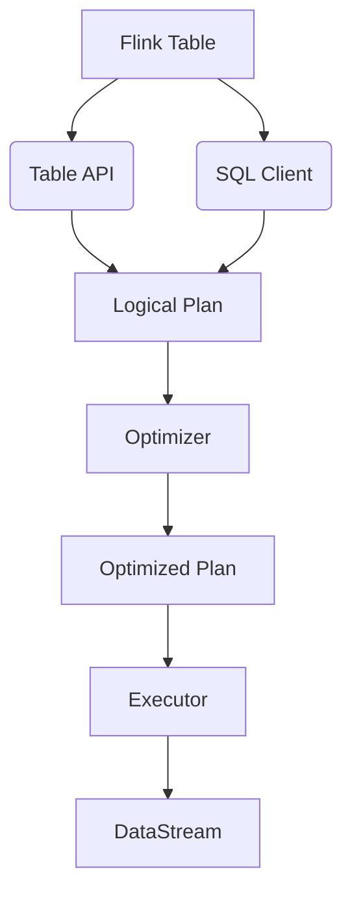

# Flink Table原理与代码实例讲解

## 1. 背景介绍

### 1.1 问题的由来

在当今大数据时代，数据量呈现出爆炸式增长趋势。传统的数据处理系统难以满足实时数据处理的需求,因此出现了流式数据处理系统。Apache Flink作为一种新兴的分布式流处理框架,凭借其低延迟、高吞吐量和容错能力,在实时数据处理领域受到广泛关注。

然而,Flink的流处理API(DataStream API)需要开发人员编写底层代码,存在一定的学习曲线。为了降低开发难度,Flink推出了基于SQL的Table API和SQL Client,使得开发人员可以使用类SQL语句进行流式数据处理,极大地提高了开发效率。

### 1.2 研究现状

Flink Table API和SQL Client已经成为Flink生态系统中不可或缺的一部分,受到了广泛的关注和使用。然而,由于其背后的原理和实现机制相对复杂,对于初学者和开发人员来说,掌握Flink Table的原理和使用方法仍然是一个挑战。

目前,已有一些文献和资料介绍了Flink Table的基本概念和使用方法,但是对于核心原理和实现细节的阐述还不够深入和全面。因此,有必要对Flink Table的原理和实现进行更加系统和深入的探讨和分析。

### 1.3 研究意义

深入理解Flink Table的原理和实现机制,对于开发人员更好地利用Flink进行流式数据处理具有重要意义。通过掌握Flink Table的核心概念和算法原理,开发人员可以更好地设计和优化流式数据处理应用程序,提高系统的性能和可靠性。

此外,探究Flink Table的内部实现细节,也有助于开发人员更好地理解Flink的整体架构和设计思想,为未来的系统扩展和优化奠定基础。

### 1.4 本文结构

本文将从以下几个方面对Flink Table进行深入探讨:

1. 核心概念与联系
2. 核心算法原理与具体操作步骤
3. 数学模型和公式详细讲解与案例分析
4. 项目实践:代码实例和详细解释说明
5. 实际应用场景
6. 工具和资源推荐
7. 总结:未来发展趋势与挑战
8. 附录:常见问题与解答

## 2. 核心概念与联系

在深入探讨Flink Table的原理和实现之前,我们需要先了解一些核心概念及其之间的联系。这些概念构成了Flink Table的基础,对于理解后续内容至关重要。

### 2.1 Table API

Table API是Flink提供的一种基于集合视图的API,允许开发人员以表的形式处理数据流。它提供了一种声明式的编程模型,使用类似SQL的语法来定义数据转换操作。Table API支持各种关系型操作,如选择(SELECT)、投影(PROJECT)、联接(JOIN)、分组(GROUP)等。

### 2.2 SQL Client

SQL Client是Flink提供的一种交互式命令行工具,支持使用SQL语句对流式数据进行处理。它基于Flink的Table API实现,但提供了更加友好的SQL接口,使得开发人员无需编写Java/Scala代码即可进行流式数据处理。

### 2.3 Logical Plan

无论是使用Table API还是SQL Client,最终都会被解析成一个逻辑执行计划(Logical Plan)。逻辑执行计划是一种关系代数表示,描述了数据转换操作的逻辑顺序和依赖关系。

### 2.4 Optimizer

Flink的优化器(Optimizer)负责对逻辑执行计划进行优化,以提高查询执行的效率。优化器会应用一系列规则,如投影下推(Projection Push Down)、Filter下推(Filter Push Down)、子查询去关联(Subquery Decorelated)等,来简化和重写逻辑执行计划。

### 2.5 Optimized Plan

经过优化器优化后,逻辑执行计划会转换为一个优化后的执行计划(Optimized Plan)。优化后的执行计划描述了实际执行时的操作步骤和顺序,并考虑了性能优化。

### 2.6 Executor

Flink的执行器(Executor)负责根据优化后的执行计划,将其转换为一个或多个DataStream作业,并提交到Flink的分布式运行时系统中执行。

### 2.7 DataStream

DataStream是Flink的底层流处理API,表示一个无界的数据流。Flink Table最终会被翻译成一个或多个DataStream作业,在Flink的分布式运行时系统中执行。

通过上述核心概念及其联系,我们可以清晰地了解Flink Table的整体架构和工作流程。Table API和SQL Client提供了高级抽象,而底层则依赖于Flink的流处理引擎进行实际执行。

## 3. 核心算法原理与具体操作步骤

在了解了Flink Table的核心概念之后,我们将深入探讨其背后的核心算法原理和具体操作步骤。这些算法和步骤是Flink Table能够高效处理流式数据的关键所在。

### 3.1 算法原理概述

Flink Table的核心算法原理主要包括以下几个方面:

1. **增量查询处理**
2. **有状态流处理**
3. **窗口操作**
4. **成本模型优化**

#### 3.1.1 增量查询处理

传统的批处理系统会将整个数据集作为输入,进行一次性处理。而对于流式数据,我们需要以增量的方式进行处理,即每当有新的数据到达时,就对其进行处理并更新结果。

Flink Table采用了增量查询处理的算法,能够高效地处理持续到达的数据流。它通过维护一个内部状态,并在新数据到达时根据查询逻辑更新状态和输出结果,从而实现了对流式数据的增量处理。

#### 3.1.2 有状态流处理

在流式数据处理中,我们通常需要维护一些状态信息,如窗口聚合、Join操作等。Flink Table通过有状态流处理算法,能够在分布式环境中高效地管理和维护这些状态。

Flink Table利用了Flink的状态管理机制,将状态信息存储在分布式的状态后端(如RocksDB)中,并通过检查点和重新发送机制实现了状态的容错和一致性。这使得Flink Table能够在发生故障时自动恢复状态,保证了流式计算的可靠性和精确一次性语义。

#### 3.1.3 窗口操作

在流式数据处理中,窗口操作是一种非常重要的技术,用于对无界数据流进行切分和聚合。Flink Table支持各种窗口操作,如滚动窗口、滑动窗口、会话窗口等。

Flink Table的窗口操作算法基于增量查询处理和有状态流处理,能够高效地计算窗口聚合结果。它利用了有状态流处理的机制来维护窗口状态,并在新数据到达时根据窗口逻辑更新状态和输出结果。

#### 3.1.4 成本模型优化

为了提高查询执行的效率,Flink Table采用了基于成本模型的查询优化算法。优化器会根据查询的逻辑执行计划,估算不同执行策略的成本,并选择成本最低的执行计划。

Flink Table的成本模型考虑了多种因素,如数据分布、数据倾斜、操作复杂度等,从而能够生成高效的执行计划。此外,优化器还支持一系列规则,如投影下推、Filter下推等,进一步优化查询执行。

### 3.2 算法步骤详解

接下来,我们将详细讲解Flink Table的核心算法在实际执行过程中的具体步骤。

#### 3.2.1 查询解析

无论是使用Table API还是SQL Client,输入的查询语句首先会被解析为一个抽象语法树(Abstract Syntax Tree, AST)。解析器会根据查询语法的规则,将查询语句转换为AST的形式。

#### 3.2.2 逻辑计划生成

基于AST,Flink Table会生成一个逻辑执行计划(Logical Plan)。逻辑执行计划是一种关系代数表示,描述了数据转换操作的逻辑顺序和依赖关系。

#### 3.2.3 查询优化

优化器会对逻辑执行计划进行一系列优化,以提高查询执行的效率。优化过程包括以下几个步骤:

1. **规则优化**:应用一系列优化规则,如投影下推、Filter下推、子查询去关联等,简化和重写逻辑执行计划。
2. **成本估算**:基于成本模型,估算不同执行策略的成本。
3. **执行计划选择**:根据成本估算结果,选择成本最低的执行计划。

经过优化后,逻辑执行计划会转换为一个优化后的执行计划(Optimized Plan)。

#### 3.2.4 执行计划翻译

优化后的执行计划需要被翻译为Flink的底层执行引擎可以理解的形式,即一个或多个DataStream作业。这个过程由Flink的执行器(Executor)完成。

执行器会遍历执行计划中的每个操作符,并将其翻译为相应的DataStream操作符。同时,执行器还会处理窗口操作、状态管理等逻辑,生成必要的状态管理代码。

#### 3.2.5 作业执行

翻译后的DataStream作业会被提交到Flink的分布式运行时系统中执行。在执行过程中,Flink会根据增量查询处理和有状态流处理的算法,对持续到达的数据流进行处理。

具体来说,Flink会维护一个内部状态,并在新数据到达时根据查询逻辑更新状态和输出结果。对于窗口操作,Flink会利用有状态流处理的机制来维护窗口状态,并在新数据到达时根据窗口逻辑更新状态和输出结果。

#### 3.2.6 结果输出

最终,Flink会将处理后的结果输出到指定的接收器(Sink)中,如文件系统、消息队列或数据库等。

### 3.3 算法优缺点

Flink Table的核心算法具有以下优点:

1. **高效处理流式数据**:通过增量查询处理和有状态流处理算法,能够高效地处理持续到达的数据流。
2. **容错和一致性**:利用Flink的状态管理机制,能够在发生故障时自动恢复状态,保证了计算的可靠性和精确一次性语义。
3. **查询优化**:基于成本模型的查询优化算法,能够生成高效的执行计划,提高查询执行的效率。
4. **丰富的窗口操作**:支持各种窗口操作,如滚动窗口、滑动窗口、会话窗口等,满足不同场景的需求。

然而,Flink Table的算法也存在一些缺点和局限性:

1. **学习曲线陡峭**:虽然Table API和SQL Client提供了高级抽象,但要深入理解其背后的原理和算法仍然具有一定的挑战。
2. **状态管理开销**:有状态流处理需要维护大量的状态信息,在某些场景下可能会带来较高的内存和计算开销。
3. **查询优化复杂度**:随着查询逻辑的复杂度增加,优化器需要考虑的因素也会变多,导致优化过程变得更加复杂和耗时。

### 3.4 算法应用领域

Flink Table的核心算法可以应用于多个领域,包括但不限于:

1. **实时数据分析**:利用Flink Table高效处理流式数据,可以实现对实时数据的分析和监控,如网络流量分析、用户行为分析等。
2. **实时数据集成**:将来自不同源的实时数据流进行清洗、转换和集成,为下游应用提供统一的数据视图。
3. **实时决策系统**:基于实时数据流,进行复杂事件处理和模式匹配,支