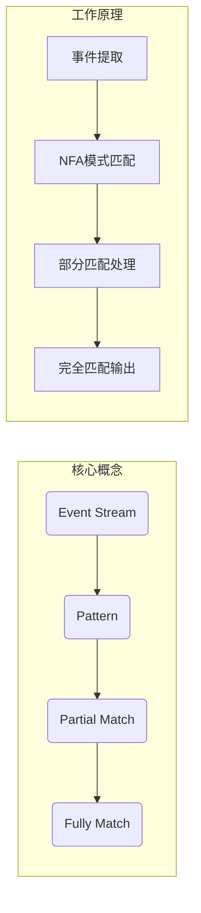
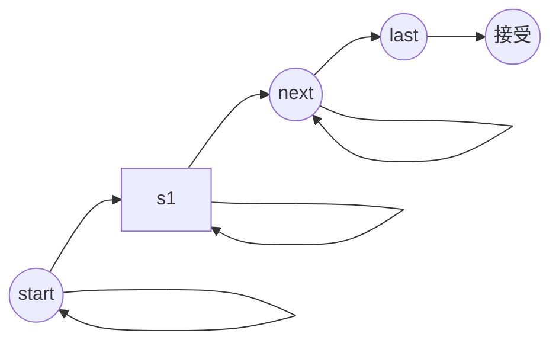

# FlinkCEP的企业客户与政府客户

## 1. 背景介绍

### 1.1 问题的由来

在当今快节奏的商业环境中，及时响应和处理大量的数据流对于企业和政府机构来说至关重要。传统的数据处理系统往往无法满足实时性和可扩展性的需求,这就催生了流式处理技术的兴起。Apache Flink是一个开源的分布式流处理框架,它提供了强大的流处理能力,可以实时处理大规模数据流。其中,Flink CEP (Complex Event Processing)是Flink的一个核心模块,专门用于复杂事件处理。

### 1.2 研究现状

Flink CEP已经在许多企业和政府机构中得到广泛应用,用于检测各种复杂的事件模式,如网络入侵检测、欺诈检测、业务流程监控等。然而,由于不同行业和应用场景的差异,企业客户和政府客户对Flink CEP的需求也存在一些差异。

### 1.3 研究意义

本文旨在深入探讨Flink CEP在企业客户和政府客户中的应用场景、需求差异以及相应的解决方案。通过对这两类客户的需求进行分析和比较,我们可以更好地理解Flink CEP的优势和局限性,并为未来的功能改进和扩展提供建议。

### 1.4 本文结构

本文首先介绍Flink CEP的核心概念和原理,然后分别探讨企业客户和政府客户对Flink CEP的需求和应用场景。接下来,我们将详细讨论满足这些需求的算法和数学模型,并提供代码示例和实际应用案例。最后,我们将总结Flink CEP的发展趋势和面临的挑战,并给出相关的工具和资源推荐。

## 2. 核心概念与联系

在深入探讨Flink CEP的应用之前,我们需要先了解一些核心概念和原理。

Flink CEP的核心概念包括:

1. **事件流(Event Stream)**: 一个无边界的事件序列,每个事件都携带一些数据。
2. **模式(Pattern)**: 用于描述我们感兴趣的复杂事件序列。
3. **部分匹配(Partial Match)**: 当前已经匹配的事件序列。
4. **完全匹配(Fully Match)**: 完全满足模式的事件序列。

Flink CEP的工作原理可以概括为以下几个步骤:

1. 从事件流中提取事件,并将其映射为内部事件对象。
2. 使用NFA(非确定有限状态自动机)来检测事件序列是否匹配给定的模式。
3. 对于每个部分匹配,NFA会创建一个新的状态实例。
4. 当事件序列完全匹配模式时,NFA会输出完全匹配的结果。

Flink CEP的核心算法是基于NFA的模式匹配算法,它能够高效地处理大规模的事件流,并检测出复杂的事件模式。



## 3. 核心算法原理 & 具体操作步骤

### 3.1 算法原理概述

Flink CEP的核心算法是基于NFA(非确定有限状态自动机)的模式匹配算法。NFA是一种用于识别正则表达式的有限状态机,它可以同时维护多个活动状态,从而能够高效地处理复杂的事件模式。

在Flink CEP中,NFA被用于检测事件流中的模式匹配。每个模式都被转换为一个NFA,NFA的每个状态代表了模式的一个部分。当有新的事件到来时,NFA会根据事件的属性和当前状态进行状态转移,从而实现模式匹配。

### 3.2 算法步骤详解

Flink CEP的模式匹配算法可以分为以下几个主要步骤:

1. **模式编译**: 将用户定义的模式编译为NFA。这个过程包括词法分析、语法分析和NFA构建。

2. **事件映射**: 将输入的事件流中的事件映射为内部事件对象,以便NFA进行处理。

3. **状态管理**: 维护NFA的当前状态集合。对于每个部分匹配,NFA会创建一个新的状态实例。

4. **状态转移**: 根据新到达的事件,对当前状态集合进行状态转移。如果转移后的状态是接受状态,则输出完全匹配的结果。

5. **超时处理**: 由于事件流是无边界的,NFA需要定期清理过期的部分匹配,以避免内存溢出。

6. **结果输出**: 将完全匹配的结果输出到下游操作符进行进一步处理。

下面是Flink CEP模式匹配算法的伪代码:

```
函数 PatternMatch(eventStream, pattern):
    nfa = CompilePattern(pattern)
    activeStates = {nfa.startState}

    对于 event 在 eventStream 中:
        mappedEvent = MapEvent(event)
        newActiveStates = {}

        对于 state 在 activeStates 中:
            对于 transition 在 state.transitions 中:
                如果 transition.condition(mappedEvent):
                    newState = transition.target
                    如果 newState 是接受状态:
                        输出完全匹配结果
                    否则:
                        newActiveStates.add(newState)

        清理超时的部分匹配
        activeStates = newActiveStates
```

### 3.3 算法优缺点

Flink CEP的模式匹配算法具有以下优点:

1. **高效**: 基于NFA的算法可以高效地处理大规模的事件流,并快速检测出复杂的事件模式。

2. **可扩展**: Flink作为分布式流处理框架,可以轻松地扩展算法的计算资源,以满足更高的吞吐量需求。

3. **灵活性**: 用户可以使用类SQL语法定义复杂的模式,算法能够自动将其编译为NFA进行匹配。

4. **容错性**: Flink提供了容错机制,可以在发生故障时自动恢复状态,确保数据处理的可靠性。

然而,该算法也存在一些缺点:

1. **内存开销**: 对于复杂的模式和大量的部分匹配,算法可能会消耗大量内存。

2. **延迟**: 由于需要维护部分匹配的状态,算法可能会引入一定的延迟。

3. **模式限制**: 虽然Flink CEP支持大多数常见的模式,但对于一些特殊的模式,可能需要进行额外的处理。

4. **学习曲线**: 定义复杂的模式需要一定的学习成本,对于一些用户来说可能存在困难。

### 3.4 算法应用领域

Flink CEP的模式匹配算法可以应用于各种领域,包括但不限于:

1. **网络安全**: 检测网络入侵、垃圾邮件和病毒等安全威胁。

2. **金融服务**: 检测欺诈行为、交易异常和风险事件。

3. **物联网**: 监控传感器数据,检测设备故障和异常状况。

4. **业务流程监控**: 跟踪业务流程的执行情况,检测异常和bottleneck。

5. **推荐系统**: 根据用户行为模式进行个性化推荐。

6. **预测性维护**: 基于设备数据预测故障,提前进行维护。

总的来说,任何需要从大规模事件流中检测复杂模式的应用场景,都可以考虑使用Flink CEP的模式匹配算法。

## 4. 数学模型和公式 & 详细讲解 & 举例说明

### 4.1 数学模型构建

为了更好地理解和优化Flink CEP的模式匹配算法,我们需要构建相应的数学模型。在这里,我们将使用有限状态自动机(FSA)作为基础模型。

一个FSA可以用一个五元组 $M = (Q, \Sigma, \delta, q_0, F)$ 来表示,其中:

- $Q$ 是一个有限的状态集合
- $\Sigma$ 是一个有限的输入符号集合(事件类型)
- $\delta: Q \times \Sigma \rightarrow Q$ 是一个状态转移函数
- $q_0 \in Q$ 是初始状态
- $F \subseteq Q$ 是一个接受状态集合

在Flink CEP中,我们使用NFA(非确定有限状态自动机)作为模式匹配的核心算法。NFA的状态转移函数 $\delta$ 可以被定义为:

$$\delta: Q \times \Sigma \rightarrow \mathcal{P}(Q)$$

其中 $\mathcal{P}(Q)$ 表示 $Q$ 的幂集,即一个状态可以根据输入符号转移到多个状态。

### 4.2 公式推导过程

接下来,我们将推导出NFA在处理事件流时的状态转移公式。

假设当前的活动状态集合为 $S_t$,新到达的事件为 $e_t$,我们需要计算下一个时间步的活动状态集合 $S_{t+1}$。

首先,我们定义一个状态转移函数 $\gamma$,它将当前状态集合和输入事件映射到下一个状态集合:

$$\gamma: \mathcal{P}(Q) \times \Sigma \rightarrow \mathcal{P}(Q)$$

对于每个当前状态 $s \in S_t$,我们可以使用NFA的状态转移函数 $\delta$ 计算出下一个可能的状态集合:

$$\delta(s, e_t) = \{q' \in Q | \exists q \in s, q' \in \delta(q, e_t)\}$$

然后,我们可以将所有下一个可能状态的并集作为 $\gamma$ 的结果:

$$\gamma(S_t, e_t) = \bigcup_{s \in S_t} \delta(s, e_t)$$

这个公式给出了NFA在处理新事件时的状态转移规则。

### 4.3 案例分析与讲解

为了更好地理解NFA的模式匹配过程,我们来看一个具体的案例。

假设我们需要检测一个简单的模式 "start, next, last",其中 "start" 和 "next" 事件可以重复出现多次,但必须以 "last" 事件结尾。我们可以使用正则表达式 `start+ next+ last` 来表示这个模式。

首先,我们将这个模式编译为一个NFA,如下图所示:



在这个NFA中,状态 $s_0$ 是初始状态,状态 $s_4$ 是接受状态。当有 "start" 事件到达时,NFA会从 $s_0$ 转移到 $s_1$;当有 "next" 事件到达时,NFA会从 $s_1$ 转移到 $s_2$;当有 "last" 事件到达时,NFA会从 $s_2$ 转移到接受状态 $s_4$,表示完全匹配。

假设我们有一个事件流 `[start, next, start, next, last]`。NFA的状态转移过程如下:

1. 初始状态集合为 $S_0 = \{s_0\}$
2. 当 "start" 事件到达时,根据公式 $\gamma(S_0, \text{start}) = \delta(s_0, \text{start}) = \{s_1\}$,新的状态集合为 $S_1 = \{s_1\}$
3. 当 "next" 事件到达时,根据公式 $\gamma(S_1, \text{next}) = \delta(s_1, \text{next}) = \{s_2\}$,新的状态集合为 $S_2 = \{s_2\}$
4. 当 "start" 事件到达时,根据公式 $\gamma(S_2, \text{start}) = \delta(s_2, \text{start}) = \{s_1\}$,新的状态集合为 $S_3 = \{s_1\}$
5. 当 "next" 事件到达时,根据公式 $\gamma(S_3, \text{next}) = \delta(s