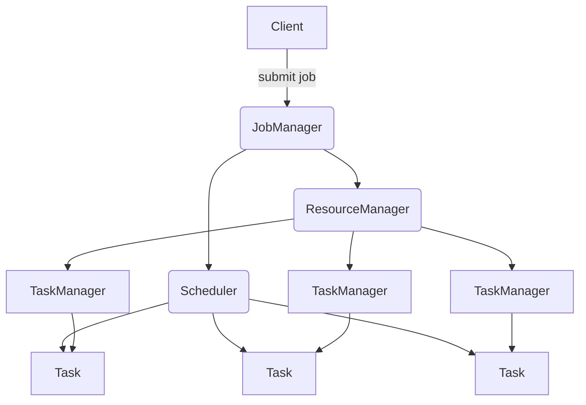
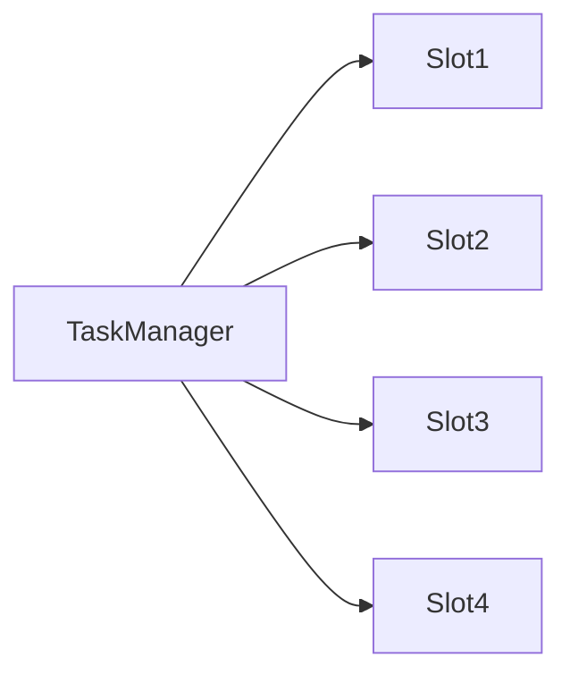

# Flink的资源管理和任务调度

## 1. 背景介绍

### 1.1 问题的由来

随着大数据时代的到来,数据的规模和复杂性都在不断增加。传统的批处理系统已经无法满足实时数据处理的需求,因此流式计算应运而生。Apache Flink作为新一代分布式流式计算框架,具有低延迟、高吞吐、精确一次语义等优点,被广泛应用于各行各业。然而,Flink作为一个分布式系统,资源管理和任务调度是其核心能力,直接影响着系统的性能、可靠性和扩展性。

### 1.2 研究现状

目前,Flink的资源管理和任务调度主要包括以下几个方面:

1. **资源管理器(ResourceManager)**: 负责管理Task Slot(TaskManager进程的一部分资源)、分配资源给Job、协调失败恢复等。
2. **调度器(Scheduler)**: 负责根据Job的并行度将任务分配到Task Slot上运行。
3. **部署模式**: Flink支持多种部署模式,如独立部署、Yarn部署、Kubernetes部署等。
4. **容错机制**: Flink通过重启策略、检查点机制等实现了精确一次语义。

虽然Flink在这些方面做了大量工作,但仍存在一些需要改进的地方,比如资源利用率不高、调度策略欠缺灵活性等。

### 1.3 研究意义

对Flink的资源管理和任务调度进行深入研究,可以帮助我们:

1. 提高资源利用率,降低运行成本。
2. 优化调度策略,提升系统吞吐量。
3. 增强容错能力,提高系统可靠性。
4. 支持更多部署场景,扩展系统适用范围。

总之,研究Flink的资源管理和任务调度,可以进一步发挥其作为流式计算引擎的优势,满足更多实际应用场景的需求。

### 1.4 本文结构  

本文将从以下几个方面对Flink的资源管理和任务调度进行全面介绍:

1. 核心概念与联系
2. 核心算法原理与具体操作步骤 
3. 数学模型和公式详细讲解与案例分析
4. 项目实践:代码实例和详细解释说明
5. 实际应用场景
6. 工具和资源推荐
7. 总结:未来发展趋势与挑战
8. 附录:常见问题与解答

## 2. 核心概念与联系

在介绍Flink资源管理和任务调度的核心概念之前,我们先来看一下Flink的整体架构,以便更好地理解这些概念之间的联系。

从上图可以看出,Flink主要由以下几个核心组件组成:

1. **Client**: 用于提交作业(Job)的客户端。
2. **JobManager**: 协调整个数据流处理的中央进程,包含了ResourceManager、Dispatcher等组件。
3. **TaskManager**: 执行实际任务(Task)的工作进程,由一个或多个Task Slot组成。
4. **ResourceManager**: 管理Task Slot,为作业分配资源。
5. **Scheduler**: 根据作业的并行度,将任务分配到Task Slot上运行。

接下来,我们详细介绍这些核心概念。

### 2.1 Task和算子链

在Flink中,算子(Operator)是指用户通过编程指定的单一的数据转换操作,如map、flatMap、filter等。而Task是算子的实例,由一个线程执行。

为了减少线程之间的context switch开销和数据序列化/反序列化开销,Flink会将一些算子链接(chain)在一起,组成一个Task,在同一个线程中执行。这个过程称为算子链接(Operator Chaining)。

上图展示了一个包含4个算子的作业,Flink会将其链接为两个Task:

1. Source -> FlatMap -> Filter (Task 1)
2. Map -> Sink (Task 2)

### 2.2 Task Slot

Task Slot是TaskManager的一个工作单元,用于执行一个或多个可链接的Task。每个TaskManager都有一定数量的Task Slot,这些Slot组成了集群的总资源池。

如上图所示,一个TaskManager包含4个Task Slot。当一个作业被提交时,ResourceManager会根据作业的并行度,从资源池中获取相应数量的Slot,并将Task分配到这些Slot上执行。

### 2.3 资源管理器(ResourceManager)

ResourceManager负责管理Task Slot,并为作业分配资源。它主要包括以下几个功能:

1. **Task Slot管理**: 维护集群中所有TaskManager的Task Slot信息。
2. **资源分配**: 根据作业的并行度,从资源池中获取相应数量的Slot,并将Task分配到这些Slot上。
3. **容错恢复**: 当TaskManager发生故障时,ResourceManager会重新分配Slot,并重启失败的Task。

### 2.4 调度器(Scheduler)

Scheduler负责将Task分配到合适的Task Slot上运行。它主要包括以下功能:

1. **Task分配**: 根据调度策略,将Task分配到合适的Task Slot上。
2. **重新调度**: 当Task失败或者资源发生变化时,重新调度受影响的Task。
3. **位置优先级排序**: 根据数据的位置信息,优先将Task调度到相同或相近的TaskManager上,以减少数据传输。

Flink目前支持多种调度策略,如FIFO、Fair、DataLocality等,用户可以根据实际需求进行选择。

## 3. 核心算法原理与具体操作步骤

### 3.1 算法原理概述

Flink的资源管理和任务调度主要涉及以下几个核心算法:

1. **资源分配算法**: 用于从资源池中获取合适的资源,并将Task分配到这些资源上。
2. **调度算法**: 用于将Task分配到合适的Task Slot上运行。
3. **容错恢复算法**: 用于在TaskManager发生故障时,重新分配资源并重启失败的Task。

这些算法的设计原则主要包括:

1. **高资源利用率**: 尽可能地利用集群资源,避免资源浪费。
2. **负载均衡**: 将Task均匀地分布到各个TaskManager上,避免负载不均。
3. **数据局部性**: 优先将Task调度到存储相关数据的TaskManager上,减少数据传输。
4. **容错性**: 能够在TaskManager发生故障时,快速恢复失败的Task,保证作业的正常执行。

### 3.2 算法步骤详解

#### 3.2.1 资源分配算法

当一个作业被提交时,ResourceManager会根据作业的并行度,从资源池中获取相应数量的Task Slot。具体步骤如下:

1. 计算作业所需的总Slot数量,即作业的并行度。
2. 遍历所有已注册的TaskManager,统计可用Slot数量。
3. 如果可用Slot数量不足,则等待一段时间后重试。
4. 如果可用Slot数量足够,则从各个TaskManager中获取相应数量的Slot。
5. 将获取到的Slot分配给作业,用于执行Task。

在分配Slot时,ResourceManager会考虑数据的位置信息,优先从存储相关数据的TaskManager上获取Slot,以提高数据局部性。

#### 3.2.2 调度算法

获取到Slot后,Scheduler会根据调度策略,将Task分配到这些Slot上运行。Flink目前支持以下几种调度策略:

1. **FIFO调度**: 按照Task到达的先后顺序进行调度。
2. **Fair调度**: 根据每个Job的剩余Task数量,按比例分配Slot。
3. **DataLocality调度**: 优先将Task调度到存储相关数据的TaskManager上。

以DataLocality调度为例,具体步骤如下:

1. 根据数据的位置信息,为每个Task计算一个位置偏好列表。
2. 遍历位置偏好列表,寻找有空闲Slot的TaskManager。
3. 如果找到合适的TaskManager,则将Task调度到该TaskManager上。
4. 如果没有找到,则将Task加入到一个延迟调度队列中。
5. 当有新的Slot资源时,重新从延迟调度队列中调度Task。

#### 3.2.3 容错恢复算法

当TaskManager发生故障时,ResourceManager会重新分配Slot,并重启失败的Task。具体步骤如下:

1. 检测到TaskManager发生故障。
2. 从资源池中移除该TaskManager的所有Slot。
3. 重新调用资源分配算法,为失败的Task获取新的Slot。
4. 根据检查点数据,重启失败的Task。

为了提高容错性,Flink采用了检查点机制,定期将状态数据持久化到持久存储中。当Task失败时,可以从最近的检查点恢复,避免重复计算。

### 3.3 算法优缺点

上述算法在资源利用率、负载均衡、数据局部性和容错性方面都有不错的表现,但也存在一些缺陷:

1. **资源分配算法**:
   - 优点:简单高效,能够快速获取所需资源。
   - 缺点:可能导致资源碎片化,降低资源利用率。
2. **调度算法**:
   - 优点:能够根据不同的策略满足不同的需求。
   - 缺点:DataLocality策略可能导致负载不均,Fair策略无法保证数据局部性。
3. **容错恢复算法**:
   - 优点:能够快速重启失败的Task,保证作业的正常执行。
   - 缺点:重启开销较大,需要从检查点恢复状态数据。

### 3.4 算法应用领域

Flink的资源管理和任务调度算法可以应用于以下场景:

1. **大数据处理**: 利用Flink的流式计算能力,实时处理大规模数据。
2. **事件驱动应用**: 通过Flink的低延迟特性,快速响应各种事件。
3. **机器学习**: 利用Flink的分布式计算能力,训练大规模机器学习模型。
4. **物联网数据处理**: 利用Flink的容错能力,可靠地处理海量物联网数据。

## 4. 数学模型和公式详细讲解与举例说明

在资源管理和任务调度过程中,我们需要建立一些数学模型,并使用相关公式进行计算和优化。本节将详细介绍这些模型和公式。

### 4.1 数学模型构建

#### 4.1.1 资源模型

我们将集群中的资源抽象为一个有向图$G=(V,E)$,其中:

- $V$表示所有TaskManager节点的集合。
- $E$表示TaskManager之间的网络连接。
- 每个节点$v\in V$都有一个资源容量$C(v)$,表示该节点的CPU和内存资源。
- 每条边$e\in E$都有一个带宽$B(e)$,表示两个TaskManager之间的网络带宽。

#### 4.1.2 作业模型

一个作业$J$可以表示为一个有向无环图$G_J=(V_J,E_J)$,其中:

- $V_J$表示作业中所有Task的集合。
- $E_J$表示Task之间的数据流。
- 每个Task $t\in V_J$都有一个资源需求$R(t)$,表示该Task需要的CPU和内存资源。
- 每条边$e\in E_J$都有一个数据传输率$D(e)$,表示两个Task之间的数据传输速率。

我们的目标是将作业$J$调度到集群资源$G$上,使得资源利用率最大化,并且满足以下约束条件:

1. 每个Task都被分配到一个TaskManager上。
2. 每个TaskManager上的资源使用量不超过其资源容量。
3. 任意两个TaskManager之间的数据传输速率不超过它们之间的网络带宽。

#### 4.1.3 目标函数

我们定义一个目标函数$f(J