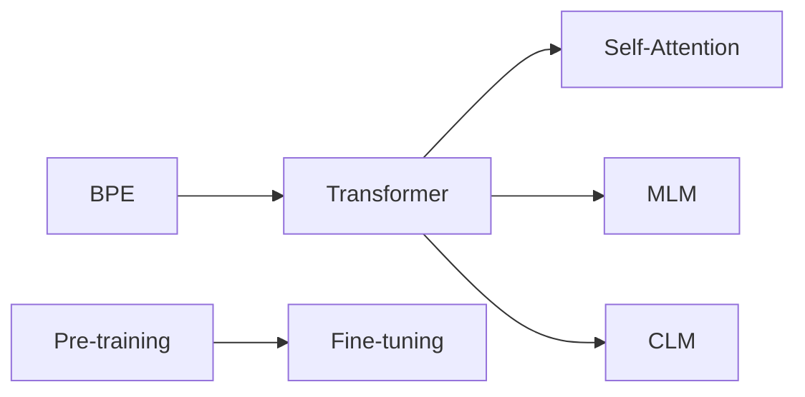

# GPT-4原理与代码实例讲解

## 1. 背景介绍
### 1.1 问题的由来
近年来,随着人工智能技术的飞速发展,自然语言处理(NLP)领域取得了令人瞩目的进展。其中,以 Transformer 为代表的预训练语言模型(Pre-trained Language Models, PLMs)在各类 NLP 任务上取得了 state-of-the-art 的性能,引领了 NLP 技术的发展潮流。而在众多 PLMs 中,由 OpenAI 推出的 GPT 系列模型以其出色的语言理解和生成能力脱颖而出,成为当前最为广泛使用和研究的语言模型之一。

GPT-4 作为 GPT 系列的最新力作,在模型规模、训练数据、算法创新等方面都有了显著的提升,展现出了更加强大的语言处理能力。然而,GPT-4 的内部原理对于许多研究者和开发者而言仍然是一个黑盒。深入理解 GPT-4 的核心原理和实现细节,对于 NLP 领域的研究者来说具有重要的学术价值;而对于工程师和开发者而言,掌握 GPT-4 的原理和代码实现,则有助于更好地应用该模型解决实际问题。

### 1.2 研究现状
目前,学术界对 GPT-4 的研究主要集中在以下几个方面:

1. 模型架构创新:GPT-4 在 Transformer 的基础上进行了哪些改进和优化,如何提升模型的表达能力和计算效率等。

2. 训练数据和方法:GPT-4 使用了哪些数据进行训练,训练过程中采用了哪些技巧和策略,如何有效利用大规模无标注数据等。 

3. 下游任务应用:GPT-4 在各类 NLP 任务上的表现如何,与其他模型相比有何优势,如何针对特定任务进行微调等。

4. 模型分析与解释:对 GPT-4 的内部机制进行分析和可视化,探究其语言理解和生成的奥秘,提高模型的可解释性和可控性等。

然而,目前对 GPT-4 的研究还主要停留在宏观层面,缺乏对其内部原理和代码实现的系统阐述。本文将从算法原理入手,结合代码实例,对 GPT-4 进行全面而深入的讲解,帮助读者真正理解其背后的设计思想和实现细节。

### 1.3 研究意义
本文的研究意义主要体现在以下几个方面:

1. 学术价值:深入剖析 GPT-4 的内部原理,有助于推动 NLP 领域的理论研究,为后续的模型改进和创新提供启发和参考。

2. 工程实践:详细讲解 GPT-4 的代码实现,为开发者提供了一份完整的学习资料和参考示例,方便其在实际项目中应用和部署 GPT-4 模型。

3. 普及 NLP 知识:以通俗易懂的方式介绍 GPT-4 的原理和应用,有助于向更广泛的受众普及 NLP 领域的前沿技术和研究进展,提高大众对 AI 的认知和兴趣。

4. 探索 AI 的未来:GPT-4 代表了当前 NLP 技术的最高水平,深入研究 GPT-4,有助于我们展望 AI 技术的未来发展方向和可能带来的变革。

### 1.4 本文结构
本文将从以下几个方面对 GPT-4 进行全面而系统的讲解:

首先,在第2部分,我们将介绍 GPT-4 中的一些核心概念,如 Transformer 结构、Self-Attention、Masked Language Modeling 等,帮助读者建立必要的背景知识。

接下来,第3部分将重点讲解 GPT-4 的核心算法原理,包括其网络架构、训练目标、优化策略等,并给出详细的算法流程。

在第4部分,我们将推导 GPT-4 中使用的关键数学公式,并结合具体的例子加以说明,帮助读者深入理解其数学原理。 

第5部分将给出 GPT-4 的代码实现示例,从搭建开发环境、编写核心模块、训练模型、生成文本等方面,对其完整的实现过程进行讲解。

第6部分将介绍 GPT-4 在实际场景中的应用案例,如智能写作、对话系统、知识问答等,展示其强大的语言处理能力。

第7部分我们将推荐一些 GPT-4 相关的学习资源、开发工具和研究论文,方便读者进一步学习和研究。

最后,第8部分将总结 GPT-4 的研究现状和成果,展望其未来的发展趋势和面临的挑战,并对 NLP 技术的研究方向进行探讨。

## 2. 核心概念与联系

在深入讲解 GPT-4 的原理之前,我们首先需要了解其中的一些核心概念。这些概念是理解 GPT-4 内部机制的基础,它们相互关联,共同构成了 GPT-4 的理论框架。

- Transformer 结构:这是 GPT-4 的网络基本组件,由 Encoder 和 Decoder 两部分组成。Transformer 通过 Self-Attention 机制来捕捉序列中各个位置之间的依赖关系,相比 RNN 和 CNN 等结构,能够更好地并行计算和建模长程依赖。GPT-4 只使用了 Transformer 的 Decoder 部分。

- Self-Attention:这是 Transformer 的核心操作,用于计算序列中每个位置与其他位置之间的注意力权重,从而实现信息的聚合和传递。具体来说,Self-Attention 通过 Query、Key、Value 三个向量来计算注意力分数,其中 Query 和 Key 用于计算相似度,Value 用于聚合信息。

- Masked Language Modeling (MLM):这是 GPT-4 的训练目标之一,通过随机 Mask 掉输入序列中的部分 Token,让模型去预测这些被 Mask 的 Token,从而学习到语言的统计规律和上下文信息。与 BERT 等模型使用的 Bidirectional MLM 不同,GPT-4 使用 Unidirectional MLM,即只能看到 Mask 位置之前的 Token。

- Causal Language Modeling (CLM):这是 GPT-4 的另一个训练目标,让模型根据之前的 Token 去预测下一个 Token,从而学习到语言的生成能力。CLM 使用的是 Teacher Forcing 的训练方式,即在训练时使用真实的下一个 Token 作为监督信号。

- Pre-training and Fine-tuning:这是 GPT-4 的训练范式,首先在大规模无标注语料上进行预训练,学习通用的语言表示;然后在特定任务的标注数据上进行微调,使模型适应具体的任务。预训练使得 GPT-4 能够建立强大的语言理解能力,而微调则赋予了其灵活的适应能力。

- Byte Pair Encoding (BPE):这是 GPT-4 使用的 Tokenization 方法,通过统计字节对的频率,将词划分为更小的子词单元。BPE 能够在保留语义信息的同时,减小词表大小,提高训练效率。此外,BPE 还能够处理未登录词,增强模型的泛化能力。

下图展示了这些核心概念之间的联系:

从图中可以看出,Transformer 结构是 GPT-4 的基础,其中 Self-Attention 是实现 Transformer 的关键;MLM 和 CLM 是 GPT-4 的两个训练目标,分别帮助其学习语言理解和生成能力;Pre-training 和 Fine-tuning 是 GPT-4 的训练范式,使其能够灵活适应不同任务;BPE 则是 GPT-4 的 Tokenization 方法,为其提供了高效而鲁棒的输入表示。

理解了这些核心概念,我们就可以进一步探究 GPT-4 的内部原理和实现细节了。在接下来的部分,我们将对 GPT-4 的算法原理、数学模型、代码实现等进行深入讲解,帮助读者全面掌握这一 NLP 领域的前沿技术。

## 3. 核心算法原理 & 具体操作步骤
### 3.1 算法原理概述
GPT-4 的核心是基于 Transformer Decoder 的自回归语言模型。它通过学习文本序列的概率分布,来预测下一个 Token 的概率。具体来说,给定一个长度为 $n$ 的文本序列 $X=(x_1,x_2,...,x_n)$,GPT-4 的目标是建模序列的概率分布 $P(X)$,即最大化如下似然函数:

$$P(X) = \prod_{i=1}^n P(x_i|x_1,x_2,...,x_{i-1})$$

其中 $P(x_i|x_1,x_2,...,x_{i-1})$ 表示在给定前 $i-1$ 个 Token 的条件下,第 $i$ 个 Token 为 $x_i$ 的条件概率。

为了建模这个概率分布,GPT-4 使用了 Transformer Decoder 结构。Transformer Decoder 由若干个相同的 Layer 组成,每个 Layer 包含两个子层:Multi-Head Self-Attention 和 Position-wise Feed-Forward Network。

在 Self-Attention 中,每个位置的表示通过注意力机制与其他位置进行聚合,捕捉序列内的长距离依赖。由于是自回归模型,GPT-4 在 Self-Attention 中使用了 Masked 机制,即每个位置只能 Attend to 其之前的位置,避免信息泄露。

Feed-Forward Network 则对每个位置进行独立的非线性变换,增强模型的表达能力。

除此之外,GPT-4 还引入了 Position Embedding,以编码每个 Token 在序列中的位置信息。最终,Transformer Decoder 的输出通过 Softmax 层,得到下一个 Token 的概率分布。

### 3.2 算法步骤详解
下面我们对 GPT-4 的算法步骤进行详细说明。

输入:长度为 $n$ 的文本序列 $X=(x_1,x_2,...,x_n)$,其中每个 $x_i$ 是一个 Token。

1. Embedding 层:将每个 Token $x_i$ 映射为 Embedding 向量 $e_i$,同时加上 Position Embedding $p_i$,得到输入表示 $h_i^0=e_i+p_i$。

2. 对于每一个 Transformer Layer $l=1,2,...,L$:
   
   a. Multi-Head Self-Attention:
      
      i. 将上一层的输出 $h_i^{l-1}$ 通过三个线性变换得到 Query、Key、Value 矩阵 $Q^l, K^l, V^l$。
      
      ii. 计算 Scaled Dot-Product Attention:
         $$Attention(Q^l,K^l,V^l)=softmax(\frac{Q^l{K^l}^T}{\sqrt{d_k}})V^l$$
         其中 $d_k$ 为 Key 向量的维度。
      
      iii. 将多个 Head 的 Attention 结果拼接,并经过线性变换,得到 $\tilde{h}_i^l$。
   
   b. Feed-Forward Network:
      
      i. 对 $\tilde{h}_i^l$ 经过两层线性变换,中间加入 ReLU 激活:
         $$h_i^l=max(0,\tilde{h}_i^lW_1^l+b_1^l)W_2^l+b_2^l$$

3. 将最后一层的输出 $h_i^L$ 经过线性变换和 Softmax,得到下一个 Token 的概率分布:
   $$P(x_{i+1}|x_1,x_2,...,x_i)=softmax(h_i^LW_e^T)$$
   其中 $W_e$ 为 Embedding 矩阵。

4. 根据概率分布采样或选择概率最大的 Token 作为生成结果。

在训练阶段,GPT-4 通过最小化负对数似然函数来优化模型参数:

$$Loss=-\frac{1}{n}\sum_{i=1}^nlogP(x_i|x_1,x_2,...,x_{i-1})$$

模型使用 Adam 优化器和学习率衰减策略进行训练,同时引入 Dropout 和 L2