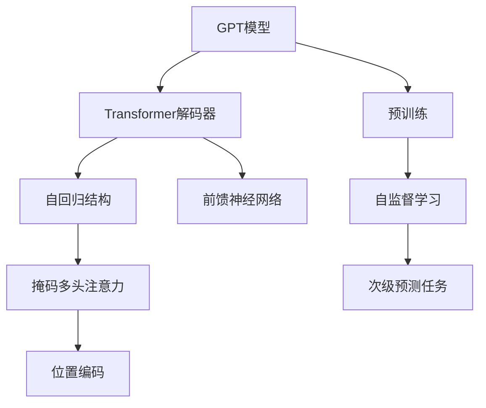

下面是以"GPT：生成式自回归模型"为主题的技术博客文章正文内容：

# GPT：生成式自回归模型

## 1. 背景介绍

### 1.1 问题的由来

在自然语言处理领域中,机器翻译、文本生成、问答系统等任务一直是研究的热点和难点。传统的基于规则或统计模型的方法在处理长句和复杂语义时存在明显缺陷。为了更好地捕捉语言的上下文语义信息,生成式预训练模型(Generative Pre-trained Transformer,GPT)应运而生。

### 1.2 研究现状 

自2018年以来,GPT及其改进版本(如GPT-2、GPT-3)在自然语言生成任务上取得了卓越的成绩,展现出强大的语言理解和生成能力。GPT模型通过自回归(Autoregressive)结构对文本序列建模,充分利用上文信息生成下文,实现了高质量的文本生成。目前GPT已广泛应用于机器翻译、文本续写、问答系统、代码生成等领域。

### 1.3 研究意义

GPT模型的出现为自然语言生成任务带来了革命性的变革,极大推动了自然语言处理技术的发展。深入研究GPT模型的原理和实现方法,不仅可以帮助我们更好地理解和应用这一领先技术,还可以为探索更加先进的语言模型奠定基础。

### 1.4 本文结构

本文将全面介绍GPT生成式自回归模型的核心概念、算法原理、数学模型、实现细节、应用案例和未来发展趋势。内容包括:背景介绍、核心概念、算法原理、数学模型推导、代码实现、应用场景、工具资源推荐、发展趋势与挑战等多个方面。

## 2. 核心概念与联系

GPT是一种生成式自回归(Autoregressive)语言模型,基于Transformer解码器结构,通过自回归方式对文本序列进行建模。其核心概念包括:

1. **Transformer解码器**:GPT模型的基础架构,由多层解码器块组成,每层包含掩码多头注意力机制和前馈神经网络。

2. **自回归结构**:模型通过掩码机制,在生成序列时只能看到当前位置之前的上文信息,实现对序列的自回归建模。

3. **掩码多头注意力**:通过掩码操作,注意力机制只关注当前位置之前的输入,捕捉上文语义信息。

4. **位置编码**:对序列中每个位置进行编码,使模型能够学习位置信息。

5. **预训练**:在大规模无标注语料上进行自监督学习,通过次级预测任务(如遮蔽语言模型)预训练模型参数。

上述核心概念相互关联、环环相扣,共同赋予了GPT强大的语言理解和生成能力。

## 3. 核心算法原理与具体操作步骤

### 3.1 算法原理概述

GPT模型的核心算法原理是通过自回归(Autoregressive)结构对文本序列进行建模,并利用Transformer解码器架构实现高效的序列生成。算法主要包括以下几个关键步骤:

1. **输入表示**:将输入文本序列转换为词嵌入向量表示。
2. **位置编码**:为每个位置添加位置编码,使模型能够捕捉位置信息。
3. **掩码多头注意力**:通过掩码机制,注意力机制只关注当前位置之前的上文信息。
4. **前馈神经网络**:对注意力输出进行非线性变换,提取高阶语义特征。
5. **自回归生成**:在每个时间步,模型根据当前位置之前的输出生成下一个词的概率分布。
6. **损失计算与优化**:计算生成序列与目标序列之间的损失,并通过梯度下降算法优化模型参数。

### 3.2 算法步骤详解

1. **输入表示**

   首先将输入文本序列$X=(x_1,x_2,...,x_n)$转换为词嵌入向量表示$\boldsymbol{E}=(\boldsymbol{e}_1,\boldsymbol{e}_2,...,\boldsymbol{e}_n)$,其中$\boldsymbol{e}_i\in\mathbb{R}^{d_\text{model}}$是词$x_i$的$d_\text{model}$维词嵌入向量。

2. **位置编码**

   为了使模型能够捕捉序列中词的位置信息,GPT采用了位置编码的方法。位置编码向量$\boldsymbol{P}=(\boldsymbol{p}_1,\boldsymbol{p}_2,...,\boldsymbol{p}_n)$与词嵌入向量相加,得到输入表示$\boldsymbol{X}=\boldsymbol{E}+\boldsymbol{P}$。

3. **掩码多头注意力**

   GPT模型中的每一个解码器层都包含一个掩码多头注意力子层。注意力机制通过计算查询向量$\boldsymbol{Q}$与键向量$\boldsymbol{K}$的点积,得到注意力分数$\text{Attention}(\boldsymbol{Q},\boldsymbol{K},\boldsymbol{V})$:

   $$\text{Attention}(\boldsymbol{Q},\boldsymbol{K},\boldsymbol{V})=\text{softmax}\left(\frac{\boldsymbol{Q}\boldsymbol{K}^\top}{\sqrt{d_k}}\right)\boldsymbol{V}$$

   其中$\boldsymbol{V}$是值向量。掩码操作通过在softmax之前将未来位置的注意力分数设置为负无穷,确保注意力只关注当前位置之前的上文信息。

4. **前馈神经网络**

   每个解码器层还包含一个前馈神经网络子层,对注意力输出进行非线性变换,提取高阶语义特征:

   $$\text{FFN}(\boldsymbol{x})=\max(0,\boldsymbol{x}\boldsymbol{W}_1+\boldsymbol{b}_1)\boldsymbol{W}_2+\boldsymbol{b}_2$$

   其中$\boldsymbol{W}_1,\boldsymbol{W}_2,\boldsymbol{b}_1,\boldsymbol{b}_2$是可训练参数。

5. **自回归生成**

   在生成过程中,GPT模型在每个时间步$t$根据当前位置之前的输出$y_{<t}$生成下一个词$y_t$的概率分布$P(y_t|y_{<t})$:

   $$P(y_t|y_{<t})=\text{softmax}(\boldsymbol{h}_t^\top\boldsymbol{W}_\text{out})$$

   其中$\boldsymbol{h}_t$是最后一个解码器层在时间步$t$的输出,而$\boldsymbol{W}_\text{out}$是可训练的输出权重矩阵。

6. **损失计算与优化**

   给定目标序列$Y=(y_1,y_2,...,y_m)$,损失函数为生成序列与目标序列的交叉熵损失:

   $$\mathcal{L}=-\sum_{t=1}^m\log P(y_t|y_{<t})$$

   通过梯度下降算法优化模型参数,最小化损失函数。

### 3.3 算法优缺点

**优点**:

1. 自回归结构能够充分利用上文信息,生成高质量、连贯的文本序列。
2. Transformer架构具有高度的并行性,能够高效地处理长序列。
3. 预训练机制使模型能够学习到丰富的语言知识,提高泛化能力。

**缺点**:

1. 自回归生成过程无法并行化,生成效率较低。
2. 生成长序列时,错误可能会逐步累积和放大。
3. 预训练过程需要消耗大量计算资源。

### 3.4 算法应用领域

GPT模型及其改进版本已广泛应用于自然语言处理的多个领域,包括但不限于:

- **机器翻译**: 将源语言文本翻译成目标语言。
- **文本续写**: 根据给定的文本开头,生成连贯的文本续写。
- **对话系统**: 根据上文对话信息,生成自然的回复。
- **文本摘要**: 对长文本进行摘要,生成简洁的文本概括。
- **问答系统**: 根据问题生成对应的答案。
- **代码生成**: 根据简单描述生成对应的代码。

## 4. 数学模型和公式详细讲解与举例说明

### 4.1 数学模型构建

GPT模型的数学表示可以形式化为:给定一个长度为$n$的文本序列$X=(x_1,x_2,...,x_n)$,目标是学习一个条件概率模型$P(X)$,使其最大化序列$X$的概率。根据链式法则,该联合概率可以分解为:

$$P(X)=\prod_{t=1}^nP(x_t|x_{<t})$$

其中$x_{<t}=(x_1,x_2,...,x_{t-1})$表示当前位置之前的所有词。GPT模型采用自回归结构,通过计算每个条件概率$P(x_t|x_{<t})$来建模整个序列的联合概率分布。

在实现中,GPT使用Transformer解码器架构来计算每个条件概率$P(x_t|x_{<t})$。具体来说,给定当前位置之前的输入$x_{<t}$,模型首先通过嵌入层和位置编码将其转换为向量表示$\boldsymbol{X}_{<t}$,然后将其输入到Transformer解码器中。解码器的输出$\boldsymbol{h}_t$被用于计算下一个词$x_t$的概率分布:

$$P(x_t|x_{<t})=\text{softmax}(\boldsymbol{h}_t^\top\boldsymbol{W}_\text{out})$$

其中$\boldsymbol{W}_\text{out}$是可训练的输出权重矩阵。在训练过程中,模型通过最大化训练语料库上的对数似然来学习参数:

$$\mathcal{L}=-\sum_{X\in\mathcal{D}}\log P(X)$$

其中$\mathcal{D}$是训练语料库。

### 4.2 公式推导过程

我们将详细推导GPT模型中掩码多头注意力机制的计算过程。

首先定义注意力机制的输入:

- $\boldsymbol{Q}\in\mathbb{R}^{n\times d_k}$是查询矩阵,其中$n$是序列长度,$d_k$是注意力维度。
- $\boldsymbol{K}\in\mathbb{R}^{n\times d_k}$是键矩阵。
- $\boldsymbol{V}\in\mathbb{R}^{n\times d_v}$是值矩阵,其中$d_v$是值向量的维度。

注意力分数矩阵$\boldsymbol{A}\in\mathbb{R}^{n\times n}$的计算如下:

$$\boldsymbol{A}=\text{softmax}\left(\frac{\boldsymbol{Q}\boldsymbol{K}^\top}{\sqrt{d_k}}\right)$$

其中,softmax函数对每一行进行操作,确保每行的元素和为1。$\sqrt{d_k}$是一个缩放因子,用于避免内积过大导致的梯度饱和问题。

接下来,我们对注意力分数矩阵$\boldsymbol{A}$进行掩码操作,以确保注意力只关注当前位置之前的上文信息。定义掩码矩阵$\boldsymbol{M}\in\mathbb{R}^{n\times n}$,其中:

$$M_{i,j}=\begin{cases}
0, & \text{if }i\leq j\\
-\infty, & \text{otherwise}
\end{cases}$$

将$\boldsymbol{M}$与$\boldsymbol{A}$相加,得到掩码后的注意力分数矩阵$\boldsymbol{A}'$:

$$\boldsymbol{A}'=\boldsymbol{A}+\boldsymbol{M}$$

由于$-\infty$加到任何有限数上的结果仍为$-\infty$,因此$\boldsymbol{A}'$的每一行中,只有当前位置之前的元素保留了有限值,其余