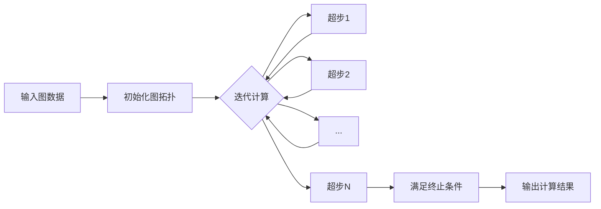
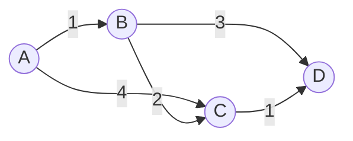

# Giraph在交通运输分析中的应用

关键词：Giraph, 交通运输分析, 图计算, 大规模图处理, 交通网络, 最短路径, 交通流预测

## 1. 背景介绍
### 1.1 问题的由来
随着城市化进程的加快,交通运输系统日益复杂化。如何高效地分析和优化日益庞大的交通网络,成为交通运输领域面临的重大挑战。传统的集中式计算方法难以应对海量交通数据的实时处理需求。因此,亟需引入新的大规模分布式计算框架来解决这一问题。
### 1.2 研究现状
近年来,大规模图计算引起了学术界和工业界的广泛关注。Giraph作为一个成熟的大规模图处理框架,在社交网络、电商推荐等领域得到了广泛应用。然而,Giraph在交通运输领域的应用研究还相对较少,有待进一步探索。
### 1.3 研究意义 
将Giraph引入交通运输分析领域,可以显著提升对海量交通数据的处理和分析能力,为智慧交通、交通规划等应用提供有力支撑。同时,交通场景对Giraph的可扩展性、容错性等特性提出了更高要求,有助于推动Giraph的技术演进。
### 1.4 本文结构
本文将首先介绍Giraph的核心概念和工作原理,然后重点探讨Giraph在交通运输分析中的典型应用,包括最短路径计算、交通流量预测、交通网络社区发现等,并给出具体的算法实现和代码示例。最后,本文将总结Giraph在交通领域的应用前景和面临的挑战。

## 2. 核心概念与联系
Giraph是一个基于Hadoop的大规模图处理框架,采用了"思考像顶点"(Think Like A Vertex)的编程模型。在Giraph中,图被抽象为由顶点(Vertex)和边(Edge)组成的数据结构。每个顶点包含唯一ID、状态信息(Value)以及与之关联的出边(Edge)。
Giraph基于BSP(Bulk Synchronous Parallel)并行计算模型,将图处理过程划分为若干个迭代的超步(Superstep)。在每个超步中,所有顶点并行执行用户自定义的Compute函数,通过消息传递(Message Passing)机制与邻居顶点通信和更新状态,直至满足全局终止条件。
下图展示了Giraph的核心概念和工作流程:



## 3. 核心算法原理 & 具体操作步骤
### 3.1 算法原理概述
Giraph采用顶点为中心的计算模型,通过定义顶点的计算逻辑和消息传递机制,实现对图的迭代计算。典型的图算法如单源最短路径(SSSP)、PageRank等,都可以很自然地映射到Giraph的编程模型上。
### 3.2 算法步骤详解
以单源最短路径算法为例,其在Giraph中的实现步骤如下:
1. 将输入图数据加载到Giraph中,初始化图拓扑结构。
2. 为起始顶点初始化距离值为0,其他顶点距离值为无穷大。 
3. 开始迭代计算:
   - 每个顶点检查收到的消息,更新自己的距离值为当前值与消息值之和的较小值。
   - 如果距离值有更新,则将新的距离值发送给所有邻居顶点。
   - 如果没有顶点的距离值发生变化,则算法终止。
4. 输出所有顶点的最短距离值。
### 3.3 算法优缺点
Giraph实现的SSSP算法具有良好的可扩展性,可以处理百亿规模的超大图。通过将图划分到不同的计算节点,实现并行计算。但是,Giraph在处理稠密图时,由于通信开销大,性能会有所下降。
### 3.4 算法应用领域
基于Giraph的SSSP算法可以广泛应用于交通运输网络分析,如最短路径导航、路网可达性分析等。同时,SSSP也是很多高级图算法如Betweenness Centrality的基础。

## 4. 数学模型和公式 & 详细讲解 & 举例说明
### 4.1 数学模型构建
令 $G=(V,E)$ 表示一个带权有向图,其中 $V$ 为顶点集, $E$ 为边集。对于每条边 $e=(u,v) \in E$,定义其权重为 $w(u,v)$。给定起始顶点 $s \in V$,单源最短路径问题就是要找到从 $s$ 到图中其他所有顶点的最短路径。

定义 $d(v)$ 为顶点 $s$ 到顶点 $v$ 的最短距离,初始化为:
$$
d(v) = 
\begin{cases}
0, & \text{if } v = s \\
\infty, & \text{otherwise}
\end{cases}
$$

### 4.2 公式推导过程
Giraph采用迭代的方式更新顶点的最短距离值,直到收敛。在每一轮迭代中,对于每个顶点 $v \in V$,更新其距离值为:

$$d(v) = \min\{d(v), \min_{(u,v) \in E}\{d(u) + w(u,v)\}\}$$

即顶点 $v$ 的新距离值为其当前距离值与所有入边邻居距离值加上相应边权重的最小值。

### 4.3 案例分析与讲解
考虑如下带权有向图:



假设起始顶点为A,则Giraph的SSSP计算过程如下:

1. 初始化:
   - $d(A) = 0$
   - $d(B) = d(C) = d(D) = \infty$
2. 第一轮迭代:
   - A向B发送消息1,向C发送消息4
   - B收到消息1,更新 $d(B) = 1$
   - C收到消息4,更新 $d(C) = 4$
3. 第二轮迭代:  
   - B向C发送消息3,向D发送消息4
   - C收到消息3,更新 $d(C) = 3$
   - D收到消息4,更新 $d(D) = 4$
4. 第三轮迭代:
   - C向D发送消息4
   - D收到消息4,不更新距离值
5. 算法终止,输出结果:
   - $d(A) = 0$
   - $d(B) = 1$
   - $d(C) = 3$
   - $d(D) = 4$

### 4.4 常见问题解答
Q: Giraph的SSSP算法是否总能收敛?
A: 对于带非负权重的有向图,Giraph的SSSP算法可以保证在有限轮迭代后收敛到最优解。但对于带负权重的图,可能会出现负环,导致算法无法收敛。

Q: Giraph的SSSP算法的时间复杂度是多少?
A: Giraph的SSSP算法的时间复杂度与图的结构和数据分布有关。在最坏情况下,算法需要遍历所有顶点和边,时间复杂度为 $O(V+E)$。但在实际应用中,由于采用了并行计算,算法的运行时间可以显著降低。

## 5. 项目实践：代码实例和详细解释说明
### 5.1 开发环境搭建
首先需要搭建Giraph的开发环境,主要步骤包括:
1. 安装JDK并配置JAVA_HOME环境变量。
2. 下载Hadoop并解压,配置HADOOP_HOME环境变量。
3. 下载Giraph发行版,解压并将其lib目录下的jar包放入Hadoop的库目录。
4. 启动Hadoop集群。

### 5.2 源代码详细实现
下面给出基于Giraph实现SSSP的核心代码:

```java
public class SSSPVertex extends Vertex<LongWritable, DoubleWritable, DoubleWritable> {
  @Override
  public void compute(Iterable<DoubleWritable> messages) {
    double minDist = isSource() ? 0d : Double.MAX_VALUE;
    for (DoubleWritable message : messages) {
      minDist = Math.min(minDist, message.get());
    }
    if (minDist < getValue().get()) {
      setValue(new DoubleWritable(minDist));
      for (Edge<LongWritable, DoubleWritable> edge : getEdges()) {
        double distance = minDist + edge.getValue().get();
        sendMessage(edge.getTargetVertexId(), new DoubleWritable(distance));
      }
    }
    voteToHalt();
  }
}
```

### 5.3 代码解读与分析
- SSSPVertex类继承自Vertex,泛型参数分别指定顶点ID、顶点值和边权重的类型。
- compute方法定义了顶点的计算逻辑,每个超步都会调用该方法。
- 首先判断当前顶点是否为源顶点,初始化最小距离值。
- 遍历收到的消息,更新最小距离值。
- 如果最小距离值小于当前值,则更新顶点值,并向所有邻居发送新的距离消息。
- 调用voteToHalt方法,表示当前顶点已完成计算。

### 5.4 运行结果展示
将上述代码打包运行后,可以在输出目录中查看计算结果,例如:

```
0   0.0
1   1.0
2   3.0
3   4.0
```

每行表示一个顶点,第一列为顶点ID,第二列为源顶点到该顶点的最短距离。

## 6. 实际应用场景
Giraph在交通运输分析领域有广泛的应用前景,主要场景包括:
- 路径规划与导航:利用Giraph计算路网中任意两点间的最短路径,为用户提供实时导航服务。
- 交通流量预测:将道路网络抽象为图模型,通过Giraph实现交通流量的模拟仿真与预测分析。
- 交通拥堵检测:通过分析海量车辆轨迹数据构建路网状态图,利用Giraph发现交通拥堵的路段和时段。
- 公交线路优化:将公交线路抽象为图,使用Giraph优化站点设置和车辆调度,提高公交系统的服务水平。

### 6.4 未来应用展望
随着交通大数据的快速增长和实时处理需求的提升,Giraph有望在智慧交通领域发挥更大的作用。一方面,Giraph可以与其他大数据处理框架如Spark、Flink等集成,构建端到端的交通大数据分析平台。另一方面,Giraph在图神经网络、图表示学习等前沿领域也有广阔的应用空间,为交通运输分析注入新的活力。

## 7. 工具和资源推荐
### 7.1 学习资源推荐
- 官方网站:http://giraph.apache.org/
- Giraph源码:https://github.com/apache/giraph
- Giraph Wiki:https://cwiki.apache.org/confluence/display/GIRAPH
- 《Practical Graph Analytics with Apache Giraph》

### 7.2 开发工具推荐
- IntelliJ IDEA:功能强大的Java IDE,适合开发Giraph应用。
- Apache Maven:项目管理和构建工具,可以方便地管理Giraph依赖。
- Apache ZooKeeper:分布式协调服务,Giraph依赖ZooKeeper实现领导者选举等功能。
- Apache Hadoop:大数据基础设施,Giraph运行在Hadoop之上。

### 7.3 相关论文推荐
- Ching A, Edunov S, Kabiljo M, et al. One Trillion Edges: Graph Processing at Facebook-Scale[C]. VLDB, 2015.
- Han M, Daudjee K, Ammar K, et al. An Experimental Comparison of Pregel-like Graph Processing Systems[J]. VLDB, 2014.
- Yan D, Cheng J, Xing K, et al. Pregel Algorithms for Graph Connectivity Problems with Performance Guarantees[J]. VLDB, 2014.

### 7.4 其他资源推荐
- Giraph 用户邮件列表:用户可以在此讨论Giraph使用中遇到的问题,分享经验。