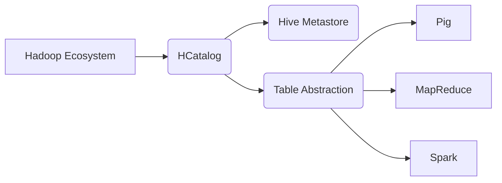

# HCatalog Table原理与代码实例讲解

关键词：HCatalog、Hive、元数据管理、表抽象、Hadoop

## 1. 背景介绍 

### 1.1 问题的由来
随着大数据时代的到来,企业需要存储和处理海量的数据。Hadoop作为开源的分布式计算平台,为大数据处理提供了良好的解决方案。然而,不同的Hadoop组件和工具通常使用不同的数据格式和API,导致数据共享和互操作性方面存在挑战。HCatalog应运而生,旨在简化Hadoop生态系统中的数据管理和共享。

### 1.2 研究现状
目前,HCatalog已经成为Apache Hive项目的子项目,并被广泛应用于Hadoop生态系统中。越来越多的大数据处理工具和框架,如Pig、MapReduce、Spark等,都支持通过HCatalog访问Hive元数据。HCatalog为不同的工具提供了一个统一的表抽象和元数据API,极大地简化了数据共享和互操作。

### 1.3 研究意义 
深入研究HCatalog Table的原理和应用,对于掌握Hadoop生态系统中的数据管理和互操作具有重要意义。通过理解HCatalog如何抽象表结构、存储表元数据以及与Hive metastore交互,可以更好地利用HCatalog实现不同工具之间的无缝数据共享。同时,通过学习HCatalog Table的代码实例,可以快速上手HCatalog的开发和应用。

### 1.4 本文结构
本文将从以下几个方面对HCatalog Table进行深入探讨：
- 第2部分介绍HCatalog的核心概念以及与Hive、Hadoop之间的关系。 
- 第3部分详细阐述HCatalog Table的工作原理,包括表抽象、元数据存储等。
- 第4部分给出HCatalog Table相关的数学模型和公式,并举例说明。
- 第5部分通过代码实例演示如何使用HCatalog API操作表。
- 第6部分讨论HCatalog Table在实际场景中的应用。
- 第7部分推荐HCatalog相关的学习资源和开发工具。
- 第8部分总结全文,并展望HCatalog的未来发展趋势和挑战。
- 第9部分列出HCatalog常见问题解答。

## 2. 核心概念与联系

HCatalog是一个元数据和表管理服务,为Hadoop生态系统中的不同工具提供统一的数据抽象。它的核心概念包括：

- Table：HCatalog中的表是对数据文件的抽象,定义了数据的模式(schema)信息。
- Partition：分区是表的一种特殊组织形式,通过指定分区键,可以将表水平切分为多个部分。
- Storage Descriptor：存储描述符定义了表数据的物理存储信息,如数据格式、存储路径等。

下图展示了HCatalog与Hadoop生态系统的关系：



HCatalog通过抽象表结构并与Hive Metastore交互,为上层的数据处理工具如Pig、MapReduce、Spark等提供统一的元数据访问接口。这种架构使得不同工具可以方便地共享和交换数据,而无需关注底层的数据格式和存储细节。

## 3. 核心算法原理 & 具体操作步骤

### 3.1 算法原理概述
HCatalog Table的核心是通过抽象表结构实现数据的统一访问。具体而言,HCatalog将表的模式信息存储在Hive Metastore中,包括表名、字段名、字段类型、分区信息等。当上层工具请求访问某个表时,HCatalog会从Metastore中获取相应的元数据,并根据元数据信息生成访问数据文件的路径。

### 3.2 算法步骤详解
HCatalog Table的工作流程可以分为以下几个步骤：

1. 创建表：用户通过HCatInputFormat或WebHCat API定义表的模式信息,并将其存储到Hive Metastore。
2. 数据导入：用户将数据文件上传到HDFS,并通过HCatOutputFormat或WebHCat API将数据关联到对应的表。
3. 元数据获取：处理工具通过HCatInputFormat向HCatalog请求表的元数据信息。
4. 数据访问：HCatInputFormat根据元数据信息生成数据文件路径,处理工具从HDFS中读取数据进行处理。

### 3.3 算法优缺点
HCatalog Table的优点包括：

- 提供统一的表抽象和元数据API,简化了数据共享和交换。
- 支持多种数据格式,如TextFile、SequenceFile、RCFile、ORC等。
- 与Hive无缝集成,可以利用HiveQL进行数据查询和处理。

不足之处在于：

- 元数据操作依赖Hive Metastore,可能成为性能瓶颈。
- 表的物理存储受限于HDFS,对其他存储系统支持有限。

### 3.4 算法应用领域
HCatalog Table广泛应用于Hadoop生态系统的数据处理场景,如数据仓库、日志分析、推荐系统等。通过HCatalog,不同的处理框架可以方便地共享和交换中间结果数据,提高了数据处理的灵活性和效率。

## 4. 数学模型和公式 & 详细讲解 & 举例说明

### 4.1 数学模型构建
HCatalog Table可以用关系代数中的表模型来描述。一个HCatalog表 $T$ 可以表示为：

$$
T = (A, D, P, S)
$$

其中：
- $A$ 表示表的属性集合,即表的字段。
- $D$ 表示表的数据集合,即表中的行。
- $P$ 表示表的分区集合,每个分区对应一个目录。
- $S$ 表示表的存储描述符,定义了数据格式、存储路径等。

### 4.2 公式推导过程
对于一个给定的HCatalog表 $T$,其数据集合 $D$ 可以进一步表示为：

$$
D = \{r_1, r_2, ..., r_n\}
$$

其中 $r_i$ 表示表中的一行数据。每行数据都有相同的属性集合 $A$：

$$
A = \{a_1, a_2, ..., a_m\}
$$

如果表 $T$ 存在分区,则其分区集合 $P$ 可以表示为：

$$
P = \{p_1, p_2, ..., p_k\}
$$

每个分区 $p_i$ 对应一个HDFS目录,目录中存储了该分区的数据文件。

### 4.3 案例分析与讲解
假设我们有一个名为 "employee" 的HCatalog表,它包含以下字段：

- name: string
- age: int
- department: string
- salary: float

该表按照 "department" 字段进行分区,每个部门对应一个HDFS目录。表的存储格式为TextFile,数据文件以逗号分隔。

根据上述数学模型,该 employee 表可以表示为：

$$
\begin{aligned}
T_{employee} &= (A, D, P, S) \\
A &= \{name, age, department, salary\} \\
D &= \{r_1, r_2, ..., r_n\} \\
P &= \{sales, marketing, engineering\} \\
S &= (\text{TextFile}, \text{hdfs://data/employee}, \text{comma-separated})
\end{aligned}
$$

当处理工具请求访问 employee 表时,HCatalog会从Hive Metastore获取表的属性、分区和存储信息,然后生成相应的HDFS路径,如:

```
hdfs://data/employee/department=sales
hdfs://data/employee/department=marketing  
hdfs://data/employee/department=engineering
```

处理工具可以从这些路径读取数据文件,并根据元数据信息解析每行数据的字段值。

### 4.4 常见问题解答
- 问：HCatalog表支持哪些文件格式？
  答：HCatalog支持多种常见的Hadoop文件格式,如TextFile、SequenceFile、RCFile、ORC、Parquet等。

- 问：HCatalog表可以与Hive表互相转换吗？ 
  答：可以。HCatalog表与Hive表共享相同的Metastore,因此可以方便地在两者之间进行转换。通过Hive的 "IMPORT/EXPORT" 语句或HCatalog API都可以实现表的导入导出。

## 5. 项目实践：代码实例和详细解释说明

### 5.1 开发环境搭建
要使用HCatalog,需要先搭建Hadoop和Hive环境。可以选择手动安装或使用现成的发行版,如CDH、HDP等。搭建完成后,确保Hive Metastore服务正常运行。

在开发机上,需要引入HCatalog相关的依赖包,如hive-hcatalog-core、hive-metastore等。可以使用Maven或SBT等构建工具进行依赖管理。

### 5.2 源代码详细实现

下面通过Scala代码演示如何使用HCatalog API创建表并导入数据。

```scala
import org.apache.hadoop.hive.metastore.api.Table
import org.apache.hadoop.hive.ql.metadata.{Hive, HiveException}
import org.apache.hive.hcatalog.data.{DefaultHCatRecord, HCatRecord}
import org.apache.hive.hcatalog.data.schema.HCatSchema
import org.apache.hive.hcatalog.mapreduce.HCatInputFormat
import org.apache.hive.hcatalog.mapreduce.OutputJobInfo.OutputInfo

object HCatalogExample {

  def main(args: Array[String]): Unit = {
    // 创建Hive Metastore客户端
    val hive = Hive.get(new HiveConf())

    // 定义表模式
    val schema = new HCatSchema(
      Arrays.asList(
        new HCatFieldSchema("name", TypeInfoFactory.stringTypeInfo, ""),
        new HCatFieldSchema("age", TypeInfoFactory.intTypeInfo, ""),
        new HCatFieldSchema("department", TypeInfoFactory.stringTypeInfo, ""),
        new HCatFieldSchema("salary", TypeInfoFactory.floatTypeInfo, "")
      )
    )

    // 创建HCatalog表
    val table = new Table(
      TableName("employee").getDbTable(),
      schema.getFields.asScala.map(_.getName).asJava,
      schema.getFields.asScala.map(_.getTypeString).asJava,
      null, // partition keys
      null, // table properties
      InputJobInfo.getStorerInfo(classOf[TextFileStorageDriver]),
      OutputJobInfo.getStorerInfo(classOf[TextFileStorageDriver]),
      null // table parameters
    )
    hive.createTable(table)

    // 准备数据
    val records = new ArrayBuffer[HCatRecord]
    records += new DefaultHCatRecord(Array("Alice", 25, "Engineering", 8000.0))
    records += new DefaultHCatRecord(Array("Bob", 30, "Sales", 10000.0))
    records += new DefaultHCatRecord(Array("Carol", 27, "Marketing", 9000.0))

    // 数据导入到HCatalog表
    val outputInfo = OutputInfo.create("default", "employee", null)
    HCatOutputFormat.setOutput(job, outputInfo)
    HCatOutputFormat.setSchema(job, schema)
    val writer = HCatOutputFormat.getRecordWriter(job, null)
    records.foreach(writer.write(_))
    writer.close(null)
  }
}
```

### 5.3 代码解读与分析
上述代码主要分为三个部分：

1. 创建Hive Metastore客户端,用于与Metastore服务交互。
2. 定义表模式,包括表名、字段名、字段类型等。
3. 创建HCatalog表,指定表模式、存储格式等信息,并将表元数据写入Hive Metastore。
4. 准备HCatRecord格式的数据,并通过HCatOutputFormat将数据写入表对应的HDFS目录。

其中,HCatSchema用于定义表的字段模式,HCatRecord用于封装每行数据,HCatOutputFormat用于数据写入。通过这些API,我们可以方便地创建HCatalog表并导入数据。

### 5.4 运行结果展示
运行上述代码后,可以在Hive中查看创建的employee表：

```sql
hive> SHOW TABLES;
employee

hive> DESCRIBE employee;
name        string
age         int
department  string
salary      float

hive> SELECT * FROM employee;
Alice   25  Engineering 8000.0
Bob     30  Sales       10000.0  
Carol   27  Marketing   9000.0
```

可以看到,employee表已成功创建,并且数据已导入到表中。此时,其他Hadoop组件就可以通过