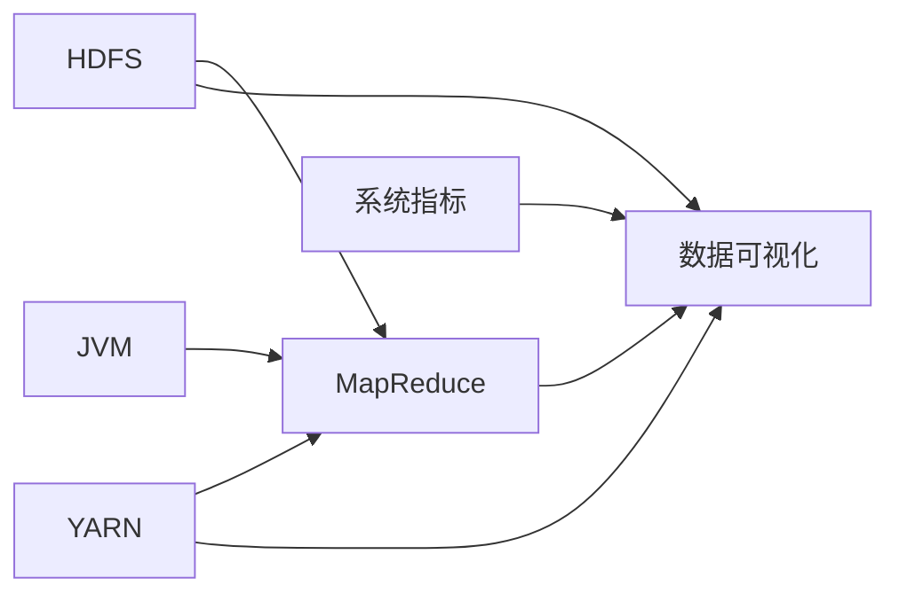

# Hadoop数据监控与数据可视化

关键词：Hadoop、数据监控、数据可视化、HDFS、YARN、MapReduce、Ganglia、Grafana、Zabbix、Ambari

## 1. 背景介绍
### 1.1  问题的由来
随着大数据时代的到来，企业需要处理和分析海量的数据。Hadoop作为一个开源的分布式计算平台，为存储和处理大规模数据集提供了高效、可扩展的解决方案。然而，随着Hadoop集群规模的不断扩大，如何有效地监控集群的运行状态，发现和定位问题，以及实现数据的可视化展现，成为了Hadoop管理员面临的重大挑战。

### 1.2  研究现状
目前，已经有许多针对Hadoop的监控和可视化工具。例如Ganglia、Nagios、Ambari、Grafana等，它们各有特点，可以从不同角度对Hadoop集群进行监控和数据展示。但现有工具在全面性、实时性、可定制性等方面还有待加强。业界仍在不断探索更加高效、直观、易用的Hadoop监控和可视化解决方案。

### 1.3  研究意义
高效的Hadoop数据监控与可视化，对于保障集群稳定运行、优化集群性能、提高数据分析效率都有重要意义。通过实时监测集群的各项指标，管理员可以及时发现异常，快速定位和解决问题。数据可视化则让复杂的数据更加直观易懂，便于分析挖掘数据价值。因此，研究先进的Hadoop监控和可视化技术，对提升大数据平台的管理水平和应用效果具有积极作用。

### 1.4  本文结构
本文将重点探讨Hadoop数据监控与可视化的相关技术。第2部分介绍Hadoop监控和可视化涉及的核心概念。第3部分讨论常用的监控和可视化算法原理。第4部分建立数学模型并推导相关公式。第5部分通过代码实例演示具体的实现过程。第6部分分析实际的应用场景。第7部分推荐相关的工具和学习资源。第8部分总结全文并展望未来的发展方向。

## 2. 核心概念与联系
在Hadoop监控和可视化中，涉及以下几个核心概念：

- HDFS：Hadoop分布式文件系统，用于海量数据的存储。监控HDFS的存储容量、I/O性能、数据块分布等指标，对优化存储至关重要。

- YARN：Hadoop的资源管理和任务调度系统。监控YARN的资源利用率、任务执行进度、队列状态等，有助于优化集群的计算性能。

- MapReduce：Hadoop的分布式计算框架。监控MapReduce作业的执行进度、成功/失败任务数、数据处理速度等，对任务性能优化和错误定位很有帮助。

- JVM：Java虚拟机，Hadoop的运行环境。监控JVM的内存使用、GC情况、线程状态等，对保障Hadoop稳定运行不可或缺。

- 系统指标：如CPU利用率、内存使用率、磁盘I/O、网络流量等。全面监控系统层面的各项指标，是实现Hadoop集群的整体监控的基础。

- 可视化：通过图表、仪表盘等方式直观展现监控数据。数据可视化是将海量监控数据转化为易于理解和分析的形式，是监控系统的重要组成。

下图展示了这些核心概念之间的关系：



由图可见，HDFS和YARN作为Hadoop的核心组件，为MapReduce提供了数据存储和计算资源的支持。而JVM和系统指标则从不同层面反映集群的运行状态。数据可视化则借助图形化手段，将HDFS、YARN、MapReduce等各组件的监控数据进行综合展示，便于全面掌握集群的整体面貌。因此，全方位、多层次地监控这些核心指标，建立直观、可交互的可视化视图，是实现Hadoop监控和运维目标的关键。

## 3. 核心算法原理 & 具体操作步骤
### 3.1  算法原理概述
Hadoop监控和可视化需要收集、处理和展现海量的时序数据。为了高效完成这一任务，常借助一些成熟的算法和工具。例如，在数据采集阶段，可使用Ganglia的gmond和gmetad守护进程分布式采集和汇总监控数据。在数据存储阶段，可采用RRDtool、OpenTSDB、InfluxDB等时序数据库高效存储监控指标。在数据分析阶段，可基于统计学原理计算均值、分位数等指标，使用聚类、异常检测等机器学习算法挖掘数据特征。在数据展示阶段，可结合D3.js等可视化库，通过折线图、柱状图、饼图、热力图等多种视图，直观呈现数据分布和变化趋势。

### 3.2  算法步骤详解
以使用Ganglia监控Hadoop集群为例，其基本步骤如下：

1. 在每个Hadoop节点上部署gmond进程，采集CPU、内存、磁盘、网络等系统指标，以及JVM运行指标。
2. 在主节点上部署gmetad进程，通过RRD格式存储汇总后的监控数据。
3. 配置Ganglia前端页面，定义图表展示哪些指标。
4. 启动Ganglia Web服务，实时查看Hadoop集群的运行状态。

在此基础上，还可进一步优化和扩展监控系统：

5. 使用JMX采集Hadoop内部指标，如HDFS的存储容量、DataNode状态，YARN的资源使用情况，MapReduce任务运行进度等。
6. 采用Kafka等消息队列缓存监控数据，提升数据采集的吞吐量和实时性。
7. 将数据导入Grafana等可视化平台，设计更加美观、可交互的仪表盘。
8. 设置合理的告警阈值，结合HBase等存储过去的告警事件，实现智能化的异常检测和告警。

### 3.3  算法优缺点
Ganglia作为老牌的监控系统，具有部署简单、图表美观、扩展性好等优点，得到了广泛应用。但其数据存储基于RRD，在处理大规模指标时性能有限。此外，图表展示能力也相对单一，难以满足个性化的展示需求。

而Grafana、Ambari等新兴监控平台，通过支持InfluxDB、OpenTSDB等时序数据库，很好地解决了监控数据存储的性能瓶颈。同时，它们提供了更加灵活的可视化方案，支持自定义仪表盘和丰富的图表类型，并提供告警功能，使得Hadoop监控更加智能和自动化。

### 3.4  算法应用领域
Hadoop监控和可视化技术，不仅适用于Hadoop平台本身，还可以扩展到Spark、Flink、Hive、HBase等大数据生态的其他组件。此外，这些技术对于监控Kubernetes容器集群、分布式消息队列、网络设备等其他IT基础设施，同样具有借鉴意义。只要是需要采集、存储、分析和展示海量时序数据的场景，都可以应用相似的思路和方法。

## 4. 数学模型和公式 & 详细讲解 & 举例说明
### 4.1  数学模型构建
为了量化评估Hadoop集群的运行状态，需要建立相应的数学模型。以HDFS存储容量为例，可以用以下几个指标来衡量：

- 集群总存储容量(C)：所有DataNode节点的磁盘容量之和。
- 已用存储空间(U)：集群中已存储的数据量。
- 可用存储空间(A)：集群中还可以存储的数据量。
- 存储空间利用率(R)：已用存储空间占总存储容量的比例。

则有如下数学关系：

$A = C - U$

$R = \frac{U}{C} \times 100\%$

### 4.2  公式推导过程
为方便表示，引入如下记号：

- $c_i$：第$i$个DataNode节点的磁盘容量。
- $u_i$：第$i$个DataNode节点已存储的数据量。
- $n$：DataNode节点的总数。

则集群总存储容量$C$的计算公式为：

$$C = \sum_{i=1}^{n} c_i$$

已用存储空间$U$的计算公式为：

$$U = \sum_{i=1}^{n} u_i$$

可用存储空间$A$的计算公式为：

$$A = C - U = \sum_{i=1}^{n} (c_i - u_i)$$

存储空间利用率$R$的计算公式为：

$$R = \frac{U}{C} \times 100\% = \frac{\sum_{i=1}^{n} u_i}{\sum_{i=1}^{n} c_i} \times 100\%$$

### 4.3  案例分析与讲解
假设某Hadoop集群由3个DataNode节点组成，其磁盘容量分别为：2TB、3TB、4TB。当前各节点已存储的数据量分别为：1TB、1.5TB、2TB。则根据上述公式，可以计算出：

集群总存储容量：
$$C = 2TB + 3TB + 4TB = 9TB$$

已用存储空间：
$$U = 1TB + 1.5TB + 2TB = 4.5TB$$

可用存储空间：
$$A = 9TB - 4.5TB = 4.5TB$$

存储空间利用率：
$$R = \frac{4.5TB}{9TB} \times 100\% = 50\%$$

通过数学建模和计算，我们得到了集群存储空间的关键指标。这些量化的结果，可直观反映集群的存储状态，为容量规划和优化提供依据。同理，对于YARN资源利用率、MapReduce任务进度等其他指标，也可以建立类似的数学模型，从而实现Hadoop运行状态的量化评估。

### 4.4  常见问题解答
问：如何设置Hadoop存储空间的告警阈值？
答：通常可以参考如下经验值：当存储空间利用率超过80%时，触发警告级别告警；超过90%时，触发严重级别告警。告警阈值可根据集群的实际情况进行调整。当触发告警后，需要及时清理无用数据，或者添加新的DataNode节点，以保障集群的存储容量。

问：如何基于数学模型实现Hadoop的智能化监控？
答：可以收集一段时间内的监控指标历史数据，使用统计学和机器学习方法，建立集群的性能基线。当监控指标偏离基线较大时，说明集群可能出现异常，需要自动触发告警。同时，还可以通过数据挖掘方法，主动发现集群中的性能瓶颈和隐患，并给出优化建议。智能化监控可以借助Zabbix、Prometheus等开源工具来实现。

## 5. 项目实践：代码实例和详细解释说明
### 5.1  开发环境搭建
以CentOS 7.x为例，搭建Hadoop监控系统的开发环境：

1. 安装JDK 8：
```bash
yum install java-1.8.0-openjdk java-1.8.0-openjdk-devel
```

2. 安装Ganglia：
```bash
yum install epel-release
yum install ganglia ganglia-gmetad ganglia-gmond ganglia-web
```

3. 安装Hadoop：
```bash
wget https://archive.apache.org/dist/hadoop/common/hadoop-3.2.1/hadoop-3.2.1.tar.gz
tar -xzvf hadoop-3.2.1.tar.gz
```

4. 安装Grafana：
```bash
wget https://dl.grafana.com/oss/release/grafana-7.5.7-1.x86_64.rpm 
yum install grafana-7.5.7-1.x86_64.rpm
```

### 5.2  源代码详细实现
配置Ganglia监控Hadoop集群的核心步骤如下：

1. 修改gmond配置文件，添加Hadoop指标收集：
```xml
/* /etc/ganglia/gmond.conf */
modules {
  module {
    name = "hadoop"
    path = "/usr/lib64/ganglia/hadoop.py"
    params = "localhost 8088 50070"
  }
}
```

2. 在Hadoop集群每个节点启动gmon