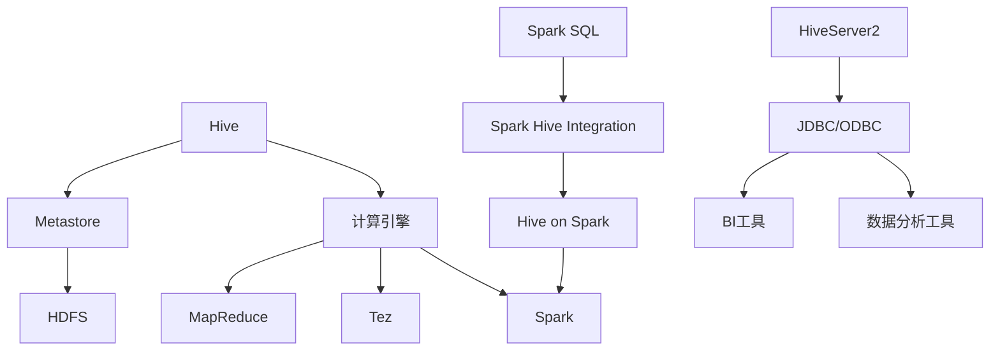

# Hive-Spark整合原理与代码实例讲解

## 1. 背景介绍

### 1.1 问题的由来

在大数据时代,数据量的快速增长使得传统的数据处理方式已经无法满足现代企业的需求。Apache Hive作为构建在Hadoop之上的数据仓库工具,提供了一种简单的方式来管理和查询存储在HDFS中的大规模数据集。然而,Hive的MapReduce计算引擎在处理迭代计算、机器学习算法等复杂任务时存在性能瓶颈。

Apache Spark作为一种新兴的内存计算框架,具有高度的容错性、可伸缩性和通用性,在大数据处理领域展现出了巨大的潜力。Spark不仅支持批处理,还支持流式计算、机器学习等多种计算模式,可以有效解决Hive在迭代计算和实时查询方面的不足。

### 1.2 研究现状

为了充分利用Hive和Spark的优势,将两者整合成为一个强大的大数据处理平台成为了业界的共识。目前,已有多种方案实现了Hive和Spark的整合,包括Spark SQL、Spark Hive Integration、Hive on Spark等。这些方案使用户可以在Hive中直接使用Spark作为计算引擎,提高了查询性能和处理效率。

### 1.3 研究意义

Hive-Spark整合解决方案的出现,为企业提供了一种高效、灵活的大数据处理平台。用户可以继续使用熟悉的HiveQL语言,同时享受Spark强大的计算能力。这不仅提高了数据处理的效率,还降低了企业的学习成本和迁移成本。此外,Hive-Spark整合还为机器学习、实时数据处理等新兴应用场景提供了坚实的基础。

### 1.4 本文结构

本文将全面介绍Hive-Spark整合的原理和实现方式。首先阐述核心概念及其联系,然后深入探讨整合的核心算法原理和数学模型,并通过代码实例详细说明实现过程。最后,本文将分析实际应用场景,推荐相关工具和资源,并对未来发展趋势和挑战进行展望。

## 2. 核心概念与联系

在Hive-Spark整合中,涉及以下几个核心概念:

1. **Hive**: 构建在Hadoop之上的数据仓库工具,提供了SQL类查询接口(HiveQL)来管理存储在HDFS中的大规模数据集。

2. **Metastore**: Hive的元数据存储,用于保存表、分区、Schema等元数据信息。

3. **HDFS**: Hadoop分布式文件系统,用于存储Hive表的实际数据。

4. **计算引擎**: Hive支持多种计算引擎,包括MapReduce、Tez和Spark。传统的MapReduce引擎在处理迭代计算时存在性能瓶颈,而Spark作为新一代内存计算框架,可以显著提高计算效率。

5. **Spark SQL**: Spark的结构化数据处理模块,提供了一种处理关系数据的高级API。

6. **Spark Hive Integration**: 允许开发人员在Spark程序中使用HiveQL,并可以将Hive数据转换为Spark RDD进行处理。

7. **Hive on Spark**: 将Spark作为Hive的计算引擎,使Hive能够利用Spark的内存计算优势,大幅提升查询性能。

8. **HiveServer2**: Hive的服务器组件,允许通过JDBC/ODBC连接访问Hive,支持CLI、ODBC、JDBC等多种客户端方式。

9. **BI工具/数据分析工具**: 通过JDBC/ODBC连接HiveServer2,可以使用商业BI工具(如Tableau)或数据分析工具(如Python、R)来查询和分析Hive中的数据。

这些核心概念相互关联、环环相扣,共同构建了Hive-Spark整合的生态系统。用户可以在熟悉的Hive环境中,无缝利用Spark的强大计算能力,实现高效、灵活的大数据处理。

## 3. 核心算法原理 & 具体操作步骤

### 3.1 算法原理概述

Hive-Spark整合的核心算法原理是将Spark作为Hive的计算引擎,利用Spark的内存计算优势来提高Hive的查询性能。该算法主要分为以下几个步骤:

1. **查询解析**: Hive将HiveQL查询语句解析为逻辑执行计划。

2. **优化器**: 根据查询的特点和数据的统计信息,优化执行计划以提高效率。

3. **物理计划生成**: 将优化后的逻辑执行计划转换为针对Spark的物理执行计划。

4. **DAG构建**: 根据物理执行计划,构建Spark作业的有向无环图(DAG)。

5. **Task提交**: 将DAG提交给Spark集群执行,Spark以并行的方式在集群中运行各个Task。

6. **结果收集**: 收集Task的执行结果,并返回给Hive客户端。

在整个过程中,Spark作为分布式内存计算引擎,能够高效地处理Hive查询,尤其是涉及迭代计算和机器学习算法的复杂查询。同时,Hive还可以利用Spark的其他特性,如流式计算、图计算等,为用户提供更加全面的大数据处理能力。

### 3.2 算法步骤详解

1. **查询解析**

   Hive使用自己的SQL解析器(Parser)将HiveQL查询语句解析为抽象语法树(AST)。然后,AST被转换为更加精简的逻辑执行计划(QueryPlan)。

2. **优化器**

   Hive的优化器(Optimizer)根据查询的特点和数据的统计信息,对逻辑执行计划进行一系列优化,包括:

   - 投影列剪裁(ProjectionPruningOptimizer)
   - 分区剪裁(PartitionPruningOptimizer)
   - 谓词下推(PredicatePushdownOptimizer)
   - 常量折叠(ConstantFoldingOptimizer)
   - 关联重写(JoinReorderOptimizer)
   - 代价模型优化(CostModelOptimizer)

   优化后的逻辑执行计划将被传递给物理计划生成器。

3. **物理计划生成**

   Hive的物理计划生成器(PhysicalPlanGenerator)将优化后的逻辑执行计划转换为针对Spark的物理执行计划。该过程包括:

   - 选择合适的Spark算子(如Map、Reduce、Join等)
   - 生成Spark作业的有向无环图(DAG)
   - 设置作业配置参数(如内存大小、并行度等)

4. **DAG构建**

   根据物理执行计划,Hive构建Spark作业的DAG。DAG由多个Stage组成,每个Stage包含一组相互依赖的Task。DAG的构建过程需要考虑:

   - 数据局部性
   - 任务并行度
   - 失败恢复机制

5. **Task提交**

   Hive将构建好的DAG提交给Spark集群执行。Spark以并行的方式在集群中运行各个Task,充分利用集群资源。在执行过程中,Spark会自动进行容错和任务调度,确保作业的可靠性和高效性。

6. **结果收集**

   所有Task执行完毕后,Hive从Spark中收集执行结果,并将结果返回给Hive客户端。如果查询涉及写入操作,Hive还会将结果数据写入HDFS或其他存储系统。

通过上述步骤,Hive-Spark整合算法实现了将Spark作为Hive的计算引擎,充分发挥了Spark内存计算的优势,大幅提高了Hive的查询性能,尤其是对于迭代计算和机器学习算法等复杂查询。

### 3.3 算法优缺点

**优点**:

1. **高性能**: 利用Spark的内存计算能力,可以显著提高Hive的查询性能,尤其是对于迭代计算和机器学习算法等复杂查询。

2. **低延迟**: Spark的内存计算模式可以减少磁盘I/O,降低查询延迟。

3. **统一平台**: Hive-Spark整合为用户提供了一个统一的大数据处理平台,支持批处理、流式计算、机器学习等多种计算模式。

4. **易用性**: 用户可以继续使用熟悉的HiveQL语言,无需学习新的API或框架。

5. **扩展性**: 整合方案保留了Hive和Spark各自的扩展性,用户可以根据需求添加新功能或优化现有功能。

**缺点**:

1. **资源消耗**: Spark的内存计算模式对集群资源(尤其是内存)的需求较高,可能会增加硬件成本。

2. **学习曲线**:虽然用户可以使用熟悉的HiveQL,但是对于优化查询性能、调试等高级操作,还是需要了解Spark的相关知识。

3. **兼容性**: 不同版本的Hive和Spark可能存在兼容性问题,需要进行版本管理和测试。

4. **调优复杂性**:为了发挥Spark的最大性能,需要对作业配置(如内存大小、并行度等)进行精细的调优,增加了管理复杂度。

5. **数据局部性**: 由于Spark的内存计算模式,可能会导致数据不够本地化,从而增加网络开销。

### 3.4 算法应用领域

Hive-Spark整合算法可以广泛应用于以下领域:

1. **交互式数据分析**: 利用Spark的低延迟特性,可以支持交互式的数据探索和分析,提高数据分析的效率。

2. **机器学习和数据挖掘**: Spark提供了强大的机器学习和数据挖掘库(如MLlib),结合Hive可以构建端到端的大数据机器学习解决方案。

3. **实时数据处理**: 通过Spark Streaming,可以实现对实时数据流的处理,支持各种实时分析和决策场景。

4. **ETL工作流**: 利用Hive和Spark的计算能力,可以高效地执行数据提取、转换和加载(ETL)工作流,加速数据集成过程。

5. **图计算和图分析**: Spark提供了GraphX库,支持对大规模图数据进行高效的计算和分析,可应用于社交网络分析、推荐系统等场景。

6. **科学计算和模拟**: Spark的通用计算框架可以用于科学计算、模拟和建模等领域,如天体物理模拟、分子动力学模拟等。

总的来说,Hive-Spark整合算法为各种大数据处理场景提供了一种高效、灵活的解决方案,助力企业从海量数据中挖掘洞见和价值。

## 4. 数学模型和公式 & 详细讲解 & 举例说明

在Hive-Spark整合中,数学模型和公式主要应用于查询优化和代价模型等方面,以提高查询执行的效率。

### 4.1 数学模型构建

**代价模型(Cost Model)**

代价模型是查询优化器中一个关键组件,用于估计不同执行计划的代价,从而选择最优的执行计划。Hive-Spark整合中的代价模型需要考虑以下因素:

- 数据量
- 数据分布
- 计算资源(CPU、内存等)
- 数据局部性
- Spark作业特性(如并行度、内存使用等)

代价模型通常基于一些数学公式和统计模型来估计查询的代价。例如,可以使用线性代数模型来估计Join操作的代价,使用概率模型来估计数据分布等。

**资源分配模型**

为了充分利用集群资源,需要合理分配CPU、内存等资源。资源分配模型通常基于作业的特性(如数据量、计算复杂度等)和集群的资源情况,使用优化算法(如整数规划、动态规划等)来确定最优的资源分配方案。

###