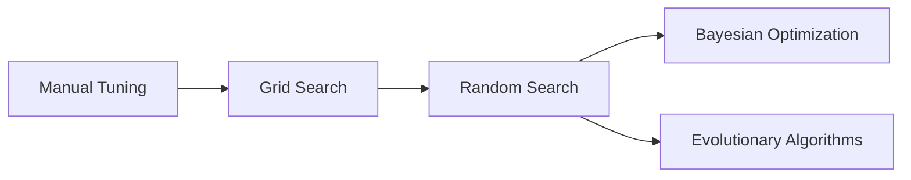

# Hyperparameter Tuning 原理与代码实战案例讲解

## 1. 背景介绍

### 1.1 问题的由来

在机器学习和深度学习中，模型的性能很大程度上取决于超参数的选择。超参数是在模型训练之前设置的参数，例如学习率、正则化系数、隐藏层数量等。不同的超参数组合会导致模型性能的显著差异。因此，如何选择最优的超参数组合成为了一个关键问题。

### 1.2 研究现状

目前，超参数调优主要有以下几种方法：

1. 手动调优：根据经验和直觉，手动尝试不同的超参数组合，并观察模型性能。这种方法费时费力，且容易陷入局部最优。

2. 网格搜索（Grid Search）：穷举所有可能的超参数组合，对每个组合训练模型并评估性能。这种方法虽然全面，但计算成本极高。

3. 随机搜索（Random Search）：在超参数空间中随机采样，并评估每个采样点的模型性能。相比网格搜索，随机搜索能以更少的计算资源找到接近最优的超参数组合。

4. 贝叶斯优化（Bayesian Optimization）：通过构建超参数与模型性能之间的概率模型，利用先验知识引导搜索方向，从而更高效地找到最优超参数。

5. 进化算法（Evolutionary Algorithms）：借鉴生物进化的思想，通过种群的迭代优化来搜索最优超参数组合。

### 1.3 研究意义

超参数调优是机器学习和深度学习中的关键环节，直接影响模型的性能表现。研究高效、自动化的超参数调优方法，可以极大地提升模型开发的效率，同时也有助于我们深入理解模型的工作原理，为算法改进提供新的思路。

### 1.4 本文结构

本文将围绕以下内容展开：

- 超参数调优的核心概念与各种方法之间的联系
- 几种主要超参数调优算法的原理与操作步骤
- 超参数调优相关的数学模型与公式推导
- 代码实战案例：如何使用Python实现超参数调优
- 超参数调优在实际应用场景中的价值
- 推荐的超参数调优工具与学习资源
- 超参数调优未来的发展趋势与面临的挑战

## 2. 核心概念与联系

超参数调优的目标是找到一组超参数，使得模型在验证集或测试集上的性能最优。形式化地，我们可以将超参数调优表示为一个优化问题：

$$\theta^* = \arg\min_\theta \mathcal{L}(\theta, \mathcal{D}_{val})$$

其中，$\theta$ 表示超参数组合，$\mathcal{L}$ 表示损失函数，$\mathcal{D}_{val}$ 表示验证集或测试集。

不同的超参数调优方法在搜索策略上有所差异，但都遵循"试错-评估-优化"的基本思路。下图展示了几种主要方法之间的联系：

手动调优是最基本的方法，但费时费力。网格搜索和随机搜索是两种暴力搜索策略，前者穷举所有可能的组合，后者随机采样。贝叶斯优化和进化算法则在随机搜索的基础上引入了先验知识和优化策略，能更高效地收敛到最优解。

## 3. 核心算法原理 & 具体操作步骤

### 3.1 算法原理概述

#### 3.1.1 网格搜索

网格搜索通过穷举所有超参数的组合来找到最优解。具体来说，它将每个超参数的取值范围划分为若干离散值，然后遍历所有可能的组合，对每个组合训练模型并评估性能，最终选择性能最优的组合作为最终结果。

#### 3.1.2 随机搜索

随机搜索与网格搜索类似，但它不是遍历所有可能的组合，而是在超参数空间中随机采样若干组合，然后评估这些组合的性能。相比网格搜索，随机搜索能以更少的计算资源找到接近最优的解。

#### 3.1.3 贝叶斯优化

贝叶斯优化通过构建超参数与模型性能之间的概率模型（通常是高斯过程），来引导下一步的搜索方向。它在每次迭代中，根据先验知识和已评估的样本点，更新概率模型，并选择最有可能改进模型性能的超参数组合进行评估。重复这一过程，直到达到预设的迭代次数或性能阈值。

#### 3.1.4 进化算法

进化算法借鉴了生物进化的思想，通过种群的迭代优化来搜索最优超参数组合。它维护一个超参数组合的种群，每一代通过选择、交叉、变异等操作产生新的个体，然后评估这些个体的性能，淘汰劣质个体，保留优质个体。经过多代进化，种群会不断优化，最终收敛到最优解。

### 3.2 算法步骤详解

#### 3.2.1 网格搜索

1. 确定每个超参数的取值范围和离散化步长
2. 生成所有可能的超参数组合
3. 对每个组合，训练模型并评估性能
4. 选择性能最优的组合作为最终结果

#### 3.2.2 随机搜索

1. 确定每个超参数的取值范围
2. 随机采样若干超参数组合
3. 对每个组合，训练模型并评估性能
4. 选择性能最优的组合作为最终结果

#### 3.2.3 贝叶斯优化

1. 确定每个超参数的取值范围
2. 初始化概率模型（通常是高斯过程）
3. 重复以下步骤，直到达到迭代次数或性能阈值：
   a. 根据概率模型，选择最有可能改进性能的超参数组合
   b. 评估该组合的性能
   c. 将评估结果加入样本集，更新概率模型
4. 返回评估过的最优超参数组合

#### 3.2.4 进化算法

1. 确定每个超参数的取值范围
2. 随机初始化一个超参数组合种群
3. 重复以下步骤，直到达到迭代次数或性能阈值：
   a. 评估当前种群中每个个体的性能
   b. 淘汰劣质个体，保留优质个体
   c. 对优质个体进行选择、交叉、变异，产生新一代种群
4. 返回种群中的最优个体作为最终结果

### 3.3 算法优缺点

- 网格搜索：
  - 优点：覆盖全面，一定能找到最优解
  - 缺点：计算成本高，在超参数维度较高时难以实施

- 随机搜索：
  - 优点：相比网格搜索，计算成本更低
  - 缺点：有一定的随机性，可能错过最优解

- 贝叶斯优化：
  - 优点：引入先验知识，搜索更高效；适用于计算成本高昂的问题
  - 缺点：概率模型的选择和优化有一定难度

- 进化算法：
  - 优点：通过种群并行搜索，能跳出局部最优；适用于非凸、非连续的搜索空间
  - 缺点：算法实现较为复杂，有一定的计算开销

### 3.4 算法应用领域

超参数调优算法广泛应用于机器学习和深度学习的各个领域，包括计算机视觉、自然语言处理、语音识别、推荐系统等。只要涉及到模型训练和优化，都离不开超参数调优。一些具体的应用场景包括：

- 调优图像分类模型的架构和训练参数
- 优化自然语言处理模型的嵌入维度、注意力机制等
- 搜索最优的语音识别模型结构和声学特征
- 调整推荐系统中的用户/物品嵌入维度、正则化系数等

## 4. 数学模型和公式 & 详细讲解 & 举例说明

### 4.1 数学模型构建

超参数调优可以形式化为一个优化问题：

$$\theta^* = \arg\min_\theta \mathcal{L}(\theta, \mathcal{D}_{val})$$

其中，$\theta$ 表示超参数组合，$\mathcal{L}$ 表示损失函数，$\mathcal{D}_{val}$ 表示验证集或测试集。

不同的超参数调优算法在优化策略上有所差异，下面以贝叶斯优化为例，介绍其数学模型。

贝叶斯优化的核心思想是，通过构建超参数与模型性能之间的概率模型，来引导下一步的搜索方向。这个概率模型通常选择高斯过程（Gaussian Process）。

高斯过程是一种非参数的贝叶斯模型，它假设任意一组随机变量都服从多元高斯分布。在超参数调优的场景下，我们可以将超参数组合 $\theta$ 视为输入，模型性能 $f(\theta)$ 视为输出，并假设它们之间满足高斯过程：

$$f(\theta) \sim \mathcal{GP}(m(\theta), k(\theta, \theta'))$$

其中，$m(\theta)$ 是均值函数，通常设为0；$k(\theta, \theta')$ 是协方差函数，用于度量不同超参数组合之间的相似性。常用的协方差函数包括平方指数核（Squared Exponential Kernel）、Matérn核等。

给定一组已评估的超参数组合 $\{\theta_1, \dots, \theta_n\}$ 及其对应的性能 $\{f(\theta_1), \dots, f(\theta_n)\}$，我们可以通过最大化边际似然估计（MLE）来拟合高斯过程的超参数。然后，利用该高斯过程预测任意未评估的超参数组合 $\theta^*$ 的性能分布：

$$p(f(\theta^*) | \theta^*, \{\theta_1, \dots, \theta_n\}, \{f(\theta_1), \dots, f(\theta_n)\}) = \mathcal{N}(\mu(\theta^*), \sigma^2(\theta^*))$$

其中，$\mu(\theta^*)$ 和 $\sigma^2(\theta^*)$ 可以通过高斯过程的预测公式计算得到。

有了性能分布，我们就可以构建一个采集函数（Acquisition Function），用于平衡探索和利用，选择下一个最有潜力的超参数组合进行评估。常用的采集函数包括期望提升（Expected Improvement）、上置信界（Upper Confidence Bound）等。

以期望提升为例，它的定义如下：

$$EI(\theta) = \mathbb{E}[\max(f(\theta) - f(\theta^+), 0)]$$

其中，$\theta^+$ 表示当前已评估的最优超参数组合。$EI(\theta)$ 度量了超参数组合 $\theta$ 相对于当前最优解的期望提升。我们选择 $EI(\theta)$ 最大的超参数组合作为下一个评估点。

重复这一过程，直到达到预设的迭代次数或性能阈值，就可以得到最优的超参数组合。

### 4.2 公式推导过程

以下是贝叶斯优化中几个关键公式的推导过程：

#### 4.2.1 高斯过程的预测公式

假设我们已经评估了 $n$ 个超参数组合 $\{\theta_1, \dots, \theta_n\}$，得到相应的性能值 $\mathbf{f} = [f(\theta_1), \dots, f(\theta_n)]^T$。现在，我们要预测一个新的超参数组合 $\theta^*$ 的性能分布。

根据高斯过程的定义，我们有：

$$\begin{bmatrix} \mathbf{f} \\ f(\theta^*) \end{bmatrix} \sim \mathcal{N}\left(\mathbf{0}, \begin{bmatrix} K & \mathbf{k} \\ \mathbf{k}^T & k(\theta^*, \theta^*) \end{bmatrix}\right)$$

其中，$K$ 是已评估超参数组合之间的协方差矩阵，$\mathbf{k}$ 是新超参数组合与已评估超参数组合之间的协方差向量。

利用多元高斯分布的条件分布公式，我们可以得到：