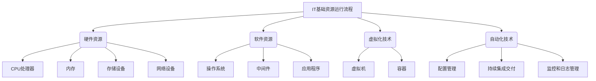

# IT基础资源（硬软件）运行流程

## 1. 背景介绍

### 1.1 问题的由来

在当今信息时代,IT基础设施已经成为现代社会运转的关键支柱。无论是个人电脑、移动设备,还是大型数据中心和云计算环境,都依赖于硬件和软件资源的高效协作运行。然而,随着IT系统的日益复杂化,确保这些资源能够顺利运行并提供可靠的服务,已经成为一个巨大的挑战。

### 1.2 研究现状

目前,业界和学术界已经提出了许多理论模型和实践方法来管理和优化IT基础资源的运行流程。例如,ITIL(IT基础架构库)为IT服务管理提供了一套完整的最佳实践指南;DevOps理念则强调开发、运维和质量保证之间的紧密协作;云计算技术则通过虚拟化和自动化,提高了资源利用率和灵活性。

### 1.3 研究意义

然而,尽管取得了一定进展,但仍然存在一些亟待解决的问题和挑战。例如,如何在确保系统安全性和合规性的同时,实现资源的高效利用?如何在不同的IT环境之间实现无缝集成和协作?如何通过智能化手段,提高资源管理的自动化水平?本文旨在系统地探讨IT基础资源运行流程的核心概念、关键技术和最佳实践,为读者提供一个全面的视角。

### 1.4 本文结构

本文将首先介绍IT基础资源运行流程的核心概念和相关技术,包括硬件资源、软件资源、虚拟化技术、自动化技术等。接下来,将详细阐述资源运行流程的核心算法原理和数学模型,并通过案例分析加深读者的理解。然后,文章将介绍实际项目中的代码实现和应用场景,并推荐相关的工具和学习资源。最后,本文将总结未来的发展趋势和面临的挑战,为读者提供一个前瞻性的视角。

## 2. 核心概念与联系

IT基础资源运行流程涉及到多个核心概念,包括硬件资源、软件资源、虚拟化技术、自动化技术等,它们相互关联、相互依赖,共同构建了现代IT基础设施的运行环境。

硬件资源包括CPU处理器、内存、存储设备和网络设备等,为软件资源的运行提供了物理基础。软件资源则包括操作系统、中间件和应用程序等,实现了特定的业务逻辑和功能。

虚拟化技术通过虚拟机和容器等手段,实现了硬件资源的抽象和共享,提高了资源利用率和灵活性。自动化技术则包括配置管理、持续集成交付、监控和日志管理等,旨在简化运维流程、提高效率和可靠性。

这些核心概念相互关联、相互依赖,共同构建了现代IT基础设施的运行环境。只有充分理解它们之间的关系,才能更好地管理和优化资源运行流程。

## 3. 核心算法原理 & 具体操作步骤

### 3.1 算法原理概述

IT基础资源运行流程的核心算法原理主要包括以下几个方面:

1. **资源调度算法**: 根据应用程序的需求和资源的可用状态,合理地分配和调度硬件资源(如CPU、内存、存储等)和软件资源(如操作系统、中间件等),以实现高效的资源利用。

2. **负载均衡算法**: 在多个资源节点之间,合理地分配和均衡工作负载,避免某些节点过载而导致性能下降或服务中断。

3. **容错和恢复算法**: 当某些资源发生故障或异常时,能够及时检测并采取相应的容错和恢复措施,确保系统的可用性和可靠性。

4. **虚拟化和隔离算法**: 通过虚拟化技术,将物理资源抽象为逻辑资源,实现资源的共享和隔离,提高资源利用率和安全性。

5. **自动化和优化算法**: 通过智能化手段,自动化资源的配置、部署、监控和优化,减少人工干预,提高运维效率。

这些核心算法原理相互关联、相互作用,共同确保了IT基础资源的高效运行和可靠服务。

### 3.2 算法步骤详解

以资源调度算法为例,其具体操作步骤如下:

1. **收集资源信息**: 首先,需要收集系统中所有可用资源的状态信息,包括CPU利用率、内存使用量、存储空间、网络带宽等。这些信息将作为资源调度决策的依据。

2. **分析应用需求**: 接下来,需要分析应用程序对资源的具体需求,包括CPU计算能力、内存大小、存储空间、网络带宽等。这些需求将作为资源分配的目标。

3. **构建资源模型**: 根据收集到的资源信息和应用需求,构建一个资源模型,描述资源之间的拓扑结构、容量约束和依赖关系等。

4. **执行调度算法**: 在资源模型的基础上,执行特定的调度算法,如启发式算法、整数规划算法等,计算出最优的资源分配方案。

5. **实施资源分配**: 将计算出的资源分配方案应用到实际的IT基础设施中,完成资源的分配和调度。

6. **监控和优化**: 持续监控资源的使用情况,并根据实时数据动态调整和优化资源分配,以适应不断变化的应用需求和资源状态。

需要注意的是,不同的算法原理可能会有不同的具体操作步骤,上述步骤仅供参考。在实际应用中,还需要考虑具体的场景和约束条件,并结合其他算法原理,综合设计出最优的解决方案。

### 3.3 算法优缺点

任何算法都有其优缺点,IT基础资源运行流程中的核心算法也不例外。

**优点**:

1. **提高资源利用率**: 通过合理的资源调度和负载均衡,可以最大限度地利用现有资源,避免资源浪费。

2. **提高系统可靠性**: 容错和恢复算法可以及时发现和处理故障,确保系统的高可用性。

3. **增强安全性和隔离性**: 虚拟化和隔离算法可以有效地隔离不同的应用程序和服务,提高系统的安全性。

4. **降低运维成本**: 自动化和优化算法可以减少人工干预,提高运维效率,降低运维成本。

**缺点**:

1. **算法复杂度高**: 许多算法原理涉及到复杂的数学模型和优化问题,实现和调优都存在一定的挑战。

2. **需要大量数据支持**: 许多算法需要收集和处理大量的资源状态数据和应用需求数据,对数据采集和处理能力有较高要求。

3. **动态性和实时性要求高**: 由于资源状态和应用需求是动态变化的,算法需要具有良好的动态适应能力和实时响应能力。

4. **算法之间存在trade-off**: 不同的算法原理可能会存在一定的trade-off关系,需要权衡和平衡不同目标之间的关系。

因此,在实际应用中,需要根据具体的场景和需求,选择合适的算法原理,并进行充分的测试和优化,以发挥算法的最大潜力。

### 3.4 算法应用领域

IT基础资源运行流程中的核心算法原理在多个领域都有广泛的应用,包括但不限于:

1. **云计算**: 在云计算环境中,资源调度、负载均衡、容错恢复等算法原理被广泛应用,以实现资源的高效利用和可靠服务。

2. **数据中心**: 大型数据中心通常拥有成千上万台服务器,需要依赖算法原理来进行资源管理和优化。

3. **边缘计算**: 随着物联网和5G技术的发展,边缘计算正在兴起,算法原理可以帮助实现边缘资源的高效利用。

4. **高性能计算**: 在科学计算、人工智能等领域,高性能计算集群需要通过算法来实现资源的合理分配和调度。

5. **虚拟化和容器技术**: 虚拟化和容器技术广泛应用于各种IT环境中,其背后离不开虚拟化和隔离算法的支持。

6. **DevOps和自动化**: DevOps理念和自动化技术的实现,依赖于配置管理、持续集成交付、监控和日志管理等算法原理。

总的来说,IT基础资源运行流程中的核心算法原理是现代IT基础设施的关键支撑,在各个领域都发挥着重要作用。随着IT技术的不断发展,这些算法原理也在不断演进和完善,以适应新的需求和挑战。

## 4. 数学模型和公式 & 详细讲解 & 举例说明

### 4.1 数学模型构建

为了更好地描述和优化IT基础资源运行流程,我们需要构建合适的数学模型。以资源调度问题为例,一种常见的数学模型是整数规划模型。

假设我们有 $n$ 个应用程序 $A = \{a_1, a_2, \dots, a_n\}$,需要部署在 $m$ 个资源节点 $R = \{r_1, r_2, \dots, r_m\}$ 上。每个应用程序 $a_i$ 对CPU、内存和存储等资源有特定的需求,分别记为 $c_i$、$m_i$ 和 $s_i$。每个资源节点 $r_j$ 的可用CPU、内存和存储资源分别记为 $C_j$、$M_j$ 和 $S_j$。

我们可以引入决策变量 $x_{ij}$,表示应用程序 $a_i$ 是否部署在资源节点 $r_j$ 上,取值为 0 或 1。目标函数可以设置为最小化资源利用率的方差,以实现负载均衡:

$$\min \sum_{j=1}^{m}\left(\frac{\sum_{i=1}^{n}c_ix_{ij}}{C_j} - \overline{C}\right)^2 + \left(\frac{\sum_{i=1}^{n}m_ix_{ij}}{M_j} - \overline{M}\right)^2 + \left(\frac{\sum_{i=1}^{n}s_ix_{ij}}{S_j} - \overline{S}\right)^2$$

其中 $\overline{C}$、$\overline{M}$ 和 $\overline{S}$ 分别表示所有节点的平均CPU、内存和存储利用率。

同时,我们需要加入以下约束条件:

$$\sum_{j=1}^{m}x_{ij} = 1,\ \forall i \in \{1, 2, \dots, n\}$$
$$\sum_{i=1}^{n}c_ix_{ij} \leq C_j,\ \forall j \in \{1, 2, \dots, m\}$$
$$\sum_{i=1}^{n}m_ix_{ij} \leq M_j,\ \forall j \in \{1, 2, \dots, m\}$$
$$\sum_{i=1}^{n}s_ix_{ij} \leq S_j,\ \forall j \in \{1, 2, \dots, m\}$$

第一个约束条件确保每个应用程序只能部署在一个资源节点上;后三个约束条件则确保每个节点的资源利用率不超过其容量。

通过求解这个整数规划模型,我们可以得到一个最优的资源分配方案,实现资源的高效利用和负载均衡。

### 4.2 公式推导过程

在构建数学模型的过程中,我们需要推导出合适的目标