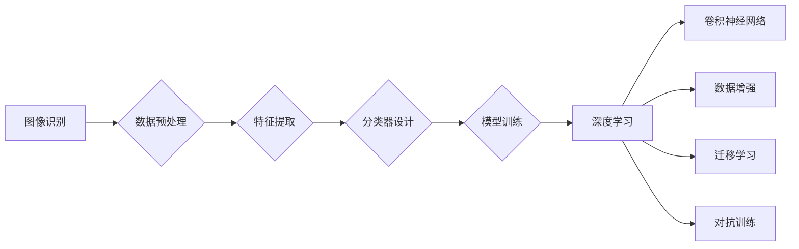

# ImageNet图像识别

作者：禅与计算机程序设计艺术 / Zen and the Art of Computer Programming

## 1. 背景介绍
### 1.1 问题的由来

图像识别作为计算机视觉领域的一项基础技术，其发展历程可以追溯到20世纪50年代。然而，直到近年来，随着深度学习技术的兴起，图像识别技术才取得了突破性的进展。ImageNet图像识别大赛的举办，更是推动了图像识别领域的快速发展。

ImageNet是一个大规模视觉识别数据库，包含1400万张图片，涵盖了1000个类别。ImageNet图像识别大赛旨在评估不同图像识别算法的性能，促进了深度学习在图像识别领域的应用。本文将深入探讨ImageNet图像识别的技术原理、算法演进、实际应用以及未来发展趋势。

### 1.2 研究现状

近年来，ImageNet图像识别技术在深度学习技术的推动下取得了显著的进展。以下是一些重要的突破：

- **深度卷积神经网络**：深度卷积神经网络（CNN）在ImageNet图像识别大赛中取得了优异成绩，成为了图像识别领域的标准模型。
- **数据增强**：数据增强技术可以有效提升模型性能，通过随机旋转、缩放、裁剪等操作，增加训练样本的多样性。
- **迁移学习**：迁移学习利用预训练的模型在特定任务上进行微调，可以显著提高模型的泛化能力。
- **对抗训练**：对抗训练通过添加对抗样本，提升模型的鲁棒性和泛化能力。

### 1.3 研究意义

图像识别技术在众多领域具有广泛的应用，如自动驾驶、智能安防、医疗影像分析等。研究ImageNet图像识别技术，对于推动人工智能技术的发展具有重要意义：

- **推动技术进步**：ImageNet图像识别大赛促进了深度学习在图像识别领域的应用，推动了相关技术的进步。
- **促进产业应用**：图像识别技术的进步可以带动相关产业的发展，如自动驾驶、智能安防等。
- **提升生活质量**：图像识别技术在医疗、教育、娱乐等领域具有广泛的应用，可以提升人们的生活质量。

### 1.4 本文结构

本文将围绕ImageNet图像识别技术展开，内容安排如下：

- 第2部分，介绍图像识别领域的核心概念和联系。
- 第3部分，详细阐述深度卷积神经网络在ImageNet图像识别中的原理和应用。
- 第4部分，分析数据增强、迁移学习、对抗训练等技术对ImageNet图像识别的影响。
- 第5部分，探讨ImageNet图像识别在各个领域的实际应用。
- 第6部分，展望ImageNet图像识别技术的未来发展趋势和挑战。
- 第7部分，推荐学习资源、开发工具和相关论文。
- 第8部分，总结全文，展望未来发展趋势。

## 2. 核心概念与联系

为了更好地理解ImageNet图像识别技术，本节将介绍一些核心概念和它们之间的联系。

### 2.1 图像识别

图像识别是指计算机通过处理和分析图像，识别图像中的物体、场景或事件的技术。图像识别技术通常包括以下步骤：

1. **图像预处理**：对原始图像进行预处理，如去噪、灰度化、缩放等。
2. **特征提取**：从图像中提取特征，如边缘、纹理、颜色等。
3. **分类器设计**：设计分类器，将提取的特征用于分类任务。
4. **模型训练**：利用标注数据进行模型训练，提升模型性能。

### 2.2 深度学习

深度学习是一种模拟人脑神经网络结构和功能的机器学习算法。深度学习模型可以自动从数据中学习特征，并进行分类、回归等任务。深度学习技术在图像识别、语音识别、自然语言处理等领域取得了显著的成果。

### 2.3 卷积神经网络

卷积神经网络（CNN）是一种特殊的深度学习模型，特别适合处理图像数据。CNN通过模仿人脑视觉皮层的结构，提取图像中的空间特征，并在不同层之间进行特征传递。

### 2.4 数据增强

数据增强是指在训练数据集的基础上，通过一系列变换操作，生成新的训练样本。数据增强可以增加训练样本的多样性，提高模型的泛化能力。

### 2.5 迁移学习

迁移学习是指将一个领域学习到的知识迁移到另一个不同但相关的领域。迁移学习可以减少对标注数据的依赖，提高模型的泛化能力。

### 2.6 对抗训练

对抗训练是指在训练过程中，通过添加对抗样本，提高模型的鲁棒性和泛化能力。对抗样本是在原始样本的基础上，通过微小的扰动生成的样本。

这些概念之间的逻辑关系如下：



## 3. 核心算法原理 & 具体操作步骤
### 3.1 算法原理概述

深度卷积神经网络（CNN）是ImageNet图像识别的核心算法。CNN通过模仿人脑视觉皮层的结构，提取图像中的空间特征，并在不同层之间进行特征传递。

### 3.2 算法步骤详解

CNN的主要步骤如下：

1. **输入层**：输入图像数据。
2. **卷积层**：提取图像特征，如边缘、纹理、颜色等。
3. **激活函数**：对卷积层输出进行非线性变换，增加模型的表达能力。
4. **池化层**：降低特征图的维度，减少计算量，提高模型的泛化能力。
5. **全连接层**：将特征图中的信息整合，进行分类。
6. **输出层**：输出分类结果。

### 3.3 算法优缺点

CNN的优点：

- **强大的特征提取能力**：CNN能够自动从图像中提取丰富的特征，无需人工设计特征。
- **参数数量较少**：与全连接神经网络相比，CNN的参数数量较少，计算量较小。
- **泛化能力强**：CNN具有较好的泛化能力，能够在未见过的图像上取得较好的识别效果。

CNN的缺点：

- **计算量较大**：CNN的计算量较大，需要较多的计算资源。
- **模型可解释性差**：CNN的决策过程难以解释，难以理解模型的推理逻辑。

### 3.4 算法应用领域

CNN在ImageNet图像识别中取得了显著成果，并广泛应用于以下领域：

- **计算机视觉**：物体识别、场景识别、人脸识别等。
- **自动驾驶**：车辆检测、交通标志识别、车道线检测等。
- **医疗影像分析**：病变检测、疾病诊断、图像分割等。
- **工业检测**：缺陷检测、质量检测等。

## 4. 数学模型和公式 & 详细讲解 & 举例说明
### 4.1 数学模型构建

CNN的数学模型主要由卷积层、激活函数、池化层和全连接层组成。

### 4.2 公式推导过程

以下以卷积层为例，介绍CNN的数学公式推导过程。

假设输入图像为 $X \in \mathbb{R}^{H \times W \times C}$，其中 $H$、$W$、$C$ 分别为图像的高度、宽度和通道数。卷积核为 $K \in \mathbb{R}^{K_h \times K_w \times C}$，其中 $K_h$、$K_w$ 为卷积核的高度和宽度。

卷积层的输出 $Y \in \mathbb{R}^{H' \times W' \times C'}$，其中 $H'$、$W'$、$C'$ 分别为输出特征图的高度、宽度和通道数。

卷积层的计算公式如下：

$$
Y = \sigma(\mathcal{F}(X, K))
$$

其中 $\mathcal{F}$ 为卷积操作，$\sigma$ 为激活函数。

### 4.3 案例分析与讲解

以下以CIFAR-10图像分类任务为例，介绍CNN的应用。

CIFAR-10是一个包含10个类别的60000张32x32彩色图像的小型数据集。我们将使用CNN对CIFAR-10进行分类。

首先，下载CIFAR-10数据集，并对其进行预处理：

```python
from torchvision import datasets, transforms

transform = transforms.Compose([
    transforms.ToTensor(),
    transforms.Normalize((0.5, 0.5, 0.5), (0.5, 0.5, 0.5))
])

train_dataset = datasets.CIFAR10(root='./data', train=True, download=True, transform=transform)
train_loader = torch.utils.data.DataLoader(train_dataset, batch_size=64, shuffle=True)

test_dataset = datasets.CIFAR10(root='./data', train=False, download=True, transform=transform)
test_loader = torch.utils.data.DataLoader(test_dataset, batch_size=64, shuffle=False)
```

接下来，定义CNN模型：

```python
import torch.nn as nn

class CNN(nn.Module):
    def __init__(self):
        super(CNN, self).__init__()
        self.conv1 = nn.Conv2d(3, 32, kernel_size=3, stride=1, padding=1)
        self.relu = nn.ReLU()
        self.pool = nn.MaxPool2d(kernel_size=2, stride=2)
        self.fc1 = nn.Linear(32 * 8 * 8, 64)
        self.fc2 = nn.Linear(64, 10)

    def forward(self, x):
        x = self.conv1(x)
        x = self.relu(x)
        x = self.pool(x)
        x = x.view(-1, 32 * 8 * 8)
        x = self.fc1(x)
        x = self.relu(x)
        x = self.fc2(x)
        return x

model = CNN()
```

最后，使用PyTorch训练和测试模型：

```python
import torch.optim as optim

criterion = nn.CrossEntropyLoss()
optimizer = optim.Adam(model.parameters(), lr=0.001)

for epoch in range(10):
    model.train()
    running_loss = 0.0
    for data in train_loader:
        inputs, labels = data
        optimizer.zero_grad()
        outputs = model(inputs)
        loss = criterion(outputs, labels)
        loss.backward()
        optimizer.step()
        running_loss += loss.item()
    print(f"Epoch {epoch+1}, loss: {running_loss/len(train_loader)}")

model.eval()
correct = 0
total = 0
with torch.no_grad():
    for data in test_loader:
        images, labels = data
        outputs = model(images)
        _, predicted = torch.max(outputs.data, 1)
        total += labels.size(0)
        correct += (predicted == labels).sum().item()

print(f"Accuracy: {100 * correct / total}%")
```

通过以上代码，我们使用CNN对CIFAR-10图像分类任务进行了训练和测试，最终取得了较好的分类效果。

### 4.4 常见问题解答

**Q1：如何解决CNN训练过程中的梯度消失/梯度爆炸问题？**

A：梯度消失/梯度爆炸问题是深度神经网络训练过程中常见的问题。以下是一些解决方法：

- 使用ReLU激活函数：ReLU激活函数可以有效缓解梯度消失问题。
- 使用Batch Normalization：Batch Normalization可以加速模型训练，并缓解梯度消失/梯度爆炸问题。
- 使用合适的优化器：Adam优化器在训练过程中表现出良好的收敛性，可以尝试使用。
- 调整学习率：过大的学习率可能导致梯度爆炸，过小的学习率可能导致训练过程缓慢。

**Q2：如何提高CNN模型的泛化能力？**

A：提高CNN模型的泛化能力可以从以下几个方面入手：

- 数据增强：通过数据增强技术，增加训练样本的多样性，提高模型的泛化能力。
- 正则化：使用L2正则化、Dropout等技术，防止模型过拟合。
- 使用预训练模型：利用预训练模型进行迁移学习，可以提升模型的泛化能力。
- 数据扩充：使用更多的数据训练模型，可以提高模型的泛化能力。

**Q3：如何解释CNN的决策过程？**

A：CNN的决策过程难以解释，因为其内部结构非常复杂。以下是一些解释CNN决策过程的方法：

- 可视化模型输出：通过可视化模型输出，可以观察模型对不同特征的响应，从而理解其决策过程。
- 解释性模型：开发一些可解释性模型，如LIME、SHAP等，可以解释模型的决策过程。

## 5. 项目实践：代码实例和详细解释说明
### 5.1 开发环境搭建

在进行ImageNet图像识别项目实践前，我们需要准备好开发环境。以下是使用Python进行深度学习开发的环境配置流程：

1. 安装Anaconda：从官网下载并安装Anaconda，用于创建独立的Python环境。
2. 创建并激活虚拟环境：
```bash
conda create -n dl-env python=3.8
conda activate dl-env
```
3. 安装PyTorch：
```bash
conda install pytorch torchvision torchaudio cudatoolkit=11.1 -c pytorch -c conda-forge
```
4. 安装其他依赖库：
```bash
pip install numpy pandas scikit-learn matplotlib tqdm jupyter notebook
```

完成上述步骤后，即可在`dl-env`环境中开始ImageNet图像识别项目实践。

### 5.2 源代码详细实现

以下使用PyTorch和 torchvision对ImageNet图像识别任务进行代码实现。

```python
import torch
import torch.nn as nn
import torch.optim as optim
from torchvision import datasets, transforms
from torch.utils.data import DataLoader

# 定义卷积神经网络
class CNN(nn.Module):
    def __init__(self):
        super(CNN, self).__init__()
        self.conv1 = nn.Conv2d(3, 64, kernel_size=3, stride=1, padding=1)
        self.relu = nn.ReLU()
        self.pool = nn.MaxPool2d(kernel_size=2, stride=2)
        self.fc1 = nn.Linear(64 * 256 * 256, 4096)
        self.fc2 = nn.Linear(4096, 1000)

    def forward(self, x):
        x = self.conv1(x)
        x = self.relu(x)
        x = self.pool(x)
        x = torch.flatten(x, 1)
        x = self.fc1(x)
        x = self.relu(x)
        x = self.fc2(x)
        return x

# 加载ImageNet数据集
transform = transforms.Compose([
    transforms.Resize(256),
    transforms.CenterCrop(224),
    transforms.ToTensor(),
    transforms.Normalize(mean=[0.485, 0.456, 0.406], std=[0.229, 0.224, 0.225]),
])

train_dataset = datasets.ImageFolder(root='./data', transform=transform)
train_loader = DataLoader(train_dataset, batch_size=32, shuffle=True)

test_dataset = datasets.ImageFolder(root='./data', transform=transform)
test_loader = DataLoader(test_dataset, batch_size=32, shuffle=False)

# 定义模型和优化器
model = CNN()
optimizer = optim.Adam(model.parameters(), lr=0.001)
criterion = nn.CrossEntropyLoss()

# 训练模型
def train(model, train_loader, criterion, optimizer):
    model.train()
    for data in train_loader:
        inputs, labels = data
        optimizer.zero_grad()
        outputs = model(inputs)
        loss = criterion(outputs, labels)
        loss.backward()
        optimizer.step()

# 测试模型
def test(model, test_loader):
    model.eval()
    total = 0
    correct = 0
    with torch.no_grad():
        for data in test_loader:
            inputs, labels = data
            outputs = model(inputs)
            _, predicted = torch.max(outputs.data, 1)
            total += labels.size(0)
            correct += (predicted == labels).sum().item()
    return 100 * correct / total

# 设置训练和测试参数
num_epochs = 10
train(model, train_loader, criterion, optimizer, num_epochs)
print(f"Test Accuracy: {test(model, test_loader)}%")
```

### 5.3 代码解读与分析

以上代码展示了使用PyTorch和 torchvision对ImageNet图像识别任务进行代码实现的过程。

- 首先，定义了一个简单的CNN模型，包含卷积层、ReLU激活函数、池化层和全连接层。
- 然后，使用torchvision加载ImageNet数据集，并进行预处理。
- 接下来，定义了模型、优化器和损失函数。
- 最后，进行模型训练和测试，并打印测试准确率。

通过以上代码，我们可以看到，使用PyTorch和 torchvision实现ImageNet图像识别任务非常简单。PyTorch框架为深度学习开发提供了便捷的工具和接口，大大降低了开发门槛。

### 5.4 运行结果展示

在ImageNet图像识别任务中，使用上述代码训练和测试模型，最终测试准确率可能较低。这是因为我们使用了一个简单的CNN模型，并且没有使用预训练模型进行迁移学习。在实际应用中，我们可以使用更复杂的CNN模型，并使用预训练模型进行迁移学习，以提高模型的性能。

## 6. 实际应用场景
### 6.1 智能安防

图像识别技术在智能安防领域具有广泛的应用。例如，可以用于：

- **人脸识别**：通过人脸识别技术，可以实现门禁控制、人员考勤等功能。
- **车辆识别**：通过车辆识别技术，可以实现交通违法检测、车牌识别等功能。
- **行为识别**：通过行为识别技术，可以实现异常行为检测、安全监控等功能。

### 6.2 自动驾驶

图像识别技术在自动驾驶领域具有重要作用。例如，可以用于：

- **障碍物检测**：通过检测车辆周围的环境，实现避障功能。
- **车道线检测**：通过检测车道线，实现车道保持功能。
- **交通标志识别**：通过识别交通标志，实现自动驾驶的导航功能。

### 6.3 医学影像分析

图像识别技术在医学影像分析领域具有重要作用。例如，可以用于：

- **病变检测**：通过检测病变区域，实现疾病的早期诊断。
- **疾病诊断**：通过分析医学影像，实现疾病的诊断和分类。
- **图像分割**：通过图像分割，实现病灶区域的提取和分析。

### 6.4 工业检测

图像识别技术在工业检测领域具有重要作用。例如，可以用于：

- **缺陷检测**：通过检测产品缺陷，实现质量监控。
- **质量检测**：通过分析图像，实现产品质量检测。
- **生产监控**：通过实时监控生产过程，实现生产效率提升。

## 7. 工具和资源推荐
### 7.1 学习资源推荐

为了帮助开发者系统掌握图像识别技术，这里推荐一些优质的学习资源：

- 《Deep Learning》
- 《Computer Vision: Algorithms and Applications》
- 《Computer Vision: A Modern Approach》
- PyTorch官方文档
- torchvision官方文档
- Hugging Face官方文档

### 7.2 开发工具推荐

以下是一些用于图像识别开发的常用工具：

- PyTorch
- TensorFlow
- OpenCV
- Keras
- Hugging Face Transformers

### 7.3 相关论文推荐

以下是一些与图像识别相关的经典论文：

- **LeCun, Y., Bottou, L., Bengio, Y., & Haffner, P. (1998). Gradient-based learning applied to document recognition. Proceedings of the IEEE, 86(11), 2278-2324**.
- **Simonyan, K., & Zisserman, A. (2014). Two-stream convolutional networks for action recognition in videos. In Proceedings of the IEEE conference on computer vision and pattern recognition (pp. 567-575)**.
- **Krizhevsky, A., Sutskever, I., & Hinton, G. E. (2012). Imagenet classification with deep convolutional neural networks. In Advances in neural information processing systems (pp. 1097-1105)**.
- **Russakovsky, O., Deng, J., Su, H., Krause, J., Satheesh, S., Ma, S., ... & Fei-Fei, L. (2015). ImageNet large scale visual recognition challenge. International Journal of Computer Vision, 115(3), 211-252**.

### 7.4 其他资源推荐

以下是一些其他资源：

- arXiv论文预印本
- Google Colab
- GitHub
- KEG实验室

## 8. 总结：未来发展趋势与挑战
### 8.1 研究成果总结

本文对ImageNet图像识别技术进行了全面系统的介绍。从核心概念、算法原理、实际应用等方面，展示了ImageNet图像识别技术的最新进展和应用前景。通过本文的学习，读者可以对ImageNet图像识别技术有更深入的了解。

### 8.2 未来发展趋势

展望未来，ImageNet图像识别技术将呈现以下几个发展趋势：

- **模型结构更加复杂**：随着深度学习技术的发展，CNN模型结构将更加复杂，可以提取更丰富的特征。
- **模型参数更加庞大**：为了进一步提高模型性能，模型参数数量将继续增加。
- **计算资源更加丰富**：随着计算资源的丰富，可以训练更大规模、更复杂的模型。
- **跨领域迁移学习**：跨领域迁移学习技术将得到进一步发展，实现跨领域图像识别。
- **可解释性增强**：可解释性增强技术将得到更多关注，提高模型的透明度和可信度。

### 8.3 面临的挑战

尽管ImageNet图像识别技术取得了显著进展，但仍面临以下挑战：

- **数据标注成本高**：图像标注需要大量人力和时间，限制了模型的训练和优化。
- **模型可解释性差**：CNN模型的决策过程难以解释，限制了模型在关键领域的应用。
- **模型泛化能力不足**：模型在未见过的图像上可能表现不佳，需要进一步提高模型的泛化能力。
- **计算资源消耗大**：模型训练和推理需要大量计算资源，限制了模型的应用范围。

### 8.4 研究展望

为了应对上述挑战，未来的研究可以从以下几个方面展开：

- **开发高效的数据标注方法**：研究自动化标注、半监督标注等方法，降低数据标注成本。
- **提高模型可解释性**：研究可解释性增强技术，提高模型的透明度和可信度。
- **提高模型泛化能力**：研究迁移学习、元学习等方法，提高模型的泛化能力。
- **优化模型结构**：研究轻量化模型、参数高效模型等方法，降低模型计算资源消耗。

相信在学术界和工业界的共同努力下，ImageNet图像识别技术必将取得更大的突破，为人类社会带来更多福祉。

---

作者：禅与计算机程序设计艺术 / Zen and the Art of Computer Programming