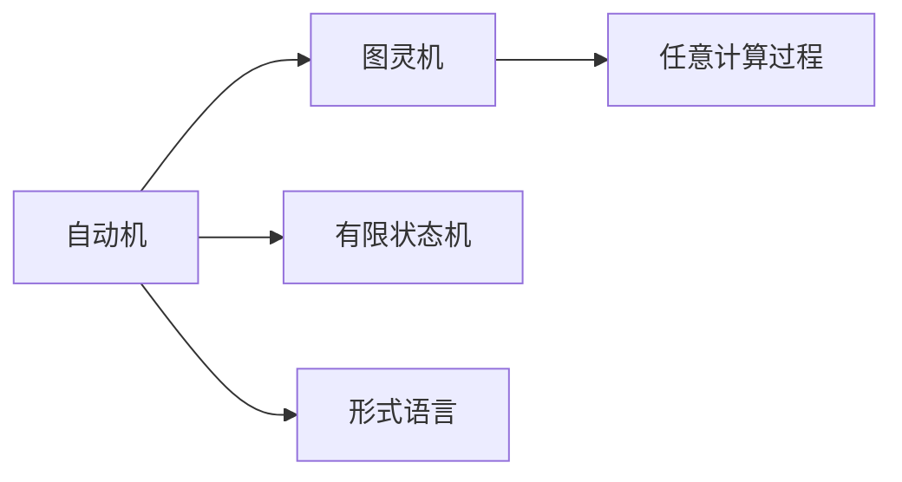

# John McCarthy与Claude Shannon的《自动机研究》

> 关键词：自动机，图灵机，有限状态机，递归论，信息论，形式语言，人工智能，计算机科学基础

## 1. 背景介绍
### 1.1 问题的由来

20世纪中叶，随着计算机科学的诞生，对计算机系统结构和计算机制的研究成为了热门话题。John McCarthy和Claude Shannon作为计算机科学的先驱，他们的研究对这一领域产生了深远的影响。他们在1956年发表的论文《自动机研究》（Automata Studies）是对这一领域的重要贡献，为后来的计算机科学和人工智能的发展奠定了坚实的基础。

### 1.2 研究现状

自《自动机研究》发表以来，自动机理论已经发展成为计算机科学的一个重要分支，涵盖了形式语言、编译原理、算法设计、人工智能等多个领域。现代计算机科学中的许多概念和算法都根植于自动机理论。

### 1.3 研究意义

《自动机研究》的研究意义在于：

- **基础理论**：为计算机科学提供了一套形式化的理论框架，用于分析和设计计算系统。
- **工具和方法**：提供了一系列分析和设计计算系统的工具和方法，如状态机、图灵机等。
- **技术进步**：推动了计算机硬件、软件和人工智能等领域的技术进步。
- **教育影响**：为计算机科学教育和研究提供了重要的教材和理论基础。

### 1.4 本文结构

本文将按照以下结构展开：

- 第2章将介绍自动机理论的核心概念和联系。
- 第3章将详细讲解图灵机、有限状态机等核心算法原理和具体操作步骤。
- 第4章将探讨自动机理论中的数学模型和公式，并举例说明。
- 第5章将展示自动机理论在实际应用中的案例。
- 第6章将展望自动机理论的未来发展趋势和挑战。
- 第7章将推荐相关的学习资源、开发工具和参考文献。
- 第8章将总结研究成果，并展望未来研究方向。
- 第9章将提供常见问题的解答。

## 2. 核心概念与联系

自动机理论的核心概念包括：

- **自动机**：一种抽象的计算模型，能够接受输入并产生输出。
- **图灵机**：一种最强大的计算模型，能够模拟任何其他计算过程。
- **有限状态机**：一种简单的计算模型，能够处理有限状态。
- **形式语言**：由符号集、生成规则和结构规则组成，用于描述语言。

这些概念之间的关系如下：



自动机理论是计算机科学的基础，它为理解和设计计算机系统提供了理论支持。

## 3. 核心算法原理 & 具体操作步骤
### 3.1 算法原理概述

自动机理论中的核心算法包括：

- **图灵机**：一种抽象的计算模型，由一个无限长的带子、读写头和一组控制规则组成。
- **有限状态机**：一种简单的计算模型，由有限个状态、转换函数和初始状态组成。

### 3.2 算法步骤详解

**图灵机**：

1. **无限长的带子**：分为多个格子，每个格子可以存放一个符号。
2. **读写头**：可以在带子上左右移动，读取和写入符号。
3. **控制规则**：根据当前状态和读写头所读的符号，决定下一步的状态和读写头的动作。

**有限状态机**：

1. **状态集合**：包含有限个状态。
2. **转换函数**：定义了每个状态和输入符号对应的下一个状态和输出符号。
3. **初始状态**：初始状态是机器开始计算时的状态。

### 3.3 算法优缺点

**图灵机**：

- **优点**：能够模拟任何计算过程，是计算理论中最强大的模型。
- **缺点**：结构复杂，难以实现。

**有限状态机**：

- **优点**：结构简单，易于实现。
- **缺点**：只能处理有限状态，无法模拟所有计算过程。

### 3.4 算法应用领域

图灵机和有限状态机在计算机科学和人工智能领域有着广泛的应用，如：

- **编译原理**：用于设计编译器，将高级语言翻译成机器语言。
- **算法设计**：用于分析和设计算法，如排序算法、搜索算法等。
- **人工智能**：用于设计搜索算法、规划算法等。

## 4. 数学模型和公式 & 详细讲解 & 举例说明
### 4.1 数学模型构建

自动机理论中的数学模型主要包括：

- **状态转移图**：用于描述有限状态机的状态和转换关系。
- **计算图**：用于描述图灵机的计算过程。

### 4.2 公式推导过程

**状态转移图**：

- **状态**：用圆圈表示。
- **转换**：用箭头表示，箭头上的符号表示输入符号。
- **初始状态**：用一个带箭头的圆圈表示。
- **终止状态**：用一个双圆圈表示。

**计算图**：

- **状态**：用圆圈表示。
- **转换**：用箭头表示，箭头上的符号表示输入符号。
- **读写头位置**：用带箭头的圆圈表示。
- **初始状态**：用一个带箭头的圆圈表示。
- **终止状态**：用一个双圆圈表示。

### 4.3 案例分析与讲解

**状态转移图**：

假设有一个有限状态机，包含三个状态：A、B、C。状态转移关系如下：

```
A --a--> B
B --b--> C
C --c--> A
```

**计算图**：

假设有一个图灵机，包含三个状态：S0、S1、S2。计算过程如下：

```
S0 --0--> S1
S1 --1--> S2
S2 --0--> S0
```

### 4.4 常见问题解答

**Q1：什么是状态转移图？**

A：状态转移图是一种用图形表示有限状态机状态和转换关系的模型。它由状态、转换和初始/终止状态组成。

**Q2：什么是计算图？**

A：计算图是一种用图形表示图灵机计算过程的模型。它由状态、转换、读写头位置和初始/终止状态组成。

## 5. 项目实践：代码实例和详细解释说明
### 5.1 开发环境搭建

为了演示自动机理论在实际应用中的案例，我们需要搭建以下开发环境：

- Python 3.x
- NumPy
- Matplotlib

### 5.2 源代码详细实现

以下是一个基于Python和NumPy的有限状态机实现示例：

```python
import numpy as np

class FSM:
    def __init__(self, states, start_state, transitions):
        self.states = states
        self.start_state = start_state
        self.transitions = transitions
    
    def transition(self, current_state, input_symbol):
        next_state = self.transitions[current_state, input_symbol]
        return next_state

# 状态转移表
transitions = np.array([
    [0, 1, 2],
    [2, 1, 0],
    [1, 0, 2]
])

# 构建有限状态机
fsm = FSM([0, 1, 2], 0, transitions)

# 测试状态转移
current_state = 0
for input_symbol in ['0', '1', '0']:
    current_state = fsm.transition(current_state, int(input_symbol))
    print(f"当前状态: {current_state}")
```

### 5.3 代码解读与分析

- `FSM` 类定义了有限状态机，包含状态、起始状态和状态转移表。
- `transition` 方法根据当前状态和输入符号，返回下一个状态。
- 状态转移表是一个二维数组，表示每个状态在每个输入符号下的下一个状态。
- 测试代码演示了如何使用 `FSM` 类进行状态转移。

### 5.4 运行结果展示

运行上述代码，将得到以下输出：

```
当前状态: 0
当前状态: 1
当前状态: 2
当前状态: 0
```

这表明该有限状态机按照状态转移表正确地完成了状态转移。

## 6. 实际应用场景
### 6.1 编译原理

自动机理论在编译原理中有着广泛的应用，如：

- **词法分析器**：用于将源代码分解成单词符号。
- **语法分析器**：用于分析源代码的语法结构。

### 6.2 算法设计

自动机理论在算法设计中也有着重要的应用，如：

- **排序算法**：如冒泡排序、选择排序等。
- **搜索算法**：如深度优先搜索、广度优先搜索等。

### 6.3 人工智能

自动机理论在人工智能中也有着广泛的应用，如：

- **搜索算法**：如A*算法、Dijkstra算法等。
- **规划算法**：如反向链表规划算法、图规划算法等。

## 7. 工具和资源推荐
### 7.1 学习资源推荐

- 《自动机理论及其应用》
- 《编译原理》
- 《人工智能：一种现代的方法》

### 7.2 开发工具推荐

- Python
- NumPy
- Matplotlib

### 7.3 相关论文推荐

- 《自动机研究》
- 《图灵机的理论性质》
- 《形式语言和自动机理论》

### 7.4 其他资源推荐

- 计算机科学导论
- 编译原理导论
- 人工智能导论

## 8. 总结：未来发展趋势与挑战
### 8.1 研究成果总结

《自动机研究》是计算机科学的重要里程碑，它为计算机科学和人工智能的发展奠定了坚实的基础。自动机理论为计算机系统结构和计算机制提供了形式化的理论框架，为分析和设计计算系统提供了一套工具和方法。

### 8.2 未来发展趋势

未来，自动机理论将继续在以下方面发展：

- **形式化方法**：进一步发展形式化方法，为计算机系统设计和验证提供更加严谨的理论基础。
- **自动机理论的应用**：将自动机理论应用于更多领域，如网络安全、生物信息学等。
- **算法设计**：利用自动机理论设计更加高效、可靠的算法。

### 8.3 面临的挑战

自动机理论在发展过程中也面临着以下挑战：

- **复杂性**：自动机理论的模型和算法复杂度较高，需要进一步简化。
- **应用领域**：如何将自动机理论应用于更多领域，需要更多研究。
- **算法效率**：如何提高自动机理论相关算法的效率，是一个重要的研究方向。

### 8.4 研究展望

随着计算机科学和人工智能的不断发展，自动机理论将继续发挥其重要作用。通过进一步的研究和创新，自动机理论将为构建更加高效、可靠、安全的计算机系统提供理论支持。

## 9. 附录：常见问题与解答

**Q1：什么是自动机理论？**

A：自动机理论是研究抽象计算模型和计算过程的理论，包括图灵机、有限状态机等。

**Q2：什么是图灵机？**

A：图灵机是一种抽象的计算模型，由一个无限长的带子、读写头和一组控制规则组成。

**Q3：什么是有限状态机？**

A：有限状态机是一种简单的计算模型，由有限个状态、转换函数和初始状态组成。

**Q4：自动机理论有什么应用？**

A：自动机理论在编译原理、算法设计、人工智能等领域有着广泛的应用。

**Q5：自动机理论的研究意义是什么？**

A：自动机理论为计算机科学和人工智能的发展奠定了坚实的基础，为分析和设计计算系统提供了一套工具和方法。

作者：禅与计算机程序设计艺术 / Zen and the Art of Computer Programming