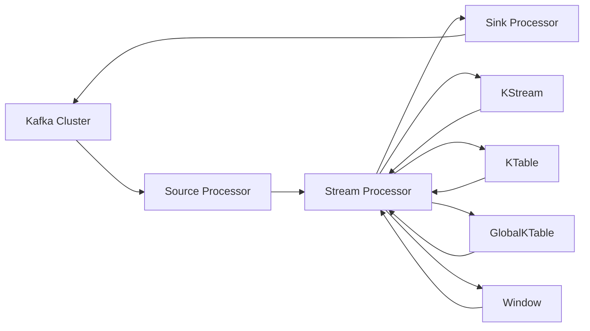

# Kafka Streams原理与代码实例讲解

## 1. 背景介绍
### 1.1 问题的由来
在大数据时代，企业每天都会产生海量的数据，如何高效地处理和分析这些数据成为一个巨大的挑战。传统的批处理方式已经无法满足实时性要求，流式计算应运而生。Kafka作为一个高吞吐、低延迟、高可靠的分布式消息队列，成为流式计算的重要基础设施。而Kafka Streams作为Kafka的流式处理类库，让开发者可以轻松构建复杂的实时流处理应用。

### 1.2 研究现状
目前业界主流的流式计算框架有Spark Streaming、Flink、Storm等，而Kafka Streams作为Kafka原生的流式处理类库，与Kafka可以无缝集成，减少了系统复杂度。越来越多的公司开始使用Kafka Streams来构建实时流处理应用，如网站点击流分析、欺诈检测、实时推荐等。

### 1.3 研究意义
深入研究Kafka Streams的原理和应用，对于构建大规模实时流处理系统具有重要意义：

1. 提高开发效率：Kafka Streams提供了高层次的流处理DSL和operator，简化了应用开发。
2. 实现端到端的exactly-once语义：通过引入事务机制，Kafka Streams可以保证数据处理的exactly-once。
3. 实现毫秒级的低延迟：得益于Kafka的高性能，Kafka Streams可以实现毫秒级的端到端延迟。
4. 支持有状态计算：Kafka Streams支持有状态的操作，如join、aggregation等。
5. 轻量级部署：不需要单独的流处理集群，应用程序可以以容器或应用程序的方式部署。

### 1.4 本文结构
本文将从以下几个方面对Kafka Streams进行深入探讨：

1. Kafka Streams的核心概念与基本原理
2. Kafka Streams的核心API与编程模型
3. Kafka Streams的状态存储与容错机制
4. Kafka Streams的时间语义与窗口机制
5. Kafka Streams的代码实例与应用场景
6. Kafka Streams的部署与监控
7. Kafka Streams的最佳实践与注意事项
8. Kafka Streams的未来发展与挑战

## 2. 核心概念与联系
Kafka Streams中有几个核心概念需要理解：

- Stream：代表一个无限的、持续更新的数据流。数据流中的每一个数据都被称为一个record。
- Stream Processor：负责对输入的数据流进行处理，并产生新的数据流。
- Source Processor：负责从Kafka中读取数据，是特殊的Stream Processor。
- Sink Processor：负责将数据写入Kafka，是特殊的Stream Processor。
- Topology：定义了Stream之间的拓扑结构，描述了数据流的转换过程。
- KStream：代表一个数据流，用于无界数据流的处理。
- KTable：代表一个changelog stream，用于有界数据集的处理。
- GlobalKTable：代表一个全局的changelog stream，数据分布在所有的partition上。
- Time：Kafka Streams支持三种时间语义：Event-time、Ingestion-time和Processing-time。
- Window：窗口是对无界数据流进行有界处理的机制，如滚动窗口、滑动窗口、会话窗口。

下图展示了Kafka Streams中核心概念之间的关系：

## 3. 核心算法原理 & 具体操作步骤
### 3.1 算法原理概述
Kafka Streams的核心算法是将无界的数据流转化为有界的数据集进行处理。具体来说，包括以下几个步骤：

1. 从Kafka中持续不断地读取数据，形成KStream或KTable。
2. 通过一系列的中间算子如map、filter、join等对数据进行处理，转化为新的KStream或KTable。
3. 对KStream或KTable进行窗口操作，如滚动窗口、滑动窗口、会话窗口等，形成窗口化的KStream或KTable。
4. 对窗口化的KStream或KTable进行聚合操作，如reduce、aggregate等，形成新的KTable。
5. 将处理结果写回Kafka或输出到外部系统。

### 3.2 算法步骤详解
1. 数据抽象：Kafka中的数据以record的形式存在，每个record包含key、value、timestamp等属性。Kafka Streams中提供了三种数据抽象：KStream、KTable和GlobalKTable。
  - KStream：代表一个无界的、持续更新的数据流。每个record都是一个独立的数据单元，多次输入同一个key会产生多个record。
  - KTable：代表一个changelog stream，每个record代表对key的一次更新。对于同一个key，只保留最新的一个record。
  - GlobalKTable：与KTable类似，但是数据分布在所有的partition上，可以用于与KStream进行join操作。

2. 中间算子：Kafka Streams提供了丰富的中间算子，用于对KStream或KTable进行转换操作。常用的算子包括：
  - map：对每个record执行一个映射函数，将record转换为新的record。
  - filter：对每个record执行一个布尔函数，只保留函数返回true的record。
  - flatMap：与map类似，但每个record可以映射为0到多个record。
  - join：对两个KStream或KTable执行join操作，常见的有innerJoin、leftJoin、outerJoin等。
  - groupBy：对KStream或KTable按key进行分组，形成一个KGroupedStream或KGroupedTable。
  - aggregate：对KGroupedStream或KGroupedTable执行聚合操作，如sum、count、avg等。
  - reduce：对KGroupedStream或KGroupedTable执行reduce操作，合并相同key的record。

3. 窗口操作：对于时间相关的聚合分析，需要引入窗口的概念，即在一定的时间范围内收集数据进行计算。Kafka Streams提供了三种窗口：
  - 滚动窗口(Tumbling Window)：固定大小的窗口，窗口之间没有重叠，每个record只属于一个窗口。
  - 滑动窗口(Sliding Window)：固定大小的窗口，可以有重叠，每个record可能属于多个窗口。
  - 会话窗口(Session Window)：基于session活动的动态大小窗口，窗口边界根据session的活跃程度调整。

4. 状态存储：Kafka Streams中的状态存储使用RocksDB实现，支持快照和变更日志，可以进行本地状态查询。
  - 每个task都有自己的本地状态存储，存储计算过程中的中间状态数据。
  - 通过定期对本地状态存储做snapshot，将状态备份到Kafka的内部topic中，实现状态容错。
  - 当应用程序重启或发生rebalance时，通过从Kafka的内部topic中恢复状态，保证exactly-once。

5. 数据一致性：Kafka Streams通过引入事务机制，实现了端到端的exactly-once语义。
  - 每个task都有一个唯一的transactional.id，用于实现幂等写入。
  - 通过将多个算子的处理结果缓存在内存中，再一次性提交，实现原子写入。
  - 引入Kafka事务，将消费位移、状态存储的变更以及结果的提交封装在一个事务中，实现端到端的一致性。

### 3.3 算法优缺点
优点：
- 原生支持Kafka：与Kafka无缝集成，减少了系统复杂度，可以实现端到端的exactly-once。
- 高吞吐、低延迟：得益于Kafka的高性能，Kafka Streams可以实现毫秒级的端到端延迟。
- 支持有状态计算：通过引入本地状态存储和容错机制，支持有状态的操作，如join、aggregation等。
- 易于编程和部署：提供了高层次的流处理DSL，简化了编程；应用程序可以以容器或应用程序的方式部署。

缺点：
- 不支持自定义插件：与Flink、Spark等通用流计算引擎相比，Kafka Streams的扩展性较差，不支持自定义插件。
- 状态存储受限：本地状态存储基于RocksDB，容量受限于单机，不适合超大规模的状态存储。
- 弱事务支持：事务机制主要用于保证exactly-once，对于端到端的分布式事务支持有限。

### 3.4 算法应用领域
Kafka Streams在许多实时流处理场景中得到了广泛应用，例如：

- 网站点击流分析：通过对用户点击事件流的实时分析，实现实时报表、异常检测等。
- 欺诈检测：通过对交易事件流的实时分析，实现实时欺诈检测和风控。
- 物联网数据处理：对传感器数据流进行实时清洗、转换和聚合分析。
- 实时推荐系统：根据用户的实时行为，动态调整推荐结果。
- 日志监控告警：对服务器日志进行实时分析，实现异常检测和告警。

## 4. 数学模型和公式 & 详细讲解 & 举例说明
### 4.1 数学模型构建
Kafka Streams的数学模型可以用有向无环图(DAG)来表示，图中的节点表示算子，边表示数据流的流向。

设输入的数据流为$S_0$，经过一系列的算子$O_1, O_2, ..., O_n$的处理，输出结果流$S_n$，则整个流处理过程可以表示为：

$$S_n = O_n(...(O_2(O_1(S_0)))...)$$

其中，每个算子$O_i$都可以看作一个函数，将输入流$S_{i-1}$转换为输出流$S_i$：

$$S_i = O_i(S_{i-1})$$

常见的算子函数包括：

- map算子：对输入流中的每个元素$x$执行一个映射函数$f$，得到输出流中的元素$y=f(x)$。
$$map(S, f) = \{f(x) | x \in S\}$$

- filter算子：对输入流中的每个元素$x$执行一个布尔函数$p$，只保留使$p(x)=true$的元素。
$$filter(S, p) = \{x | x \in S, p(x)=true\}$$

- flatMap算子：与map算子类似，但映射函数$f$可以返回0到多个元素。
$$flatMap(S, f) = \bigcup_{x \in S} f(x)$$

- groupBy算子：根据key函数$k$对输入流进行分组，形成一个KGroupedStream。
$$groupBy(S, k) = \{(k(x), \{y | y \in S, k(y)=k(x)\}) | x \in S\}$$

- aggregate算子：对KGroupedStream中的每个分组执行聚合函数$a$，得到一个KTable。
$$aggregate(G, a) = \{(k, a(\{y | (k, y) \in G\})) | (k, \_) \in G\}$$

### 4.2 公式推导过程
以一个简单的wordcount为例，说明Kafka Streams的公式推导过程。

输入数据流$S_0$为一串句子，每个句子包含多个单词：
$$S_0 = \{"hello world", "hello kafka streams", ...\}$$

1. 首先使用flatMap算子将句子拆分为单词：
$$S_1 = flatMap(S_0, split) = \{"hello", "world", "hello", "kafka", "streams", ...\}$$

2. 然后使用map算子将每个单词映射为(word, 1)的形式：
$$S_2 = map(S_1, x \rightarrow (x, 1)) = \{("hello", 1), ("world", 1), ("hello", 1), ("kafka", 1), ("streams", 1), ...\}$$

3. 接着使用groupBy算子按单词进行分组：
$$G = groupBy(S_2, (x,y) \rightarrow x) = \{("hello", \{("hello", 1), ("hello", 1)\}), ("world", \{("world", 1)\}), ...\}$$

4. 最后使用aggregate算子对每个分组进行求和：
$$S_3 = aggregate(G, (k,v) \rightarrow sum(v)) = \{("hello", 2), ("world", 1), ("kafka", 1), ("streams", 1), ...\}$$

### 4.3 案例分析与讲解
下面通过一个实际的案例，说明如何使用Kafka Streams进行实时wordcount。