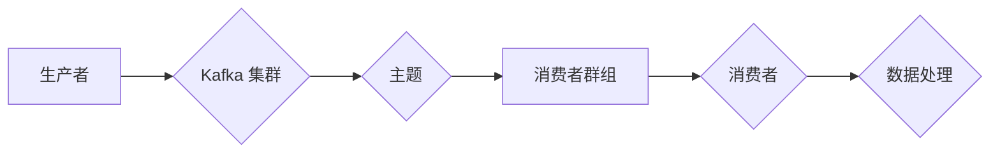

# Kafka消费者集群部署与管理

作者：禅与计算机程序设计艺术 / Zen and the Art of Computer Programming

## 1. 背景介绍

### 1.1 问题的由来

随着大数据时代的到来，企业对实时数据处理的需求日益增长。Apache Kafka 作为一款高性能、可扩展的流处理平台，已成为构建实时数据管道的首选技术之一。在 Kafka 集群中，消费者负责消费并处理消息，从而实现数据流的处理。然而，随着消费者数量的增加和业务需求的复杂化，如何高效地部署和管理 Kafka 消费者集群成为一个亟待解决的问题。

### 1.2 研究现状

目前，Kafka 消费者集群的部署与管理主要依靠以下几个方面：

- **Kafka 官方客户端**：Kafka 官方提供了 Java、Python、Go、C++ 等语言的客户端库，方便开发者进行消费者集群的部署与管理。
- **第三方管理工具**：例如 Debezium、Confluent Kafka Manager、Kafka MirrorMaker 等工具，提供可视化界面和自动化管理功能。
- **容器化平台**：利用 Docker、Kubernetes 等容器化平台，实现消费者集群的自动化部署和运维。

### 1.3 研究意义

研究 Kafka 消费者集群的部署与管理，对于提高 Kafka 集群的可用性、高性能和可扩展性具有重要意义：

- **提高可用性**：通过合理部署和管理消费者集群，降低系统故障风险，保证数据处理的连续性和可靠性。
- **提升性能**：优化消费者集群的配置和资源分配，提高数据处理速度，满足实时业务需求。
- **增强可扩展性**：实现消费者集群的动态扩展和伸缩，适应业务发展变化。

### 1.4 本文结构

本文将从以下方面对 Kafka 消费者集群的部署与管理进行详细介绍：

- 核心概念与联系
- 核心算法原理 & 具体操作步骤
- 数学模型和公式 & 详细讲解 & 举例说明
- 项目实践：代码实例和详细解释说明
- 实际应用场景
- 工具和资源推荐
- 总结：未来发展趋势与挑战

## 2. 核心概念与联系

以下是一些与 Kafka 消费者集群相关的核心概念：

- **消费者**：Kafka 消费者是 Kafka 集群中负责消费并处理消息的客户端。
- **消费者群组**：一组协同工作的消费者，共同消费一个或多个 Kafka 主题的消息。
- **分区**：Kafka 主题的分区数量决定了数据的并行度，提高处理速度。
- **副本**：Kafka 主题分区的备份，用于提高可用性和容错性。
- **偏移量**：表示消费者消费到的消息位置。
- **消费者负载**：消费者处理消息的速度和效率。

Kafka 消费者集群的架构如下：



## 3. 核心算法原理 & 具体操作步骤

### 3.1 算法原理概述

Kafka 消费者集群的部署与管理主要涉及以下几个方面：

- **消费者配置**：配置消费者群组 ID、消费模式（推模式或拉模式）、消息拉取策略等。
- **分区分配**：将主题分区分配给消费者，实现负载均衡。
- **消费消息**：消费者拉取消息并处理。
- **偏移量提交**：提交消费偏移量，保证消息消费的顺序性和可靠性。
- **故障恢复**：处理消费者故障，保证数据处理的连续性。

### 3.2 算法步骤详解

以下是 Kafka 消费者集群部署与管理的具体步骤：

1. **安装 Kafka**：在服务器上安装 Kafka 服务。
2. **创建主题**：在 Kafka 集群中创建主题，并设置分区数量和副本数量。
3. **配置消费者**：配置消费者群组 ID、消费模式、消息拉取策略等。
4. **消费者分组**：将消费者分配到不同的消费者群组。
5. **消费消息**：消费者从 Kafka 集群中拉取消息并处理。
6. **提交偏移量**：消费者提交消费偏移量，保证消息消费的顺序性和可靠性。
7. **故障恢复**：处理消费者故障，保证数据处理的连续性。

### 3.3 算法优缺点

**优点**：

- **负载均衡**：通过分区分配和消费者分组，实现负载均衡，提高数据处理速度。
- **高可用性**：通过副本机制，提高可用性和容错性。
- **可扩展性**：可以通过增加消费者和分区来实现动态扩展和伸缩。

**缺点**：

- **资源消耗**：消费者集群需要消耗较多的计算和存储资源。
- **复杂度**：部署和管理消费者集群需要一定的技术积累和经验。

### 3.4 算法应用领域

Kafka 消费者集群在以下领域得到广泛应用：

- **实时数据处理**：例如，实时日志收集、实时监控、实时分析等。
- **流式计算**：例如，Apache Flink、Apache Spark Streaming 等流式计算框架。
- **事件驱动架构**：例如，构建微服务架构中的事件驱动系统。

## 4. 数学模型和公式 & 详细讲解 & 举例说明

### 4.1 数学模型构建

以下是 Kafka 消费者集群的数学模型：

- **消费者容量**：消费者处理消息的能力，通常用每秒处理的消息数量表示。
- **消息队列长度**：待消费的消息数量，通常用消息数量表示。
- **消费者效率**：消费者处理消息的效率，通常用每秒处理的消息数量除以消息队列长度表示。

### 4.2 公式推导过程

假设消费者容量为 $C$，消息队列长度为 $L$，则消费者效率为：

$$
E = \frac{C}{L}
$$

### 4.3 案例分析与讲解

以下是一个 Kafka 消费者集群的案例分析：

假设 Kafka 集群中有 3 个主题，每个主题有 4 个分区，每个分区有 2 个副本。消费者集群中有 5 个消费者，每个消费者处理能力为每秒 100 条消息。

根据上述公式，消费者效率为：

$$
E = \frac{5 \times 100}{3 \times 4 \times 2} = 4.17
$$

这意味着消费者集群每秒可以处理 4.17 条消息。在实际应用中，需要根据业务需求和系统资源进行调整。

### 4.4 常见问题解答

**Q1：消费者数量越多越好吗？**

A：消费者数量并非越多越好。过多的消费者会导致资源浪费和性能下降。建议根据业务需求和系统资源进行合理配置。

**Q2：如何优化消费者效率？**

A：可以通过以下方法优化消费者效率：

- 增加消费者数量
- 提高消费者处理能力
- 调整分区数量和副本数量
- 优化消费者配置
- 使用消息队列管理工具

## 5. 项目实践：代码实例和详细解释说明

### 5.1 开发环境搭建

以下是使用 Python 和 Kafka 官方客户端进行 Kafka 消费者集群部署与管理的代码示例。

```python
from kafka import KafkaConsumer

# 创建消费者实例
consumer = KafkaConsumer('test_topic',
                         bootstrap_servers=['localhost:9092'],
                         group_id='test_group',
                         auto_offset_reset='earliest')

# 消费消息
for message in consumer:
    print(message.value.decode('utf-8'))
```

### 5.2 源代码详细实现

1. 导入 Kafka 客户端库。
2. 创建 KafkaConsumer 实例，指定主题、服务器地址、消费者群组 ID 和偏移量重置策略。
3. 循环消费消息，并打印消息内容。

### 5.3 代码解读与分析

- `KafkaConsumer` 类用于创建 Kafka 消费者实例。
- `bootstrap_servers` 参数指定 Kafka 集群的服务器地址。
- `group_id` 参数指定消费者群组 ID。
- `auto_offset_reset` 参数指定偏移量重置策略。
- `for` 循环用于迭代消费消息。

### 5.4 运行结果展示

运行上述代码后，将在终端中打印出 `test_topic` 主题的消息内容。

## 6. 实际应用场景

### 6.1 实时日志收集

使用 Kafka 消费者集群可以实现对海量日志数据的实时收集和分析。例如，在互联网公司中，可以将服务器、应用等产生的日志数据发送到 Kafka 集群，然后由消费者集群进行实时监控和分析。

### 6.2 实时监控

Kafka 消费者集群可以用于实时监控业务系统的运行状态。例如，将系统指标数据发送到 Kafka 集群，然后由消费者集群进行实时监控和分析。

### 6.3 实时分析

Kafka 消费者集群可以用于实时分析业务数据。例如，将用户行为数据发送到 Kafka 集群，然后由消费者集群进行实时分析，为用户提供个性化推荐。

## 7. 工具和资源推荐

### 7.1 学习资源推荐

- 《Kafka权威指南》
- Apache Kafka 官方文档
- Kafka 官方客户端库文档

### 7.2 开发工具推荐

- Py Kafka 官方客户端库
- Confluent Kafka Manager
- Debezium

### 7.3 相关论文推荐

- 《The Design of the Apache Kafka System》
- 《Kafka: A Distributed Streaming Platform》

### 7.4 其他资源推荐

- Apache Kafka GitHub 仓库
- Apache Kafka 社区论坛
- Kafka 用户邮件列表

## 8. 总结：未来发展趋势与挑战

### 8.1 研究成果总结

本文对 Kafka 消费者集群的部署与管理进行了详细介绍，包括核心概念、算法原理、具体操作步骤、实际应用场景等。通过本文的学习，读者可以掌握 Kafka 消费者集群的部署与管理方法，并将其应用于实际项目中。

### 8.2 未来发展趋势

未来，Kafka 消费者集群将呈现以下发展趋势：

- **更加强大的性能和可扩展性**
- **更加便捷的部署和管理**
- **与更多技术和平台集成**

### 8.3 面临的挑战

Kafka 消费者集群的部署与管理仍面临以下挑战：

- **资源消耗**
- **复杂度**
- **安全性**
- **可解释性**

### 8.4 研究展望

未来，需要进一步研究以下方面：

- **降低资源消耗**
- **简化部署和管理**
- **提高安全性**
- **增强可解释性**

相信随着技术的不断发展和创新，Kafka 消费者集群的部署与管理将会变得更加高效、便捷和安全。

## 9. 附录：常见问题与解答

**Q1：Kafka 消费者与消费者群组有什么区别？**

A：消费者是 Kafka 集群中负责消费消息的客户端，消费者群组是一组协同工作的消费者。多个消费者可以组成一个消费者群组，共同消费一个或多个主题的消息。

**Q2：如何保证 Kafka 消费者的顺序性？**

A：通过以下方法可以保证 Kafka 消费者的顺序性：

- 使用单个分区
- 保证消费者群组 ID 不变
- 确保消息生产者发送消息的顺序性

**Q3：Kafka 消费者如何处理消息丢失？**

A：Kafka 消费者可以通过以下方法处理消息丢失：

- 开启消费者偏移量提交功能
- 使用事务确保消息的顺序性和可靠性

**Q4：如何优化 Kafka 消费者的性能？**

A：可以通过以下方法优化 Kafka 消费者的性能：

- 调整分区数量和副本数量
- 调整消费者配置
- 使用消息队列管理工具

**Q5：Kafka 消费者集群如何实现负载均衡？**

A：通过以下方法可以实现 Kafka 消费者集群的负载均衡：

- 调整分区数量
- 调整消费者数量
- 使用分区分配策略

通过本文的学习，相信读者可以更好地理解 Kafka 消费者集群的部署与管理方法，并将其应用于实际项目中。