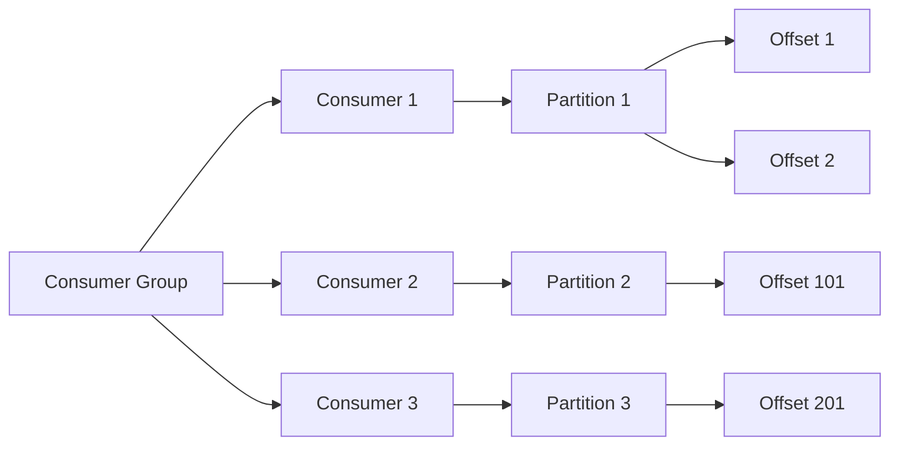

# Kafka消费者高可用性与容错设计

关键词：Kafka、消费者、高可用、容错、分区、再均衡、位移提交

## 1. 背景介绍
### 1.1  问题的由来
在大数据时代，实时数据处理已成为很多企业的核心需求。Apache Kafka作为一个分布式的流式处理平台，以其高吞吐、低延迟、高可靠等特性，被广泛应用于实时数据处理领域。然而，在实际应用中，如何保证Kafka消费者的高可用性与容错能力，是一个值得深入探讨的问题。
### 1.2  研究现状
目前，业界已经有很多关于Kafka消费者高可用性与容错设计的研究和实践。例如，LinkedIn、Netflix等公司都分享了他们在这方面的经验。总的来说，现有的方案主要包括：消费者组机制、分区再均衡、位移提交等。但这些方案在实际应用中仍然面临一些挑战，如何进一步优化仍有较大的探索空间。
### 1.3  研究意义
深入研究Kafka消费者的高可用性与容错设计，对于保证数据处理的可靠性和稳定性具有重要意义。同时，这也有助于我们更好地理解Kafka的内部机制，为构建基于Kafka的应用系统提供参考。
### 1.4  本文结构
本文将从以下几个方面展开论述：首先介绍Kafka消费者的核心概念与基本原理；然后重点分析消费者高可用性与容错的核心算法，并给出数学模型与代码实例；接着讨论这些机制的实际应用场景；最后总结全文，并展望Kafka消费者机制的未来发展趋势与面临的挑战。

## 2. 核心概念与联系
在讨论Kafka消费者的高可用性与容错机制之前，我们先来了解一下Kafka消费者的一些核心概念：

- 消费者（Consumer）：从Kafka中拉取消息的客户端应用程序。
- 消费者组（Consumer Group）：多个消费者实例共同组成的逻辑分组单元，同组内的消费者协同消费订阅主题的所有分区，每个分区只能被一个消费者消费。
- 分区（Partition）：Kafka中的消息是按照主题（Topic）来组织的，每个主题可以划分为多个分区，每个分区是一个有序的消息日志。
- 位移（Offset）：每条消息在分区中的唯一标识，表示消息在分区中的位置。
- 位移提交（Offset Commit）：消费者通过定期向Kafka汇报其消费进度（即提交位移），以便在发生故障时能够恢复。
- 再均衡（Rebalance）：当消费者组内成员发生变更（新增、离开、崩溃）时，Kafka会自动调整消费者与分区的对应关系，重新分配各个消费者负责的分区，这个过程称为再均衡。

下图展示了这些核心概念之间的关系：

多个消费者实例组成消费者组，协同消费主题的多个分区，每个消费者负责一个或多个分区。消费者在消费时会定期提交位移，记录消费进度。当消费者数量发生变化时，会触发再均衡，重新调整消费者与分区的对应关系。

理解了这些核心概念后，我们就可以进一步探讨Kafka消费者的高可用性与容错机制了。

## 3. 核心算法原理 & 具体操作步骤
### 3.1  算法原理概述
Kafka消费者的高可用性与容错能力主要是通过以下几个核心机制来实现的：

1. 消费者组：通过将多个消费者实例组成一个消费者组，可以实现消费的负载均衡和容错。当某个消费者实例崩溃时，其他消费者可以接管它负责的分区，从而保证消费可以继续进行。

2. 分区再均衡：当消费者组内成员发生变更时，Kafka会自动触发再均衡，重新调整消费者与分区的对应关系。再均衡过程通过分区分配策略（如Range、RoundRobin等）来决定每个消费者实例分配到哪些分区。

3. 位移提交：消费者需要定期向Kafka汇报其消费进度，即提交位移。位移提交分为自动提交和手动提交两种方式。通过位移提交，可以保证发生故障时能够恢复到之前的消费进度，避免消息丢失或重复消费。

4. 位移管理：Kafka提供了基于Kafka自身的位移主题（__consumer_offsets）来集中管理消费者位移。消费者提交的位移会定期写入位移主题，当消费者崩溃恢复或再均衡时，可以从位移主题中获取之前提交的位移，从而恢复到之前的消费进度。

### 3.2  算法步骤详解
下面我们以消费者组的分区再均衡过程为例，详细讲解其中的步骤和原理。

分区再均衡的触发条件包括：

- 消费者组内成员发生变更，如有新的消费者加入、现有消费者主动离开或崩溃；
- 订阅的主题分区数发生变化；
- 消费者组的订阅关系发生变化；
- 定期触发再均衡（可配置）。

当满足触发条件后，Kafka会自动执行以下再均衡步骤：

1. 选举协调者：消费者组内的各个消费者实例会选举出一个协调者（Coordinator），负责管理和协调再均衡过程。

2. 加入消费者组：各个消费者实例向协调者发送JoinGroup请求，表示要加入消费者组，并汇报自己的订阅信息。

3. 等待成员就绪：协调者等待消费者组内所有成员都发送JoinGroup请求，直到超时或所有成员就绪。

4. 制定分配方案：协调者根据消费者组的订阅信息，制定分区分配方案，即决定每个消费者实例分配到哪些分区。Kafka内置了多种分区分配策略，如Range、RoundRobin、Sticky等。

5. 发送分配方案：协调者将制定好的分区分配方案，通过SyncGroup请求发送给各个消费者实例。

6. 执行分配方案：各个消费者实例收到分配方案后，根据方案内容执行分区的分配与订阅，开始消费分配到的分区。

7. 稳定期：经过再均衡后进入稳定期，各个消费者实例按照分配方案进行消费，定期提交位移。

8. 发生变更：当消费者组内成员再次发生变更时，会重新触发再均衡，进入下一轮再均衡流程。

通过再均衡机制，Kafka实现了消费者组内消费者实例的动态调整和故障恢复，保证了消费的高可用性和容错能力。

### 3.3  算法优缺点
Kafka消费者的高可用性和容错机制具有以下优点：

- 自动故障恢复：当消费者实例崩溃时，其他消费者可以自动接管故障实例负责的分区，保证消费可以继续进行，实现了自动的故障恢复。

- 负载均衡：通过消费者组和再均衡机制，Kafka可以在多个消费者实例之间自动进行负载均衡，提高消费的吞吐量和性能。

- 位移管理：Kafka提供了基于位移主题的集中式位移管理，可以在消费者故障恢复时准确恢复到之前的消费进度，避免了消息丢失或重复消费。

- 灵活的分区分配策略：Kafka内置了多种分区分配策略，可以根据不同的业务需求选择合适的策略，如Range策略可以实现分区的均匀分配，Sticky策略可以最大限度地保持分区分配的稳定性。

但是，这些机制也存在一些局限性：

- 再均衡开销：再均衡过程会导致消费者短暂地停止消费，对消费的实时性会有一定影响。如果再均衡频繁发生，会对性能产生较大影响。

- 位移提交延迟：为了避免位移提交过于频繁，Kafka通常会采用定期提交的方式，这导致提交的位移可能滞后于实际消费的进度，在发生故障时可能会有少量的消息重复消费。

- 消费者崩溃检测延迟：Kafka通过心跳机制来检测消费者是否存活，但是这种检测存在一定的延迟，导致发生崩溃到触发再均衡之间会有一段时间窗口，在此期间对应分区的消费会中断。

因此，在实际应用中，我们需要根据具体的业务需求和场景，权衡利弊，合理设置相关参数，如再均衡检测时间、位移提交间隔等，以达到高可用性与性能的最佳平衡。

### 3.4  算法应用领域
Kafka消费者的高可用性与容错机制广泛应用于以下领域：

- 日志收集与处理：通过Kafka收集分布式系统的日志，再由消费者进行实时处理与分析，保证日志处理的高可靠性。

- 流式数据处理：利用Kafka构建实时数据处理管道，消费者从Kafka中消费数据，进行实时计算、聚合、关联等操作，并将结果写回Kafka或其他存储系统。

- 事件驱动架构：基于Kafka构建事件驱动的微服务架构，服务之间通过Kafka进行异步解耦通信，消费者负责消费和处理相关事件。

- 数据集成与同步：通过Kafka实现不同数据源之间的数据集成与同步，消费者负责从Kafka中读取数据，并写入目标数据存储系统。

- 监控与告警：将系统的各种指标数据写入Kafka，消费者负责实时监控这些指标，当发现异常时触发告警。

在这些应用场景中，Kafka消费者的高可用性与容错能力是保证系统稳定运行、数据处理可靠的关键。通过合理利用消费者组、再均衡、位移提交等机制，可以构建高可靠、高性能的实时数据处理系统。

## 4. 数学模型和公式 & 详细讲解 & 举例说明
### 4.1  数学模型构建
为了更好地理解和分析Kafka消费者的高可用性与容错能力，我们可以尝试建立一个简单的数学模型。

假设我们有一个Kafka集群，其中有$n$个Broker节点，$m$个主题，每个主题有$p$个分区。同时，我们有一个消费者组，其中有$c$个消费者实例。

我们定义以下变量和函数：

- $B=\{b_1,b_2,...,b_n\}$：表示Kafka集群中的$n$个Broker节点。
- $T=\{t_1,t_2,...,t_m\}$：表示Kafka集群中的$m$个主题。
- $P_i=\{p_{i1},p_{i2},...,p_{ip}\}$：表示主题$t_i$的$p$个分区。
- $C=\{c_1,c_2,...,c_c\}$：表示消费者组中的$c$个消费者实例。
- $A:C\rightarrow \bigcup_{i=1}^{m} P_i$：表示消费者到分区的分配函数，即消费者$c_j$被分配到主题$t_i$的哪些分区。

### 4.2  公式推导过程
基于上述数学模型，我们可以推导出一些关键指标的计算公式。

1. 平均每个消费者实例分配到的分区数：
$$
\bar{p}=\frac{\sum_{i=1}^{m} |P_i|}{|C|}=\frac{mp}{c}
$$

2. 单个消费者实例故障时，需要重新分配的分区数：
$$
p_f=\frac{\sum_{i=1}^{m} |P_i|}{|C|}=\frac{mp}{c}
$$

3. 在理想情况下，再均衡后每个消费者实例分配到的分区数：
$$
p_r=\frac{\sum_{i=1}^{m} |P_i|}{|C|-1}=\frac{mp}{c-1}
$$

4. 