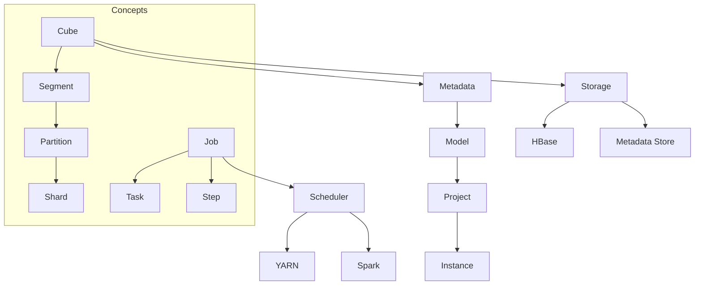
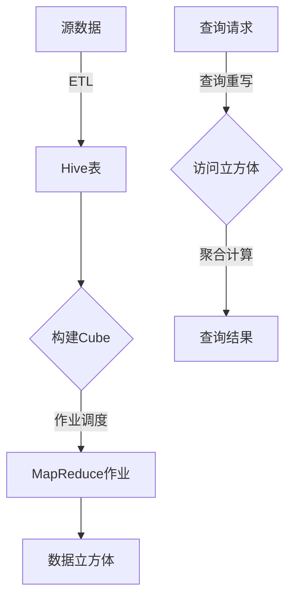

# Kylin原理与代码实例讲解

## 1. 背景介绍

### 1.1 问题的由来

在大数据时代,随着数据量的激增,传统的数据处理方式已经无法满足现代企业对数据分析的需求。Apache Kylin 应运而生,作为一个开源的分布式分析引擎,它专门为大数据分析而设计,能够极大提高分析查询的性能。

大数据分析面临的主要挑战包括:

1. **数据量大且多维度**: 企业数据来源复杂,包括日志、网络流量、物联网设备等,数据维度众多。
2. **实时性要求高**: 企业需要快速响应,对数据的分析查询有较高的实时性要求。
3. **并发查询多**: 大量用户同时对数据进行分析查询,需要系统具有高并发处理能力。

传统的数据库系统在处理大数据分析时,性能低下且成本高昂,无法满足现代企业的需求。Apache Kylin 通过预计算和存储数据立方体,能够极大提升分析查询性能,成为大数据分析的利器。

### 1.2 研究现状

Apache Kylin 作为一款优秀的开源大数据分析引擎,已经被众多知名企业和组织广泛使用,如易车、陆金所、苏宁、中国移动等。它在大数据分析领域占有一席之地,得到了业界的广泛认可。

目前,Apache Kylin 已经发展到 4.x 版本,不断优化和完善其核心功能。研究人员也在持续探索和改进 Kylin 的算法和架构,以提高其性能和可扩展性。

### 1.3 研究意义

深入研究 Apache Kylin 的原理和实现,对于以下几个方面具有重要意义:

1. **提高大数据分析效率**: 了解 Kylin 的工作原理和优化策略,能够帮助企业更好地利用它进行高效的大数据分析,提升决策效率。

2. **推动大数据技术发展**: 研究 Kylin 的创新点和不足之处,可以为改进现有算法和架构提供思路,推动大数据技术的发展。

3. **培养大数据人才**: 通过学习 Kylin 的设计思想和实现细节,可以培养大数据分析和开发人才,为企业输送复合型人才。

4. **促进开源社区发展**: 深入分析 Kylin 的源代码,有助于发现问题和提出改进建议,促进开源社区的持续发展。

### 1.4 本文结构

本文将全面介绍 Apache Kylin 的核心原理和实现细节,内容安排如下:

1. 背景介绍: 阐述问题由来、研究现状和意义。
2. 核心概念与联系: 解释 Kylin 的关键概念及其相互关系。
3. 核心算法原理与具体操作步骤: 深入分析 Kylin 的核心算法原理,并详细讲解算法步骤。
4. 数学模型和公式详细讲解与举例说明: 介绍 Kylin 所采用的数学模型和公式,并通过案例加以说明。
5. 项目实践:代码实例和详细解释说明: 提供 Kylin 的代码实例,并对核心模块代码进行解读和分析。
6. 实际应用场景: 列举 Kylin 在不同行业的应用案例。
7. 工具和资源推荐: 推荐 Kylin 相关的学习资源、开发工具和论文等。
8. 总结:未来发展趋势与挑战: 总结 Kylin 的研究成果,展望其未来发展方向并分析面临的挑战。
9. 附录:常见问题与解答: 汇总 Kylin 使用过程中的常见问题及解决方案。

## 2. 核心概念与联系

在深入探讨 Apache Kylin 的核心原理之前,我们需要先了解它的一些关键概念及其相互关系。

1. **Cube(数据立方体)**: 是 Kylin 的核心数据结构,用于存储预计算的数据集。它由多个 Segment 组成。

2. **Segment(数据段)**: 是 Cube 的构建单元,由多个 Partition 组成。每个 Segment 对应一个构建作业。

3. **Partition(数据分区)**: 是 Segment 的子集,由多个 Shard 组成。Partition 可以独立构建和查询。

4. **Shard(数据分片)**: 是 Partition 的物理存储单元,存储在 HBase 中。

5. **Job(作业)**: 是 Kylin 的基本执行单元,包括 Cube 构建、维度维护等操作。一个 Job 由多个 Task 和 Step 组成。

6. **Task(任务)**: 是 Job 的子任务,负责执行特定的操作,如数据抽取、构建索引等。

7. **Step(步骤)**: 是 Task 的执行步骤,定义了具体的操作流程。

8. **Model(模型)**: 定义了数据的维度和度量,是构建 Cube 的基础。

9. **Project(项目)**: 是 Kylin 的逻辑组织单元,包含多个 Model 和 Cube。

10. **Instance(实例)**: 是 Kylin 的物理部署单元,可以是单机或集群。

11. **Metadata(元数据)**: 存储 Kylin 的配置信息、作业状态等元数据。

12. **Storage(存储)**: Kylin 使用 HBase 作为数据存储,同时使用独立的 Metadata Store 存储元数据。

13. **Scheduler(调度器)**: 负责调度和执行 Job,支持 YARN 和 Spark 两种调度模式。

这些核心概念相互关联,共同构成了 Kylin 的整体架构。理解它们的作用和关系,有助于我们深入探讨 Kylin 的工作原理。

## 3. 核心算法原理与具体操作步骤

### 3.1 算法原理概述

Apache Kylin 的核心算法原理是基于数据立方体(Data Cube)技术,通过预计算和存储多维数据集,来加速分析查询。其主要思想是:

1. **预计算**: 根据用户定义的模型,预先计算并存储常用的数据集和聚合结果,避免重复计算。

2. **索引优化**: 对预计算的数据集建立多层次索引,加快查询访问速度。

3. **分区分片**: 将数据分区存储,并进一步划分为分片,提高并行处理能力。

4. **延迟材料化**: 根据查询模式动态构建和更新数据立方体,提高资源利用率。

5. **查询重写**: 将查询请求转换为对预计算数据集的访问,从而加速查询响应。

Kylin 的工作流程大致如下:

1. 从源数据(如日志、事务等)提取、转换、加载(ETL)到 Hive 表中。

2. 根据模型定义,触发 Cube 构建作业,使用 MapReduce 计算并存储数据立方体。

3. 当有查询请求时,Kylin 会将其重写为对数据立方体的访问和聚合计算。

4. 返回查询结果,避免了对原始数据的重复计算。

通过预计算和索引优化,Kylin 能够显著提升分析查询的性能,满足大数据场景下的实时查询需求。

### 3.2 算法步骤详解

Kylin 的核心算法包括数据立方体构建和查询重写两个主要部分,具体步骤如下:

#### 数据立方体构建

1. **模型定义**: 用户根据分析需求,定义维度、度量和数据源等模型元数据。

2. **作业调度**: Kylin 根据模型信息,生成并调度相应的 MapReduce 作业。

3. **数据抽取**: 从 Hive 表中抽取原始数据,进行必要的清洗和转换。

4. **立方体计算**:
   - **分层构建**: 按照维度层次,自底向上构建数据立方体。
   - **分区分片**: 将数据划分为多个分区和分片,以支持并行计算。
   - **索引构建**: 为每个分区和分片构建位图索引等多层次索引。

5. **立方体存储**: 将计算结果存储到 HBase 中,作为查询时的数据源。

6. **元数据更新**: 更新 Kylin 的元数据,记录立方体信息和作业状态。

7. **增量更新**: 根据数据源变化,增量式地更新相应的数据立方体。

#### 查询重写

1. **查询解析**: 解析用户的 SQL 查询语句,提取查询条件和计算逻辑。

2. **立方体匹配**: 根据查询条件,匹配可用的数据立方体和相应的维度路径。

3. **查询重写**:
   - **立方体裁剪**: 根据查询条件,裁剪出所需的数据立方体分区和分片。
   - **查询转换**: 将原始查询转换为对数据立方体的访问和聚合计算。

4. **查询执行**:
   - **索引查询**: 使用位图索引等快速定位所需的数据分片。
   - **数据聚合**: 从分片中读取数据,进行必要的聚合和计算。

5. **查询结果**: 返回最终的查询结果,完成整个查询过程。

通过上述步骤,Kylin 能够高效地构建和利用数据立方体,加速分析查询的执行。同时,它还支持增量更新和查询优化等高级功能,以适应不同的应用场景。

### 3.3 算法优缺点

Apache Kylin 的核心算法具有以下优点:

1. **查询性能优异**: 通过预计算和索引优化,能够显著提升分析查询的响应速度。

2. **支持高并发**: 分区分片设计支持并行计算和查询,能够处理大量并发请求。

3. **资源利用率高**: 延迟材料化策略根据查询模式动态构建立方体,避免资源浪费。

4. **可扩展性强**: 采用分布式架构,可以通过增加节点来线性扩展计算和存储能力。

5. **支持增量更新**: 能够增量式地更新数据立方体,降低了维护成本。

不过,Kylin 的算法也存在一些缺点和局限性:

1. **预计算开销大**: 构建数据立方体需要大量的计算和存储资源,对资源要求较高。

2. **延迟较高**: 首次查询需要构建立方体,存在一定的延迟,不适合实时查询场景。

3. **模型定义复杂**: 需要用户对数据有深入的了解,并熟悉 Kylin 的模型定义语法。

4. **缓存命中率影响大**: 查询性能很大程度上依赖于缓存命中率,缓存命中不佳会导致性能下降。

5. **维度爆炸问题**: 随着维度数量的增加,立方体规模会快速增长,带来存储和计算压力。

总的来说,Kylin 的核心算法在大数据分析场景下表现出色,但也需要根据具体应用场景权衡利弊。

### 3.4 算法应用领域

Apache Kylin 的核心算法主要应用于以下几个领域:

1. **商业智能(BI)**: Kylin 可以为企业提供高性能的数据分析和商业智能解决方案,支持多维度的数据分析和可视化。

2. **互联网分析**: 在互联网行业,Kylin 可以用于分析网站流量、用户行为等大数据,为业务决策提供数据支持。

3. **物联网分析**: 物联网设备产生的海量数据可以使用 Kylin 进行实时分析