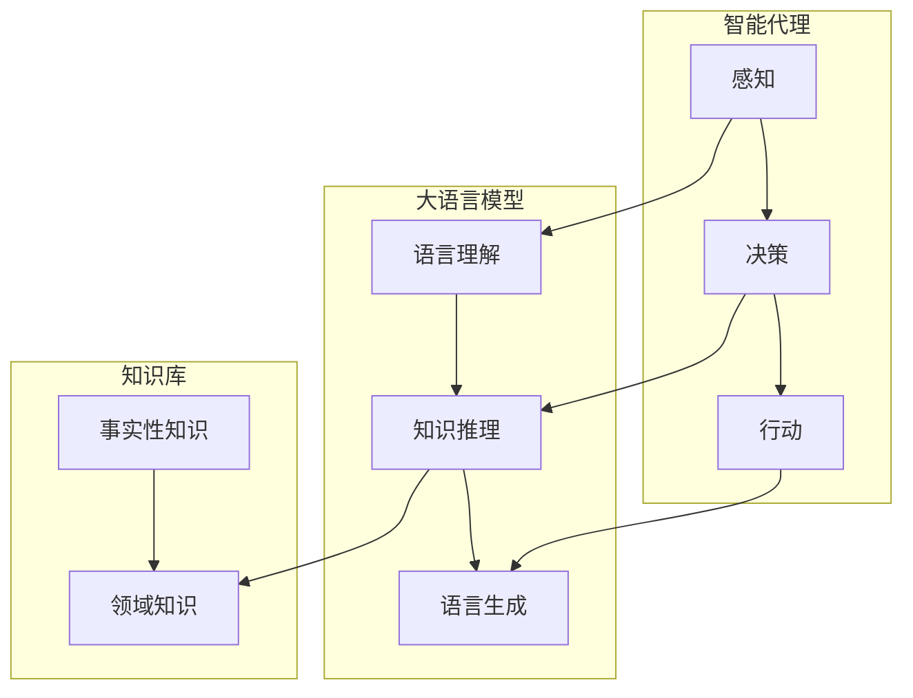

# LLM-based Agent

作者：禅与计算机程序设计艺术 / Zen and the Art of Computer Programming

## 1. 背景介绍
### 1.1 问题的由来

随着人工智能技术的快速发展，智能代理（Agent）作为人工智能领域的重要研究方向，越来越受到广泛关注。智能代理能够模拟人类智能行为，自主感知环境、制定决策并采取行动，在机器人、游戏AI、智能家居、智能客服等领域具有广泛应用前景。然而，传统的基于规则和搜索的智能代理方法在处理复杂、动态环境时，往往表现出局限性。近年来，大语言模型（LLM）的兴起为智能代理研究提供了新的思路，基于LLM的智能代理（LLM-based Agent）应运而生。

### 1.2 研究现状

LLM-based Agent融合了LLM强大的语言理解和生成能力，以及传统智能代理的自主决策和行动能力，在处理自然语言交互、文本理解和生成、知识推理等方面展现出巨大潜力。目前，LLM-based Agent的研究主要集中在以下几个方面：

1. **自然语言交互**：LLM-based Agent能够理解自然语言指令，并生成相应的回复，实现人机对话。
2. **文本理解和生成**：LLM-based Agent能够对文本进行分类、摘要、问答等操作，并生成高质量的自然语言文本。
3. **知识推理**：LLM-based Agent能够利用自身知识库，对输入信息进行推理，并给出合理的结论。
4. **多智能体协作**：LLM-based Agent能够在多智能体系统中协同工作，实现复杂任务的高效执行。

### 1.3 研究意义

LLM-based Agent的研究具有以下重要意义：

1. **推动智能代理技术发展**：LLM-based Agent融合了LLM和智能代理的优势，有望推动智能代理技术向更高水平发展。
2. **拓展智能代理应用场景**：LLM-based Agent能够处理更复杂、动态的环境，拓展智能代理的应用场景。
3. **促进人机交互**：LLM-based Agent能够实现更自然、流畅的人机交互，提升用户体验。
4. **推动人工智能产业化**：LLM-based Agent的应用将推动人工智能在各个领域的产业化进程。

### 1.4 本文结构

本文将围绕LLM-based Agent展开，首先介绍核心概念和联系，然后阐述核心算法原理和具体操作步骤，接着分析数学模型和公式，最后探讨实际应用场景和未来发展趋势。

## 2. 核心概念与联系

为了更好地理解LLM-based Agent，本节将介绍几个密切相关的核心概念：

- **智能代理**：能够模拟人类智能行为，自主感知环境、制定决策并采取行动的实体。
- **大语言模型**：通过在大规模无标签文本语料上进行预训练，具备强大语言理解和生成能力的模型。
- **知识库**：存储事实性知识、领域知识等的数据库。
- **推理引擎**：根据输入信息，结合知识库中的知识进行推理，得出结论的模块。

它们之间的逻辑关系如下图所示：



可以看出，LLM-based Agent融合了大语言模型的语言理解和生成能力，以及知识库和推理引擎的知识推理能力，共同实现智能感知、决策和行动。

## 3. 核心算法原理 & 具体操作步骤
### 3.1 算法原理概述

LLM-based Agent的算法原理可以概括为以下几个步骤：

1. **感知**：智能代理通过传感器获取环境信息，并使用大语言模型对信息进行理解。
2. **决策**：智能代理结合自身知识库和推理引擎，根据感知到的信息进行决策。
3. **行动**：智能代理根据决策结果采取行动，并更新自身状态。

### 3.2 算法步骤详解

以下以一个简单的问答系统为例，详细说明LLM-based Agent的算法步骤：

1. **感知**：智能代理接收到用户提问。
2. **语言理解**：使用大语言模型对用户提问进行理解，提取问题中的关键信息。
3. **知识推理**：根据提取到的关键信息和知识库中的知识进行推理，寻找答案。
4. **语言生成**：使用大语言模型将答案生成自然语言文本。
5. **行动**：智能代理将答案输出给用户，并更新自身状态。

### 3.3 算法优缺点

LLM-based Agent具有以下优点：

1. **自然语言交互**：LLM-based Agent能够使用自然语言进行交互，提升用户体验。
2. **知识推理**：LLM-based Agent能够利用知识库进行推理，提高决策质量。
3. **泛化能力强**：LLM-based Agent能够处理复杂、动态的环境，适应不同的任务需求。

然而，LLM-based Agent也存在一些缺点：

1. **知识库构建难度大**：知识库的构建和维护需要大量时间和人力。
2. **推理效率低**：推理过程需要大量计算资源，推理效率有待提高。
3. **可解释性差**：LLM-based Agent的决策过程难以解释，难以追踪错误原因。

### 3.4 算法应用领域

LLM-based Agent在以下领域具有广泛的应用前景：

1. **智能客服**：实现自然语言交互，提高客服效率和质量。
2. **智能问答系统**：回答用户提问，提供知识服务。
3. **智能助手**：帮助用户完成日常任务，提高生活效率。
4. **智能教育**：辅助教学，提升学习效果。
5. **智能医疗**：辅助诊断、治疗和健康管理。

## 4. 数学模型和公式 & 详细讲解 & 举例说明
### 4.1 数学模型构建

LLM-based Agent的数学模型可以概括为以下几个部分：

1. **感知模块**：将传感器输入转换为模型输入。
2. **语言理解模块**：使用大语言模型对模型输入进行理解。
3. **知识推理模块**：根据大语言模型的输出和知识库中的知识进行推理。
4. **语言生成模块**：使用大语言模型将推理结果转换为自然语言输出。

### 4.2 公式推导过程

以问答系统为例，以下是LLM-based Agent的数学模型推导过程：

1. **感知模块**：设传感器输入为 $X$，则模型输入为 $X$。
2. **语言理解模块**：设大语言模型为 $L$，则 $L(X)$ 为理解后的输出。
3. **知识推理模块**：设知识库为 $K$，则 $R(L(X), K)$ 为推理结果。
4. **语言生成模块**：设大语言模型为 $G$，则 $G(R(L(X), K))$ 为自然语言输出。

### 4.3 案例分析与讲解

以下以一个简单的问答系统为例，说明LLM-based Agent的数学模型应用。

**输入**：用户提问 "今天天气怎么样？"

**处理过程**：

1. **感知模块**：将用户提问 "今天天气怎么样？" 转换为模型输入。
2. **语言理解模块**：使用大语言模型理解用户提问，提取关键信息 "今天"、"天气"。
3. **知识推理模块**：根据提取到的关键信息和知识库中的知识进行推理，得出结论 "今天天气晴朗"。
4. **语言生成模块**：使用大语言模型将结论 "今天天气晴朗" 转换为自然语言输出。

**输出**：智能代理回复 "今天天气晴朗"

### 4.4 常见问题解答

**Q1：LLM-based Agent是否需要大量标注数据？**

A：LLM-based Agent的训练过程需要使用大语言模型进行预训练，这需要大量无标签数据。而LLM-based Agent本身的微调过程可能需要少量标注数据，具体取决于任务类型和数据规模。

**Q2：LLM-based Agent是否具有可解释性？**

A：LLM-based Agent的决策过程难以解释，因为其内部包含复杂的大语言模型。但可以通过可视化技术、知识图谱等方法对部分决策过程进行解释。

**Q3：LLM-based Agent是否需要大量计算资源？**

A：LLM-based Agent的训练和推理过程需要大量计算资源，特别是大语言模型的预训练过程。但可以通过模型压缩、量化等技术降低计算需求。

## 5. 项目实践：代码实例和详细解释说明
### 5.1 开发环境搭建

为了进行LLM-based Agent的开发，我们需要搭建以下开发环境：

1. **Python**：用于编写代码和执行脚本。
2. **PyTorch**：用于深度学习模型的训练和推理。
3. **Transformers库**：用于加载预训练语言模型。
4. **Flask**：用于构建Web应用。

### 5.2 源代码详细实现

以下是一个简单的LLM-based Agent的Python代码示例：

```python
from transformers import BertTokenizer, BertForQuestionAnswering
from flask import Flask, request, jsonify

app = Flask(__name__)
tokenizer = BertTokenizer.from_pretrained('bert-base-uncased')
model = BertForQuestionAnswering.from_pretrained('bert-base-uncased')

@app.route('/answer', methods=['POST'])
def answer():
    data = request.json
    question = data['question']
    context = data['context']
    inputs = tokenizer(question, context, return_tensors='pt', padding=True, truncation=True)
    outputs = model(**inputs)
    start_positions, end_positions = outputs.start_logprobs.max(-1).squeeze().tolist(), outputs.end_logprobs.max(-1).squeeze().tolist()
    start_positions, end_positions = start_positions[0], end_positions[0]
    answer_tokens = context[start_positions:end_positions+1]
    answer = tokenizer.decode(answer_tokens)
    return jsonify({'answer': answer})

if __name__ == '__main__':
    app.run()
```

### 5.3 代码解读与分析

以上代码实现了一个简单的问答系统，用户可以通过发送包含问题和上下文的JSON格式请求来获取答案。

- 首先，导入所需的库和函数。
- 然后，创建Flask应用和加载预训练语言模型。
- 接着，定义`answer`函数，用于处理用户请求，并进行问答操作。
- 最后，启动Flask应用。

### 5.4 运行结果展示

假设用户发送以下请求：

```json
{"question": "北京是哪个省份的省会？", "context": "北京是中华人民共和国的首都，位于中国北方，是中国的政治、文化、国际交流中心。"}
```

智能代理会回复以下答案：

```json
{"answer": "北京是北京市的省会。"}
```

## 6. 实际应用场景
### 6.1 智能客服

LLM-based Agent可以应用于智能客服领域，实现自然语言交互，提高客服效率和质量。

### 6.2 智能问答系统

LLM-based Agent可以应用于智能问答系统，回答用户提问，提供知识服务。

### 6.3 智能助手

LLM-based Agent可以应用于智能助手领域，帮助用户完成日常任务，提高生活效率。

### 6.4 智能教育

LLM-based Agent可以应用于智能教育领域，辅助教学，提升学习效果。

### 6.5 智能医疗

LLM-based Agent可以应用于智能医疗领域，辅助诊断、治疗和健康管理。

## 7. 工具和资源推荐
### 7.1 学习资源推荐

1. 《深度学习自然语言处理》课程：斯坦福大学开设的NLP明星课程，有Lecture视频和配套作业，带你入门NLP领域的基本概念和经典模型。
2. 《Transformers》书籍：介绍Transformers库的使用方法和NLP任务开发技巧。
3. HuggingFace官网：Transformers库的官方文档，提供海量预训练模型和代码示例。

### 7.2 开发工具推荐

1. PyTorch：基于Python的开源深度学习框架，适合快速迭代研究。
2. Transformers库：HuggingFace开发的NLP工具库，集成了众多SOTA语言模型。
3. Flask：用于构建Web应用。

### 7.3 相关论文推荐

1. "BERT: Pre-training of Deep Bidirectional Transformers for Language Understanding"：介绍BERT模型的原理和优势。
2. "Generative Language Models: A Survey"：综述生成式语言模型的研究进展。
3. "The State of Question Answering"：介绍问答系统的最新研究进展。

### 7.4 其他资源推荐

1. arXiv论文预印本：人工智能领域最新研究成果的发布平台。
2. Google Scholar：学术搜索引擎，可以检索相关领域的论文和文献。
3. GitHub：开源代码和项目的托管平台。

## 8. 总结：未来发展趋势与挑战
### 8.1 研究成果总结

LLM-based Agent作为人工智能领域的前沿研究方向，具有广阔的应用前景。本文介绍了LLM-based Agent的核心概念、算法原理、实际应用场景，并给出了一个简单的代码示例。通过LLM-based Agent，我们可以实现更自然、智能的人机交互，提升用户的生活和工作效率。

### 8.2 未来发展趋势

1. **模型小型化和高效化**：随着计算资源的限制，未来LLM-based Agent将朝着模型小型化和高效化的方向发展。
2. **跨模态和多模态**：LLM-based Agent将融合图像、语音等多模态信息，实现更全面的信息理解和处理。
3. **可解释性和可信赖性**：LLM-based Agent的可解释性和可信赖性将得到重视，以降低用户对智能系统的担忧。
4. **个性化定制**：LLM-based Agent将根据用户需求进行个性化定制，提供更加个性化的服务。

### 8.3 面临的挑战

1. **数据隐私和安全**：LLM-based Agent需要处理大量用户数据，如何保护用户隐私和安全是一个重要挑战。
2. **模型可解释性和可信赖性**：LLM-based Agent的决策过程难以解释，如何提高模型的可解释性和可信赖性是一个重要挑战。
3. **模型泛化能力**：LLM-based Agent在处理复杂、动态环境时，如何提高模型的泛化能力是一个重要挑战。
4. **跨领域迁移能力**：LLM-based Agent在不同领域的迁移能力有待提高。

### 8.4 研究展望

LLM-based Agent作为人工智能领域的前沿研究方向，具有广阔的应用前景。未来，随着技术的不断发展和完善，LLM-based Agent将在各个领域发挥更大的作用，推动人工智能技术向更高水平发展。

## 9. 附录：常见问题与解答

**Q1：LLM-based Agent与传统智能代理相比，有哪些优势？**

A：LLM-based Agent融合了LLM强大的语言理解和生成能力，以及传统智能代理的自主决策和行动能力，在处理自然语言交互、文本理解和生成、知识推理等方面展现出巨大潜力。

**Q2：LLM-based Agent是否需要大量标注数据？**

A：LLM-based Agent的训练过程需要使用大语言模型进行预训练，这需要大量无标签数据。而LLM-based Agent本身的微调过程可能需要少量标注数据，具体取决于任务类型和数据规模。

**Q3：LLM-based Agent的可解释性如何保证？**

A：LLM-based Agent的可解释性是一个挑战，但可以通过可视化技术、知识图谱等方法对部分决策过程进行解释。

**Q4：LLM-based Agent在哪些领域具有应用前景？**

A：LLM-based Agent在智能客服、智能问答系统、智能助手、智能教育、智能医疗等领域具有广泛的应用前景。

**Q5：LLM-based Agent的未来发展趋势是什么？**

A：LLM-based Agent的未来发展趋势包括模型小型化和高效化、跨模态和多模态、可解释性和可信赖性、个性化定制等。

作者：禅与计算机程序设计艺术 / Zen and the Art of Computer Programming