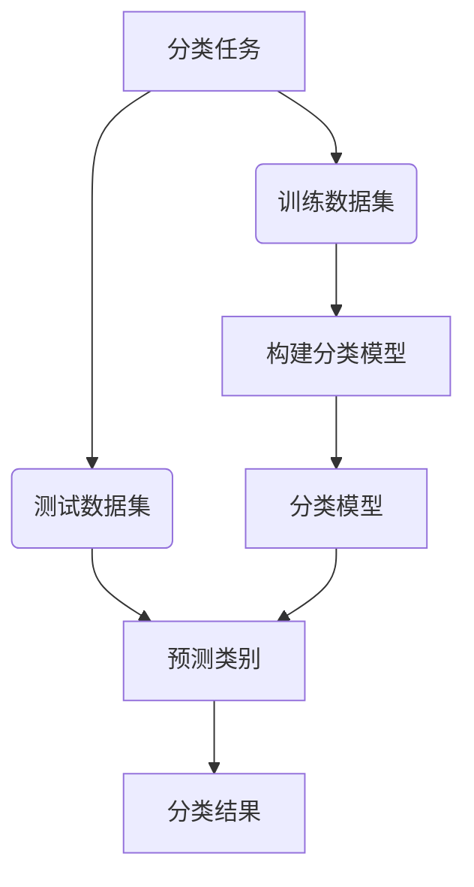

# Mahout分类算法原理与代码实例讲解

## 1. 背景介绍

### 1.1 问题的由来

在当今大数据时代，海量的数据被生成和积累。如何从这些原始数据中发现有价值的信息和知识模式成为了一个迫切的需求。分类作为数据挖掘和机器学习中的一个核心任务,旨在根据已有的训练数据构建分类模型,并将新的数据实例映射到预定义的类别或概念上。分类技术已广泛应用于多个领域,如垃圾邮件检测、客户细分、疾病诊断等。

### 1.2 研究现状

传统的分类算法包括决策树、朴素贝叶斯、逻辑回归、支持向量机等。近年来,随着大数据和分布式计算技术的发展,一些新的分类算法也应运而生,如基于集成学习的随机森林、基于核方法的核支持向量机、基于深度学习的卷积神经网络等。这些算法在处理高维、非线性和大规模数据集时表现出色。

### 1.3 研究意义

Apache Mahout是一个可扩展的机器学习库,旨在帮助开发人员构建可扩展的智能应用程序。作为Mahout中的核心组件之一,Mahout分类提供了多种分类算法的实现,如朴素贝叶斯、逻辑回归、随机森林等。研究Mahout分类算法的原理和实现对于理解分类任务、掌握分布式机器学习技术、构建智能系统等具有重要意义。

### 1.4 本文结构

本文将全面介绍Mahout分类算法的理论基础、核心原理、实现细节和应用案例。首先阐述分类任务的基本概念和Mahout中的相关设计。然后重点讲解几种核心分类算法的数学模型、算法步骤和优缺点分析。接着通过代码示例解析Mahout分类的实现细节。最后探讨分类算法在实际场景中的应用,以及未来的发展趋势和挑战。

## 2. 核心概念与联系

分类是机器学习中的一个核心任务,旨在根据已知的训练数据构建分类模型,并将新的数据实例映射到预定义的类别或概念上。分类过程通常包括以下几个关键步骤:

1. **训练数据集**:包含已标记类别的数据实例集合。
2. **测试数据集**:需要预测类别的新数据实例集合。
3. **构建分类模型**:基于训练数据集,使用特定的分类算法构建分类模型。
4. **分类模型**:描述将数据映射到类别的函数或决策规则。
5. **预测类别**:将测试数据集输入分类模型,预测每个实例的类别。
6. **分类结果**:获得每个测试数据实例的预测类别。

分类算法的关键在于如何从训练数据中学习出有效的分类模型。不同的算法基于不同的数学原理和假设,如贝叶斯概率、决策边界、集成学习等,从而具有不同的优缺点和适用场景。

## 3. 核心算法原理 & 具体操作步骤

Mahout分类库中实现了多种经典和先进的分类算法,包括朴素贝叶斯、逻辑回归、随机森林等。下面将重点介绍其中的几种核心算法。

### 3.1 算法原理概述

#### 3.1.1 朴素贝叶斯分类

朴素贝叶斯分类是基于贝叶斯定理和特征条件独立假设的概率分类模型。算法思想是计算每个类别中出现该数据实例的概率,将实例划分到概率最大的那个类别中。尽管独立性假设较为简单,但朴素贝叶斯分类在许多实际任务中表现出色,同时具有计算高效、对缺失数据不太敏感等优点。

#### 3.1.2 逻辑回归分类

逻辑回归是一种基于对数几率的概率分类模型。它通过构建对数几率函数,将输入特征映射到0到1之间的概率值,再根据概率阈值将实例划分到不同类别。逻辑回归适用于二分类问题,也可以推广到多分类任务。该算法简单且易于理解和实现,同时具有较好的解释性。

#### 3.1.3 随机森林分类

随机森林是一种基于集成学习的分类和回归算法。它由多个决策树组成,每棵树在训练过程中使用不同的数据子集和特征子集。对新实例进行分类时,每棵树会独立作出预测,最终通过投票或平均的方式确定最终结果。随机森林具有很好的准确性和鲁棒性,可以有效处理高维数据和缺失值,但可解释性较差。

### 3.2 算法步骤详解

接下来将详细解析这些算法在Mahout中的实现步骤。

#### 3.2.1 朴素贝叶斯分类器

1. **计算先验概率**:计算每个类别在训练数据集中的先验概率$P(c_k)$。
2. **计算条件概率**:对于每个特征$x_i$,计算其在每个类别$c_k$下的条件概率$P(x_i|c_k)$。
3. **应用贝叶斯公式**:对于新实例$\vec{x}$,根据贝叶斯公式计算其属于每个类别的后验概率:

$$P(c_k|\vec{x})=\frac{P(c_k)P(\vec{x}|c_k)}{P(\vec{x})}$$

4. **预测类别**:将新实例$\vec{x}$划分到后验概率最大的那个类别$c_k$中。

#### 3.2.2 逻辑回归分类器

1. **特征编码**:对于分类特征,使用One-Hot编码;对于数值特征,可能需要进行标准化。
2. **定义对数几率函数**:对于二分类问题,对数几率函数为$\ln\frac{P(y=1|\vec{x})}{P(y=0|\vec{x})}=\vec{w}^T\vec{x}+b$。
3. **模型训练**:使用梯度下降等优化算法,在训练数据集上最小化逻辑损失函数,求解参数$\vec{w}$和$b$。
4. **预测类别**:对于新实例$\vec{x}$,计算$P(y=1|\vec{x})=\frac{1}{1+e^{-(\vec{w}^T\vec{x}+b)}}$,根据概率阈值(通常为0.5)将其划分到0或1类。

#### 3.2.3 随机森林分类器

1. **构建决策树集成**:
    - 从训练集中有放回地抽取$n$个bootstrap样本。
    - 在构建每棵决策树时,从$m$个特征中随机选择$k$个特征(通常$k=\sqrt{m}$)。
    - 重复以上步骤,构建$T$棵决策树。
2. **预测类别**:
    - 对于新实例$\vec{x}$,将其输入每棵决策树,得到$T$个类别预测结果。
    - 对于分类任务,选择票数最多的类别作为最终预测结果。

### 3.3 算法优缺点

#### 3.3.1 朴素贝叶斯分类器

**优点**:
- 原理简单,易于实现
- 对缺失数据不太敏感
- 计算高效,可以处理高维数据

**缺点**:
- 特征独立性假设在实际中难以完全满足
- 对于非线性决策边界,分类性能可能较差

#### 3.3.2 逻辑回归分类器  

**优点**:
- 模型简单,可解释性强
- 可直接给出类别概率估计
- 对于线性可分数据,分类性能良好

**缺点**:
- 对于非线性决策边界,分类性能较差
- 对异常值敏感,需要进行数据预处理

#### 3.3.3 随机森林分类器

**优点**:
- 不易过拟合,泛化能力强
- 可以处理高维数据和缺失值
- 对异常值不太敏感,鲁棒性好

**缺点**:
- 模型复杂,可解释性较差
- 训练时间和内存开销较大
- 对于不相关的特征,分类性能可能下降

### 3.4 算法应用领域

朴素贝叶斯分类器常用于文本分类、垃圾邮件检测、个人化推荐等领域。逻辑回归分类器适用于医疗诊断、信用评分、网络入侵检测等二分类问题。随机森林分类器由于其优秀的性能和鲁棒性,在图像分类、语音识别、基因表达分析等领域都有广泛应用。

## 4. 数学模型和公式 & 详细讲解 & 举例说明

在上一节中,我们介绍了几种核心分类算法的原理和步骤。本节将进一步深入探讨它们的数学模型和公式,并通过具体案例进行详细讲解。

### 4.1 数学模型构建

#### 4.1.1 朴素贝叶斯分类器

朴素贝叶斯分类器的数学模型基于贝叶斯定理和特征条件独立性假设。对于给定的数据实例$\vec{x}=(x_1,x_2,\dots,x_n)$,我们需要计算其属于每个类别$c_k$的后验概率$P(c_k|\vec{x})$。根据贝叶斯定理:

$$P(c_k|\vec{x})=\frac{P(c_k)P(\vec{x}|c_k)}{P(\vec{x})}$$

由于分母$P(\vec{x})$对于所有类别是相同的,因此我们只需要最大化分子部分$P(c_k)P(\vec{x}|c_k)$。根据特征条件独立性假设,我们有:

$$P(\vec{x}|c_k)=\prod_{i=1}^nP(x_i|c_k)$$

将其代入原式,得到:

$$P(c_k|\vec{x})\propto P(c_k)\prod_{i=1}^nP(x_i|c_k)$$

在训练阶段,我们需要从数据中估计先验概率$P(c_k)$和条件概率$P(x_i|c_k)$。对于新实例$\vec{x}$,我们计算其属于每个类别的概率,并将其划分到概率最大的那个类别中。

#### 4.1.2 逻辑回归分类器

逻辑回归分类器的数学模型是通过对数几率函数将输入特征映射到0到1之间的概率值。对于二分类问题,我们定义对数几率函数为:

$$\ln\frac{P(y=1|\vec{x})}{P(y=0|\vec{x})}=\vec{w}^T\vec{x}+b$$

其中$\vec{w}$和$b$是需要从训练数据中学习的模型参数。通过一些代数运算,我们可以得到:

$$P(y=1|\vec{x})=\frac{1}{1+e^{-(\vec{w}^T\vec{x}+b)}}$$

$$P(y=0|\vec{x})=1-P(y=1|\vec{x})=\frac{e^{-(\vec{w}^T\vec{x}+b)}}{1+e^{-(\vec{w}^T\vec{x}+b)}}$$

在训练阶段,我们通过最小化逻辑损失函数(如交叉熵损失)来优化参数$\vec{w}$和$b$。对于新实例$\vec{x}$,我们计算$P(y=1|\vec{x})$,并根据概率阈值(通常为0.5)将其划分到0或1类。

#### 4.1.3 随机森林分类器

随机森林分类器是一种基于集成学习的算法,它由多棵决策树组成。每棵决策树都是通过从训练数据中有放回地抽取bootstrap样本,并在构建树时随机选择特征子集来训练得到的。

对于新实例$\vec{x}$,我们将其输入每棵决策树,得到$T$个类别预测结果$\{c_t(\vec{x})\}_{t=1}^T$。对于分类任务,我们通过多数投票的方式