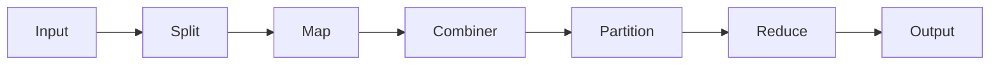

# MapReduce 原理与代码实例讲解

## 1. 背景介绍
### 1.1 问题的由来
在大数据时代,我们面临着海量数据的处理与分析挑战。传统的单机系统已经无法满足对TB甚至PB级别数据进行高效计算的需求。为了应对大数据处理的难题,Google公司在2004年提出了MapReduce并行计算框架,开创性地解决了超大规模数据集的并行处理问题。
### 1.2 研究现状 
MapReduce作为一种编程模型和相关的实现,为大规模数据集的并行计算提供了一个完整的解决方案。它已经成为大数据处理领域事实上的标准,被广泛应用于搜索引擎、数据挖掘、机器学习等诸多领域。Hadoop作为MapReduce的开源实现,更是成为大数据生态圈的基石。国内外众多互联网公司都基于Hadoop构建了自己的大数据平台。学术界对MapReduce的研究也方兴未艾,涌现出大量相关论文。
### 1.3 研究意义
深入理解和掌握MapReduce的原理与实现,对于从事大数据开发和研究的工程师和学者来说至关重要。一方面,MapReduce思想启发了一系列的大数据处理框架和工具的诞生,如Spark、Flink等,理解MapReduce有助于我们把握后续大数据技术的发展脉络。另一方面,MapReduce仍是目前使用最为广泛的大数据处理框架,在工程实践中得到大量应用,深入研究其原理可以指导我们更好地应用这一框架解决实际问题。
### 1.4 本文结构
本文将分为以下几个部分展开论述:
- 第2部分介绍MapReduce的核心概念与联系
- 第3部分详细讲解MapReduce的核心算法原理与具体操作步骤
- 第4部分从数学角度对MapReduce建模,推导相关公式,并举例说明
- 第5部分给出MapReduce的代码实例,并详细解释说明
- 第6部分讨论MapReduce在实际场景中的应用
- 第7部分推荐MapReduce相关的学习资源与开发工具
- 第8部分总结全文,展望MapReduce的未来发展趋势与挑战
- 第9部分的附录解答MapReduce学习中的常见问题

## 2. 核心概念与联系
在MapReduce框架中,最核心的两个概念是Map和Reduce。 
- Map:对输入的数据集执行指定的map函数进行处理,将数据转化为一系列的key-value对。map任务之间可以完全并行执行。
- Reduce:对Map阶段输出的key-value对按照key进行分组,执行指定的reduce函数进行规约,将一组具有相同key的value合并产生一个更小的value集合。不同key的reduce任务之间可以并行。

除此之外,MapReduce还引入了以下重要概念:
- Split:将输入数据集切分为若干个Split,每个Split由一个Map任务处理。
- Partition:将Map输出的key-value对按照key进行分区,保证具有相同key的数据会被分到同一个Partition,从而交由同一个Reduce任务处理。
- Combiner:在Map端对Map输出先做一次本地规约,减少需要传输到Reduce端的数据量。

这些概念环环相扣,构成了MapReduce的基本处理流程:



## 3. 核心算法原理 & 具体操作步骤
### 3.1 算法原理概述
MapReduce借鉴了函数式编程语言中的map和reduce两个基本操作,将复杂的分布式并行计算抽象为两个基本步骤:
1. Map阶段:并行处理输入数据
2. Reduce阶段:对Map结果按key进行规约

用户只需编写map和reduce两个函数,就能轻松实现并行计算,而无需关心底层复杂的分布式系统细节。这极大地降低了编写分布式程序的门槛。
### 3.2 算法步骤详解
1. **输入数据切分成Splits**。MapReduce首先将输入数据集切分成若干个Split。Split是MapReduce处理的基本单位,通常每个Split对应一个Map任务。
2. **调度Map任务**。Master节点根据Split数量和集群中可用的计算资源,将Map任务调度到各个Worker节点并行执行。Map任务之间没有依赖,可以完全并行。
3. **执行Map函数**。Map任务读取对应Split的数据,对每一条数据执行用户定义的map函数,将数据转化为一系列key-value对形式的中间结果。
4. **Combiner本地规约(可选)**。如果用户指定了Combiner函数,Map会在本地先对中间结果做一次规约,减少需要传输的数据量。
5. **Partition分区**。Map输出的key-value对需要按key进行分区。默认使用hash(key) mod R,保证相同key会被分到同一个Partition。R为Reduce任务数。
6. **Shuffle**。Map输出的数据通过网络传输到对应的Reduce节点。这一过程称为Shuffle。
7. **Sort排序**。Reduce节点接收到属于自己的数据后,需要对key进行排序,使得具有相同key的value在一起。
8. **执行Reduce函数**。Reduce函数处理一组具有相同key的value,执行规约操作,输出最终结果。
9. **输出结果**。所有Reduce任务的输出结果合并,写入到输出文件,一个MapReduce作业完成。

### 3.3 算法优缺点
MapReduce的优点主要有:
- 良好的可扩展性:当数据量增大时,可通过增加机器来提升计算能力
- 高容错性:若某个任务失败,框架会自动重新调度执行,屏蔽了底层错误
- 易用性:用户无需关注分布式系统细节,只需实现map和reduce函数

MapReduce的局限性在于:  
- 不适合迭代计算:中间结果需写入磁盘,多次迭代效率低下
- 不支持实时计算:需要等到所有任务完成才能得到最终结果
- 不适合流式计算:输入数据集需预先确定,不能处理实时数据流

### 3.4 算法应用领域
- 搜索引擎:网页排序、倒排索引构建
- 机器学习:数据预处理、特征提取
- 数据挖掘:频繁项集挖掘、聚类分析
- 图计算:PageRank、最短路径
- 日志分析:用户行为分析、异常检测

## 4. 数学模型和公式 & 详细讲解 & 举例说明  
### 4.1 数学模型构建
我们可以用以下符号来描述MapReduce作业:
- 设输入数据集为 $D=\{d_1,d_2,...,d_n\}$
- 定义Map函数为 $map(d_i) \to \{(k_{i1},v_{i1}),(k_{i2},v_{i2}),...\}$
- 定义Reduce函数为 $reduce(k_i,\{v_{i1},v_{i2},...\}) \to v_i$
- 则MapReduce作业可表示为:
$$MR(D) = \{reduce(k_1,map(D)_{k_1}),reduce(k_2,map(D)_{k_2}),...\}$$
其中$map(D)_{k_i}$表示Map输出中key为$k_i$的所有value集合。

### 4.2 公式推导过程
MapReduce的时间复杂度分析如下:
设输入数据量为n,Map和Reduce任务数分别为M和R。
- Map阶段:每个Map任务处理n/M的数据,时间复杂度为$O(n/M)$。M个Map任务并行,则Map阶段总时间为$O(n/M)$。
- Reduce阶段:每个Reduce任务处理n/R的数据,时间复杂度为$O(n/R)$。R个Reduce任务并行,则Reduce阶段总时间为$O(n/R)$。
- Shuffle阶段:洗牌阶段需要将Map输出数据传输给对应的Reduce任务,涉及网络开销。假设传输时间为$O(n)$,则Shuffle阶段时间复杂度为$O(n)$。

因此,MapReduce作业的总时间复杂度为:
$$O(n/M)+O(n)+O(n/R)=O(n)$$
可见,MapReduce通过增加Map和Reduce任务数,可以显著提高计算并行度,降低作业的响应时间。

### 4.3 案例分析与讲解
下面以词频统计为例,来说明MapReduce的工作原理。
输入数据集为一系列文本文件,每个文件看作一条记录,Map函数对每个文件中的单词计数:
```
map(file) -> {(word1, 1), (word2, 1), ...}
```
Reduce函数对相同单词的计数值求和:
```
reduce(word, {1, 1, ...}) -> (word, sum)
```
最终输出结果为每个单词的出现总次数。
假设输入数据量为1TB,Map和Reduce任务数分别为1000和100。则每个Map任务处理约1GB数据,每个Reduce任务处理约10GB数据,通过并行计算可以大大加快词频统计的速度。

### 4.4 常见问题解答
- 如何选择合适的Map和Reduce任务数?
通常Map任务数是Split数的1~2倍,使得每个Map任务处理大小适中的数据块。Reduce任务数一般从几十到几百,过多的Reduce任务会增加调度开销。

- 什么情况下使用Combiner?
对于求和、求最值等符合结合律和交换律的Reduce函数,使用Combiner可以大大减少网络传输量。但对于求平均值等不满足结合律的函数,则不能使用Combiner。

- Map和Reduce任务是如何容错的?  
对于失败的Map任务,MapReduce会自动重新调度执行。对于完成的Map任务,会将结果写入本地磁盘,即使该节点后续出错,其他Reduce节点也能读取中间结果。对于失败的Reduce任务,框架同样会重新调度。

## 5. 项目实践:代码实例和详细解释说明
### 5.1 开发环境搭建
- 安装JDK,配置JAVA_HOME环境变量
- 下载Hadoop发行版,解压到指定目录
- 配置Hadoop环境变量
- 修改Hadoop配置文件,指定NameNode、DataNode等参数
- 启动Hadoop集群

### 5.2 源代码详细实现
以下是使用Hadoop MapReduce实现词频统计的完整代码:
```java
import java.io.IOException;
import java.util.StringTokenizer;
import org.apache.hadoop.conf.Configuration;
import org.apache.hadoop.fs.Path;
import org.apache.hadoop.io.IntWritable;
import org.apache.hadoop.io.Text;
import org.apache.hadoop.mapreduce.Job;
import org.apache.hadoop.mapreduce.Mapper;
import org.apache.hadoop.mapreduce.Reducer;
import org.apache.hadoop.mapreduce.lib.input.FileInputFormat;
import org.apache.hadoop.mapreduce.lib.output.FileOutputFormat;

public class WordCount {

  public static class TokenizerMapper extends Mapper<Object, Text, Text, IntWritable> {
    private final static IntWritable one = new IntWritable(1);
    private Text word = new Text();

    public void map(Object key, Text value, Context context) throws IOException, InterruptedException {
      StringTokenizer itr = new StringTokenizer(value.toString());
      while (itr.hasMoreTokens()) {
        word.set(itr.nextToken());
        context.write(word, one);
      }
    }
  }

  public static class IntSumReducer extends Reducer<Text,IntWritable,Text,IntWritable> {
    private IntWritable result = new IntWritable();

    public void reduce(Text key, Iterable<IntWritable> values, Context context) throws IOException, InterruptedException {
      int sum = 0;
      for (IntWritable val : values) {
        sum += val.get();
      }
      result.set(sum);
      context.write(key, result);
    }
  }

  public static void main(String[] args) throws Exception {
    Configuration conf = new Configuration();
    Job job = Job.getInstance(conf, "word count");
    job.setJarByClass(WordCount.class);
    job.setMapperClass(TokenizerMapper.class);
    job.setCombinerClass(IntSumReducer.class);
    job.setReducerClass(IntSumReducer.class);
    job.setOutputKeyClass(Text.class);
    job.setOutputValueClass(IntWritable.class);
    FileInputFormat.addInputPath(job, new Path(args[0]));
    FileOutputFormat.setOutputPath(job, new Path(args[1]));
    System.exit(job.waitForCompletion(true) ? 0 : 1);
  }
}
```

### 5.3 代码解读与分析
- TokenizerMapper