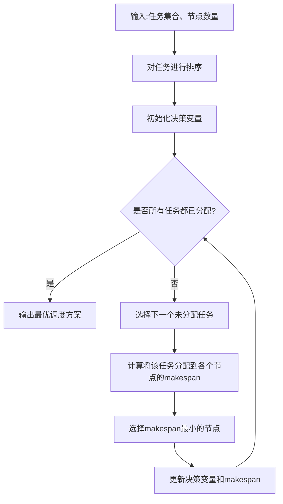

# MapReduce任务调度与负载均衡

## 1. 背景介绍

### 1.1 问题的由来

在大数据时代,海量数据的处理和分析成为了一个巨大的挑战。传统的数据处理方式已经无法满足现代大规模数据集的需求,因此出现了一种新的大数据处理范式:MapReduce。MapReduce是Google提出的一种软件架构,用于在大规模集群上并行处理大数据集。它将计算过程分为两个阶段:Map阶段和Reduce阶段,极大地简化了大规模数据处理的编程模型。

然而,随着数据量的不断增长和计算任务的复杂性提高,MapReduce集群面临着新的挑战:如何高效地调度和分配计算资源,实现负载均衡,从而提高整个系统的吞吐量和响应时间。传统的静态资源分配策略已经无法满足动态变化的工作负载需求,因此需要一种动态的、基于实时状态的调度和负载均衡机制。

### 1.2 研究现状

MapReduce任务调度和负载均衡是大数据处理领域的一个热门研究方向。目前,已经提出了多种调度和负载均衡算法,包括基于规则的算法、基于成本模型的算法、基于机器学习的算法等。

一些著名的MapReduce任务调度器包括Apache Hadoop的YARN(Yet Another Resource Negotiator)、Apache Spark的调度器等。这些调度器采用不同的策略来分配资源,如公平调度、容量调度、动态优先级调度等。

负载均衡是MapReduce任务调度的一个重要组成部分。常见的负载均衡技术包括硬件负载均衡(如负载均衡器)和软件负载均衡(如DNS负载均衡、反向代理负载均衡等)。在MapReduce环境中,负载均衡主要关注如何在多个节点之间平衡计算任务的分配,以提高整体系统的性能和可用性。

### 1.3 研究意义

高效的MapReduce任务调度和负载均衡对于大数据处理系统的性能和可扩展性至关重要。合理的调度策略可以充分利用集群资源,避免资源浪费,提高系统吞吐量。同时,良好的负载均衡机制可以确保任务在集群节点之间均匀分布,防止个别节点过载而导致系统性能下降。

此外,MapReduce任务调度和负载均衡还需要考虑诸如数据局部性、容错性、公平性等因素,以确保系统的高效、可靠和公平运行。因此,设计一种综合考虑多种因素的调度和负载均衡策略,对于构建高性能、可扩展的大数据处理系统具有重要意义。

### 1.4 本文结构

本文将全面介绍MapReduce任务调度和负载均衡的相关理论和实践。首先,我们将介绍MapReduce的核心概念和原理,以及任务调度和负载均衡在其中的作用。接下来,我们将详细阐述几种主要的调度和负载均衡算法,包括它们的原理、优缺点和适用场景。

然后,我们将构建相应的数学模型,并推导出关键公式,以量化和分析调度和负载均衡策略的性能。为了加深理解,我们将提供具体的案例分析和常见问题解答。

在实践部分,我们将介绍如何在实际项目中实现调度和负载均衡,包括开发环境搭建、源代码实现、代码解读和运行结果展示。

最后,我们将探讨MapReduce任务调度和负载均衡在实际应用中的场景,并对未来的发展趋势和挑战进行展望。同时,我们还将推荐一些有用的学习资源、开发工具和相关论文,以供读者进一步学习和研究。

## 2. 核心概念与联系

在深入探讨MapReduce任务调度和负载均衡之前,我们需要先了解MapReduce的核心概念和原理。MapReduce是一种软件架构,用于在大规模集群上并行处理大数据集。它将计算过程分为两个阶段:Map阶段和Reduce阶段。

1. **Map阶段**:输入数据首先被拆分为多个数据块,每个数据块由一个Map任务处理。Map任务将输入数据转换为一组键值对,并将这些键值对写入本地磁盘。

2. **Shuffle阶段**:在Shuffle阶段,MapReduce框架将Map任务的输出按照键值对的键进行分组,并将具有相同键的值分发给相应的Reduce任务。

3. **Reduce阶段**:每个Reduce任务接收一个键及其相关的值集合,对这些值进行聚合或其他操作,最终生成最终输出结果。

MapReduce的核心优势在于它能够自动并行化计算过程,并在大规模集群上高效执行。然而,为了充分发挥MapReduce的潜力,需要合理的任务调度和负载均衡策略,以确保集群资源的高效利用和任务的均匀分布。

任务调度负责将Map任务和Reduce任务分配到合适的集群节点上执行。良好的调度策略可以考虑数据局部性、容错性、公平性等因素,从而提高系统的整体性能和可靠性。

负载均衡则关注如何在多个节点之间平衡计算任务的分配,避免个别节点过载而导致系统性能下降。常见的负载均衡技术包括硬件负载均衡和软件负载均衡。在MapReduce环境中,负载均衡主要关注如何在Map阶段和Reduce阶段均匀分配任务,以充分利用集群资源。

总的来说,MapReduce任务调度和负载均衡是密切相关的两个概念,共同确保了MapReduce系统的高效运行和可扩展性。合理的调度和负载均衡策略不仅可以提高系统吞吐量和响应时间,还能提高资源利用率,降低运营成本。

## 3. 核心算法原理 & 具体操作步骤

### 3.1 算法原理概述

MapReduce任务调度和负载均衡涉及多种算法和策略,它们根据不同的目标函数和约束条件,采用不同的调度和分配机制。在这一部分,我们将介绍几种核心算法的原理和思路。

1. **基于规则的调度算法**

基于规则的调度算法是最简单和最直观的一种调度策略。它根据预定义的一系列规则来分配任务,例如:

- 先来先服务(FCFS)规则:按照任务到达的时间顺序进行调度。
- 最短作业优先(SJF)规则:优先调度估计运行时间最短的任务。
- 公平共享规则:确保所有任务或用户获得相同比例的资源。

这些规则通常易于实现,但往往无法充分考虑复杂的约束条件和动态变化的工作负载。

2. **基于成本模型的调度算法**

基于成本模型的调度算法试图优化某个成本函数,例如最小化作业完成时间、最大化集群利用率等。这些算法通常建立在一个数学模型的基础之上,并采用各种优化技术(如线性规划、动态规划等)来求解最优调度方案。

一些典型的基于成本模型的算法包括:

- 最小化平均完成时间
- 最小化最大完成时间(makespan)
- 最大化集群利用率

这些算法往往更加精确和高效,但也需要更多的计算资源和更复杂的实现。

3. **基于机器学习的调度算法**

随着机器学习技术的不断发展,一些研究人员尝试将机器学习应用于MapReduce任务调度和负载均衡。基于机器学习的调度算法通过从历史数据中学习任务模式和资源利用情况,从而做出更加智能的调度决策。

常见的机器学习技术包括:

- 监督学习(如决策树、支持向量机等)
- 无监督学习(如聚类算法)
- 强化学习

这些算法具有自适应性和智能性,但也存在一定的不确定性和复杂性。

除了上述三种主要类型的算法之外,还有一些其他的调度和负载均衡策略,如基于约束的调度、基于启发式的调度等。不同的算法适用于不同的场景和需求,需要根据具体情况进行选择和权衡。

### 3.2 算法步骤详解

在这一部分,我们将详细介绍一种常见的基于成本模型的调度算法:最小化makespan算法。该算法旨在找到一种任务分配方式,使得所有任务的完成时间最短(即makespan最小)。

1. **问题建模**

假设我们有一个MapReduce集群,包含$m$个节点,需要执行$n$个任务。每个任务$j$的运行时间为$p_j$,我们的目标是找到一种任务分配方式,使得所有任务的完成时间之和(makespan)最小。

我们定义决策变量$x_{ij}$表示任务$j$是否被分配到节点$i$上执行,其中$x_{ij} = 1$表示分配,$x_{ij} = 0$表示不分配。

则makespan可以表示为:

$$
makespan = \max_{1 \leq i \leq m} \sum_{j=1}^n x_{ij}p_j
$$

我们需要最小化makespan,同时满足以下约束条件:

- 每个任务只能被分配到一个节点上执行:

$$
\sum_{i=1}^m x_{ij} = 1, \quad \forall j = 1, 2, \ldots, n
$$

- 决策变量的取值范围:

$$
x_{ij} \in \{0, 1\}, \quad \forall i = 1, 2, \ldots, m, \quad j = 1, 2, \ldots, n
$$

2. **算法步骤**

最小化makespan算法的主要步骤如下:

具体步骤如下:

1) 对所有任务按照运行时间$p_j$进行非递减排序。
2) 初始化决策变量$x_{ij} = 0$,makespan为0。
3) 遍历排序后的任务列表,对于每个未分配的任务$j$:
    a) 计算将该任务分配到每个节点$i$时的makespan值。
    b) 选择使makespan最小的节点$i^*$,将任务$j$分配到该节点上,即$x_{i^*j} = 1$。
    c) 更新makespan为$\max\{\text{makespan}, \sum_{j=1}^n x_{i^*j}p_j\}$。
4) 重复步骤3,直到所有任务都被分配。
5) 输出最终的决策变量$x_{ij}$,即为最优调度方案。

该算法的时间复杂度为$O(n^2m)$,其中$n$为任务数量,$m$为节点数量。

### 3.3 算法优缺点

最小化makespan算法具有以下优点:

1. **目标明确**:算法的目标函数是最小化makespan,即所有任务的完成时间之和,这是一个非常直观和实用的目标。
2. **可解释性强**:算法的原理和步骤都比较容易理解,决策过程也很透明。
3. **考虑了负载均衡**:在分配任务时,算法会尽量选择当前负载最小的节点,从而实现了一定程度的负载均衡。

然而,该算法也存在一些缺点和局限性:

1. **只考虑任务运行时间**:算法仅考虑了任务的运行时间,而没有考虑其他因素,如数据局部性、容错性等,可能会导致次优的调度方案。
2. **无法处理动态变化**:算法是基于静态信息进行调度的,无法适应动态变化的工作负载和资源状态。
3. **时间复杂度较高