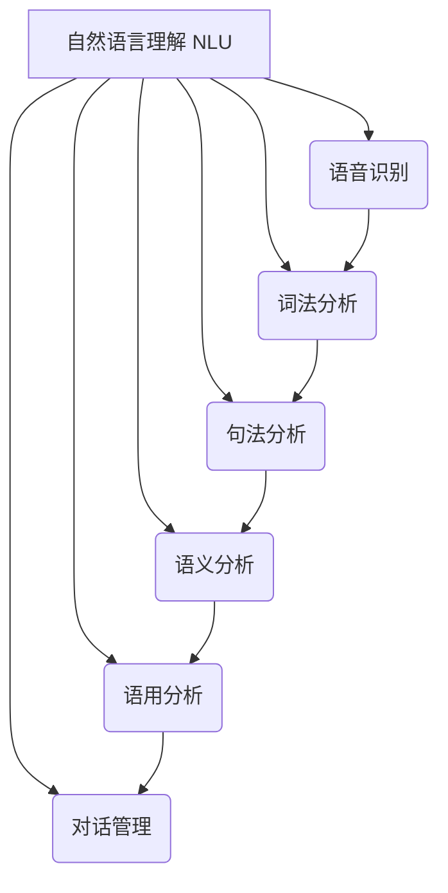
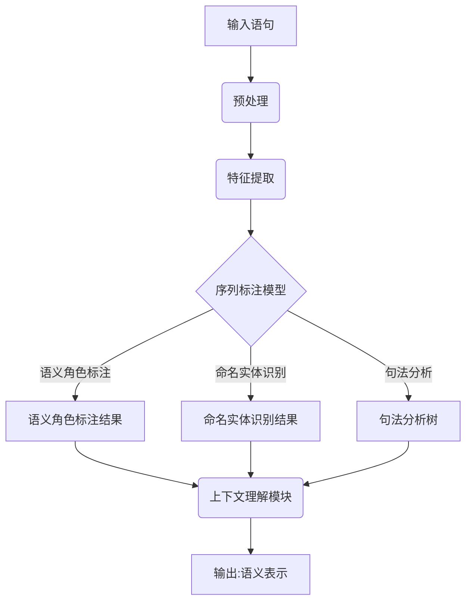

好的，我会严格遵循您提供的约束条件，以"Natural Language Understanding 原理与代码实战案例讲解"为题目，撰写一篇专业的技术博客文章。

# Natural Language Understanding 原理与代码实战案例讲解

## 1. 背景介绍

### 1.1 问题的由来

在人工智能领域中,自然语言处理(Natural Language Processing, NLP)一直是一个极具挑战性的研究方向。作为NLP的核心任务之一,自然语言理解(Natural Language Understanding, NLU)旨在让机器能够真正理解人类语言的含义,而不仅仅是进行表面文本处理。随着人工智能技术的不断发展,NLU已经广泛应用于智能问答系统、语音助手、信息检索等诸多领域。

### 1.2 研究现状  

早期的NLU系统主要依赖于基于规则的方法,通过手工设计语法规则和语义规则来分析和理解自然语言。然而,这种方法存在一些固有的缺陷,如规则覆盖面有限、难以扩展、缺乏鲁棒性等。近年来,随着深度学习技术的兴起,基于神经网络的NLU方法逐渐占据主导地位。这些方法能够自动从大量数据中学习语言模式,并展现出更好的泛化能力。

### 1.3 研究意义

NLU技术的发展对于实现人机自然交互具有重要意义。通过深入理解自然语言的语义和语用,机器可以更好地捕捉人类意图,提供更加智能和人性化的服务。同时,NLU也是构建智能对话系统、问答系统等应用的基础,对于推动人工智能技术的发展具有战略意义。

### 1.4 本文结构

本文将全面介绍NLU的核心概念、算法原理、数学模型,并通过代码实例和案例分析,深入探讨NLU在实际应用中的实践。文章最后将总结NLU的发展趋势和面临的挑战,为读者提供全面的NLU知识体系。

## 2. 核心概念与联系



自然语言理解(NLU)是一个复杂的过程,涉及多个核心概念和技术:

1. **语音识别(Speech Recognition)**: 将人类语音转换为文本,是NLU的基础。
2. **词法分析(Lexical Analysis)**: 将文本分割成词汇单元(tokens),如单词、数字等。
3. **句法分析(Syntactic Analysis)**: 确定词汇单元之间的语法关系,构建语法树。
4. **语义分析(Semantic Analysis)**: 理解语句的实际含义,解析语义角色和关系。
5. **语用分析(Pragmatic Analysis)**: 根据上下文和背景知识,理解说话人的真实意图。
6. **对话管理(Dialogue Management)**: 控制对话流程,生成合理的响应。

这些概念相互关联、环环相扣,共同构成了完整的NLU过程。只有将它们有机结合,机器才能真正理解自然语言的内涵。

## 3. 核心算法原理与具体操作步骤

### 3.1 算法原理概述



NLU的核心算法原理可以概括为:

1. **预处理**: 对输入语句进行标准化处理,如分词、词性标注等。
2. **特征提取**: 从预处理后的文本中提取相关的语言学特征,如词向量、词性等。
3. **序列标注模型**: 基于提取的特征,使用序列标注模型(如条件随机场、LSTM等)完成语义角色标注、命名实体识别、句法分析等任务。
4. **上下文理解模块**: 综合语义角色、命名实体、句法结构等信息,结合背景知识和上下文,理解语句的真实意图和语义表示。

该算法框架将语言理解分解为多个子任务,通过有效的特征提取和序列标注模型,能够较好地捕捉语句的语义信息。

### 3.2 算法步骤详解

1. **预处理**
   - 分词: 将文本按照一定规则分割成词汇单元序列
   - 词性标注: 为每个词汇单元赋予相应的词性标记(如名词、动词等)

2. **特征提取**
   - 词向量: 将词汇映射到连续的向量空间,捕捉词与词之间的语义关系
   - 词性特征: 利用词性信息,如词性是否为名词、动词等
   - 语法特征: 包括词与词之间的依存关系、命名实体类型等

3. **序列标注模型**
   - 语义角色标注: 识别语句中的谓词及其论元,确定语义角色
     - 模型: 基于BiLSTM-CRF的序列标注模型
   - 命名实体识别: 识别语句中的实体名称,如人名、地名、组织机构名等
     - 模型: 基于BiLSTM-CRF的序列标注模型
   - 句法分析: 确定语句的句法结构,构建句法分析树
     - 模型: 基于Shift-Reduce的transition-based依存分析模型

4. **上下文理解模块**
   - 融合语义角色、命名实体、句法结构等信息
   - 利用背景知识库(如知识图谱)和上下文信息
   - 机器阅读理解技术,深入理解语句含义
   - 输出最终的语义表示,反映语句的真实意图

### 3.3 算法优缺点

**优点**:

- 将复杂的NLU任务分解为多个子任务,可解耦不同模块
- 序列标注模型能够有效捕捉局部语义信息
- 融合多种语言学特征,提高了理解能力
- 引入背景知识和上下文信息,提升了语义理解的准确性

**缺点**:

- 模块化的架构可能会引入错误传递和累积
- 依赖大量人工标注的训练数据
- 难以很好地捕捉长距离依赖和跨句语义关系
- 背景知识库的覆盖面和质量直接影响理解效果

### 3.4 算法应用领域

该算法框架可广泛应用于以下领域:

- 智能问答系统
- 智能语音助手
- 信息检索与文本挖掘
- 对话系统
- 机器翻译
- 主观性分析与情感分析

## 4. 数学模型和公式详细讲解与举例说明

### 4.1 数学模型构建

在NLU中,常用的数学模型包括:

1. **序列标注模型**
   - 条件随机场(CRF)
   - 循环神经网络(RNN)及其变种,如LSTM、GRU等

2. **语义表示模型**
   - 知识库表示,如知识图谱
   - 分布式向量表示,如Word2Vec、BERT等

我们以BiLSTM-CRF序列标注模型为例,介绍其数学原理。该模型将输入序列 $X = (x_1, x_2, ..., x_n)$ 映射到标记序列 $Y = (y_1, y_2, ..., y_n)$。

### 4.2 公式推导过程

1. **BiLSTM编码层**

$$
\overrightarrow{h_t} = \overrightarrow{\text{LSTM}}(x_t, \overrightarrow{h_{t-1}}) \\
\overleftarrow{h_t} = \overleftarrow{\text{LSTM}}(x_t, \overleftarrow{h_{t+1}}) \\
h_t = [\overrightarrow{h_t}; \overleftarrow{h_t}]
$$

其中 $\overrightarrow{h_t}$ 和 $\overleftarrow{h_t}$ 分别表示前向和后向LSTM在时间步 $t$ 的隐藏状态,通过拼接得到最终的隐藏状态表示 $h_t$。

2. **CRF解码层**

令 $P(Y|X)$ 表示输出序列 $Y$ 在给定输入序列 $X$ 的条件概率,CRF模型定义为:

$$
P(Y|X) = \frac{1}{Z(X)}\exp\left(\sum_{t=1}^{n}\left(\sum_{j}\lambda_jt_j(y_{t-1},y_t,X) + \sum_{k}\mu_ks_k(y_t,X)\right)\right)
$$

其中:
- $Z(X)$ 是归一化因子
- $t_j(y_{t-1},y_t,X)$ 是转移特征函数,用于捕捉标记之间的转移关系
- $s_k(y_t,X)$ 是状态特征函数,用于捕捉输入序列与标记之间的关系
- $\lambda_j$ 和 $\mu_k$ 是对应特征函数的权重

通过训练,可以学习得到特征函数的权重,从而最大化序列的条件概率。

### 4.3 案例分析与讲解

考虑一个语义角色标注的例子:

**输入语句**: "我想在北京的王府井大街买一件衣服"

**期望输出**: 
```
[
  {
    "predicate": "买",
    "arguments": [
      {
        "role": "买主",
        "value": "我"
      },
      {
        "role": "物品",
        "value": "一件衣服"
      },
      {
        "role": "地点",
        "value": "北京的王府井大街"
      }
    ]
  }
]
```

我们使用BiLSTM-CRF模型进行语义角色标注:

1. 将输入语句分词、词性标注,并将词汇映射为词向量
2. 将词向量输入BiLSTM层,获取每个词的隐藏状态表示 $h_t$
3. 将隐藏状态 $h_t$ 输入CRF解码层,计算每个词属于不同语义角色的概率
4. 使用维特比算法求解最优路径,得到每个词的语义角色标注
5. 根据标注结果,提取谓词、论元及其语义角色

通过上述步骤,模型能够较好地识别出语句中的谓词"买"以及对应的论元及其语义角色。

### 4.4 常见问题解答

**Q: 为什么要使用BiLSTM而不是普通LSTM?**

A: BiLSTM能够同时捕捉序列的前向和后向信息,对于序列标注任务更加有效。相比之下,普通LSTM只能获取单向的上下文信息。

**Q: CRF解码层的作用是什么?**

A: CRF解码层能够有效捕捉标记之间的转移关系,避免出现不合理的标记序列。它通过全局归一化,使模型输出的是序列的条件概率,从而提高了序列标注的准确性。

**Q: 如何处理 OOV(Out-Of-Vocabulary)问题?**

A: 对于训练集中未出现的词汇,可以使用字符级表示(如字符级CNN或RNN)、子词表示(如BPE或WordPiece)等方法,从字符或子词级别构建词向量表示。

## 5. 项目实践:代码实例和详细解释说明

### 5.1 开发环境搭建

我们使用Python作为开发语言,主要依赖包括:

- PyTorch: 深度学习框架
- NLTK: 自然语言处理工具包
- sklearn: 机器学习库

可以使用以下命令安装相关依赖:

```bash
pip install pytorch nltk scikit-learn
```

### 5.2 源代码详细实现

```python
import torch
import torch.nn as nn
from typing import List, Tuple

class BiLSTM(nn.Module):
    def __init__(self, vocab_size, embedding_dim, hidden_dim):
        super(BiLSTM, self).__init__()
        self.embedding = nn.Embedding(vocab_size, embedding_dim)
        self.lstm = nn.LSTM(embedding_dim, hidden_dim // 2, num_layers=1, bidirectional=True)

    def forward(self, x):
        x = self.embedding(x)