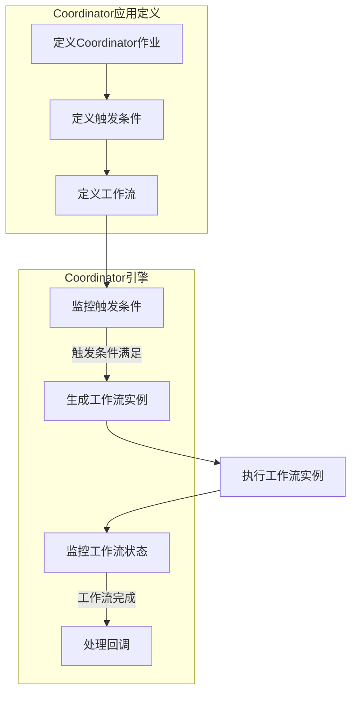

好的，我会严格遵守约束条件，以"Oozie Coordinator原理与代码实例讲解"为题，撰写一篇专业的技术博客文章。

# Oozie Coordinator原理与代码实例讲解

## 1. 背景介绍

### 1.1 问题的由来

在大数据时代，数据处理作业通常需要以工作流的形式按特定的时间计划周期性地执行。例如,每天凌晨需要对前一天的网站日志进行分析;每周一需要生成上周的销售报表;每月月初需要对上个月的财务数据进行汇总等。这种周期性的作业调度需求使得简单的作业调度工具已无法满足要求,需要一种更加智能和可扩展的作业调度框架。

### 1.2 研究现状  

Apache Oozie作为Apache Hadoop生态系统中的工作流调度器,旨在管理Hadoop作业。它能够整合多种作业类型(如Java MapReduce、Pig作业、Hive作业等)到同一个工作流中,并行或串行运行,实现复杂的数据处理流程。Oozie不仅支持简单的条件控制语句,还提供了强大的Coordinator功能,可以根据时间和数据可用性触发工作流运行,从而实现复杂的周期性调度需求。

### 1.3 研究意义

Oozie Coordinator作为Oozie的核心功能之一,可以极大地简化Hadoop作业的调度,提高数据处理效率。掌握Coordinator的工作原理和使用方法,对于构建高效、可靠的大数据处理平台具有重要意义。本文将深入探讨Oozie Coordinator的设计理念、工作原理和实现细节,并通过实例讲解其具体使用方法,以期为读者提供一个全面的Coordinator学习参考。

### 1.4 本文结构

本文共分为8个部分:

1. 背景介绍
2. Oozie Coordinator核心概念
3. Coordinator工作原理与算法步骤 
4. 时间和数据可用性模型
5. 项目实践:代码实例讲解
6. Coordinator应用场景
7. 相关工具与资源推荐  
8. 总结与展望

## 2. 核心概念与联系

在深入探讨Oozie Coordinator的原理之前,我们先来了解几个核心概念:

- **Coordinator应用(Coordinator Application)**: 一个Coordinator应用由若干个相关的Coordinator作业组成,用于描述要执行的周期性调度流程。
- **Coordinator作业(Coordinator Job)**: Coordinator应用中的基本单元,定义了触发条件和要执行的工作流细节。
- **工作流(Workflow)**: 由一个或多个行动组成的有向权限图,用于执行具体的任务,如MapReduce、Pig、Hive等作业。
- **行动(Action)**: 工作流中的基本单元,可以是MapReduce作业、Pig作业、Hive作业或Shell命令等。

Coordinator应用通过协调多个Coordinator作业来实现复杂的调度需求。每个Coordinator作业会根据时间或数据可用性触发条件,启动相应的工作流执行实际任务。工作流由一系列有依赖关系的行动组成,用于执行具体的数据处理任务。

Coordinator作为Oozie的核心组件,负责调度和协调整个数据处理流程,是实现高效、可靠的大数据处理平台的关键。

## 3. 核心算法原理与具体操作步骤

### 3.1 算法原理概述

Oozie Coordinator的工作原理可以概括为以下几个步骤:

1. **定义调度流程**: 使用Coordinator应用定义要执行的周期性调度流程,包括Coordinator作业的触发条件、工作流细节等。
2. **监控触发条件**: Coordinator引擎持续监控每个Coordinator作业的触发条件(时间或数据可用性)是否满足。
3. **生成工作流实例**: 一旦触发条件满足,Coordinator就会为该作业实例生成对应的工作流实例。
4. **执行工作流**: 工作流实例由Oozie WorkflowEngine执行,完成实际的数据处理任务。
5. **监控工作流状态**: Coordinator持续监控工作流实例的执行状态,直到其完成。
6. **处理回调**: 工作流完成后,Coordinator会根据其状态进行相应的回调处理。

这种松耦合的设计使得Coordinator可以灵活调度各种类型的作业,并能够根据实际情况动态生成和执行工作流实例,从而实现高效的周期性调度。

### 3.2 算法步骤详解 

我们使用一个流程图来详细展示Oozie Coordinator的工作流程:



1. **定义Coordinator作业**: 首先需要定义Coordinator作业,包括触发条件(时间或数据可用性)和要执行的工作流细节。这通常在一个XML文件中完成。

2. **监控触发条件**: Coordinator引擎会持续监控每个Coordinator作业的触发条件是否满足。对于基于时间的触发,引擎会检查当前时间是否符合作业定义的时间范围;对于基于数据可用性的触发,引擎会检查指定的数据集是否已经就绪。

3. **生成工作流实例**: 一旦某个Coordinator作业的触发条件满足,Coordinator引擎就会为该作业实例生成一个对应的工作流实例。

4. **执行工作流实例**: 生成的工作流实例由Oozie的WorkflowEngine执行,完成实际的数据处理任务,如运行MapReduce、Pig、Hive作业等。

5. **监控工作流状态**: Coordinator引擎会持续监控工作流实例的执行状态,包括运行中、成功、失败等。

6. **处理回调**: 工作流实例执行完毕后,Coordinator引擎会根据其状态进行相应的回调处理,如记录日志、发送通知等。

通过这一系列步骤,Oozie Coordinator可以根据时间或数据可用性自动触发并执行工作流,实现复杂的周期性调度需求。

### 3.3 算法优缺点

**优点**:

1. **灵活性强**: Coordinator可以根据时间或数据可用性触发条件调度各种类型的作业,支持复杂的工作流定义。
2. **可扩展性好**: 由于采用松耦合设计,Coordinator可以轻松地集成新的作业类型。
3. **容错性高**: 如果某个工作流实例失败,Coordinator可以自动重新执行,提高系统的可靠性。
4. **集成度高**: Coordinator与Hadoop生态系统完全集成,可以无缝调度各种Hadoop作业。

**缺点**:  

1. **学习曲线陡峭**: Oozie的配置较为复杂,需要一定的学习成本。
2. **依赖性强**: Coordinator需要依赖Hadoop集群及相关生态系统组件的正常运行。
3. **调度延迟**: 由于需要持续监控触发条件,可能会引入一定的调度延迟。
4. **单点故障风险**: Oozie服务器作为中心化的调度器,如果发生故障可能会影响整个系统。

### 3.4 算法应用领域

Oozie Coordinator主要应用于需要周期性调度的大数据处理场景,包括但不限于:

- **日志数据分析**: 每天对网站、系统等日志数据进行分析和处理。
- **业务智能(BI)报表生成**: 定期生成各类业务报表,如销售、财务等。  
- **数据集成**: 按计划从各个数据源周期性地抽取、转换并加载数据到数据仓库或数据湖。
- **机器学习模型训练**: 根据新数据定期重新训练机器学习模型。
- **任务调度**: 作为通用的任务调度框架,协调和管理各种周期性的数据处理流程。

任何需要按特定的时间计划或数据可用性条件执行的作业,都可以通过Oozie Coordinator实现自动化调度,从而提高数据处理效率,降低维护成本。

## 4. 数学模型和公式详细讲解与举例说明

在Oozie Coordinator中,时间触发条件和数据可用性触发条件都可以使用特定的数学模型和公式进行描述和计算。下面我们将详细介绍这些模型和公式。

### 4.1 数学模型构建

**时间触发模型**:

Oozie使用类Unix Cron语法来定义时间触发条件,可以支持秒、分钟、小时、日期和月份级别的调度。我们将时间触发条件建模为一个5元组:

$$
T = (秒, 分钟, 小时, 日期, 月份)
$$

其中每个元素都可以是一个整数值,也可以是一个值的列表或范围。

**数据可用性触发模型**:

Oozie使用数据集(Dataset)的概念来表示输入/输出数据,数据集由一个URI统一资源标识符标识。我们将数据可用性触发条件建模为一个二元组:

$$
D = (数据集URI, 协调器应用路径)
$$

其中数据集URI指定要监控的数据集位置,协调器应用路径指定包含触发器定义的应用程序路径。

### 4.2 公式推导过程

**时间触发条件计算**:

假设我们定义了一个时间触发条件为`0 1 * * ?`(每天凌晨1点触发),对应的5元组为:

$$
T = (0, 1, *, *, ?)
$$

其中`*`表示任意值。我们将这个5元组转换为一个时间集合$T_s$:

$$
T_s = \{t_i | t_i 满足 T 的条件\}
$$

也就是说,$T_s$包含了所有满足触发条件$T$的时间点。

判断当前时间$t_c$是否满足触发条件,只需检查$t_c$是否属于$T_s$:

$$
t_c 满足触发条件 \iff t_c \in T_s
$$

**数据可用性触发条件计算**:

假设我们定义了一个数据可用性触发条件为`dataset:hive-logs-db/rawlogs/#ds_year/#ds_month/#ds_day`和应用路径为`/user/oozie/coordinators/logs`。对应的二元组为:

$$
D = (dataset:hive-logs-db/rawlogs/#ds_year/#ds_month/#ds_day, /user/oozie/coordinators/logs)
$$

其中`#ds_year`、`#ds_month`、`#ds_day`是特殊的时间模板变量,会被Oozie自动替换为实际值。

判断数据集是否可用,Oozie会检查指定的URI路径下是否存在满足模式的文件或目录。如果存在,则认为数据集可用,触发条件满足。

### 4.3 案例分析与讲解

为了更好地理解时间触发和数据可用性触发,我们通过一个具体的例子进行分析。

假设我们需要构建一个每天凌晨1点执行的日志分析流程,分析前一天网站的访问日志。我们可以定义如下的Coordinator应用:

```xml
<coordinator-app name="daily_log_analysis" start="2023-06-01T00:00Z" end="2023-06-30T23:59Z" timezone="UTC" xmlns="uri:oozie:coordinator:0.4">
  <controls>
    <timeout>300</timeout>
    <concurrency>1</concurrency>
    <execution>FIFO</execution>
  </controls>
  <datasets>
    <dataset name="logs" frequency="${coord:days(1)}" initial-instance="2023-06-01T00:00Z" timezone="UTC">
      <uri-template>dataset:logs/access_logs/${YEAR}/${MONTH}/${DAY}</uri-template>
    </dataset>
  </datasets>
  <input-events>
    <data-in name="logs" dataset="logs">
      <instance>${coord:current(0)}</instance>
    </data-in>
  </input-events>
  <action>
    <workflow>
      <app