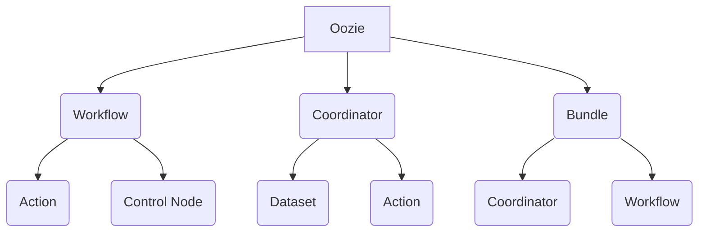

# Oozie原理与代码实例讲解

## 1. 背景介绍

### 1.1 问题的由来

在大数据时代，数据处理任务变得越来越复杂。传统的批处理系统无法满足现代数据应用的需求,例如需要处理大量的数据源、复杂的工作流程和高可用性等。Apache Hadoop生态系统中的Oozie工作流调度器应运而生,旨在解决这些挑战。

随着大数据应用的不断增长,数据处理任务变得越来越复杂。这些任务通常涉及多个步骤,每个步骤可能依赖于前一步骤的输出。手动协调和管理这些步骤是一项艰巨的任务,容易出错且效率低下。因此,需要一个强大的工作流调度系统来自动化和协调这些复杂的数据处理任务。

### 1.2 研究现状

Apache Oozie是Hadoop生态系统中的一个关键组件,用于管理Hadoop作业(如MapReduce、Pig、Hive和Sqoop等)。它是一个高度可扩展、可靠和可扩展的工作流调度系统,可以定义工作流应用程序以及协调和监控它们的执行。

Oozie支持多种类型的Hadoop作业,并提供了一种声明式的方式来定义工作流。它还支持作业之间的依赖关系、故障处理和重新运行失败的任务。此外,Oozie还提供了一个基于Web的用户界面,用于监控和管理工作流执行。

尽管Oozie提供了强大的功能,但它也面临一些挑战。例如,它的学习曲线较陡峭,需要对Hadoop生态系统有深入的了解。此外,调试和故障排除可能是一个挑战,因为工作流执行可能涉及多个步骤和依赖关系。

### 1.3 研究意义

了解Oozie的原理和实现对于大数据开发人员和架构师来说是非常重要的。通过掌握Oozie,您可以:

1. **自动化和协调复杂的数据处理任务**:Oozie允许您定义、调度和监控复杂的工作流,从而提高效率和可靠性。

2. **集成Hadoop生态系统组件**:Oozie支持各种Hadoop生态系统组件,如MapReduce、Pig、Hive和Sqoop等,使您能够构建端到端的数据处理管道。

3. **提高可靠性和容错能力**:Oozie提供了故障处理和重新运行失败任务的机制,提高了工作流的可靠性和容错能力。

4. **简化大数据应用程序开发**:通过使用Oozie,您可以将注意力集中在业务逻辑上,而不必关注底层的任务协调和调度细节。

5. **促进团队协作**:Oozie提供了一个集中式的工作流管理系统,有助于团队成员之间的协作和沟通。

通过深入了解Oozie的原理和实现细节,您可以更好地利用它的强大功能,提高大数据应用程序的开发效率和质量。

### 1.4 本文结构

本文将全面介绍Oozie的原理和实现细节,包括以下主要内容:

1. **核心概念与联系**:介绍Oozie的核心概念,如工作流、协调器、Bundle等,并解释它们之间的关系。

2. **核心算法原理与具体操作步骤**:深入探讨Oozie的核心算法原理,包括工作流执行引擎、任务调度算法等,并详细解释其具体操作步骤。

3. **数学模型和公式详细讲解与举例说明**:介绍Oozie中使用的数学模型和公式,如任务调度算法的数学模型,并通过实例详细讲解和说明。

4. **项目实践:代码实例和详细解释说明**:提供Oozie的实际代码实例,包括工作流定义、协调器定义等,并对关键代码进行详细解释和说明。

5. **实际应用场景**:探讨Oozie在实际大数据应用中的使用场景,如ETL流水线、机器学习流水线等。

6. **工具和资源推荐**:推荐Oozie相关的学习资源、开发工具和参考文献,帮助读者深入学习和使用Oozie。

7. **总结:未来发展趋势与挑战**:总结Oozie的研究成果,展望其未来发展趋势,并讨论其面临的挑战。

8. **附录:常见问题与解答**:列出Oozie使用过程中的常见问题,并给出解答和建议。

通过全面深入的介绍和分析,本文旨在帮助读者深入理解Oozie的原理和实现细节,提高大数据应用程序开发的效率和质量。

## 2. 核心概念与联系

在深入探讨Oozie的核心算法原理和实现细节之前,我们需要先了解Oozie的核心概念及它们之间的关系。Oozie中的核心概念包括:工作流(Workflow)、协调器(Coordinator)、Bundle、动作(Action)和控制节点(Control Node)等。

### 2.1 工作流(Workflow)

工作流是Oozie中最基本的概念,它定义了一系列有序的动作(Action)及其执行顺序。每个动作可以是MapReduce作业、Pig作业、Hive作业、Shell脚本等。工作流支持控制节点(Control Node),如`fork`、`join`和`decision`等,用于控制执行流程。

工作流由一个XML文件定义,该文件描述了工作流的结构、动作和控制节点。工作流可以被协调器或Bundle调度和执行。

### 2.2 协调器(Coordinator)

协调器用于定义和调度基于时间和数据可用性触发的工作流。它允许您指定工作流的执行计划,例如每天运行一次或在新数据集可用时运行。

协调器由一个XML文件定义,该文件描述了触发条件、数据集、工作流应用程序等。协调器可以包含多个动作,每个动作都是一个工作流实例。

### 2.3 Bundle

Bundle是一种高级概念,用于组合多个协调器和/或工作流,并将它们作为一个逻辑单元进行管理和执行。Bundle可以包含多个协调器和工作流,并定义它们之间的依赖关系。

Bundle由一个XML文件定义,该文件描述了包含的协调器和工作流,以及它们之间的依赖关系。

### 2.4 动作(Action)

动作是工作流中最小的执行单元,它可以是MapReduce作业、Pig作业、Hive作业、Shell脚本等。每个动作都有一个类型、配置和执行环境。

动作由工作流定义文件中的`<action>`元素定义,并包含执行所需的所有信息,如作业类型、配置属性和文件系统路径等。

### 2.5 控制节点(Control Node)

控制节点用于控制工作流的执行流程,它们包括`fork`、`join`和`decision`等。

- `fork`节点允许并行执行多个动作或子工作流。
- `join`节点用于等待并行分支完成,然后继续执行后续步骤。
- `decision`节点根据条件决定执行哪个分支。

控制节点由工作流定义文件中的`<decision>`、`<fork>`和`<join>`元素定义。

通过这些核心概念及其关系,Oozie提供了一种声明式的方式来定义、调度和执行复杂的数据处理工作流。下一节将深入探讨Oozie的核心算法原理和具体操作步骤。

## 3. 核心算法原理与具体操作步骤

### 3.1 算法原理概述

Oozie的核心算法原理包括工作流执行引擎和任务调度算法。工作流执行引擎负责解析工作流定义,并根据控制流逻辑执行各个动作。任务调度算法则负责确定何时执行工作流或协调器,并管理它们的执行。

#### 3.1.1 工作流执行引擎

工作流执行引擎是Oozie的核心组件之一,它负责解析工作流定义XML文件,并根据控制流逻辑执行各个动作。执行引擎的主要功能包括:

1. **解析工作流定义**:执行引擎首先解析工作流定义XML文件,构建一个内部表示形式,包括动作、控制节点和它们之间的依赖关系。

2. **执行动作**:根据控制流逻辑,执行引擎按顺序执行每个动作。它会根据动作类型(如MapReduce、Pig、Hive等)启动相应的作业,并监控作业的执行状态。

3. **处理控制节点**:执行引擎处理控制节点(如`fork`、`join`和`decision`)的逻辑,以控制执行流程。例如,在`fork`节点处,它会并行执行多个分支;在`join`节点处,它会等待所有并行分支完成。

4. **错误处理**:如果某个动作失败,执行引擎会根据配置决定是重试、继续执行还是终止整个工作流。

5. **状态跟踪**:执行引擎会跟踪工作流的执行状态,包括已完成的动作、当前正在执行的动作以及未来要执行的动作。

工作流执行引擎的核心算法是基于有向无环图(DAG)的拓扑排序算法。它将工作流定义解析为一个DAG,其中节点表示动作或控制节点,边表示它们之间的依赖关系。然后,执行引擎按照拓扑顺序执行每个节点。

#### 3.1.2 任务调度算法

任务调度算法负责确定何时执行工作流或协调器,并管理它们的执行。Oozie使用了基于时间和数据可用性的调度策略。

对于工作流,Oozie支持以下调度方式:

1. **手动触发**:用户可以手动触发工作流的执行。

2. **基于时间的调度**:通过协调器,可以定义工作流的执行计划,例如每天运行一次或在特定时间运行。

3. **基于数据可用性的调度**:协调器还可以监控数据集的可用性,并在新数据集可用时触发工作流的执行。

对于协调器,Oozie使用以下调度算法:

1. **时间触发器**:协调器根据定义的时间计划(如每天、每周等)触发工作流的执行。

2. **数据触发器**:协调器监控指定的数据集,当新数据集可用时,它会触发工作流的执行。

3. **混合触发器**:协调器可以同时使用时间触发器和数据触发器,以满足复杂的调度需求。

任务调度算法还需要处理故障和重试策略。如果某个工作流或协调器动作失败,Oozie可以根据配置决定是重试、继续执行还是终止整个流程。

### 3.2 算法步骤详解

#### 3.2.1 工作流执行引擎算法步骤

工作流执行引擎的算法步骤如下:

1. **解析工作流定义**:
   - 读取工作流定义XML文件。
   - 构建内部表示形式,包括动作、控制节点和它们之间的依赖关系。
   - 将工作流表示为有向无环图(DAG)。

2. **初始化执行上下文**:
   - 创建执行上下文对象,用于存储工作流的执行状态和元数据。
   - 初始化执行上下文,包括工作流ID、启动时间等。

3. **执行动作**:
   - 根据拓扑顺序遍历DAG。
   - 对于每个动作节点:
     - 检查其依赖条件是否满足。
     - 如果依赖条件满足,则提交动作作业。
     - 监控动作作业的执行状态。
     - 更新执行上下文中的动作状态。

4. **处理控制节点**:
   - 对于`fork`节点,并行执行所有子分支。
   - 对于`join`节点,等待所有子分支完成。
   - 对于`decision`节点,根据条件执行相应的分支。

5. **错误处理**:
   - 如果某个动作失败,根据配置决定是重试、继续执行还是