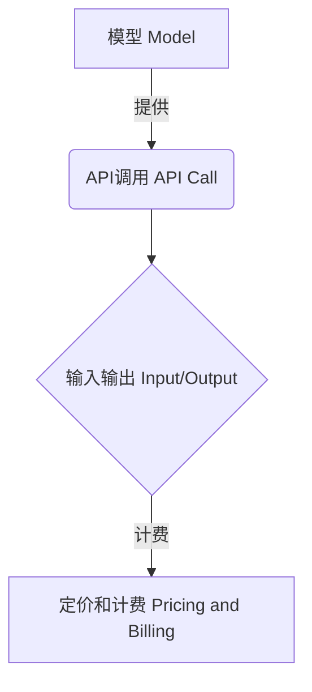

# OpenAI Models API

## 1. 背景介绍

### 1.1 问题的由来

在过去几年中，自然语言处理(NLP)和计算机视觉(CV)等人工智能领域取得了长足的进步。这主要归功于深度学习技术的飞速发展,尤其是transformer模型在各种任务上展现出了卓越的性能。然而,训练这些大型模型需要大量的计算资源和海量的数据,这对于普通开发者和研究人员来说是一个巨大的挑战。

为了降低人工智能模型的使用门槛,OpenAI于2021年6月推出了Models API,旨在为开发者提供一种简单且经济高效的方式来访问先进的人工智能模型。Models API支持多种任务,包括自然语言处理、计算机视觉、音频处理等,使开发者能够将人工智能技术无缝集成到他们的应用程序中。

### 1.2 研究现状

目前,OpenAI Models API提供了多种预训练模型,涵盖了广泛的应用场景。其中,GPT-3是OpenAI推出的一款大型语言模型,具有出色的自然语言生成和理解能力。GPT-3已被广泛应用于文本生成、问答系统、文本摘要等任务中。

除了GPT-3之外,OpenAI还提供了一系列计算机视觉模型,如CLIP和DALL-E,用于图像识别、图像生成和图像编辑等任务。此外,OpenAI还推出了用于音频处理的Whisper模型,可以实现高精度的语音识别和转录功能。

随着人工智能技术的不断发展,OpenAI Models API也在持续更新和扩展,以满足不同领域的需求。例如,最近推出的GPT-4模型在多个基准测试中展现出了令人印象深刻的性能,被认为是迄今为止最强大的大型语言模型之一。

### 1.3 研究意义

OpenAI Models API的推出为开发者和研究人员提供了一个全新的人工智能开发平台,具有重要的意义:

1. **降低使用门槛**:开发者无需自行训练复杂的人工智能模型,只需通过API调用即可获取强大的模型能力,大大降低了使用门槛。

2. **加速应用开发**:借助OpenAI提供的高质量模型,开发者可以更快地将人工智能技术集成到应用程序中,加速了应用开发的进程。

3. **促进创新与探索**:Models API为开发者和研究人员提供了一个实验平台,鼓励他们探索人工智能在各个领域的应用,推动创新发展。

4. **降低成本**:相比于自行训练大型模型,使用OpenAI Models API可以显著降低计算资源和数据成本,使人工智能技术更加经济高效。

5. **推动人工智能民主化**:Models API使人工智能技术不再局限于大型科技公司和研究机构,普通开发者也能轻松获取先进的人工智能能力,推动了人工智能的民主化进程。

### 1.4 本文结构

本文将全面介绍OpenAI Models API,内容包括:

1. **核心概念与联系**:介绍Models API的核心概念,如模型、API调用、输入输出等,并阐述它们之间的关系。

2. **核心算法原理与具体操作步骤**:深入探讨Models API背后的核心算法原理,如transformer模型、注意力机制等,并详细解释API调用的具体操作步骤。

3. **数学模型和公式详细讲解与举例说明**:阐述Models API中使用的数学模型和公式,如自注意力计算、多头注意力机制等,并通过具体案例进行详细讲解。

4. **项目实践:代码实例和详细解释说明**:提供Models API的实际代码示例,涵盖不同任务和模型的使用,并对关键代码进行深入解释。

5. **实际应用场景**:介绍Models API在自然语言处理、计算机视觉、音频处理等领域的实际应用场景,并探讨未来的应用前景。

6. **工具和资源推荐**:推荐与Models API相关的学习资源、开发工具、论文等,为读者提供进一步学习和研究的参考。

7. **总结:未来发展趋势与挑战**:总结Models API的研究成果,展望未来的发展趋势,并分析可能面临的挑战。

8. **附录:常见问题与解答**:列出使用Models API时可能遇到的常见问题,并给出解答和建议。

通过全面介绍OpenAI Models API,本文旨在帮助读者深入理解这一强大的人工智能开发平台,掌握其核心原理和使用方法,并探索其在各个领域的应用前景。

## 2. 核心概念与联系

在深入探讨OpenAI Models API的细节之前,我们先来了解一些核心概念及它们之间的关系。

### 2.1 模型(Model)

模型是OpenAI Models API的核心组成部分。OpenAI提供了多种预训练的人工智能模型,涵盖自然语言处理、计算机视觉、音频处理等领域。这些模型经过大规模训练,具备强大的能力,可以应用于各种任务。

目前,OpenAI提供的主要模型包括:

- **GPT-3**:一种大型语言模型,擅长自然语言生成、理解和问答等任务。
- **DALL-E**:一种图像生成模型,可以根据文本描述生成相应的图像。
- **CLIP**:一种视觉语义模型,用于图像识别和图像文本匹配。
- **Whisper**:一种语音识别模型,可以将音频转录为文本。

这些模型都是基于深度学习技术,尤其是transformer模型和自注意力机制训练而成。它们具有强大的泛化能力,可以应用于广泛的场景。

### 2.2 API调用(API Call)

要使用OpenAI提供的模型,需要通过API调用的方式进行交互。API调用是一种标准化的接口,允许开发者向OpenAI的服务器发送请求,并获取模型的输出结果。

API调用通常包括以下几个核心要素:

- **端点(Endpoint)**:指定要调用的API的URL地址。
- **HTTP方法**:通常使用POST或GET方法向API发送请求。
- **请求头(Headers)**:包含认证信息(如API密钥)和其他元数据。
- **请求体(Body)**:包含输入数据,如文本、图像或音频等。
- **响应(Response)**:API返回的输出结果,如生成的文本、图像或转录文本等。

OpenAI提供了多种编程语言的SDK和示例代码,方便开发者进行API调用和数据处理。

### 2.3 输入输出(Input/Output)

模型的输入输出是API调用的核心部分。不同的模型对应不同的输入输出格式:

- **自然语言处理模型**:输入为文本,输出也为文本。
- **计算机视觉模型**:输入可以是图像或文本,输出可以是图像、文本描述或其他信息。
- **音频处理模型**:输入为音频数据,输出为文本转录。

输入输出的格式需要符合OpenAI的规范,以确保模型能够正确处理数据。同时,开发者也可以根据需求对输入输出进行预处理和后处理,以获得更好的结果。

### 2.4 定价和计费(Pricing and Billing)

OpenAI Models API采用按使用量计费的定价模式。开发者需要为每次API调用和模型使用付费,费用取决于模型的大小、计算资源消耗等因素。

OpenAI提供了详细的定价信息和计费说明,开发者可以根据预计使用量估算成本。同时,OpenAI还提供了免费的试用额度,方便开发者进行测试和评估。

### 2.5 概念关系总结

上述核心概念之间的关系可以用下图总结:



模型是OpenAI Models API的核心,它们通过API调用的方式对外提供服务。API调用涉及输入输出数据的处理,同时需要根据使用量支付相应的费用。这些概念相互关联,共同构成了OpenAI Models API的整体架构。

## 3. 核心算法原理与具体操作步骤

### 3.1 算法原理概述

OpenAI Models API背后的核心算法原理是transformer模型和自注意力机制。这些算法在近年来取得了突破性的进展,成为了自然语言处理、计算机视觉等领域的主流技术。

#### 3.1.1 Transformer模型

Transformer模型是一种全新的深度学习架构,它完全基于注意力机制,不依赖于传统的递归神经网络或卷积神经网络。Transformer模型的主要优势包括:

1. **并行计算**:Transformer模型可以并行处理输入序列的所有位置,提高了计算效率。
2. **长距离依赖捕获**:注意力机制可以直接捕获输入序列中任意两个位置之间的依赖关系,解决了长期依赖问题。
3. **灵活性**:Transformer模型可以应用于不同的任务,如机器翻译、文本生成、图像识别等。

Transformer模型的核心组件是编码器(Encoder)和解码器(Decoder)。编码器负责处理输入序列,提取其中的特征表示;解码器则根据编码器的输出和目标序列生成最终的输出。

#### 3.1.2 自注意力机制

自注意力机制是Transformer模型的核心部分,它允许模型在计算每个位置的表示时,关注输入序列中的所有其他位置。自注意力机制的计算过程如下:

1. 将输入序列映射为查询(Query)、键(Key)和值(Value)向量。
2. 计算查询和所有键向量之间的相似性得分(注意力分数)。
3. 使用注意力分数对值向量进行加权求和,得到该位置的注意力表示。
4. 对所有位置的注意力表示进行进一步处理,得到最终的输出表示。

自注意力机制的优势在于它可以自适应地捕获输入序列中任意两个位置之间的依赖关系,而无需手动设计特征或窗口大小。这种灵活性使得Transformer模型在各种任务上表现出色。

### 3.2 算法步骤详解

使用OpenAI Models API的具体步骤如下:

1. **导入必要的库**:根据使用的编程语言,导入OpenAI提供的SDK或第三方库,如Python的`openai`库。

2. **设置API密钥**:获取OpenAI API密钥,并在代码中进行设置,以便进行身份验证。

```python
import openai
openai.api_key = "YOUR_API_KEY"
```

3. **选择模型**:根据任务需求,选择合适的OpenAI模型,如GPT-3、DALL-E、CLIP等。

```python
model_engine = "text-davinci-003"  # GPT-3模型
```

4. **准备输入数据**:根据模型的要求,准备输入数据,如文本、图像或音频。对于文本输入,可能需要进行tokenization等预处理。

```python
prompt = "Write a short story about a curious robot."
```

5. **发送API请求**:使用SDK或库提供的函数,向OpenAI服务器发送API请求,传递输入数据和其他参数。

```python
response = openai.Completion.create(
    engine=model_engine,
    prompt=prompt,
    max_tokens=1024,
    n=1,
    stop=None,
    temperature=0.7,
)
```

6. **处理响应结果**:从API响应中提取模型的输出结果,如生成的文本、图像或转录文本。根据需要进行后处理,如解码、格式化等。

```python
generated_text = response.choices[0].text
print(generated_text)
```

7. **可选:调整参数**:根据需要,调整API请求的参数,如`max_tokens`(输出长度)、`temperature`(创造力程度)等,以获得更好的结果。

8. **可选:错误处理**:处理API调用过程中可能出现的错误,如认证失败、请求超时等,并采取相应的措施。

通过上述步骤,开发者可以轻松地将OpenAI Models API集成到自己的应用程序中,利用先进的人工智能模型提供强大的功能。

### 3.3 算法优缺点

OpenAI Models API基于Transformer模型和