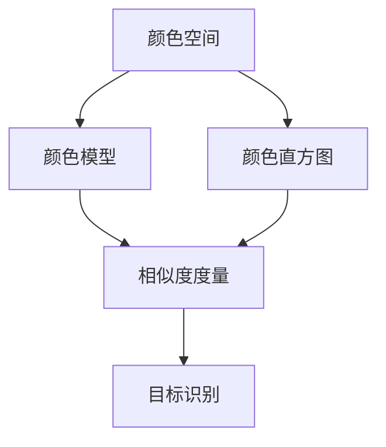

# OpenCV基于颜色的目标识别

## 1. 背景介绍

### 1.1 问题的由来

在计算机视觉领域,目标识别是一项非常重要和具有挑战性的任务。随着视觉技术的不断发展,人们对于更加智能化、自动化的目标识别系统有着越来越高的期望。其中,基于颜色的目标识别技术因其简单高效而备受关注。

颜色是视觉信息中最直观、最容易获取的特征之一。利用颜色特征进行目标识别,不仅可以避免复杂的图像处理过程,还能够在特定场景下获得非常理想的效果。因此,基于颜色的目标识别技术在工业自动化、机器人导航、交通监控等领域有着广泛的应用前景。

### 1.2 研究现状

目前,基于颜色的目标识别技术主要分为两大类:基于特定颜色模型的方法和基于颜色直方图的方法。

基于特定颜色模型的方法通常利用像素值在某一特定颜色空间(如RGB、HSV等)中的分布情况,建立颜色模型,然后根据模型对目标像素进行分类。这种方法对特定颜色目标的识别效果较好,但受光照条件和背景干扰的影响较大。

基于颜色直方图的方法则是计算图像的颜色直方图作为特征,通过直方图匹配或其他相似度度量来识别目标。这种方法对旋转、平移等变化有较好的鲁棒性,但对目标形状的变化敏感度较低。

### 1.3 研究意义

基于颜色的目标识别技术具有以下重要意义:

1. 简单高效:相比基于纹理、形状等其他特征的目标识别方法,颜色特征更加直观,计算量较小,处理速度更快。

2. 应用广泛:工业自动化、机器人导航、交通监控等领域都有着广阔的应用前景。

3. 理论基础:研究颜色特征在目标识别中的作用,有助于深入理解视觉信息的本质,为发展更加智能化的计算机视觉系统奠定理论基础。

### 1.4 本文结构

本文将首先介绍基于颜色的目标识别技术的核心概念和原理,包括常用的颜色空间、颜色模型和相似度度量方法。接下来,将详细阐述基于颜色直方图的目标识别算法的原理和具体实现步骤。然后,通过数学模型和公式,对算法的理论基础进行严格推导和分析。在此基础上,以OpenCV为例,给出了一个完整的基于颜色直方图的目标识别项目的代码实现,并对关键步骤进行了详细的解释和分析。最后,讨论了该技术在实际应用中的场景,以及未来的发展趋势和面临的挑战。

## 2. 核心概念与联系

基于颜色的目标识别技术涉及以下几个核心概念:

1. **颜色空间(Color Space)**:用于描述和表示颜色的数学模型。常用的颜色空间包括RGB、HSV、YCbCr等。不同的颜色空间对应不同的颜色表示方式,在特定场景下会有不同的表现。

2. **颜色模型(Color Model)**:描述目标颜色在特定颜色空间中的分布情况。常用的颜色模型有高斯模型、单高斯模型、混合高斯模型等。

3. **颜色直方图(Color Histogram)**:统计图像中每个颜色值出现的频率,作为图像的颜色特征描述子。

4. **相似度度量(Similarity Measure)**:用于衡量两个颜色直方图之间的相似程度,常用的方法有相关系数、交叉熵、卡方统计量等。

这些概念之间存在着紧密的联系:首先需要选择合适的颜色空间,然后根据目标颜色在该空间中的分布情况建立颜色模型。对于基于直方图的方法,需要计算图像的颜色直方图作为特征向量。最后,通过相似度度量,比较目标直方图与参考直方图之间的距离,从而实现目标识别。

## 3. 核心算法原理 & 具体操作步骤

### 3.1 算法原理概述

基于颜色直方图的目标识别算法主要分为以下几个步骤:

1. **预处理**:对输入图像进行必要的预处理,如去噪、平滑等,以提高后续处理的效果。

2. **颜色空间转换**:将输入图像从默认的RGB颜色空间转换到更加适合的颜色空间,如HSV空间。

3. **计算颜色直方图**:在选定的颜色空间中,计算输入图像的颜色直方图作为特征向量。

4. **直方图匹配**:将计算得到的直方图与预先存储的参考直方图(对应目标颜色)进行匹配,采用合适的相似度度量方法计算两者之间的距离。

5. **目标识别**:根据距离值,判断输入图像是否包含目标颜色,若距离小于预设阈值,则认为存在目标。

6. **后处理**:对识别结果进行必要的后处理,如滤波、形态学操作等,以获得更加准确和稳定的输出。

### 3.2 算法步骤详解

1. **预处理**

   对原始输入图像进行预处理是很有必要的,因为图像中通常会存在噪声、失真等干扰因素,这会影响后续处理的效果。常用的预处理操作包括:

   - 去噪:使用滤波器(如高斯滤波、中值滤波等)去除图像中的噪声。
   - 平滑:通过模糊操作(如均值模糊、高斯模糊等)平滑图像,减少细节信息对后续处理的影响。
   - 增强:利用直方图均衡化、对比度拉伸等方法增强图像的对比度和清晰度。

2. **颜色空间转换**

   不同的颜色空间对应不同的颜色表示方式,在特定场景下会有不同的表现。常用的颜色空间包括:

   - **RGB**:红绿蓝三原色的加和,最常见的颜色空间,但不太直观。
   - **HSV**:色调(Hue)、饱和度(Saturation)、明度(Value),更加直观和符合人眼感知。
   - **YCbCr**:亮度(Y)、蓝色色度(Cb)、红色色度(Cr),常用于视频压缩编码。

   在基于颜色的目标识别任务中,HSV空间通常是一个不错的选择,因为它能够很好地分离出颜色信息和亮度信息,对光照变化的鲁棒性较强。

   颜色空间转换的公式如下:

   $$
   \begin{aligned}
   H &= \cos^{-1}\left\{\frac{(R-G)+(R-B)}{2\sqrt{(R-G)^2+(R-B)(G-B)}}\right\} \\
   S &= 1 - \frac{3}{R+G+B}\min(R,G,B) \\
   V &= \frac{1}{3}(R+G+B)
   \end{aligned}
   $$

   其中$R$、$G$、$B$分别表示像素在RGB空间中的值。

3. **计算颜色直方图**

   颜色直方图是图像的一种全局特征描述子,它统计了图像中每个颜色值出现的频率。对于彩色图像,通常需要在选定的颜色空间(如HSV)中计算三个通道的联合直方图。

   设图像大小为$M\times N$,颜色空间的量化级别为$L$,则三个通道的联合直方图可表示为:

   $$
   H(a,b,c) = \sum_{x=1}^{M}\sum_{y=1}^{N}\begin{cases}
   1, & \text{if } I(x,y)=(a,b,c)\\
   0, & \text{otherwise}
   \end{cases}
   $$

   其中$a\in[0,L-1]$、$b\in[0,L-1]$、$c\in[0,L-1]$分别表示三个通道的量化值,$I(x,y)$表示像素$(x,y)$在该颜色空间中的值。

   为了减小直方图的维度,通常需要对其进行归一化处理:

   $$
   \hat{H}(a,b,c) = \frac{H(a,b,c)}{M\times N}
   $$

4. **直方图匹配**

   计算得到目标图像的颜色直方图后,需要与预先存储的参考直方图(对应目标颜色)进行匹配,以判断是否存在目标颜色。

   常用的相似度度量方法包括:

   - **相关系数(Correlation Coefficient)**:衡量两个直方图之间的线性相关程度。
   - **交叉熵(Cross Entropy)**:基于信息论,衡量两个直方图之间的差异性。
   - **卡方统计量(Chi-Square Statistic)**:测量两个直方图之间的总体差异。

   以相关系数为例,其计算公式为:

   $$
   r = \frac{\sum_{a,b,c}(H_1(a,b,c)-\overline{H_1})(H_2(a,b,c)-\overline{H_2})}{\sqrt{\sum_{a,b,c}(H_1(a,b,c)-\overline{H_1})^2\sum_{a,b,c}(H_2(a,b,c)-\overline{H_2})^2}}
   $$

   其中$H_1$和$H_2$分别表示两个归一化的直方图,$\overline{H_1}$和$\overline{H_2}$分别表示它们的均值。相关系数的取值范围为$[-1,1]$,值越接近1,表示两个直方图越相似。

5. **目标识别**

   根据直方图匹配的结果,即两个直方图之间的距离值,判断输入图像是否包含目标颜色。

   通常会设置一个阈值$T$,若距离值小于$T$,则认为存在目标颜色;否则,认为不存在目标颜色。

   $$
   \text{Result} = \begin{cases}
   1, & \text{if } d(H_1,H_2) < T\\
   0, & \text{otherwise}
   \end{cases}
   $$

   其中$d(\cdot,\cdot)$表示所采用的相似度度量方法。

6. **后处理**

   对识别结果进行必要的后处理,可以进一步提高目标识别的准确性和稳定性。常用的后处理操作包括:

   - 滤波:使用开运算、闭运算等形态学操作,去除噪声和小区域。
   - 区域生长:从种子点出发,根据相似性原则,不断扩展区域,获得更加完整的目标区域。
   - 边界提取:使用边缘检测算子(如Canny等)提取目标的边界,获得更加精确的目标轮廓。

### 3.3 算法优缺点

基于颜色直方图的目标识别算法具有以下优缺点:

**优点**:

1. 计算简单,效率较高。
2. 对目标的旋转、平移等变换有较好的鲁棒性。
3. 对部分遮挡、形变等情况也有一定的适应能力。

**缺点**:

1. 只利用了颜色信息,对目标的形状、纹理等其他特征缺乏描述。
2. 对复杂背景和光照变化的适应能力较差。
3. 无法很好地区分相似颜色的不同目标。

### 3.4 算法应用领域

基于颜色直方图的目标识别算法由于其简单高效的特点,在以下领域有着广泛的应用:

1. **工业自动化**:在流水线上快速识别特定颜色的工件、产品等。
2. **机器人导航**:识别特定颜色的路标、标志物,实现自主导航。
3. **交通监控**:识别特定颜色的车辆、信号灯等,用于智能交通管理。
4. **人机交互**:识别特定颜色的手势、标记物,实现无接触式交互。
5. **医学图像分析**:在医学影像中识别特定颜色的病灶、组织等。
6. **无人机/航拍监控**:从空中视角识