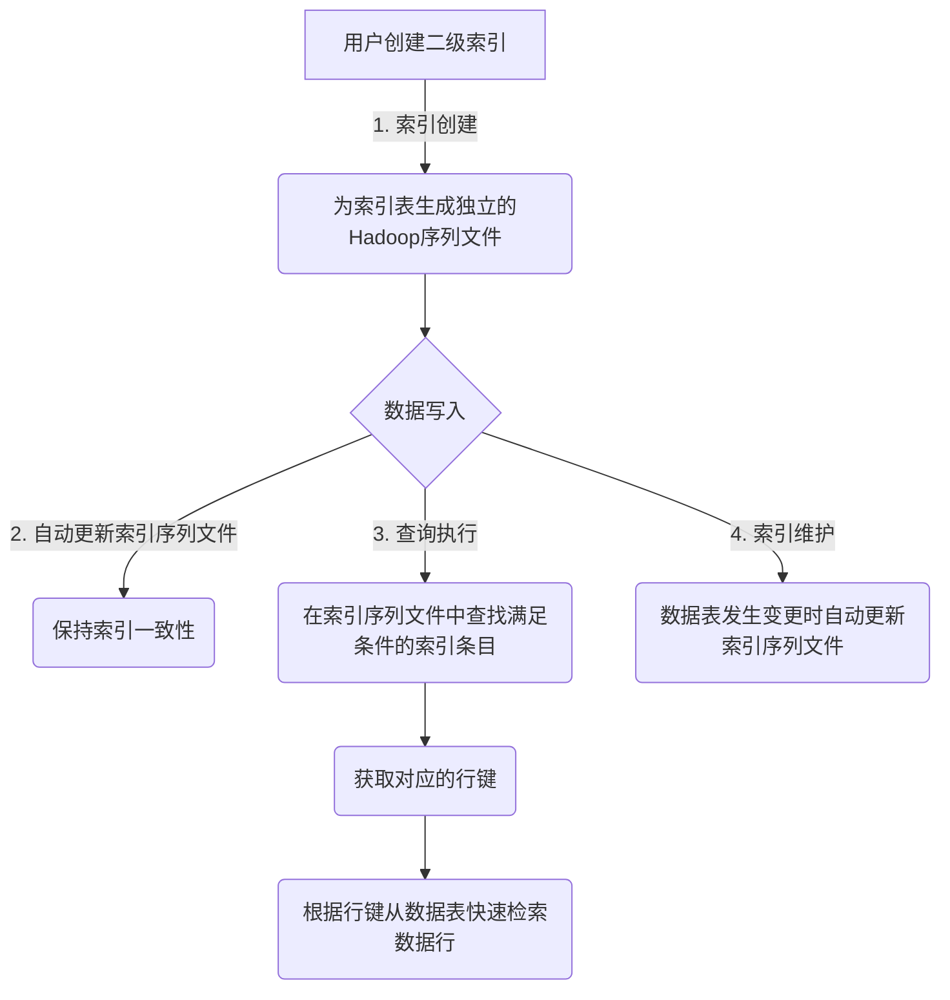

# Phoenix二级索引原理与代码实例讲解

## 1. 背景介绍

### 1.1 问题的由来

在现代数据库系统中,索引扮演着至关重要的角色,它可以显著提高数据查询的效率。然而,传统的索引方式存在一些局限性,例如无法满足复杂查询条件的需求。为了解决这个问题,二级索引(Secondary Index)应运而生。

### 1.2 研究现状

二级索引是一种常见的数据库索引技术,它允许我们在非主键列上创建索引,从而加快对这些列的查询速度。二级索引广泛应用于各种数据库系统中,如关系型数据库、NoSQL数据库等。然而,不同的数据库系统对二级索引的实现方式可能有所不同。

### 1.3 研究意义

深入理解二级索引的原理及其在Phoenix中的实现,对于提高数据查询效率、优化系统性能具有重要意义。本文将从理论和实践两个层面,全面剖析Phoenix二级索引的工作机制,并通过代码示例加深读者的理解。

### 1.4 本文结构

本文首先介绍二级索引的基本概念和作用,然后详细阐述其在Phoenix中的实现原理,包括核心算法、数学模型等。接下来,我们将通过实际的代码示例,演示如何在Phoenix中创建和使用二级索引。最后,探讨二级索引的应用场景、未来发展趋势和面临的挑战。

## 2. 核心概念与联系

二级索引(Secondary Index)是一种辅助索引,它建立在数据表的非主键列上。与主键索引不同,二级索引并不决定数据的物理存储顺序,而是维护一个独立的索引结构,用于加速对非主键列的查询。

在关系型数据库中,二级索引通常采用B+树的数据结构来实现。每个二级索引都与一个数据表相关联,索引中的条目包含了索引列的值和对应数据行的主键值或行标识符(Row ID)。当查询涉及索引列时,数据库可以先在二级索引中查找满足条件的索引条目,然后根据主键值或行标识符快速定位并返回相应的数据行。

在NoSQL数据库中,二级索引的实现方式可能有所不同,但其基本思想是相似的。例如,在Apache Phoenix中,二级索引是通过构建额外的Hadoop序列文件(Sequence File)来实现的,这些文件将索引列的值与对应的行键(Row Key)相关联。

无论是关系型数据库还是NoSQL数据库,二级索引都可以显著提高非主键列查询的效率,尤其是在数据量庞大的情况下。然而,创建和维护二级索引也会带来一定的开销,因此需要权衡利弊,合理设计索引策略。

## 3. 核心算法原理 & 具体操作步骤

### 3.1 算法原理概述

在Phoenix中,二级索引的实现原理可以概括为以下几个关键步骤:

1. **索引创建**: 当用户创建二级索引时,Phoenix会为索引表生成一个独立的Hadoop序列文件,并将索引列的值与对应的行键存储在其中。

2. **数据写入**: 每当向数据表中插入或更新数据时,Phoenix会自动更新相关的二级索引序列文件,以保持索引的一致性。

3. **查询执行**: 当查询涉及索引列时,Phoenix会先在二级索引序列文件中查找满足条件的索引条目,获取对应的行键。然后,Phoenix会根据这些行键从数据表中快速检索出相关的数据行。

4. **索引维护**: 为了保证索引的有效性,Phoenix会在数据表发生变更(插入、更新或删除)时,自动更新相应的二级索引序列文件。

该算法的核心思想是将索引信息与数据分离存储,通过构建额外的索引结构来加速查询。与传统的B+树索引相比,这种基于Hadoop序列文件的实现方式具有更好的可扩展性和容错性,能够有效处理大规模数据集。



### 3.2 算法步骤详解

1. **索引创建**

   当用户使用`CREATE INDEX`语句创建二级索引时,Phoenix会执行以下操作:

   - 分析索引列的数据类型和约束条件,确定索引的存储格式。
   - 为索引表生成一个独立的Hadoop序列文件,用于存储索引信息。
   - 将数据表中已有的数据行逐一扫描,构建初始的索引序列文件。

2. **数据写入**

   每当向数据表中插入或更新数据时,Phoenix会自动执行以下步骤来维护二级索引:

   - 解析新的数据行,提取索引列的值和行键。
   - 在相应的索引序列文件中,添加或更新索引条目,将索引列的值与行键相关联。
   - 如果是更新操作,还需要删除原有的索引条目。

3. **查询执行**

   当查询涉及索引列时,Phoenix会采取以下步骤利用二级索引加速查询:

   - 分析查询条件,确定需要使用哪些二级索引。
   - 在相应的索引序列文件中,根据查询条件查找满足要求的索引条目。
   - 从索引条目中提取出对应的行键集合。
   - 根据行键集合,从数据表中快速检索出相关的数据行。

4. **索引维护**

   为了保证索引的有效性和一致性,Phoenix会在数据表发生变更时自动维护相关的二级索引:

   - 插入操作: 为新插入的数据行添加对应的索引条目。
   - 更新操作: 先删除原有的索引条目,然后为更新后的数据行添加新的索引条目。
   - 删除操作: 从索引序列文件中删除对应的索引条目。

### 3.3 算法优缺点

**优点**:

- 提高了非主键列查询的效率,尤其是在数据量庞大的情况下。
- 基于Hadoop序列文件的实现方式具有良好的可扩展性和容错性。
- 自动维护索引的一致性,无需手动干预。

**缺点**:

- 创建和维护二级索引会带来额外的存储和计算开销。
- 对于频繁更新的数据表,索引维护开销可能较大。
- 索引的设计需要权衡查询效率和维护开销,合理规划索引策略。

### 3.4 算法应用领域

Phoenix二级索引的应用场景非常广泛,包括但不限于:

- 大数据分析: 在海量数据集上进行复杂查询和分析时,二级索引可以显著提高查询效率。
- 业务智能(BI): 二级索引可用于加速BI系统中的多维数据分析和报表生成。
- 内容搜索: 通过在文本字段上创建二级索引,可以实现高效的全文搜索功能。
- 物联网(IoT): 在处理来自各种传感器的海量时序数据时,二级索引可以加快数据查询和分析。

总的来说,只要涉及到对非主键列进行频繁查询的场景,使用二级索引都可以带来显著的性能提升。

## 4. 数学模型和公式 & 详细讲解 & 举例说明

在讨论Phoenix二级索引的数学模型之前,我们先介绍一些基本概念和符号:

- 设$D$为数据表,包含$n$行数据,即$D = \{r_1, r_2, \dots, r_n\}$。
- 设$C$为索引列,其中$r_i.C$表示第$i$行数据在列$C$上的值。
- 设$K$为行键(Row Key),其中$r_i.K$表示第$i$行数据的行键值。
- 设$I$为二级索引,它是一个键值对集合,即$I = \{(c_j, S_j) | c_j \in C, S_j = \{r_i.K | r_i.C = c_j\}\}$,其中$c_j$是索引列$C$上的一个distinct值,而$S_j$是一个行键集合,包含了所有具有值$c_j$的数据行的行键。

### 4.1 数学模型构建

我们可以将Phoenix二级索引的构建过程建模为以下数学表达式:

$$
I = \bigcup_{j=1}^{|C|} \{(c_j, S_j)\}, \text{ where } S_j = \{r_i.K | r_i.C = c_j, 1 \leq i \leq n\}
$$

这个模型描述了如何从数据表$D$中构建二级索引$I$。具体来说,对于索引列$C$上的每个distinct值$c_j$,我们都会创建一个键值对$(c_j, S_j)$,其中$S_j$是一个集合,包含了所有具有值$c_j$的数据行的行键。最终,二级索引$I$就是所有这些键值对的并集。

### 4.2 公式推导过程

接下来,我们推导一个公式,用于计算查询执行时的代价。

假设我们要执行一个查询$Q$,它涉及索引列$C$上的条件$C \in \{c_1, c_2, \dots, c_m\}$,其中$m \leq |C|$。不使用索引的情况下,我们需要扫描整个数据表$D$,代价为$O(n)$。

但是,如果我们使用二级索引$I$,那么查询的执行代价可以表示为:

$$
\begin{aligned}
\text{Cost}(Q) &= \sum_{j=1}^m \text{Cost}(c_j, S_j) \\
               &= \sum_{j=1}^m \Big(O(1) + O(|S_j|)\Big) \\
               &= O(m) + \sum_{j=1}^m O(|S_j|)
\end{aligned}
$$

其中:

- $O(1)$是从索引$I$中查找键$c_j$的代价,因为我们可以使用哈希表或其他高效数据结构来存储索引。
- $O(|S_j|)$是遍历行键集合$S_j$并从数据表$D$中检索相应数据行的代价。

由于$\sum_{j=1}^m |S_j| \leq n$,我们可以得到:

$$
\text{Cost}(Q) = O(m + n)
$$

当$m \ll n$时,使用二级索引执行查询的代价要远小于全表扫描的代价$O(n)$。

### 4.3 案例分析与讲解

为了更好地理解二级索引的工作原理,我们来分析一个具体的案例。

假设我们有一个名为`orders`的数据表,用于存储订单信息,其中包含以下列:

- `order_id`: 订单ID(主键)
- `customer_id`: 客户ID
- `order_date`: 订单日期
- `total_amount`: 订单总金额

现在,我们希望能够快速查询某个客户在特定日期范围内的所有订单。为此,我们可以在`customer_id`和`order_date`列上创建一个复合二级索引:

```sql
CREATE INDEX orders_idx ON orders (customer_id, order_date) INCLUDE (total_amount);
```

这个索引不仅包含了`customer_id`和`order_date`列,还包含了`total_amount`列,以便在查询时直接返回订单总金额,无需额外访问数据表。

创建索引后,Phoenix会为其生成一个独立的Hadoop序列文件,其中的键值对形式为:

```
(customer_id_1, order_date_1) -> (order_id_1, total_amount_1)
(customer_id_1, order_date_2) -> (order_id_2, total_amount_2)
(customer_id_2, order_date_3) -> (order_id_3, total_amount_3)
...
```

当我们执行以下查询时:

```sql
SELECT order_id, total_amount
FROM orders
WHERE customer_id = 123 AND order_date BETWEEN '2023-01-01' AND '2023-03-31';
```

Phoenix会利用二级索引来加速查询执行:

1. 在索引序列文件中,查