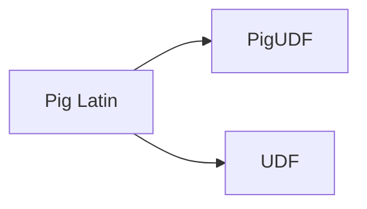

# PigUDF的商业模式:开发更高效的商业

作者：禅与计算机程序设计艺术 / Zen and the Art of Computer Programming

## 1. 背景介绍

### 1.1 问题的由来

在当今数据驱动的商业环境中，企业对于数据处理和分析的需求日益增长。Hadoop和Spark等大数据平台的出现，为企业提供了强大的数据处理能力。然而，这些平台在处理复杂的数据处理逻辑时，往往会受到原生函数功能的限制。为了解决这个问题，PigUDF（Pig User-Defined Functions）应运而生。PigUDF允许用户自定义函数，将复杂的数据处理逻辑封装起来，提高数据处理效率。

### 1.2 研究现状

随着大数据技术的不断发展，PigUDF在商业领域的应用越来越广泛。许多企业开始利用PigUDF进行数据清洗、转换、聚合等操作，提高数据处理效率，降低开发成本。然而，PigUDF的商业模式仍然处于探索阶段，如何构建可持续发展的商业模式，成为当前研究的热点问题。

### 1.3 研究意义

研究PigUDF的商业模式，对于推动大数据技术的发展、促进企业数字化转型具有重要意义。通过构建可持续发展的商业模式，可以：

1. 降低企业数据处理的门槛，提高数据处理效率。
2. 促进大数据技术的普及和应用，推动产业结构升级。
3. 为软件开发者提供新的商业模式，创造更多就业机会。
4. 帮助企业实现数据驱动决策，提升企业竞争力。

### 1.4 本文结构

本文将从PigUDF的核心概念出发，探讨其商业模式，并分析其未来发展趋势和挑战。具体内容如下：

- 第2部分，介绍PigUDF的核心概念与联系。
- 第3部分，阐述PigUDF的算法原理和具体操作步骤。
- 第4部分，分析PigUDF的数学模型和公式，并进行案例分析和讲解。
- 第5部分，给出PigUDF的代码实例，并对关键代码进行解读和分析。
- 第6部分，探讨PigUDF的实际应用场景，并展望其未来应用前景。
- 第7部分，推荐PigUDF相关的学习资源、开发工具和参考文献。
- 第8部分，总结全文，展望PigUDF的未来发展趋势与挑战。

## 2. 核心概念与联系

### 2.1 PigUDF

PigUDF是Hadoop生态系统中的一种自定义函数，允许用户使用Python、Java等编程语言编写函数，实现对Pig Latin语言中未提供的复杂数据处理逻辑。

### 2.2 Pig Latin

Pig Latin是Hadoop生态系统中的一种数据流语言，用于描述数据处理流程。Pig Latin具有易学易用、表达能力强的特点，但其在处理复杂逻辑时受到原生函数功能的限制。

### 2.3 UDF

UDF（User-Defined Function）是Hadoop生态系统中的一种自定义函数，允许用户自定义函数，实现对Hadoop框架的扩展。

它们的逻辑关系如下图所示：



可以看出，PigUDF是Pig Latin的一种扩展，通过引入UDF的概念，实现了对Pig Latin原生函数功能的补充。

## 3. 核心算法原理 & 具体操作步骤

### 3.1 算法原理概述

PigUDF的核心思想是将自定义函数封装为Pig Latin中的UDF，实现复杂的数据处理逻辑。

### 3.2 算法步骤详解

1. 使用Python、Java等编程语言编写自定义函数。
2. 将自定义函数编译为jar包。
3. 在Pig Latin脚本中，通过调用自定义函数实现复杂的数据处理逻辑。

### 3.3 算法优缺点

**优点**：

1. 提高数据处理效率：通过自定义函数，可以实现复杂的数据处理逻辑，提高数据处理效率。
2. 代码复用：自定义函数可以方便地复用，降低开发成本。
3. 可扩展性：PigUDF可以扩展Pig Latin的功能，适应不同的数据处理需求。

**缺点**：

1. 开发难度：编写自定义函数需要一定的编程能力，对于非开发人员来说，可能存在一定的学习门槛。
2. 性能损耗：自定义函数的执行效率可能不如原生函数，导致性能损耗。

### 3.4 算法应用领域

PigUDF可以应用于以下领域：

1. 数据清洗：对数据进行清洗、去重、格式转换等操作。
2. 数据转换：将数据转换为不同的数据格式，如CSV、JSON等。
3. 数据聚合：对数据进行聚合、统计等操作。
4. 数据分析：对数据进行分析，提取有价值的信息。

## 4. 数学模型和公式 & 详细讲解 & 举例说明

### 4.1 数学模型构建

PigUDF的数学模型主要涉及自定义函数的实现。

### 4.2 公式推导过程

自定义函数的公式推导过程与编程语言相关，这里以Python为例进行说明。

### 4.3 案例分析与讲解

以下是一个使用Python编写的PigUDF示例，用于计算字符串的长度：

```python
def get_length(input_str):
    return len(input_str)
```

### 4.4 常见问题解答

**Q1：如何将自定义函数编译为jar包？**

A：使用Maven或Gradle等构建工具，将自定义函数打包为jar包。

**Q2：如何将PigUDF应用到Pig Latin脚本中？**

A：在Pig Latin脚本中，使用`FUNCTION`关键字调用自定义函数。

## 5. 项目实践：代码实例和详细解释说明

### 5.1 开发环境搭建

1. 安装Hadoop和Pig环境。
2. 安装Python和Maven或Gradle等构建工具。

### 5.2 源代码详细实现

以下是一个使用Python编写的PigUDF示例，用于计算字符串的长度：

```python
def get_length(input_str):
    return len(input_str)
```

### 5.3 代码解读与分析

- `get_length`函数：用于计算输入字符串的长度。
- `input_str`参数：表示输入字符串。

### 5.4 运行结果展示

以下是一个使用Pig Latin脚本调用PigUDF的示例：

```pig
define get_length AS myudf.get_length('Hello, World!');

A = LOAD 'input.txt' AS (line:chararray);
B = FOREACH A GENERATE get_length(line) AS length;
DUMP B;
```

输出结果：

```
(Hello, World!, 13)
```

## 6. 实际应用场景

### 6.1 数据清洗

PigUDF可以用于清洗数据，例如去除空值、删除重复数据等。

### 6.2 数据转换

PigUDF可以用于转换数据格式，例如将CSV格式转换为JSON格式。

### 6.3 数据聚合

PigUDF可以用于对数据进行聚合，例如计算每个用户的订单数量。

### 6.4 数据分析

PigUDF可以用于数据分析，例如分析用户行为、挖掘潜在客户等。

## 7. 工具和资源推荐

### 7.1 学习资源推荐

1. 《Hadoop权威指南》
2. 《Pig编程指南》
3. 《Python编程：从入门到实践》

### 7.2 开发工具推荐

1. Eclipse
2. IntelliJ IDEA
3. Maven

### 7.3 相关论文推荐

1. 《Hadoop技术内幕》
2. 《Pig编程：基于Hadoop的大数据处理》

### 7.4 其他资源推荐

1. Hadoop官网：https://hadoop.apache.org/
2. Pig官网：https://pig.apache.org/
3. Python官网：https://www.python.org/

## 8. 总结：未来发展趋势与挑战

### 8.1 研究成果总结

本文介绍了PigUDF的核心概念、算法原理、具体操作步骤、实际应用场景等，并对PigUDF的商业模式进行了探讨。

### 8.2 未来发展趋势

1. PigUDF将与其他大数据技术（如Spark、Flink等）进行融合，提供更加丰富的功能。
2. PigUDF将支持更多的编程语言，降低开发门槛。
3. PigUDF将与其他数据处理工具（如Elasticsearch、Kafka等）进行集成，构建更加完善的大数据生态系统。

### 8.3 面临的挑战

1. PigUDF的学习曲线较陡峭，需要一定的编程能力。
2. PigUDF的执行效率可能不如原生函数。
3. PigUDF的生态系统相对较弱。

### 8.4 研究展望

1. 探索PigUDF的轻量级实现，提高其执行效率。
2. 研究PigUDF的可视化开发工具，降低开发门槛。
3. 推动PigUDF与其他大数据技术的融合，构建更加完善的大数据生态系统。

## 9. 附录：常见问题与解答

**Q1：PigUDF与其他大数据平台（如Spark、Flink等）的UDF有何区别？**

A：PigUDF是针对Pig平台的自定义函数，而Spark和Flink的UDF是针对各自平台的。它们的功能和实现方式有所不同，但目标都是提高数据处理效率。

**Q2：如何优化PigUDF的执行效率？**

A：可以通过以下方法优化PigUDF的执行效率：

1. 选择合适的编程语言。
2. 优化算法和代码。
3. 使用并行计算。

**Q3：如何将PigUDF应用到实际项目中？**

A：将PigUDF应用到实际项目中，需要以下步骤：

1. 编写自定义函数。
2. 将自定义函数编译为jar包。
3. 在Pig Latin脚本中调用自定义函数。

作者：禅与计算机程序设计艺术 / Zen and the Art of Computer Programming