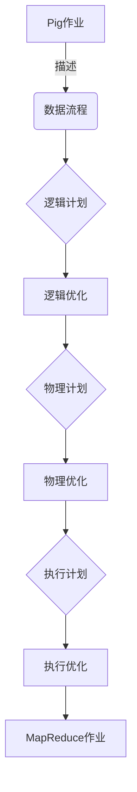

好的,我会按照要求认真撰写这篇文章。以下是《Pig优化策略原理与代码实例讲解》的正文内容:

# Pig优化策略原理与代码实例讲解

## 1. 背景介绍

### 1.1 问题的由来

在大数据时代,海量数据的存储和处理成为了一个巨大的挑战。Apache Pig作为一种高级数据流语言,被广泛应用于大数据处理领域,它能够简化复杂的MapReduce任务,提高开发效率。然而,随着数据量的不断增长和分析需求的日益复杂,Pig作业的执行效率成为制约性能的关键因素。因此,优化Pig作业的执行策略对于提升系统吞吐量和降低资源消耗至关重要。

### 1.2 研究现状  

目前,Pig社区和研究人员已经提出了多种优化策略,包括逻辑层优化、物理层优化和执行层优化等。逻辑层优化主要包括代数重写、投影剪枝、Filter向前传递等;物理层优化包括基于代价模型的关联顺序优化、采样优化、分区连接等;执行层优化则涉及任务并行度调整、数据局部性优化等。这些优化策略从不同角度对Pig作业进行了优化,取得了不同程度的效果提升。

### 1.3 研究意义

然而,现有的优化策略还存在一些不足之处:

1. 缺乏整体系统性,优化策略相对分散。
2. 优化效果受数据特征和作业模式的影响较大,通用性不足。  
3. 缺乏对优化策略之间相互影响的深入研究。

因此,有必要对现有优化策略进行系统性总结,分析其适用场景,探讨优化策略之间的协同机制,并结合新的优化思路,构建一套更加全面高效的Pig优化策略体系。

### 1.4 本文结构

本文首先介绍Pig的核心概念和原理,然后重点阐述几种核心优化策略的原理、实现步骤和数学模型,并通过实例代码讲解其具体应用。接下来探讨这些优化策略在不同应用场景下的效果,给出相关工具和学习资源推荐。最后总结优化策略的发展趋势和面临的挑战。

## 2. 核心概念与联系



Pig作业本质上是一个数据流程的描述,Pig会将其转化为逻辑计划,经过一系列逻辑优化得到物理计划,再进行物理优化生成执行计划,最终在执行层进行优化后翻译为MapReduce作业在Hadoop集群上运行。

Pig中的主要概念包括:

- **Relation(关系)**: 数据集合,类似关系数据库中的表
- **Alias(别名)**: 对Relation的命名
- **Field(字段)**: 元组中的单个数据项
- **Bag(背包)**: 元组的集合
- **Tuple(元组)**: 有序的字段集合
- **Operation(操作)**: 对数据进行转换和处理的操作符

Pig通过组合这些概念构建数据流程,并提供了丰富的操作符,如LOAD、FILTER、JOIN、GROUP、FOREACH等,支持大多数常见的数据处理需求。

## 3. 核心算法原理 & 具体操作步骤  

### 3.1 算法原理概述

Pig的优化策略主要包括三个层次:逻辑层优化、物理层优化和执行层优化。

**逻辑层优化**主要利用代数重写规则对逻辑计划进行等价变换,目的是生成更优的逻辑计划。常见的逻辑优化有:

1. 投影剪枝(Projection Pruning)
2. 推导过滤(Pushdown Filter)
3. 代数重写(Algebraic Rewrite)

**物理层优化**则是根据代价模型选择最优的物理执行计划,包括:

1. 基于代价的关联顺序优化
2. 采样优化
3. 分区连接优化

**执行层优化**主要解决作业在实际执行过程中的一些问题,如:

1. 任务并行度调整
2. 数据局部性优化
3. 动态优化调整

### 3.2 算法步骤详解

#### 3.2.1 逻辑层优化

##### 投影剪枝

投影剪枝的目的是尽可能减少中间数据的字段数,降低数据传输和存储开销。其基本思路是:

1. 分析作业的数据流,找到每个操作实际需要的字段
2. 在LOAD和FOREACH等操作中插入投影转换(PROJECT),只保留需要的字段
3. 在JOIN等操作的输入端插入投影,减少不需要的字段

例如对于作业:

```pig
A = LOAD 'data' AS (x:int, y:int, z:int);
B = FILTER A BY x > 10;
C = GROUP B BY y;
```

投影剪枝后的作业为:

```pig 
A = LOAD 'data' AS (x:int, y:int, z:int);
A1 = FOREACH A GENERATE x, y; # 只保留x,y字段
B = FILTER A1 BY x > 10;  
B1 = FOREACH B GENERATE y; # 只保留y字段
C = GROUP B1 BY y;
```

##### 推导过滤

推导过滤的目的是尽可能将FILTER操作向前推导,以减少不必要的数据处理。基本步骤为:

1. 分析FILTER条件,找到可以向前推导的部分
2. 将FILTER拆分,并插入到相应的位置

例如对于作业:

```pig
A = LOAD 'data1' AS (x, y);
B = LOAD 'data2' AS (x, z);
C = JOIN A BY x, B BY x;
D = FILTER C BY y > 10 AND z > 20;
```

经过推导过滤优化后:

```pig
A = LOAD 'data1' AS (x, y); 
A1 = FILTER A BY y > 10;  # 提前过滤
B = LOAD 'data2' AS (x, z);
B1 = FILTER B BY z > 20;  # 提前过滤
C = JOIN A1 BY x, B1 BY x;
D = C;
```

##### 代数重写

代数重写利用代数等式对逻辑计划进行等价变换,目的是生成更优的执行计划。常见的代数重写规则有:

- 合并连续的FILTER: `FILTER(FILTER(X))` => `FILTER(X)`
- FILTER和FOREACH交换: `FOREACH(FILTER(X))` => `FILTER(FOREACH(X))`
- DISTINCT和FOREACH结合: `DISTINCT(FOREACH(X))` => `FOREACH(DISTINCT(X))`
- 等等

#### 3.2.2 物理层优化 

##### 基于代价的关联顺序优化

关联顺序优化的目的是找到代价最小的连接顺序。Pig采用动态规划算法和代价模型进行优化。

1. 构建连接计划搜索空间,即所有可能的连接顺序
2. 计算每个连接计划的代价,选择代价最小的计划
3. 代价模型主要考虑数据量、数据分布、连接类型等因素

例如对于查询:

```sql
SELECT *
FROM A JOIN B ON A.x = B.x
        JOIN C ON A.y = C.y
        JOIN D ON B.z = D.z;
```

可能的连接顺序有:

```
(A⋈B)⋈(C⋈D)
(A⋈C)⋈(B⋈D)
(A⋈(B⋈C))⋈D
(A⋈(B⋈D))⋈C
...
```

优化器将计算每个顺序的代价,选择代价最小的作为最终执行计划。

##### 采样优化

采样优化的目的是通过对输入数据进行采样,估算数据的基本统计信息,为其他优化策略提供依据。

1. 在作业开始时,对输入数据进行采样
2. 计算采样数据的基本统计信息,如数据量、数值分布、重复值比例等
3. 优化器利用这些统计信息,为其他优化策略提供参数输入

例如,采样优化可以为基于代价的关联顺序优化提供更准确的数据量和数据分布估计。

##### 分区连接优化

分区连接优化的目的是将连接操作转化为多个分区内连接和少量分区间连接,以提高连接效率。

1. 根据连接键对输入数据进行分区
2. 在每个分区内执行连接操作
3. 对分区间的数据执行连接操作

分区连接优化可以减少需要参与连接的数据量,提高连接效率。但同时也会增加分区的开销,需要权衡利弊。

#### 3.2.3 执行层优化

##### 任务并行度调整

Pig作业会被翻译为多个MapReduce任务在集群上并行执行。任务并行度是指同时运行的任务数量,过高或过低都会影响性能。

1. 估算作业的总计算量和可用资源
2. 根据计算量和资源情况,动态调整任务并行度
3. 监控作业执行过程,根据反馈动态调整并行度

合理的并行度设置可以更好地利用集群资源,提高资源利用率和吞吐量。

##### 数据局部性优化

数据局部性优化的目的是尽量减少数据的网络传输,提高处理效率。

1. 分析作业的数据流向,找到热点数据
2. 尽量将计算任务调度到热点数据所在节点
3. 对于无法本地化的数据,减少网络传输次数

例如,对于包含多次扫描相同输入文件的作业,可以将这些扫描合并为一个MapReduce作业,只扫描一次输入文件,避免重复的数据传输。

##### 动态优化调整

动态优化调整是在作业执行过程中,根据实时反馈动态调整执行计划。

1. 在作业执行时收集统计信息,包括数据量、数据分布等
2. 根据实时统计信息,评估当前执行计划的效率
3. 如果效率较低,动态重新优化生成新的执行计划

动态优化可以弥补静态优化时缺乏准确信息而导致的不足,提高优化效果。但同时也会增加运行时开销。

### 3.3 算法优缺点

Pig优化策略的主要优点是:

1. 能够有效提升Pig作业的执行效率
2. 涵盖了逻辑、物理和执行多个层面的优化
3. 优化策略相对成熟,在生产环境中广泛使用

主要缺点是:

1. 优化效果依赖于数据特征和作业模式,通用性不足
2. 优化策略相对分散,缺乏系统性
3. 动态优化会增加一定的运行时开销

### 3.4 算法应用领域

Pig优化策略主要应用于以下几个领域:

1. **大数据分析**: 作为大数据处理的重要工具,Pig优化对提高大数据分析效率至关重要
2. **数据ETL**: Pig常用于构建数据ETL(提取、转换、加载)流程,优化可以提高ETL效率
3. **数据探索**: 在数据探索和原型验证阶段,高效的Pig作业可以加快迭代速度
4. **机器学习&数据挖掘**: 作为数据处理的前置环节,高效的Pig作业可以为后续算法提供高质量的数据输入

## 4. 数学模型和公式 & 详细讲解 & 举例说明

### 4.1 数学模型构建

在优化过程中,通常需要构建代价模型对不同执行计划进行评估。Pig中常用的代价模型主要包括:

1. **数据传输代价模型**
2. **CPU计算代价模型**
3. **I/O代价模型**

#### 数据传输代价模型

数据传输代价模型用于估算作业中的网络数据传输代价。

设作业的输入数据集为$R$,经过一系列操作$\theta$得到输出数据集$S$,传输代价可以表示为:

$$
\begin{aligned}
\text{TransferCost}(R, \theta, S) &= \sum_{i=1}^{n}\text{Transfer}(R_i, \theta_i, S_i) \\
&= \sum_{i=1}^{n}\left(\text