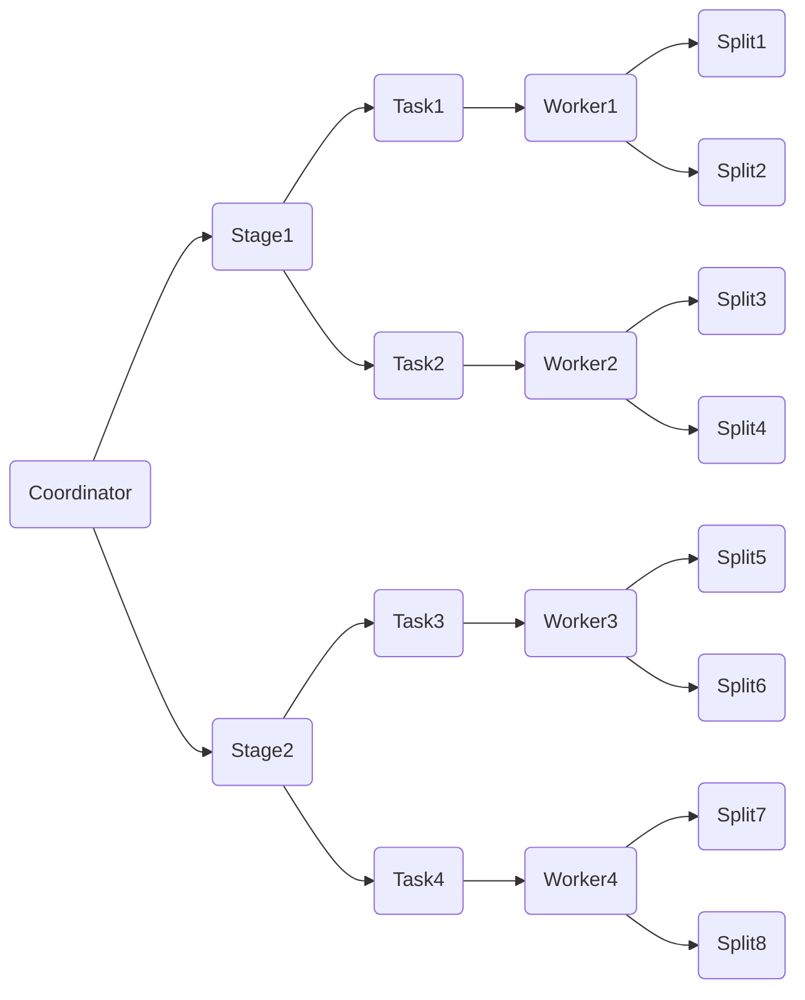

# Presto原理与代码实例讲解

## 1. 背景介绍
### 1.1  问题的由来
随着大数据时代的到来,企业面临着海量数据处理和实时分析的挑战。传统的数据仓库和 OLAP 系统难以满足快速增长的数据量和复杂的分析需求。为了应对这一挑战,Facebook 在2012年开源了 Presto,一个用于大规模数据分析的分布式 SQL 查询引擎。
### 1.2  研究现状 
Presto 自开源以来得到了广泛的关注和应用。众多互联网公司如 Airbnb、Netflix、优步等都在生产环境中大规模使用 Presto。学术界对 Presto 的研究主要集中在查询优化、执行引擎、连接器等方面,取得了一些研究成果。但总体而言,对 Presto 内部实现原理的系统性分析还比较欠缺。
### 1.3  研究意义
深入剖析 Presto 的实现原理,对于理解现代化的分布式查询引擎有重要意义。一方面可以学习 Presto 在查询解析、执行计划生成、任务调度等方面的优秀设计;另一方面也可以洞察 Presto 查询引擎的性能瓶颈,为进一步优化和改进提供思路。
### 1.4  本文结构
本文将从以下几个方面对 Presto 展开深入的分析:

1. Presto 的核心概念与内部组件间的联系
2. Presto 查询引擎的关键算法原理与具体实现步骤
3. Presto 涉及的核心数据结构与算法的数学模型和公式推导
4. Presto 源码实例剖析,结合代码讲解内部实现细节 
5. Presto 的实际应用场景及其带来的价值
6. Presto 学习和应用过程中的工具和资源推荐
7. Presto 技术的未来发展趋势和面临的挑战
8. 常见问题解答

## 2. 核心概念与联系

在深入分析 Presto 的内部原理之前,我们先来了解一下 Presto 的几个核心概念:

- Coordinator:负责接收客户端的查询请求,解析 SQL 生成执行计划,协调任务的调度执行。
- Worker:负责执行实际的查询任务,从数据源读取数据并执行计算。
- Stage:代表查询计划中的一个执行阶段,包含一组可并行执行的任务。
- Task:代表 Stage 中一个原子的工作单元,在一个 Worker 节点上执行。
- Split:代表数据源的一个逻辑分片,一个 Task 会处理一个或多个 Split。
- Connector:连接器,用于 Presto 接入不同的数据源,如 Hive、MySQL 等。
- Exchange:用于在 Stage 之间传输数据,支持 Broadcast Join、Repartition 等。

下图展示了 Presto 核心组件之间的关系:



从图中可以看出,Coordinator 负责生成查询计划和调度任务,并将任务下发到 Worker 执行。每个 Worker 通过 Connector 读取数据源的 Split 并执行计算。Stage 之间通过 Exchange 传输数据,最终由 Coordinator 收集结果并返回给客户端。

## 3. 核心算法原理 & 具体操作步骤
### 3.1  算法原理概述
Presto 的查询引擎采用了 MPP(大规模并行处理)架构,整个查询执行过程被划分为多个 Stage,每个 Stage 包含多个可并行的 Task,调度器会将 Task 动态分配到不同的 Worker 节点执行。

为了提高查询的并行度和执行效率,Presto 在关系型算子(如 Join、Aggregation)的实现上大量采用了 Hash 分区的思想。即将数据按照 Hash 值切分到不同的 Task 上进行计算,避免数据倾斜,充分利用分布式环境的并行计算能力。
### 3.2  算法步骤详解
下面我们以一个简单的 Join 查询为例,详细分析 Presto 的查询执行步骤:

1. SQL 解析:Coordinator 收到用户提交的 SQL 后,调用 SQL Parser 进行词法和语法解析,生成抽象语法树 AST。

2. 语义分析:在 AST 上进行语义分析,检查表名、字段名是否合法,解析表达式类型等,生成语义分析后的查询树。

3. 逻辑计划生成:遍历查询树,生成初始的逻辑执行计划。主要完成投影裁剪、谓词下推、Join 顺序优化等逻辑优化。

4. 物理计划生成:将逻辑计划转换成物理执行计划,引入具体的物理算子如 TableScan、Exchange、HashJoin 等。

5. Stage 划分:根据查询计划中 Exchange 算子的边界,将物理计划划分为多个 Stage,每个 Stage 代表一个独立的执行阶段。

6. Task 生成:对于每个 Stage,根据数据源的 Split 信息生成多个可并行的 Task,每个 Task 负责处理部分数据。

7. 任务调度:Coordinator 将 Task 调度到各个 Worker 节点执行,并监控执行状态。

8. 算子执行:Worker 收到 Task 后,开始执行算子流水线。对于 Join 算子,常见的执行过程如下:
   - Build 端 Task 读取本地 Split 数据并构建 Hash 表
   - Probe 端 Task 读取本地 Split 数据,并根据 Join Key 探测 Hash 表,输出 Join 结果
   - 如果 Join 两端数据分布在不同节点,需要先通过 Exchange 算子进行数据重分布

9. 结果归并:每个 Worker 将 Task 的执行结果返回给 Coordinator,Coordinator 对结果进行归并后输出给客户端。

### 3.3  算法优缺点

Presto 的 MPP 架构和以 Hash 分区为核心的执行算法有如下优点:

- 通过 Stage 划分和 Task 并行,充分利用分布式集群的计算资源,加速查询执行
- 采用 Hash 分区处理数据倾斜,避免个别 Task 执行时间过长而影响整体性能
- Coordinator 只参与调度,不处理数据,避免单点瓶颈

同时也存在一些问题:

- 复杂 Join(如 Cross Join)会产生大量的中间数据,占用大量内存
- 频繁的数据重分布(Exchange)会带来较大的网络开销
- 缺乏数据本地性优化,容易产生不必要的网络传输

### 3.4  算法应用领域

Presto 基于 MPP 和 Hash 分区的分布式查询引擎在很多领域得到了广泛应用,如:

- 互联网广告分析:通过 Presto 对广告投放日志进行 OLAP 分析,挖掘广告的点击、转化等指标
- 电商用户行为分析:通过 Presto 对电商网站的用户行为日志(如浏览、收藏、下单)进行多维度分析,为营销决策提供支持
- 金融风控:通过 Presto 对交易数据、用户信息等进行联合分析,构建金融风控模型

Presto 在这些场景中能发挥大数据分析的优势,实现复杂 OLAP 查询的亚秒级响应。

## 4. 数学模型和公式 & 详细讲解 & 举例说明
### 4.1  数学模型构建
Presto 的查询优化器需要对 SQL 查询进行等价变换和代价估算,这离不开相关的数学模型支撑。下面我们对 Presto 常见的几个数学模型进行介绍。

#### 4.1.1 关系代数模型

关系代数是关系型数据库的理论基础,Presto 同样利用关系代数进行查询优化。一个查询可以表示为一颗关系代数表达式树,通过应用等价变换规则,我们可以得到语义相同但执行代价更低的查询计划。

常见的关系代数算子包括:

- Selection($\sigma$):选择满足条件的行
- Projection($\Pi$):选择表中的列子集
- Join($\bowtie$):连接两个关系
- Aggregation($\gamma$):分组聚合

#### 4.1.2 数据统计模型

为了进行更精准的代价估算,Presto 需要维护数据源的统计信息,如表的行数、列的唯一值数目(Distinct)等。

假设关系 R 有 N 条记录,属性 A 有 V 个不同的值,我们通过下面的公式可以估算属性 A 上的选择率:

$Selectivity(A) = \frac{1}{V}$

这意味着对属性 A 进行等值过滤时,过滤后的结果集大小为:

$Size(σ_{A=c}(R)) = N * Selectivity(A) = \frac{N}{V}$

### 4.2  公式推导过程

下面我们推导一下 Presto 中 Join 算子的代价估算公式。

假设有两个关系 R 和 S,大小分别为 $N_R$ 和 $N_S$,要对两个关系在属性 A 上做 Join,属性 A 在关系 R 和 S 上的唯一值数目为 $V_R$ 和 $V_S$。我们可以估算 Join 后结果集的大小:

$Size(R\bowtie_{A} S) = \frac{N_R * N_S}{max(V_R, V_S)}$

这个公式的推导过程如下:

1. 如果 $V_R = V_S$,那么 Join 结果的行数就是笛卡尔积除以 V,即 $\frac{N_R * N_S}{V}$。

2. 如果 $V_R < V_S$,那么实际上 Join 时 R 中的每一行最多匹配 S 中的 $\frac{N_S}{V_S}$ 行,所以 Join 结果的行数为 $N_R * \frac{N_S}{V_S} = \frac{N_R * N_S}{V_S}$。

3. 同理,如果 $V_R > V_S$,Join 结果的行数为 $\frac{N_R * N_S}{V_R}$。

4. 综合 2 和 3,可以得到 Join 结果行数的公式为 $\frac{N_R * N_S}{max(V_R, V_S)}$。

### 4.3  案例分析与讲解

我们用一个实际的例子来说明如何应用上述公式。假设有两张表,订单表 Orders 和用户表 Users,它们在 user_id 属性上连接:

```sql
SELECT * 
FROM Orders o
JOIN Users u ON o.user_id = u.user_id
```

已知:
- Orders 表有 1 亿行,user_id 有 500 万个唯一值
- Users 表有 2000 万行,user_id 有 1000 万个唯一值

根据上面的公式,我们可以估算 Join 结果集的大小为:

$Size = \frac{10^8 * 2*10^7}{max(5*10^6, 10^7)} = \frac{2*10^{15}}{10^7} = 2*10^8$ 

即 Join 后的结果集约有 2 亿行。这个信息可以帮助 Presto 选择合适的 Join 算法,如果预估结果集较小则用 Broadcast Join,否则用 Partitioned Join。

### 4.4  常见问题解答

问题1:Presto 如何选择 Join 的顺序?

答:Presto 采用动态规划算法来选择代价最小的 Join 顺序。对于 n 个表的 Join,Presto 会枚举所有可能的 Join 顺序(即 Join 树),对每个 Join 树自底向上估算中间结果集大小和代价,最终选择代价最小的 Join 树作为最优计划。

问题2:什么是数据倾斜,Presto 如何处理?

答:数据倾斜指的是 Join 或 Aggregation 的 Key 