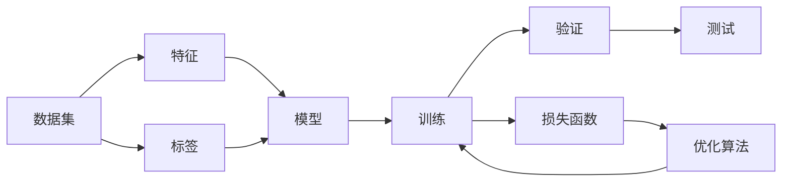

# Python机器学习实战：从零开始构建机器学习环境

## 1. 背景介绍

### 1.1 问题的由来
机器学习近年来在各个领域取得了巨大的成功,从图像识别、语音识别到自然语言处理,机器学习算法正在深刻地改变着我们的生活。然而,对于很多初学者来说,机器学习似乎是一个难以进入的领域。搭建机器学习环境、理解算法原理、编写代码实现,每一步都充满了挑战。本文旨在帮助初学者从零开始,一步步构建起自己的机器学习开发环境,并通过实战项目来理解和掌握机器学习的核心概念和算法。

### 1.2 研究现状
目前市面上有很多优秀的机器学习教程和书籍,但大多偏重理论知识的讲解,对于如何从零开始搭建开发环境、动手实践的讲解相对较少。初学者在学习过程中往往会遇到环境配置困难、代码无从下手等问题,导致学习进度缓慢,难以取得实质性进展。因此,一套完整的从环境搭建到项目实战的教程,对于机器学习初学者来说是非常必要的。

### 1.3 研究意义
本文的意义在于:
1. 帮助初学者快速搭建机器学习开发环境,减少环境配置上的困难,为后续学习扫清障碍。
2. 通过实战项目驱动学习,让初学者在动手实践中加深对算法原理的理解,提高编码能力。  
3. 介绍主流的机器学习工具和资源,方便初学者进一步学习和研究。
4. 总结机器学习的发展趋势和面临的挑战,让初学者对该领域有一个整体的认识。

### 1.4 本文结构
全文分为9个章节:
第1章介绍研究背景、意义及文章结构;
第2章介绍机器学习的核心概念;  
第3章讲解机器学习的主要算法原理;
第4章介绍相关数学知识;
第5章从零开始搭建开发环境并进行项目实战;
第6章总结机器学习的应用场景;
第7章推荐相关工具和学习资源;
第8章总结全文并展望未来;
第9章为附录,解答一些常见问题。

## 2. 核心概念与联系

机器学习的目标是让计算机系统从数据中自动分析获得规律,并利用规律对未知数据进行预测。核心概念包括:

- 数据集(Dataset):训练机器学习模型所用的数据。
- 特征(Feature):数据集中每个样本的属性。
- 标签(Label):训练数据中每个样本的目标值。
- 模型(Model):基于训练数据学习得到的映射函数。
- 训练(Training):利用训练数据集优化模型参数的过程。
- 验证(Validation):用验证集评估不同模型的性能。
- 测试(Testing):用测试集评估训练好的模型泛化能力。
- 损失函数(Loss Function):衡量模型预测值与真实值之间差异的函数。
- 优化算法(Optimization):通过最小化损失函数来调整模型参数。

这些概念环环相扣,在实际的机器学习项目中都会涉及。下图展示了它们之间的关系:

理解这些概念之间的联系,是成功应用机器学习算法的基础。

## 3. 核心算法原理 & 具体操作步骤

### 3.1 算法原理概述
机器学习算法按照训练方式可以分为:

- 监督学习(Supervised Learning):训练数据带有标签,算法学习特征到标签的映射。代表算法有线性回归、逻辑回归、决策树、支持向量机等。
- 无监督学习(Unsupervised Learning):训练数据没有标签,算法从数据本身学习数据的内在结构和关系。代表算法有聚类、降维等。
- 强化学习(Reinforcement Learning):智能体(Agent)在环境中学习,根据环境的反馈(奖励)不断调整策略,最大化长期累积奖励。代表算法有Q学习、策略梯度等。

本文重点介绍监督学习中的分类和回归任务,以及如何用Scikit-learn库来实现相关算法。

### 3.2 算法步骤详解
以下以线性回归为例,详细讲解监督学习算法的一般步骤。

输入:训练样本集$D=\{(x_1,y_1),(x_2,y_2),...,(x_N,y_N)\}$,其中$x_i\in \mathbf{R}^n$为第$i$个样本的特征向量,$y_i\in \mathbf{R}$为相应的标签值,$N$为样本总数。

输出:学得的线性回归模型$\hat{y}=f(x)=\mathbf{w}^T\mathbf{x}+b$。

算法步骤:
1. 选择模型:这里选择线性模型$f(x)=\mathbf{w}^T\mathbf{x}+b$,其中$\mathbf{w}=(w_1;w_2;...;w_n)$为模型参数,$b$为偏置项。
2. 定义损失函数:常用的是均方误差(MSE)损失:$J(\mathbf{w},b)=\frac{1}{N}\sum_{i=1}^N(f(x_i)-y_i)^2$。
3. 选择优化算法:这里使用梯度下降法。参数$\mathbf{w}$和$b$的更新公式为:
$$
\begin{aligned}
w_j &:= w_j - \alpha \frac{\partial}{\partial w_j}J(\mathbf{w},b) \\
b &:= b - \alpha \frac{\partial}{\partial b}J(\mathbf{w},b)
\end{aligned}
$$
其中$\alpha$为学习率。
4. 训练模型:在训练集上迭代执行梯度下降,直到损失函数收敛或达到预设的迭代次数。
5. 测试模型:在测试集上评估模型的泛化性能,常用的指标有均方误差、平均绝对误差等。

以上是线性回归的一般步骤,对于其他算法如逻辑回归、决策树等,步骤大同小异,主要区别在于模型的定义、损失函数的选择以及优化算法的不同。

### 3.3 算法优缺点
线性回归的优点是:
- 模型简单,易于理解和实现。
- 训练速度快,计算开销小。
- 适用于特征与标签呈线性关系的场景。

缺点是:
- 难以拟合非线性数据。
- 对异常值敏感。
- 易受多重共线性影响。

总的来说,线性回归适用于快速建立基准模型,或者用于特征与标签的线性关系较强的场景。对于非线性数据,可以考虑使用多项式回归、决策树、神经网络等更复杂的模型。

### 3.4 算法应用领域
线性回归在很多领域都有应用,比如:
- 预测房价、销量等连续型变量。
- 分析各个特征对结果的影响。
- 用于数据降维,如主成分回归。

除了线性回归,本章将介绍的其他算法如逻辑回归、决策树、支持向量机,也都有广泛的应用,如逻辑回归常用于广告点击预测、疾病诊断等二分类任务;决策树可用于金融风控、用户分群等;支持向量机常用于文本分类、人脸识别等。

## 4. 数学模型和公式 & 详细讲解 & 举例说明

### 4.1 数学模型构建
以多元线性回归为例,我们详细讲解其数学模型的构建过程。假设有$n$个特征变量$x_1,x_2,...,x_n$和一个目标变量$y$,多元线性回归模型可以表示为:

$$y=w_0+w_1x_1+w_2x_2+...+w_nx_n+\epsilon$$

其中$w_0,w_1,...,w_n$为模型参数,$\epsilon$为误差项,服从均值为0的正态分布。

用矩阵形式表示为:

$$\mathbf{y}=\mathbf{X}\mathbf{w}+\mathbf{\epsilon}$$

其中

$$
\mathbf{y}=\begin{bmatrix}
y_1 \\ y_2 \\ \vdots \\ y_m
\end{bmatrix},
\mathbf{X}=\begin{bmatrix}
1 & x_{11} & \dots & x_{1n}\\
1 & x_{21} & \dots & x_{2n}\\
\vdots & \vdots & \ddots & \vdots\\
1 & x_{m1} & \dots & x_{mn}
\end{bmatrix},
\mathbf{w}=\begin{bmatrix}
w_0 \\ w_1 \\ \vdots \\ w_n
\end{bmatrix},
\mathbf{\epsilon}=\begin{bmatrix}
\epsilon_1 \\ \epsilon_2 \\ \vdots \\ \epsilon_m
\end{bmatrix}
$$

其中$m$为样本数。这就是多元线性回归的数学模型。

### 4.2 公式推导过程
对于多元线性回归,我们希望找到一组参数$\mathbf{w}$,使得预测值$\mathbf{X}\mathbf{w}$与真实值$\mathbf{y}$尽可能接近。用均方误差(MSE)来衡量二者的差异:

$$J(\mathbf{w})=\frac{1}{m}\sum_{i=1}^m(y_i-\mathbf{x}_i^T\mathbf{w})^2=\frac{1}{m}||\mathbf{y}-\mathbf{X}\mathbf{w}||_2^2$$

为了让损失最小化,对$J(\mathbf{w})$求导并令其等于0:

$$\frac{\partial J}{\partial \mathbf{w}}=\frac{2}{m}\mathbf{X}^T(\mathbf{X}\mathbf{w}-\mathbf{y})=0$$

移项可得:

$$\mathbf{X}^T\mathbf{X}\mathbf{w}=\mathbf{X}^T\mathbf{y}$$

假设$\mathbf{X}^T\mathbf{X}$可逆,两边同时左乘$(\mathbf{X}^T\mathbf{X})^{-1}$,得到:

$$\mathbf{w}=(\mathbf{X}^T\mathbf{X})^{-1}\mathbf{X}^T\mathbf{y}$$

这就是多元线性回归的最小二乘解。

### 4.3 案例分析与讲解
我们用一个简单的例子来说明多元线性回归的用法。假设要根据房屋的面积(area)和房龄(age)来预测房价(price),已知4个样本数据:

面积(平米) | 房龄(年) | 房价(万元) 
:-:|:-:|:-:
100 | 5 | 300
120 | 3 | 400
80 | 10 | 250
90 | 8 | 280

根据这4个样本,我们建立多元线性回归模型:

$$price=w_0+w_1\cdot area+w_2\cdot age$$

写成矩阵形式:

$$
\begin{bmatrix}
300\\400\\250\\280 
\end{bmatrix}=
\begin{bmatrix}
1 & 100 & 5\\ 
1 & 120 & 3\\
1 & 80 & 10\\
1 & 90 & 8
\end{bmatrix}
\begin{bmatrix}
w_0\\w_1\\w_2
\end{bmatrix}+
\begin{bmatrix}
\epsilon_1\\\epsilon_2\\\epsilon_3\\\epsilon_4
\end{bmatrix}
$$

代入公式$\mathbf{w}=(\mathbf{X}^T\mathbf{X})^{-1}\mathbf{X}^T\mathbf{y}$,可以算出:

$$
\mathbf{w}=
\begin{bmatrix}
w_0\\w_1\\w_2
\end{bmatrix}=
\begin{bmatrix}
162.34\\3.31\\-12.31
\end{bmatrix}
$$

因此,预测房价的模型为:

$$price=162.34+3.31\cdot area-12.31\cdot age$$

这个模型可以用来预测新房屋的价格。比如,一个面积为110平米、房龄为4年的房子,预测价格为:

$$price=162.34+3.31\c