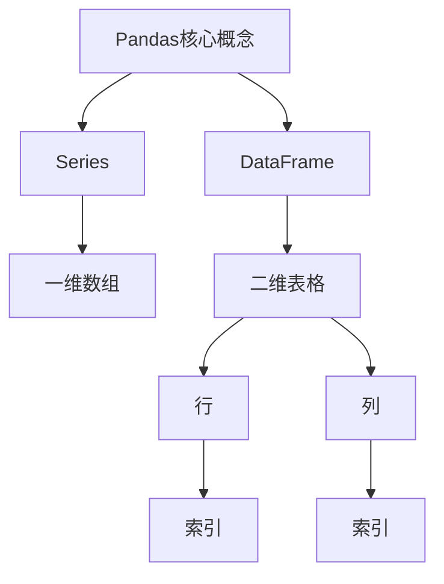
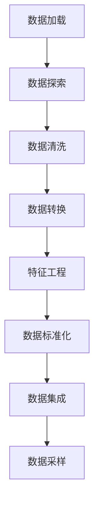

# Python机器学习实战：使用Pandas进行数据预处理与分析

## 1. 背景介绍

### 1.1 问题的由来

在当今数据时代，海量数据的产生使得数据分析和机器学习成为了炙手可热的领域。然而,在开始构建机器学习模型之前,我们首先需要对原始数据进行预处理和清洗,以确保数据的质量和完整性。这个过程通常被称为数据预处理,它是机器学习项目中不可或缺的一个环节。

数据预处理的重要性不言而喻,因为原始数据通常存在着缺失值、异常值、噪声等问题,这些问题会严重影响机器学习模型的性能和准确性。此外,不同的机器学习算法对数据的格式和特征也有不同的要求,因此需要对数据进行适当的转换和处理。

### 1.2 研究现状

目前,Python生态系统中有许多优秀的数据分析库,如Pandas、Numpy、Scikit-learn等,它们为数据预处理提供了强大的功能支持。其中,Pandas库以其高效、灵活的数据结构和丰富的数据操作函数而备受推崇,成为了Python数据分析领域的事实标准。

然而,对于初学者而言,Pandas库的使用往往存在一定的学习曲线。如何高效地利用Pandas进行数据预处理和清洗,并为后续的机器学习模型奠定良好的基础,是一个值得探讨的重要课题。

### 1.3 研究意义

本文旨在深入探讨如何使用Pandas库进行数据预处理和分析,为机器学习项目的成功奠定坚实的基础。通过详细介绍Pandas的核心概念、数据结构、常用函数和实际案例,读者将能够掌握数据预处理的基本技能,并了解如何利用Pandas库高效地处理各种类型的数据。

此外,本文还将探讨数据预处理在机器学习中的重要性,以及如何根据不同的机器学习算法和任务需求选择合适的预处理技术。通过理论与实践的结合,读者将能够全面地了解数据预处理的核心原理和实践技巧。

### 1.4 本文结构

本文将分为以下几个部分:

1. 背景介绍
2. Pandas核心概念与数据结构
3. 数据加载与探索
4. 数据清洗与转换
5. 数据缺失值处理
6. 特征工程
7. 数据标准化与归一化
8. 数据集成与采样
9. 项目实践:使用Pandas进行数据预处理
10. 总结与展望

## 2. 核心概念与联系

在开始探讨Pandas库的具体应用之前,我们需要先了解一些核心概念和数据结构,以便更好地理解和运用Pandas进行数据预处理和分析。



### 2.1 Series

Series是Pandas中的一维数组对象,它类似于Python中的列表或NumPy中的一维数组,但是具有更强大的功能和更高的性能。Series可以存储任何数据类型,包括整数、浮点数、字符串等,并且每个元素都有一个关联的索引标签。

```python
import pandas as pd

# 创建一个Series
s = pd.Series([1, 2, 3, 4], index=['a', 'b', 'c', 'd'])
print(s)
# 输出:
# a    1
# b    2
# c    3
# d    4
# dtype: int64
```

### 2.2 DataFrame

DataFrame是Pandas中的二维表格对象,它类似于Excel中的工作表或SQL中的表格,由行和列组成。每一行代表一个观测值或实例,每一列代表一个特征或变量。DataFrame可以存储不同数据类型的列,并且每一列都有一个关联的列名。

```python
import pandas as pd

# 创建一个DataFrame
data = {'Name': ['Alice', 'Bob', 'Charlie'],
        'Age': [25, 30, 35],
        'City': ['New York', 'London', 'Paris']}
df = pd.DataFrame(data)
print(df)
# 输出:
#    Name  Age     City
# 0  Alice   25  New York
# 1    Bob   30    London
# 2  Charlie   35    Paris
```

DataFrame是Pandas中最重要的数据结构,它提供了丰富的数据操作和分析功能,包括数据选择、过滤、排序、聚合等,是进行数据预处理和分析的核心工具。

## 3. 核心算法原理 & 具体操作步骤

在使用Pandas进行数据预处理时,我们通常需要执行以下几个核心步骤:



### 3.1 算法原理概述

数据预处理是一个迭代的过程,它涉及多个步骤,包括数据加载、探索、清洗、转换、特征工程、标准化、集成和采样等。每个步骤都有其特定的目的和算法原理,共同确保数据的质量和适用性。

1. **数据加载**: 将原始数据从各种来源(如CSV文件、数据库、API等)加载到Pandas的数据结构中,为后续操作做准备。
2. **数据探索**: 通过可视化和统计分析等方式,了解数据的基本特征、分布情况和潜在问题,为后续的清洗和转换提供依据。
3. **数据清洗**: 处理缺失值、异常值、重复值和噪声等数据质量问题,确保数据的完整性和一致性。
4. **数据转换**: 根据特定的机器学习算法和任务需求,对数据进行适当的转换和编码,如类别编码、特征缩放等。
5. **特征工程**: 从原始数据中提取、构建和选择有意义的特征,以提高机器学习模型的性能。
6. **数据标准化**: 将数据转换到相同的尺度或范围,以消除不同特征之间的量级差异,提高模型的收敛速度和稳定性。
7. **数据集成**: 将来自多个数据源的数据集合并,形成一个统一的数据集,以捕获更多的信息和模式。
8. **数据采样**: 从原始数据集中抽取一个代表性的子集,用于训练或测试机器学习模型,以提高计算效率和模型性能。

### 3.2 算法步骤详解

接下来,我们将详细介绍每个步骤的具体操作步骤和相关Pandas函数。

#### 3.2.1 数据加载

Pandas提供了多种方式从不同来源加载数据,如CSV文件、Excel文件、数据库等。以CSV文件为例:

```python
import pandas as pd

# 从CSV文件加载数据
df = pd.read_csv('data.csv')
```

#### 3.2.2 数据探索

探索数据的基本特征和分布情况,可以使用以下函数:

```python
# 查看前几行数据
print(df.head())

# 查看数据基本统计信息
print(df.describe())

# 查看缺失值情况
print(df.isnull().sum())

# 绘制直方图或散点图等可视化图形
df.plot(kind='hist', subplots=True)
```

#### 3.2.3 数据清洗

清洗数据的常见操作包括处理缺失值、异常值和重复值等。

```python
# 删除包含缺失值的行
df = df.dropna()

# 填充缺失值
df = df.fillna(df.mean())

# 删除异常值
df = df[(df['Age'] >= 18) & (df['Age'] <= 65)]

# 删除重复值
df = df.drop_duplicates()
```

#### 3.2.4 数据转换

根据不同的机器学习算法和任务需求,可能需要对数据进行适当的转换和编码。

```python
# 对类别特征进行编码
df['Gender'] = df['Gender'].map({'Male': 1, 'Female': 0})

# 对数据进行对数转换
df['Income'] = np.log(df['Income'])
```

#### 3.2.5 特征工程

从原始数据中提取、构建和选择有意义的特征,以提高机器学习模型的性能。

```python
# 从日期特征中提取年、月、日等信息
df['Year'] = pd.DatetimeIndex(df['Date']).year
df['Month'] = pd.DatetimeIndex(df['Date']).month
df['Day'] = pd.DatetimeIndex(df['Date']).day

# 构建新的特征
df['Age_Bucket'] = pd.cut(df['Age'], bins=[0, 18, 30, 65, 120], labels=['Child', 'Young', 'Adult', 'Elderly'])

# 选择重要特征
selected_features = ['Age', 'Income', 'Age_Bucket']
X = df[selected_features]
```

#### 3.2.6 数据标准化

标准化可以消除不同特征之间的量级差异,提高模型的收敛速度和稳定性。

```python
from sklearn.preprocessing import StandardScaler

# 标准化数据
scaler = StandardScaler()
X_scaled = scaler.fit_transform(X)
```

#### 3.2.7 数据集成

将来自多个数据源的数据集合并,形成一个统一的数据集。

```python
# 合并两个DataFrame
df_merged = pd.merge(df1, df2, on='common_column', how='inner')
```

#### 3.2.8 数据采样

从原始数据集中抽取一个代表性的子集,用于训练或测试机器学习模型。

```python
# 简单随机采样
sample = df.sample(frac=0.2, random_state=42)

# 分层采样
sample = df.groupby('Gender').apply(lambda x: x.sample(frac=0.2, random_state=42))
```

### 3.3 算法优缺点

使用Pandas进行数据预处理具有以下优点:

1. **功能丰富**: Pandas提供了丰富的数据操作和分析函数,可以高效地执行各种数据预处理任务。
2. **性能优异**: Pandas的数据结构和算法经过高度优化,在处理大型数据集时表现出色。
3. **易于集成**: Pandas可以与其他Python数据科学库(如NumPy、Scikit-learn等)无缝集成,构建完整的数据处理和机器学习流程。
4. **可读性强**: Pandas的代码风格清晰、简洁,易于阅读和维护。

然而,Pandas也存在一些缺点和限制:

1. **内存占用大**: Pandas在处理大型数据集时,可能会占用大量内存,导致性能下降或内存不足。
2. **并行计算能力有限**: Pandas目前对并行计算的支持还不够完善,在处理大型数据集时可能会遇到瓶颈。
3. **学习曲线陡峭**: Pandas的功能丰富,但也意味着需要花费一定的时间和精力来学习和掌握。

### 3.4 算法应用领域

数据预处理是机器学习项目中不可或缺的一个环节,因此使用Pandas进行数据预处理的应用领域非常广泛,包括但不限于:

1. **金融领域**: 处理金融交易数据、风险分析数据等。
2. **电子商务**: 处理用户行为数据、商品数据等。
3. **医疗健康**: 处理电子病历数据、基因组数据等。
4. **自然语言处理**: 处理文本数据、语料库数据等。
5. **计算机视觉**: 处理图像数据、视频数据等。
6. **推荐系统**: 处理用户偏好数据、商品特征数据等。
7. **网络安全**: 处理网络流量数据、日志数据等。

总的来说,只要涉及到数据处理和分析,Pandas都可以发挥重要作用,为机器学习模型的构建奠定坚实的基础。

## 4. 数学模型和公式 & 详细讲解 & 举例说明

在数据预处理过程中,我们经常需要使用一些数学模型和公式来描述和处理数据。本节将介绍一些常见的数学模型和公式,并详细讲解它们的原理和应用场景。

### 4.1 数学模型构建

#### 4.1.1 缺失值插补模型

缺失值插补是数据清洗中的一个重要步骤。常见的缺失值插补方法包括:

1. **均值插补**

$$\hat{