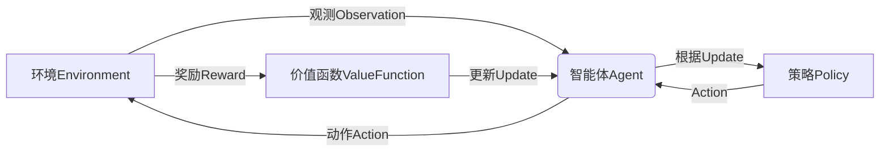

好的,我理解了您的要求。以下是标题为《Python机器学习实战:强化学习(Reinforcement Learning)基础介绍》的技术博客文章正文部分:

# Python机器学习实战:强化学习(Reinforcement Learning)基础介绍

## 1. 背景介绍

### 1.1 问题的由来

在传统的机器学习领域中,监督学习和无监督学习占据了主导地位。监督学习需要大量标注好的训练数据,而无监督学习则不需要标注数据,但通常难以解决复杂的决策序列问题。相比之下,强化学习(Reinforcement Learning)提供了一种全新的学习范式,它让智能体(Agent)通过与环境(Environment)的交互来学习,而不需要事先的训练数据。

强化学习的核心思想是让智能体通过试错来学习,并根据获得的奖励或惩罚来调整自身的行为策略,最终达到最优化的目标。这种学习方式非常类似于人类和动物的学习过程,具有广阔的应用前景,如机器人控制、游戏AI、资源调度优化等领域。

### 1.2 研究现状

强化学习理论最早可以追溯到20世纪50年代,当时它主要应用于有限状态空间的问题。20世纪90年代,结合时序差分技术的发展,强化学习开始应用于解决连续状态空间和动作空间的问题。近年来,伴随着深度学习的兴起,将深度神经网络引入强化学习算法中的深度强化学习(Deep Reinforcement Learning)成为研究热点,取得了令人瞩目的成就,如AlphaGo战胜人类顶尖棋手、OpenAI的人工智能系统在多款Atari游戏中超过人类水平等。

### 1.3 研究意义

强化学习为人工智能系统提供了一种全新的学习方式,使其能够在与环境的交互过程中自主获取经验并不断优化决策,这种学习能力对于解决复杂的序列决策问题至关重要。另一方面,强化学习算法与其他机器学习算法相比,具有以下优势:

- 无需事先的训练数据集,可以通过试错来学习
- 能够处理连续的状态空间和动作空间
- 具有很强的泛化能力,可以应用于各种不同的问题领域

因此,强化学习在人工智能、机器人、游戏AI、智能控制等诸多领域都有广阔的应用前景。

### 1.4 本文结构

本文将全面介绍强化学习的基础知识,内容安排如下:

- 第2部分阐述强化学习的核心概念及其与其他机器学习范式的关系
- 第3部分详细解析强化学习算法的原理及具体实现步骤
- 第4部分构建强化学习的数学模型,并推导相关公式
- 第5部分通过实际代码实例,演示如何使用Python实现强化学习算法
- 第6部分介绍强化学习在实际应用中的场景
- 第7部分推荐一些有用的学习资源和开发工具
- 第8部分总结强化学习的发展趋势和面临的挑战
- 第9部分列出常见的问题并给出解答

## 2. 核心概念与联系

强化学习(Reinforcement Learning)是机器学习的一个重要分支,它区别于监督学习(Supervised Learning)和无监督学习(Unsupervised Learning)。

**监督学习**是基于训练数据集进行学习的过程,其目标是从给定的输入到输出的映射关系中学习一个近似目标函数的模型。典型的监督学习任务包括分类和回归等。

**无监督学习**则不需要标注的训练数据,其目标是从未标注的原始输入数据中发现潜在的结构或模式。常见的无监督学习任务有聚类、降维和密度估计等。

**强化学习**的学习过程不同于以上两种,它是智能体(Agent)与环境(Environment)持续交互的过程。在这个过程中,智能体根据当前状态选择一个动作,环境会相应地反馈一个奖励或惩罚信号,智能体的目标是通过不断尝试并根据反馈调整策略,最终学习到一个在长期获得最大累积奖励的最优策略。

强化学习的核心要素包括:

- 智能体(Agent)
- 环境(Environment) 
- 状态(State)
- 动作(Action)
- 奖励(Reward)
- 策略(Policy)
- 价值函数(Value Function)

这些要素之间的关系如下所示的Mermaid流程图:

强化学习的目标是找到一个最优策略,使得在与环境交互的过程中,智能体能够获得最大的长期累积奖励。这种学习方式与监督学习和无监督学习有着本质的区别,使其在处理序列决策问题时具有独特的优势。

## 3. 核心算法原理具体操作步骤

### 3.1 算法原理概述

强化学习算法的核心思想是基于马尔可夫决策过程(Markov Decision Process,MDP),通过价值迭代(Value Iteration)或策略迭代(Policy Iteration)的方式来寻找最优策略。

马尔可夫决策过程是一种数学模型,用于描述一个完全可观测的、随机的序列决策问题。在MDP中,系统的状态和智能体的动作都具有马尔可夫性质,即当前状态只与之前的状态和动作有关,与更早的历史无关。

价值迭代算法通过不断更新状态价值函数(State Value Function)或状态-动作价值函数(State-Action Value Function),来逐步逼近最优价值函数,进而得到最优策略。

策略迭代算法则直接对策略进行迭代,首先通过某种方式得到一个初始策略,然后基于该策略评估价值函数,再根据价值函数对策略进行改进,重复这个过程直到收敛到最优策略。

### 3.2 算法步骤详解

以Q-Learning算法为例,它是一种基于价值迭代的强化学习算法,具体步骤如下:

1. 初始化Q表格(Q-table),表格的行对应状态,列对应动作,元素值初始化为任意值(如0)
2. 对每个Episode(即一个完整的交互序列),重复以下步骤:
    a) 初始化当前状态s
    b) 对当前状态s,根据某种策略(如ε-贪婪策略)选择一个动作a
    c) 执行动作a,获得奖励r和下一个状态s'
    d) 根据下式更新Q(s,a):
        $$Q(s,a) \leftarrow Q(s,a) + \alpha[r + \gamma\max_{a'}Q(s',a') - Q(s,a)]$$
        其中,$\alpha$是学习率,$\gamma$是折扣因子
    e) 将s'设为新的当前状态s
    f) 如果达到终止条件,结束当前Episode,否则返回b)
3. 直到Q表格收敛,得到的Q表格即为最优的状态-动作价值函数

在实际应用中,可以将Q表格用神经网络来逼近,这就是深度Q网络(Deep Q-Network,DQN)算法,它将价值迭代与深度学习相结合,可以处理大规模的状态空间和动作空间。

### 3.3 算法优缺点

强化学习算法的主要优点包括:

- 无需事先的训练数据集,可以通过与环境交互自主学习
- 能够处理连续的状态空间和动作空间
- 具有很强的泛化能力,可应用于各种序列决策问题
- 学习过程类似于人类和动物的试错学习,具有生物学合理性

但同时也存在一些缺点和挑战:

- 收敛性能差,需要大量的样本交互才能收敛
- 存在样本相关性问题,难以并行采样
- 奖励函数的设计对算法性能影响很大
- 在连续空间中可能出现维数灾难问题

### 3.4 算法应用领域

强化学习算法已经在诸多领域展现出巨大的应用潜力:

- 机器人控制:让机器人自主学习如何在各种环境中行走、抓取等动作
- 游戏AI:训练AI玩家在复杂的游戏环境中作出最优决策,如AlphaGo等
- 自动驾驶:让无人驾驶汽车学习在复杂的道路环境中安全驾驶
- 资源调度优化:优化数据中心的资源调度、产能规划等
- 智能系统:对话系统、推荐系统等各类智能系统的优化
- 金融投资:进行自动化的投资组合管理和交易决策

## 4. 数学模型和公式详细讲解举例说明

### 4.1 数学模型构建

强化学习问题通常建模为一个马尔可夫决策过程(Markov Decision Process,MDP)。一个MDP可以用一个五元组(S, A, P, R, γ)来表示:

- S是所有可能状态的集合
- A是所有可能动作的集合 
- P是状态转移概率函数,P(s'|s,a)表示在状态s执行动作a后,转移到状态s'的概率
- R是奖励函数,R(s,a)表示在状态s执行动作a获得的即时奖励
- γ∈[0,1]是折扣因子,用于权衡即时奖励和长期累积奖励

在MDP中,智能体的目标是找到一个策略π,使得在该策略指导下,能够最大化从任意初始状态s0出发的长期累积奖励的期望值,即:

$$\max_\pi \mathbb{E}\left[\sum_{t=0}^\infty \gamma^t R(s_t, a_t) | s_0, \pi\right]$$

其中,t表示时间步长,γ^t是对未来奖励的折扣因子。

### 4.2 公式推导过程

为了找到最优策略,我们需要定义状态价值函数(State Value Function)和状态-动作价值函数(State-Action Value Function):

$$
\begin{aligned}
V^\pi(s) &= \mathbb{E}_\pi\left[\sum_{t=0}^\infty \gamma^t R(s_t, a_t) | s_0 = s\right] \\
Q^\pi(s, a) &= \mathbb{E}_\pi\left[\sum_{t=0}^\infty \gamma^t R(s_t, a_t) | s_0 = s, a_0 = a\right]
\end{aligned}
$$

其中,π是当前的策略。我们的目标是找到一个最优策略π*,使得对任意状态s,有:

$$V^{*}(s) = \max_\pi V^\pi(s)$$

利用贝尔曼最优性方程(Bellman Optimality Equation),可以推导出最优价值函数必须满足:

$$
\begin{aligned}
V^{*}(s) &= \max_a Q^{*}(s, a) \\
Q^{*}(s, a) &= \mathbb{E}_{s' \sim P(\cdot|s, a)}\left[R(s, a) + \gamma \max_{a'} Q^{*}(s', a')\right]
\end{aligned}
$$

这个方程给出了最优价值函数的递推关系式,可以用价值迭代或策略迭代的方式求解。

### 4.3 案例分析与讲解

以格子世界(Gridworld)为例,这是一个经典的强化学习案例。假设智能体位于一个N×N的网格世界中,其中有些格子是障碍物,有些格子是终点,其余格子是可以行走的空地。智能体的目标是从起点出发,找到一条路径到达终点,并获得最大的累积奖励。

在这个案例中:

- 状态s是智能体当前所处的位置(x,y)
- 动作a是上下左右四个方向
- 状态转移概率P(s'|s,a)如果执行a能够成功走到s'则为1,否则为0
- 奖励R(s,a)如果到达终点则为+1,到达障碍物则为-1,其余为0
- 折扣因子γ设为0.9

我们可以使用Q-Learning算法来求解这个问题。初始时,Q表格所有元素值都设为0。每个Episode中,智能体根据ε-贪婪策略选择动作,并根据获得的奖励和下