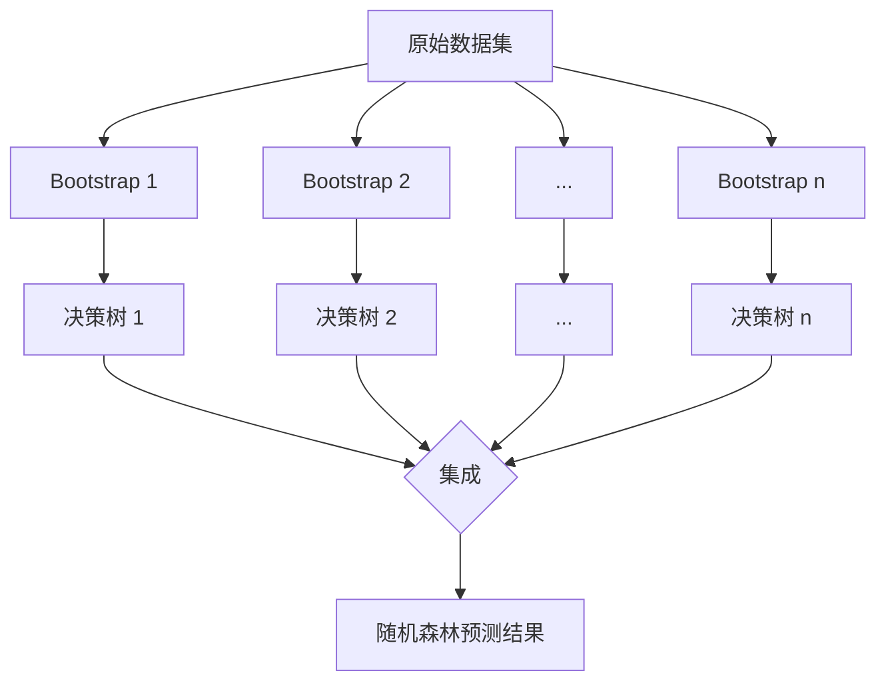

# Python机器学习实战：随机森林算法 - 集成学习的力量

关键词：机器学习、集成学习、随机森林、决策树、Bagging、特征重要性

## 1. 背景介绍
### 1.1  问题的由来
在当今大数据时代,机器学习已成为各行各业的热门技术。面对海量的数据,如何从中挖掘出有价值的信息,建立高效准确的预测模型,是摆在数据科学家面前的一大挑战。众多机器学习算法中,随机森林(Random Forest)凭借其出色的性能和良好的泛化能力,受到了广泛关注。

### 1.2  研究现状
随机森林由Tin Kam Ho于1995年首次提出,并由Leo Breiman等人于2001年发展完善。它是一种基于决策树的集成学习算法,通过构建多棵决策树并集成它们的预测结果,可以显著提升单一决策树的性能。目前,随机森林已被广泛应用于分类、回归、特征选择、异常检测等多个领域,展现出强大的实力。

### 1.3  研究意义
深入研究随机森林算法,对于理解集成学习的内在机理,提高机器学习模型的性能具有重要意义。通过剖析随机森林的原理和实现,我们可以更好地把握其优势和局限,为实际问题选择合适的机器学习算法提供参考。此外,随机森林思想启发人们探索更多集成学习方法,推动了机器学习领域的发展。

### 1.4  本文结构
本文将全面探讨随机森林算法。首先介绍相关的核心概念,然后深入分析随机森林的算法原理,给出详细的操作步骤。接着,我们建立随机森林的数学模型,推导相关公式,并通过案例加以说明。在实践部分,本文给出了Python中实现随机森林的完整代码,对其进行逐步解析。此外,本文还总结了随机森林的实际应用场景,推荐了学习随机森林的资源,展望了随机森林的发展趋势与挑战。

## 2. 核心概念与联系
在讨论随机森林之前,我们先来了解几个核心概念:
- 决策树(Decision Tree):一种树形结构的分类器,通过一系列"属性测试"将样本划分到不同的叶子节点上,实现分类或回归。
- 集成学习(Ensemble Learning):通过构建并结合多个学习器来完成学习任务,常见方法有Bagging和Boosting。
- Bootstrap聚合(Bootstrap Aggregating,简称Bagging):从原始数据集中有放回地抽取多个子集,基于每个子集训练一个基学习器,然后通过投票或平均来组合各学习器的预测结果。
- 随机森林(Random Forest):以决策树为基学习器,基于Bagging思想构建的一种集成学习模型,并在此基础上引入了随机特征选择。

随机森林继承了决策树和Bagging的优点,通过多棵树的集成有效地降低了过拟合风险,提高了模型的泛化性能。同时,随机森林还具有易于并行化、鲁棒性强、可处理高维数据等优势。下图展示了随机森林的整体架构:



## 3. 核心算法原理 & 具体操作步骤
### 3.1  算法原理概述
随机森林的核心思想是"三个随机":数据的随机性、特征的随机性和决策树的随机性。具体来说:
1. 通过Bootstrap方法有放回地从原始训练集中随机抽取n个样本子集
2. 对每个样本子集,随机选择m个特征,构建决策树
3. 重复步骤1和2,生成多棵决策树,形成随机森林
4. 对新样本,利用随机森林中所有决策树进行预测,并将结果进行组合(分类任务多数投票,回归任务取平均)

通过引入随机性,随机森林有效地降低了决策树的方差,提高了模型的泛化能力。此外,由于每棵决策树只用到了部分特征,因此随机森林还具有特征选择的功能。

### 3.2  算法步骤详解
下面我们详细讲解随机森林的构建步骤:
1. 输入参数:
   - 原始训练数据集D
   - 决策树的个数n
   - 每棵决策树使用的特征数m
2. 对i = 1,2,...,n:
   - 从D中通过Bootstrap采样生成第i个训练子集Di
   - 基于Di,随机选择m个特征,构建第i棵决策树Ti:
     - 如果当前节点的样本属于同一类,则将该节点标记为叶节点,类别标记为该类
     - 否则,随机选择一个最优划分特征,根据该特征的取值将样本划分到子节点
     - 对每个子节点递归执行上述过程,直到满足停止条件
3. 返回随机森林{T1,T2,...,Tn}

对于分类任务,随机森林的预测函数为:

$H(x) = argmax_{y \in Y} \sum_{i=1}^n I(h_i(x)=y)$

其中,$h_i$为第i棵决策树,Y为类别集合,I为指示函数。即新样本的预测类别由多棵决策树投票产生。

对于回归任务,随机森林的预测函数为:

$H(x) = \frac{1}{n} \sum_{i=1}^n h_i(x)$

即对所有决策树的预测值取平均。

### 3.3  算法优缺点
随机森林的主要优点包括:
- 集成多棵决策树,泛化性能优异,不易过拟合
- 通过Bootstrap和随机特征选择,降低了模型的方差
- 对噪声和异常值鲁棒,避免了决策树的不稳定性
- 可并行训练,计算效率高
- 能够评估特征重要性,具有特征选择功能
- 对缺失值不敏感,无需专门填充

随机森林的缺点主要有:
- 模型比较复杂,可解释性不如单棵决策树
- 对于噪声较大的分类问题,泛化性能可能不如支持向量机等算法
- 训练时间相对较长,尤其在处理高维数据时

### 3.4  算法应用领域
随机森林被广泛应用于多个领域,例如:
- 计算机视觉:图像分类、目标检测、语义分割等
- 自然语言处理:文本分类、情感分析、命名实体识别等
- 生物信息学:基因表达数据分析、疾病诊断、药物研发等
- 金融领域:信用评分、欺诈检测、股票预测等
- 工业领域:设备故障诊断、质量预测、客户流失预警等

随机森林能够有效处理高维数据,自动进行特征选择,对各类问题都展现出良好的性能,因此成为机器学习从业者的重要工具之一。

## 4. 数学模型和公式 & 详细讲解 & 举例说明
### 4.1  数学模型构建
我们考虑一个二分类问题,训练集为$D = \{(x_1,y_1),(x_2,y_2),...,(x_N,y_N)\}$,其中$x_i \in \mathbb{R}^d$为第i个样本的特征向量,$y_i \in \{-1,+1\}$为其类别标记。随机森林由n棵决策树组成,每棵树基于m个随机选择的特征进行生成。

定义单棵决策树的预测函数为:

$h(x;\theta) \in \{-1,+1\}$

其中$\theta$为决策树的参数(包括树的结构、每个节点的划分特征和阈值等)。

则随机森林的预测函数可表示为:

$H(x) = sign(\sum_{i=1}^n h_i(x;\theta_i))$

其中$h_i(x;\theta_i)$为第i棵决策树的预测函数。

### 4.2  公式推导过程
对于第i棵决策树,我们从原始训练集D中通过Bootstrap采样得到其对应的训练子集$D_i$。设$D_i$中样本数为$N_i$,则$D_i$中样本$(x,y)$被采样的概率为:

$P_{\theta_i}(x,y) = \frac{1}{N}(1-\frac{1}{N})^{N-N_i}$

其中$\theta_i$为第i棵决策树的参数。

根据Bagging的原理,随机森林的泛化误差界为:

$PE^* \leq \frac{1}{n} \sum_{i=1}^n P_{\theta_i}(h_i(x;\theta_i) \neq y)$

即随机森林的泛化误差不超过每棵决策树泛化误差的平均值。

假设每棵决策树的泛化误差为$\epsilon$,决策树之间的预测相关性为$\rho$,则随机森林的泛化误差可近似为:

$PE^* \approx \rho \epsilon + \frac{1-\rho}{n}\epsilon$

可见,随着决策树数量n的增加,随机森林的泛化误差会逐渐收敛到$\rho \epsilon$。因此,通过集成多棵相互独立的决策树,随机森林能够显著降低泛化误差。

### 4.3  案例分析与讲解
下面我们以一个简单的二维数据集为例,直观展示随机森林的分类效果。数据集如下图所示,其中红色点和蓝色点分别代表两个类别:

```python
import numpy as np
import matplotlib.pyplot as plt

# 生成示例数据
np.random.seed(42)
X_red = np.random.randn(100, 2) + np.array([0, 0])
X_blue = np.random.randn(100, 2) + np.array([2, 2])
X = np.vstack((X_red, X_blue))
y = np.hstack((np.zeros(100), np.ones(100)))

# 绘制数据分布
plt.figure(figsize=(8, 6))
plt.scatter(X_red[:,0], X_red[:,1], c='red', marker='o', s=50, label='Class 0')
plt.scatter(X_blue[:,0], X_blue[:,1], c='blue', marker='^', s=50, label='Class 1')
plt.xlabel('Feature 1')
plt.ylabel('Feature 2')
plt.legend()
plt.tight_layout()
plt.show()
```

我们分别训练单棵决策树和随机森林,并绘制它们的决策边界:

```python
from sklearn.tree import DecisionTreeClassifier
from sklearn.ensemble import RandomForestClassifier

# 训练单棵决策树
tree = DecisionTreeClassifier(random_state=42)
tree.fit(X, y)

# 训练随机森林
forest = RandomForestClassifier(n_estimators=10, random_state=42)
forest.fit(X, y)

# 可视化决策边界
x_min, x_max = X[:, 0].min() - 1, X[:, 0].max() + 1
y_min, y_max = X[:, 1].min() - 1, X[:, 1].max() + 1
xx, yy = np.meshgrid(np.arange(x_min, x_max, 0.02),
                     np.arange(y_min, y_max, 0.02))

plt.figure(figsize=(12, 5))
for i, clf in enumerate([tree, forest]):
    plt.subplot(1, 2, i+1)
    Z = clf.predict(np.c_[xx.ravel(), yy.ravel()])
    Z = Z.reshape(xx.shape)
    plt.contourf(xx, yy, Z, alpha=0.8)
    plt.scatter(X_red[:,0], X_red[:,1], c='red', marker='o', s=50)
    plt.scatter(X_blue[:,0], X_blue[:,1], c='blue', marker='^', s=50)
    plt.xlabel('Feature 1')
    plt.ylabel('Feature 2')
    plt.title(str(clf).split('(')[0])
    plt.tight_layout()
plt.show()    
```

从决策边界可以看出,相比单棵决策树,随机森林的决策边界更加平滑,对噪声和异常点更加鲁棒,泛化性能更优。这直观展现了集成学习的优势。

### 4.4  常见问题解答
1. 问:随机森林中的决策树是否需要剪枝?
   答:一