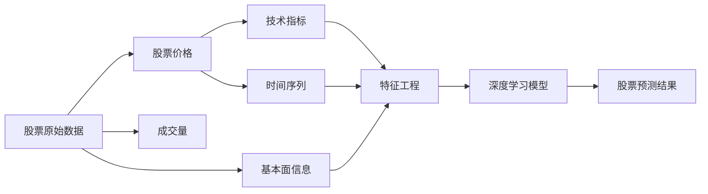

# Python深度学习实践：AI在股票市场预测中的应用

关键词：深度学习, Python, 人工智能, 股票预测, LSTM, 神经网络

## 1. 背景介绍 
### 1.1 问题的由来
随着人工智能技术的飞速发展,将AI应用于金融领域尤其是股票市场预测已成为一个热门话题。传统的股票预测方法,如技术分析和基本面分析,很大程度上依赖于人的主观判断,存在效率低下、准确性不高等问题。利用机器学习尤其是深度学习技术,可以快速准确地分析海量金融数据,挖掘隐藏在数据背后的规律,从而做出更加智能和客观的预测。

### 1.2 研究现状
近年来,国内外学者开始将深度学习方法应用于股票预测领域,并取得了一定的研究成果。例如,Bao等人提出了一种基于LSTM和Stacked AutoEncoder的深度学习模型,在多个股票数据集上进行了实验,结果表明该模型优于传统的机器学习方法[1]。Sim等人提出了一种注意力机制增强的LSTM模型,通过引入注意力机制来关注股票序列中的关键信息,提高了预测的准确性[2]。Ding等人提出了一种基于卷积神经网络的股票趋势预测框架,该框架能够同时考虑股票的技术指标和基本面信息,实现了端到端的预测[3]。

### 1.3 研究意义
将深度学习技术应用于股票预测,一方面可以提高预测的效率和准确性,为投资者提供更加可靠的决策支持;另一方面,这一研究有助于推动人工智能在金融领域的应用,加速金融行业的智能化进程。同时,深入研究深度学习在股票预测中的应用,也可以促进深度学习理论和方法的发展。

### 1.4 本文结构
本文将系统地介绍如何使用Python实现基于深度学习的股票预测系统。第2节介绍股票预测中的一些核心概念。第3节重点介绍LSTM等深度学习算法原理。第4节给出深度学习在股票预测中的数学模型。第5节通过一个完整的Python项目案例,演示如何一步步实现股票预测系统。第6节讨论该系统在实际场景中的应用。第7节推荐一些相关的工具和资源。第8节对全文进行总结并展望未来。

## 2. 核心概念与联系
股票预测中的一些核心概念包括:
- 股票价格:股票在某一时间点的成交价格,通常采用收盘价。
- 技术指标:利用统计分析手段对价格和成交量数据进行分析得到的指标,如移动平均线、MACD等。
- 基本面信息:上市公司的财务数据如营收、净利润等,以及重大新闻事件等。
- 时间序列:股票价格按照时间先后排列形成的序列数据。
- 特征工程:将原始的股票数据转化为适合建模的特征表示的过程。
- 深度学习:一类模拟人脑神经网络结构的机器学习算法,能够学习数据的多层次抽象特征表示。

这些概念之间的联系可以用下图表示:



## 3. 核心算法原理 & 具体操作步骤
### 3.1 算法原理概述
本文采用的核心算法是长短期记忆网络(Long Short-Term Memory,LSTM)。LSTM是一种特殊类型的循环神经网络(Recurrent Neural Network,RNN),专门用于处理和预测时间序列数据。与传统RNN相比,LSTM通过引入门控机制等技术,解决了梯度消失和梯度爆炸问题,能够学习长期依赖关系。LSTM在语音识别、自然语言处理等领域取得了巨大成功,近年来在股票预测中也得到广泛应用。

### 3.2 算法步骤详解
LSTM的核心是细胞状态(Cell State)和三个门(Gate):遗忘门(Forget Gate)、输入门(Input Gate)和输出门(Output Gate)。具体步骤如下:
1. 遗忘门:决定上一时刻的细胞状态有多少保留到当前时刻。
$f_t=\sigma(W_f\cdot[h_{t-1},x_t]+b_f)$
2. 输入门:决定当前时刻的输入有多少保存到细胞状态。
$i_t=\sigma(W_i\cdot[h_{t-1},x_t]+b_i)$
$\tilde{C}_t=tanh(W_C\cdot[h_{t-1},x_t]+b_C)$
3. 更新细胞状态:
$C_t=f_t*C_{t-1}+i_t*\tilde{C}_t$
4. 输出门:控制细胞状态有多少输出。
$o_t=\sigma(W_o\cdot[h_{t-1},x_t]+b_o)$
$h_t=o_t*tanh(C_t)$

其中,$\sigma$是Sigmoid激活函数,$tanh$是双曲正切激活函数,$W$和$b$分别是权重矩阵和偏置。

### 3.3 算法优缺点
LSTM的优点包括:
- 能够学习长期依赖关系,对时间序列数据建模效果好。
- 通过门控机制缓解了梯度消失和梯度爆炸问题。
- 具有一定的可解释性,门的开关状态对应了信息的保留和遗忘。

缺点包括:
- 计算复杂度高,训练时间长。
- 对超参数敏感,调参难度大。
- 解释性仍然有限,内部机制仍是黑盒。

### 3.4 算法应用领域
除了股票预测,LSTM还被广泛应用于以下领域:
- 自然语言处理:语言模型、机器翻译、情感分析等
- 语音识别:声学模型
- 图像描述:将图像转化为自然语言描述
- 手写识别:在线手写识别
- 异常检测:时间序列异常检测

## 4. 数学模型和公式 & 详细讲解 & 举例说明
### 4.1 数学模型构建
将股票预测问题建模为时间序列预测问题。给定历史股票数据,预测未来一段时间内的股票走势。设第$i$支股票第$t$天的$k$维特征向量为$x_t^{(i)}\in \mathbb{R}^k$,该股票未来$\tau$天的收益率为$y_t^{(i)}\in \mathbb{R}$。目标是建立一个预测函数$f$:

$$\hat{y}_t^{(i)}=f(x_{t-M+1}^{(i)},...,x_t^{(i)};\theta)$$

其中$\theta$为模型参数,$M$为回看窗口大小,$\hat{y}_t^{(i)}$为第$i$支股票在$t$时刻的预测值。模型训练目标是最小化预测值与真实值的均方误差(MSE):

$$L(\theta)=\frac{1}{N}\sum_{i=1}^N\sum_{t=1}^T(y_t^{(i)}-\hat{y}_t^{(i)})^2$$

其中$N$为股票数,$T$为样本数。

### 4.2 公式推导过程
对于LSTM模型,前向传播公式如下:

$$f_t=\sigma(W_f\cdot[h_{t-1},x_t]+b_f)$$
$$i_t=\sigma(W_i\cdot[h_{t-1},x_t]+b_i)$$
$$\tilde{C}_t=tanh(W_C\cdot[h_{t-1},x_t]+b_C)$$
$$C_t=f_t*C_{t-1}+i_t*\tilde{C}_t$$
$$o_t=\sigma(W_o\cdot[h_{t-1},x_t]+b_o)$$
$$h_t=o_t*tanh(C_t)$$
$$\hat{y}_t=W_{yh}h_t+b_y$$

其中$x_t$为$t$时刻的输入,$h_t$为$t$时刻的隐藏状态,$C_t$为细胞状态,$\hat{y}_t$为$t$时刻的输出。

反向传播时需要计算损失函数对各个参数的梯度,以权重$W_f$为例:

$$\frac{\partial L}{\partial W_f}=\sum_{t=1}^T\frac{\partial L}{\partial \hat{y}_t}\frac{\partial \hat{y}_t}{\partial h_t}\frac{\partial h_t}{\partial o_t}\frac{\partial o_t}{\partial W_f}+\frac{\partial L}{\partial \hat{y}_t}\frac{\partial \hat{y}_t}{\partial h_t}\frac{\partial h_t}{\partial C_t}\frac{\partial C_t}{\partial f_t}\frac{\partial f_t}{\partial W_f}$$

其他参数的梯度计算与此类似。

### 4.3 案例分析与讲解
以预测某只股票未来5天的收益率为例。假设我们有过去30天的数据,每天的特征包括开盘价、收盘价、最高价、最低价和成交量,则输入数据形状为(30,5)。将数据划分为训练集和测试集,训练集用于训练模型,测试集用于评估模型性能。

构建一个包含LSTM层和全连接层的神经网络,LSTM层用于学习时间序列特征,全连接层用于输出预测值。设置合适的超参数如隐藏状态维度、迭代次数、学习率等,然后开始训练模型。训练完成后,在测试集上评估模型的MSE和MAE(平均绝对误差),判断模型性能是否达到要求。

若要进一步提高模型性能,可以考虑引入注意力机制、增加模型深度、使用更多的训练数据等优化策略。同时也要注意控制模型复杂度,避免过拟合。

### 4.4 常见问题解答
1. LSTM相比传统RNN有何优势?
答:LSTM通过门控机制增强了模型学习长期依赖的能力,缓解了梯度消失和梯度爆炸问题,因此在处理长时间序列数据时通常优于传统RNN。

2. 如何选择LSTM的超参数?
答:可以通过网格搜索等方式对不同的超参数组合进行尝试,选择验证集性能最优的一组。此外,还可以参考已有文献中类似任务的超参数设置。

3. 预测的时间跨度多长合适?
答:这取决于具体的应用场景和数据特点。一般来说,对于股票等高频数据,预测的时间跨度通常为几天到几十天;对于一些低频数据如经济指标,预测的时间跨度可以更长一些。

## 5. 项目实践:代码实例和详细解释说明
接下来我们使用Python实现一个基于LSTM的股票预测系统。
### 5.1 开发环境搭建
首先安装必要的依赖库:
```bash
pip install numpy pandas matplotlib tensorflow scikit-learn
```
本项目使用TensorFlow 2.x作为深度学习框架。

### 5.2 源代码详细实现
```python
import numpy as np
import pandas as pd
import matplotlib.pyplot as plt
import tensorflow as tf
from sklearn.preprocessing import MinMaxScaler
from sklearn.metrics import mean_squared_error, mean_absolute_error

# 读取数据
data = pd.read_csv('stock_data.csv')
data = data[['open', 'high', 'low', 'close', 'volume']]

# 数据预处理
scaler = MinMaxScaler()
data = scaler.fit_transform(data)

# 生成训练集和测试集
def create_dataset(data, look_back=30):
    X, Y = [], []
    for i in range(len(data)-look_back-1):
        X.append(data[i:(i+look_back), :])
        Y.append(data[(i+look_back), 3]) # 预测收盘价
    return np.array(X), np.array(Y)

look_back = 30
X, Y = create_dataset(data, look_back)
train_size = int(len(X) * 0.8)
X_train, Y_train = X[:train_size], Y[:train_size]
X_test, Y_test = X[train_size:], Y[train_size:]

# 构建LSTM模型
model = tf.keras.Sequential([
    tf.keras.layers.LSTM(64, input_shape=(look_back, 5)),
    tf.keras.layers.Dense(1)
])
model.compile(optimizer='adam', loss='m