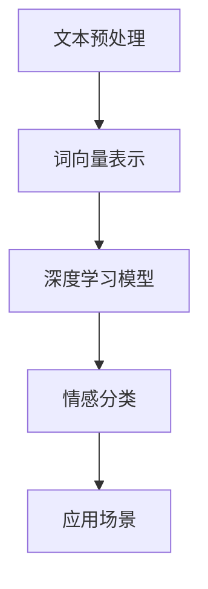

正文内容如下:

# Python深度学习实践：文本情感分类的深度学习方法

## 1. 背景介绍

### 1.1 问题的由来

在当今信息时代,文本数据的产生量呈现出爆炸式增长。无论是社交媒体平台、新闻网站还是企业内部系统,大量的文本数据被持续生成和积累。这些文本数据蕴含着丰富的信息和洞见,对于企业和组织来说,能够有效地从海量文本中提取有价值的信息,将为他们带来巨大的竞争优势。

其中,情感分析(Sentiment Analysis)作为一种重要的文本挖掘任务,旨在自动识别和提取文本中所蕴含的主观观点、情绪和情感倾向。它在多个领域都有广泛的应用,如社交媒体监测、品牌声誉管理、客户服务优化等。传统的基于规则或机器学习的情感分析方法,由于需要大量的人工特征工程,且难以捕捉语义和上下文信息,因此在处理复杂文本时往往表现不佳。

### 1.2 研究现状  

近年来,随着深度学习技术在自然语言处理领域的迅猛发展,基于深度神经网络的情感分析方法逐渐成为研究热点。深度学习模型能够自动从原始数据中学习特征表示,并对复杂的语义和上下文信息建模,从而显著提高了情感分类的准确性和鲁棒性。目前,广泛使用的深度学习模型包括卷积神经网络(CNN)、循环神经网络(RNN)、长短期记忆网络(LSTM)、门控循环单元(GRU)、注意力机制(Attention)等。

### 1.3 研究意义

掌握文本情感分类的深度学习方法,对于企业和组织来说具有重要的现实意义:

1. 提高客户体验 - 通过分析客户反馈和评论的情感倾向,企业可以及时发现问题并采取改进措施,从而提升客户满意度和忠诚度。

2. 优化营销策略 - 分析社交媒体上用户对产品或服务的情感反馈,可以帮助企业调整营销策略,提高营销效果。

3. 监测品牌声誉 - 及时发现负面舆情,采取应对措施,维护品牌形象。

4. 改善客户服务 - 根据客户情感分析结果,优化客户服务流程和培训服务人员,提升服务质量。

5. 发现商机 - 从大量用户评论中发现潜在的市场需求,开发新产品或服务。

总之,掌握文本情感分类的深度学习方法,将为企业带来更好地洞察用户需求、优化业务流程、提升竞争力的机会。

### 1.4 本文结构

本文将详细介绍如何利用Python中的深度学习框架(如TensorFlow、PyTorch等)构建文本情感分类模型。内容包括:

1. 核心概念与联系
2. 核心算法原理与具体操作步骤
3. 数学模型和公式的详细推导
4. 项目实践:代码实例和解释
5. 实际应用场景分析
6. 相关工具和学习资源推荐
7. 总结与展望

接下来,我们将从核心概念入手,循序渐进地探讨这一主题。

## 2. 核心概念与联系

在深入研究文本情感分类的深度学习方法之前,我们先来了解一些核心概念及它们之间的关联。

1. **文本预处理** - 原始文本数据往往存在噪声、错误等问题,需要进行分词、去除停用词、词形还原等预处理,以提高后续处理的效果。

2. **词向量表示** - 将文本转化为向量形式输入神经网络模型。常用的词向量表示方法包括One-Hot编码、Word2Vec、GloVe等。

3. **深度学习模型** - 使用深度神经网络对文本进行建模和情感分类,如CNN、RNN、LSTM、Attention等。

4. **情感分类** - 将文本划分为正面、负面或中性等情感类别。可以是二分类或多分类任务。

5. **应用场景** - 情感分类的结果可应用于多个领域,如社交媒体监测、品牌声誉管理、客户服务优化等。

这些概念相互关联、环环相扣,构成了完整的文本情感分类流程。接下来,我们将重点介绍核心算法原理与具体实现步骤。

## 3. 核心算法原理与具体操作步骤  

### 3.1 算法原理概述

文本情感分类的深度学习算法主要分为以下几个步骤:

1. **文本预处理** - 对原始文本进行分词、去除停用词、词形还原等预处理,以提高后续处理的效果。

2. **词向量表示** - 将文本转化为向量形式,作为神经网络的输入。常用的词向量表示方法包括One-Hot编码、Word2Vec、GloVe等。

3. **构建深度学习模型** - 使用深度神经网络对文本进行建模和情感分类,如CNN、RNN、LSTM、Attention等。模型的输入是词向量序列,输出是情感类别。

4. **模型训练** - 使用标注好的文本数据集对模型进行训练,通过调整模型参数来最小化损失函数,提高分类准确率。

5. **模型评估和优化** - 在测试集上评估模型的性能,并根据评估指标(如准确率、F1分数等)对模型进行调优和改进。

6. **模型部署** - 将训练好的模型部署到实际应用场景中,对新的文本数据进行情感分类。

下面我们将详细介绍其中的核心算法原理和具体操作步骤。

### 3.2 算法步骤详解

#### 3.2.1 文本预处理

文本预处理是情感分类任务的基础步骤,目的是将原始文本数据清理并转换为标准化的格式,以提高后续处理的效果。常见的预处理操作包括:

1. **分词** - 将文本按照一定的规则分割成单词序列,如基于字典或统计模型的分词方法。

2. **去除停用词** - 移除没有实际意义的高频词,如"的"、"了"、"是"等。

3. **词形还原** - 将单词转换为基本形式,如将"playing"转换为"play"。

4. **处理特殊字符** - 去除或替换标点符号、表情符号、HTML标签等特殊字符。

5. **大小写转换** - 将所有单词统一转换为小写或大写形式。

6. **数字处理** - 保留、删除或替换数字等。

以上步骤可以根据具体需求进行选择和组合。经过预处理后,文本将转换为标准化的单词序列,为后续的词向量表示和模型输入做好准备。

#### 3.2.2 词向量表示

将文本转化为向量形式是深度学习模型能够处理的必要步骤。常用的词向量表示方法包括:

1. **One-Hot编码** - 为每个单词分配一个长度为词汇量的向量,该单词对应位置为1,其余位置为0。缺点是高维稀疏,无法捕捉词与词之间的语义关系。

2. **Word2Vec** - 通过神经网络模型从大量文本语料中学习单词的分布式向量表示,能够捕捉词与词之间的语义和语法关系。包括CBOW和Skip-Gram两种模型。

3. **GloVe** - 基于全局词向量表示,通过构建单词与单词之间的共现矩阵,使用矩阵分解的方法获得单词向量表示。

4. **FastText** - 在Word2Vec的基础上,将单词视为字符n-gram的组合,能够更好地处理未登录词和构词规律。

5. **BERT** - 基于Transformer的双向编码器表示,通过预训练的方式学习上下文敏感的单词表示,取得了卓越的性能。

不同的词向量表示方法各有优缺点,需要根据具体任务和数据集进行选择。在情感分类任务中,Word2Vec、GloVe和BERT等方法被广泛使用。

#### 3.2.3 构建深度学习模型

经过预处理和词向量表示后,我们可以将文本输入到深度神经网络模型中进行情感分类。常用的深度学习模型包括:

1. **卷积神经网络(CNN)** - 通过卷积和池化操作从局部区域提取特征,能够有效捕捉文本中的局部模式和关键词信息。

2. **循环神经网络(RNN)** - 适用于处理序列数据,能够捕捉文本中的上下文信息和长距离依赖关系。常见的RNN变体包括LSTM和GRU。

3. **注意力机制(Attention)** - 通过自适应地分配不同权重来聚焦文本中的重要部分,提高模型对关键信息的关注度。

4. **Transformer** - 基于自注意力机制的序列到序列模型,在机器翻译、语言模型等任务中表现出色,也可应用于情感分类。

5. **预训练语言模型** - 如BERT、GPT等,通过在大规模语料上预训练获得通用的语言表示,然后在下游任务(如情感分类)上进行微调。

这些模型可以单独使用,也可以进行组合和改进,形成更加复杂和强大的架构。在实际应用中,需要根据数据集的特点和任务要求选择合适的模型。

#### 3.2.4 模型训练

构建好深度学习模型后,我们需要使用标注好的文本数据集对模型进行训练,以学习模型参数。训练过程的关键步骤包括:

1. **准备数据集** - 收集和标注足够数量的文本数据,通常需要将数据集划分为训练集、验证集和测试集。

2. **设置超参数** - 包括学习率、批量大小、epochs数、正则化参数等,对模型的训练和性能有重要影响。

3. **定义损失函数** - 常用的损失函数包括交叉熵损失、焦点损失等,用于衡量模型预测与真实标签之间的差异。

4. **选择优化器** - 如SGD、Adam等,用于根据损失函数的梯度更新模型参数。

5. **模型训练** - 在训练集上反复迭代,使用优化器更新模型参数,最小化损失函数。可视化训练过程中的损失曲线和评估指标变化。

6. **早停和模型保存** - 通过监控验证集上的指标,在模型性能不再提升时提前停止训练,并保存最优模型。

训练过程需要根据具体任务和数据集特点进行调优,以获得最佳的模型性能。

#### 3.2.5 模型评估和优化

在训练完成后,我们需要在测试集上评估模型的性能,并根据评估指标对模型进行优化和改进。常用的评估指标包括:

1. **准确率(Accuracy)** - 正确分类的样本数占总样本数的比例。

2. **精确率(Precision)** - 被分类为正例的样本中真正为正例的比例。

3. **召回率(Recall)** - 真实为正例的样本中被正确分类为正例的比例。

4. **F1分数** - 精确率和召回率的调和平均值,综合考虑了两者。

5. **ROC曲线和AUC** - 受操作特征曲线及其下面积,用于评估二分类模型的性能。

根据评估结果,我们可以采取以下优化策略:

1. **数据增强** - 通过扩充训练数据、引入噪声等方式,增加数据的多样性,提高模型的泛化能力。

2. **超参数调优** - 尝试不同的学习率、正则化参数等超参数组合,寻找最优配置。

3. **模型集成** - 将多个模型的预测结果进行集成,提高整体性能。

4. **模型修改** - 根据任务特点,对模型架构进行修改和改进,引入注意力机制、残差连接等技术。

5. **迁移学习** - 在大规模语料上预训练的模型(如