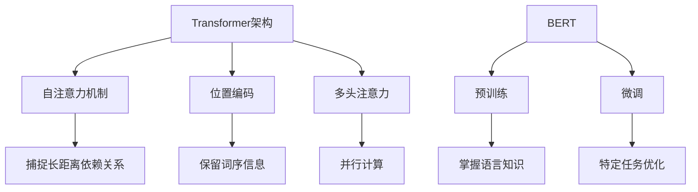

# Python深度学习实践：解析BERT如何改善文本理解

## 1. 背景介绍

### 1.1 问题的由来

在自然语言处理(NLP)领域中,文本理解一直是一个具有挑战性的任务。传统的机器学习方法,如基于规则的系统和统计模型,在处理复杂的语言结构和语义信息时存在局限性。随着深度学习技术的发展,基于神经网络的模型展现出了强大的文本表示和理解能力,在各种NLP任务中取得了突破性的进展。

然而,早期的神经网络模型,如循环神经网络(RNN)和长短期记忆网络(LSTM),在捕捉长距离依赖关系时仍然存在困难。这种局限性使得模型难以充分理解复杂的语义关系和上下文信息,从而影响了文本理解的准确性和深度。

### 1.2 研究现状

为了解决上述问题,谷歌于2018年提出了BERT(Bidirectional Encoder Representations from Transformers)模型,这是一种基于Transformer架构的双向编码器表示模型。BERT通过预训练和微调两个阶段,能够学习到深层次的语义表示,并在各种NLP任务中取得了卓越的表现。

自BERT问世以来,它在自然语言理解、文本生成、机器翻译等多个领域产生了深远的影响。许多研究人员和实践者都在探索如何利用BERT来改善文本理解能力,并将其应用于各种实际场景中。

### 1.3 研究意义

深入理解BERT的原理和实现细节,对于提高文本理解能力和推进NLP技术发展具有重要意义。通过剖析BERT的核心机制,我们可以更好地把握其优势和局限性,进而优化和扩展现有模型,以满足不同应用场景的需求。

此外,探索BERT在实际项目中的应用,可以为开发人员提供宝贵的经验和最佳实践,帮助他们更高效地利用这一强大的技术来解决实际问题。

### 1.4 本文结构

本文将从以下几个方面深入探讨BERT在改善文本理解方面的作用:

1. 介绍BERT的核心概念和原理,包括Transformer架构、自注意力机制和预训练等关键技术。
2. 详细解析BERT的算法原理和具体操作步骤,包括模型结构、训练过程和微调策略。
3. 阐述BERT背后的数学模型和公式,并通过案例分析和实例说明进行深入讲解。
4. 提供BERT的代码实现示例,并对关键代码进行详细解读和分析。
5. 探讨BERT在实际应用场景中的作用,包括问答系统、文本分类、机器翻译等领域。
6. 介绍BERT相关的工具和学习资源,为读者提供进一步学习和实践的途径。
7. 总结BERT的研究成果和未来发展趋势,并讨论其面临的挑战和展望。

通过全面深入的分析和实践,本文旨在为读者提供一个透彻的理解和掌握BERT技术的机会,帮助他们在文本理解和自然语言处理领域取得进展。

## 2. 核心概念与联系

在深入探讨BERT的算法原理和实现细节之前,让我们先了解一些核心概念和它们之间的联系。这将为后续内容奠定基础,并帮助读者更好地理解BERT的工作原理。

- **Transformer架构**是BERT的核心基础,它采用了自注意力机制、位置编码和多头注意力等关键技术,能够有效地捕捉长距离依赖关系,并通过并行计算提高效率。
- **自注意力机制**允许模型在计算每个单词的表示时,直接关注其他相关单词,而不受位置或距离的限制,从而更好地捕捉长距离依赖关系。
- **位置编码**通过为每个单词添加位置信息,使模型能够保留词序信息,这对于理解自然语言非常重要。
- **多头注意力**将注意力机制分解为多个并行的注意力头,每个头捕捉不同的依赖关系,从而提高模型的表示能力。
- **BERT**是一种基于Transformer架构的双向编码器表示模型,它通过预训练和微调两个阶段来学习语言知识和优化特定任务。
- **预训练**允许BERT在大量无标注数据上学习通用的语言表示,掌握丰富的语言知识。
- **微调**则将预训练模型在特定任务上进行进一步优化,使其能够更好地适应特定的应用场景。

通过这些核心概念的有机结合,BERT能够捕捉复杂的语义关系和上下文信息,从而显著提高文本理解的能力。在后续章节中,我们将更深入地探讨BERT的算法原理、数学模型和实现细节。

## 3. 核心算法原理 & 具体操作步骤

### 3.1 算法原理概述

BERT的核心算法原理基于Transformer架构和自注意力机制。与传统的序列模型(如RNN和LSTM)不同,Transformer完全依赖于注意力机制来捕捉输入和输出之间的全局依赖关系,而不需要递归操作。

BERT采用了Transformer的编码器部分,通过堆叠多个编码器层来构建深层次的语义表示。每个编码器层由两个子层组成:多头自注意力子层和前馈神经网络子层。

**多头自注意力子层**允许模型在计算每个单词的表示时,直接关注其他相关单词,而不受位置或距离的限制。这种机制使得BERT能够有效地捕捉长距离依赖关系,从而更好地理解复杂的语义关系和上下文信息。

**前馈神经网络子层**则对每个单词的表示进行非线性变换,以捕捉更高层次的语义特征。

此外,BERT还引入了**位置编码**和**段嵌入**等技术,以保留单词的位置信息和句子边界信息,从而提高模型的理解能力。

### 3.2 算法步骤详解

BERT的算法步骤可以分为两个主要阶段:预训练和微调。

#### 3.2.1 预训练阶段

在预训练阶段,BERT在大量无标注的文本数据上进行训练,目标是学习通用的语言表示。预训练过程包括以下两个任务:

1. **掩码语言模型(Masked Language Model, MLM)**:在输入序列中随机掩码一部分单词,要求模型根据上下文预测被掩码的单词。这有助于BERT学习理解上下文语义和捕捉长距离依赖关系。

2. **下一句预测(Next Sentence Prediction, NSP)**:给定两个句子,模型需要判断第二个句子是否为第一个句子的下一句。这项任务旨在让BERT学习理解句子之间的关系和语境。

通过在大规模语料库上进行预训练,BERT可以学习到丰富的语言知识和语义表示,为后续的微调任务奠定基础。

#### 3.2.2 微调阶段

在微调阶段,BERT将预训练模型应用于特定的自然语言处理任务,如文本分类、问答系统、机器翻译等。微调过程包括以下步骤:

1. **任务特定输入表示**:根据目标任务,对输入数据进行适当的预处理和表示,例如添加特殊标记、构建输入序列等。

2. **微调模型参数**:在预训练模型的基础上,对模型的最后一层或几层进行微调,使其能够更好地适应目标任务。在这个过程中,大部分预训练参数保持不变,只有少量参数进行调整。

3. **模型评估和优化**:在开发集上评估模型的性能,并根据评估指标对模型进行进一步优化,如调整超参数、修改损失函数等。

4. **模型部署**:将优化后的模型应用于实际场景,解决目标任务。

通过这两个阶段的训练,BERT能够充分利用大规模语料库中的语言知识,并将其应用于特定的自然语言处理任务,从而显著提高文本理解的准确性和效率。

### 3.3 算法优缺点

#### 优点

1. **捕捉长距离依赖关系**:由于自注意力机制,BERT能够有效地捕捉输入序列中的长距离依赖关系,从而更好地理解复杂的语义关系和上下文信息。

2. **双向编码**:与传统的单向语言模型不同,BERT采用了双向编码器,可以同时利用左右上下文信息,提高了语义表示的质量。

3. **通用性和可迁移性**:预训练阶段使BERT能够学习到通用的语言知识,这种知识可以通过微调轻松迁移到各种下游任务中,提高了模型的灵活性和适用范围。

4. **高效并行计算**:Transformer架构允许BERT在训练和推理时进行高效的并行计算,提高了模型的计算效率。

#### 缺点

1. **计算资源需求高**:由于BERT模型的规模较大,预训练和微调过程需要消耗大量的计算资源,对硬件要求较高。

2. **长文本处理能力有限**:由于输入长度的限制,BERT在处理超长文本时可能会遇到困难,需要采取特殊的分块策略。

3. **缺乏显式的推理能力**:BERT主要关注语义表示和理解,但缺乏显式的推理和reasoning能力,在某些复杂的推理任务上表现可能不佳。

4. **预训练数据质量影响大**:BERT的性能在很大程度上依赖于预训练数据的质量和多样性,如果预训练数据存在偏差或噪声,可能会影响模型的泛化能力。

### 3.4 算法应用领域

由于BERT在捕捉语义关系和理解上下文信息方面的卓越表现,它已被广泛应用于各种自然语言处理任务,包括但不限于:

1. **文本分类**:将文本分配到预定义的类别中,如情感分析、新闻分类、垃圾邮件检测等。

2. **问答系统**:根据给定的问题和上下文信息,从文本中提取出相关的答案。

3. **机器翻译**:将一种自然语言的文本翻译成另一种语言。

4. **文本摘要**:自动生成文本的简洁摘要,捕捉原始文本的核心内容。

5. **实体识别和关系抽取**:从文本中识别出命名实体(如人名、地名等)及其相互关系。

6. **语义相似度计算**:衡量两段文本在语义上的相似程度。

7. **文本生成**:根据给定的上下文或提示,自动生成连贯、流畅的自然语言文本。

8. **语音识别和合成**:将语音转换为文本,或将文本转换为自然语音。

BERT的应用范围不断扩展,它已成为自然语言处理领域中最重要和最广泛使用的技术之一,为各种语言理解和生成任务提供了强大的支持。

## 4. 数学模型和公式 & 详细讲解 & 举例说明

### 4.1 数学模型构建

BERT的数学模型基于Transformer架构,其核心是自注意力机制。让我们从自注意力机制的数学表示开始探讨。

给定一个输入序列 $X = (x_1, x_2, \dots, x_n)$,其中每个 $x_i$ 表示一个单词的嵌入向量。自注意力机制的目标是为每个单词 $x_i$ 计算一个新的向量表示 $z_i$,该向量不仅包含 $x_i$ 本身的信息,还融合了其他相关单词的信息。

自注意力机制的计算过程可以表示为:

$$z_i = \sum_{j=1}^n \alpha_{ij}(x_jW^V)$$

其中