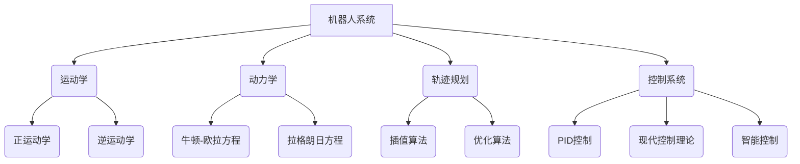

# Robotics 原理与代码实战案例讲解

## 1. 背景介绍

### 1.1 问题的由来

在当今科技飞速发展的时代,机器人技术已经渗透到了我们生活的方方面面。从工业制造到家庭服务,从医疗保健到航空航天,机器人系统都发挥着越来越重要的作用。然而,机器人技术的发展也带来了一系列新的挑战和问题。

首先,机器人系统的复杂性不断增加,需要更先进的控制算法和软件架构来确保其稳定性和可靠性。其次,机器人需要具备更强大的感知能力,能够准确地感知和理解周围环境,从而做出合理的决策和行为。此外,机器人系统还需要具备一定的自主性和智能性,能够根据环境变化自主调整行为策略。

因此,研究和开发高效、智能、可靠的机器人系统,已经成为当前机器人领域的一个重要课题。

### 1.2 研究现状

近年来,机器人技术的研究取得了长足的进步。在控制算法方面,基于现代控制理论的各种先进算法不断涌现,如自适应控制、鲁棒控制、智能控制等,大大提高了机器人系统的控制性能。在感知技术方面,传感器技术的发展使得机器人能够获取更加丰富的环境信息,如视觉、深度、力觉等,为机器人的环境感知提供了有力支持。

同时,人工智能技术的飞速发展也为机器人系统带来了新的契机。机器学习、深度学习等技术赋予了机器人更强大的感知、决策和控制能力,使得机器人系统能够在复杂的环境中自主完成各种任务。

### 1.3 研究意义

发展先进的机器人技术对于推动社会进步具有重要意义。高性能的机器人系统不仅可以大幅提高工业生产的自动化水平,降低人工成本,还能够承担一些危险或者极端环境下的作业任务,保护人类的生命安全。在服务领域,智能机器人可以为人类提供更加贴心、高效的服务,提升生活质量。在科研领域,机器人技术在航空航天、海洋探测等极端环境下的应用,也将推动人类对未知世界的探索和认识。

因此,研究和开发高效、智能、可靠的机器人系统,对于提高社会的生产力水平、保障人类生命安全、推动科技进步,都具有重要的现实意义。

### 1.4 本文结构  

本文将围绕机器人技术的核心原理和实战案例进行全面讲解。

首先,介绍机器人系统的核心概念,如运动学、动力学、轨迹规划等,并分析它们之间的内在联系。

其次,深入探讨机器人控制的核心算法原理,包括经典的PID控制、现代控制理论,以及基于人工智能的智能控制算法,并详细讲解具体的操作步骤。

再次,建立机器人系统的数学模型,推导控制算法的相关公式,并通过案例分析加深理解。

此外,还将介绍机器人系统的实际开发流程,提供代码实例并进行详细解释,帮助读者掌握实战开发技能。

最后,探讨机器人技术的实际应用场景,推荐相关的学习资源和开发工具,并展望机器人技术的未来发展趋势和面临的挑战。

## 2. 核心概念与联系

机器人系统是一个复杂的综合体系,涉及多个核心概念,这些概念相互关联、相互影响。本节将介绍机器人系统的几个核心概念,并分析它们之间的内在联系。

### 2.1 运动学(Kinematics)

运动学是研究机器人运动的几何特性,不考虑引起运动的力和力矩。它包括两个核心概念:

- **正运动学(Forward Kinematics)**: 给定机器人每个关节的角度,计算机器人末端执行器的位置和姿态。
- **逆运动学(Inverse Kinematics)**: 给定期望的末端执行器位置和姿态,求解机器人每个关节的角度。

运动学是机器人系统的基础,为轨迹规划、控制系统等提供了重要支持。

### 2.2 动力学(Dynamics)

动力学研究机器人运动时所受到的力和力矩,以及它们与机器人运动之间的关系。主要包括两种建模方法:

- **牛顿-欧拉方程(Newton-Euler Equations)**: 基于刚体力学,建立每个连杆的运动方程。
- **拉格朗日方程(Lagrangian Equations)**: 基于能量原理,建立整个机器人系统的运动方程。

动力学模型不仅可以用于机器人的运动控制,还可以用于力/力矩控制、接触建模等。

### 2.3 轨迹规划(Trajectory Planning)

轨迹规划的目标是为机器人生成平滑、连续的运动轨迹,使其从起始位置到达目标位置。常用的算法包括:

- **插值算法(Interpolation)**: 在起始点和终止点之间生成一条平滑曲线,如多项式插值、三次样条插值等。
- **优化算法(Optimization)**: 根据优化目标(如最短时间、最小能耗等)和约束条件,求解最优轨迹,如梯度下降法、动态规划等。

轨迹规划需要基于运动学模型,并且生成的轨迹需要由控制系统执行。

### 2.4 控制系统(Control System)

控制系统的任务是根据期望的轨迹,计算每个关节的控制指令(力矩或角度),从而驱动机器人按照规划的轨迹运动。常用的控制算法包括:

- **PID控制(PID Control)**: 经典的反馈控制算法,通过比例、积分、微分三个项对偏差进行补偿。
- **现代控制理论(Modern Control Theory)**: 如最优控制、鲁棒控制、自适应控制等,能够处理更加复杂的控制问题。
- **智能控制(Intelligent Control)**: 基于人工智能技术(如机器学习、神经网络等)的控制算法,具有自适应、自学习的能力。

控制系统需要基于运动学、动力学模型,并且依赖于轨迹规划模块提供期望轨迹。

上述四个核心概念相互关联、相互影响。运动学和动力学为轨迹规划和控制系统提供了理论基础;轨迹规划模块为控制系统提供了期望轨迹;而控制系统则根据期望轨迹驱动机器人运动。因此,机器人系统的设计需要综合考虑这四个方面,才能实现高效、智能、可靠的运行。

## 3. 核心算法原理 & 具体操作步骤

### 3.1 算法原理概述

机器人控制系统的核心是控制算法,其作用是根据期望的轨迹,计算出驱动每个关节运动所需的控制指令(力矩或角度)。根据算法的不同原理,控制算法可以分为三大类:经典PID控制算法、现代控制理论算法和智能控制算法。

#### 3.1.1 PID控制算法

PID控制算法是最经典的反馈控制算法,其核心思想是根据系统输出与期望值之间的偏差,通过比例(P)、积分(I)、微分(D)三个项对偏差进行补偿,从而使系统输出跟踪期望值。

PID控制算法的控制律为:

$$
u(t) = K_p e(t) + K_i \int_{0}^{t} e(\tau) d\tau + K_d \frac{de(t)}{dt}
$$

其中:
- $u(t)$ 为控制器输出(控制指令)
- $e(t)$ 为系统输出与期望值之间的偏差
- $K_p$、$K_i$、$K_d$ 分别为比例、积分、微分系数

PID控制算法简单有效,被广泛应用于工业控制系统。但它也存在一些缺陷,如参数调节困难、响应性能有限、无法处理非线性系统等。

#### 3.1.2 现代控制理论算法

为了克服PID控制的缺陷,现代控制理论提出了一系列新的控制算法,如最优控制、鲁棒控制、自适应控制等。这些算法能够处理更加复杂的控制问题,如非线性系统、不确定系统、存在扰动的系统等。

其中,最优控制算法的目标是在满足一定约束条件下,寻找使某一性能指标(如能耗、时间等)最优的控制策略。常见的最优控制算法有线性二次型调节器(LQR)、线性二次差分型调节器(LQG)等。

鲁棒控制算法则是设计一种对系统参数变化和外部扰动具有鲁棒性的控制器,使得系统输出能够保持稳定。常见的鲁棒控制算法有H无穷大控制、滑模控制等。

自适应控制算法的核心思想是在控制过程中不断识别系统参数的变化,并自动调整控制器参数以适应这些变化。常见的自适应控制算法有模型参考自适应控制、自整定自适应控制等。

现代控制理论算法性能优异,但也存在一些缺陷,如算法复杂、鲁棒性有限、参数调节困难等。

#### 3.1.3 智能控制算法

随着人工智能技术的发展,智能控制算法应运而生,赋予了控制系统自适应、自学习的智能。智能控制算法通常基于机器学习、神经网络、模糊逻辑等技术,能够从数据中自动学习系统模型和控制策略,从而实现高效、鲁棒的控制。

常见的智能控制算法有:

- **基于神经网络的控制**: 利用神经网络逼近非线性系统,实现高精度控制。
- **基于强化学习的控制**: 将控制问题建模为马尔可夫决策过程,通过互动与环境学习最优控制策略。
- **基于模糊逻辑的控制**: 利用模糊规则对非线性、不确定系统进行控制。

智能控制算法具有很强的自适应性和鲁棒性,能够有效处理复杂的非线性、不确定系统。但其也存在一些缺陷,如收敛速度慢、需要大量训练数据、可解释性差等。

上述三大类控制算法各有优缺点,在不同的应用场景下会有不同的选择。在实际应用中,还可以将它们相互结合,发挥各自的优势,设计出更加高效、智能的控制系统。

### 3.2 算法步骤详解

本节将详细介绍上述三大类控制算法的具体实现步骤。

#### 3.2.1 PID控制算法步骤

1. **建立系统数学模型**

   首先需要建立被控对象(如机器人关节)的数学模型,描述其输入(控制指令)与输出(关节角度/位置)之间的映射关系。对于线性系统,可以使用传递函数或状态空间模型;对于非线性系统,可以使用非线性微分方程等。

2. **设计控制器结构**

   根据系统的模型特性,设计合适的PID控制器结构。常见的PID控制器结构有:

   - 理想PID控制器
   - 增量式PID控制器
   - 位置式PID控制器

3. **确定控制器参数**

   PID控制器的性能很大程度上取决于比例系数$K_p$、积分系数$K_i$和微分系数$K_d$的取值。常用的参数调节方法有:

   - 经验调节法
   - 离线调节法(如根轨迹法、优化调节法等)
   - 自整