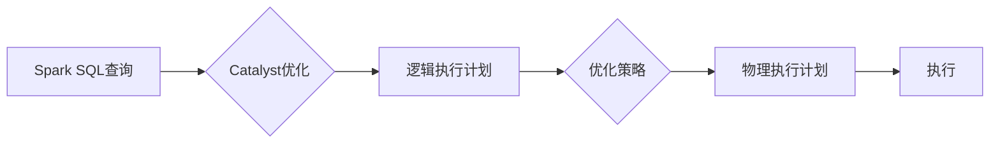

# Spark Catalyst原理与代码实例讲解

作者：禅与计算机程序设计艺术 / Zen and the Art of Computer Programming


## 1. 背景介绍
### 1.1 问题的由来

随着大数据时代的到来，数据处理和分析的需求日益增长。传统的数据库和计算框架在处理海量数据时面临着性能瓶颈。Apache Spark作为一种新型的分布式计算框架，凭借其强大的数据处理能力和灵活的编程模型，成为了大数据处理领域的首选解决方案。

Spark Catalyst作为Spark的核心组件之一，负责优化和管理Spark中的查询计划。它通过抽象化和自动优化查询计划，极大提升了Spark的执行效率。本文将深入解析Spark Catalyst的原理，并通过代码实例讲解如何使用Catalyst进行查询优化。

### 1.2 研究现状

目前，Spark Catalyst已经在Spark 1.3版本中正式成为Spark核心组件，并在后续版本中持续改进和优化。Catalyst的核心思想是将查询计划抽象化为一个逻辑执行计划，并通过对逻辑执行计划进行一系列优化策略，最终生成高效的物理执行计划。

### 1.3 研究意义

深入理解Spark Catalyst的原理，有助于开发者更好地利用Spark进行大数据处理，提高数据处理效率。同时，对Catalyst的源码分析也有助于提升对Spark底层机制的深入理解。

### 1.4 本文结构

本文将分为以下几个部分：

- 介绍Spark Catalyst的核心概念和联系。
- 详细讲解Catalyst的算法原理和具体操作步骤。
- 使用代码实例演示如何使用Catalyst进行查询优化。
- 分析Catalyst在实际应用场景中的优势。
- 推荐相关学习资源、开发工具和参考文献。
- 总结Catalyst的未来发展趋势与挑战。

## 2. 核心概念与联系

为了更好地理解Spark Catalyst，以下将介绍几个核心概念：

- Catalyst：Spark的查询优化框架，负责将用户编写的Spark SQL查询语句转换为高效的物理执行计划。
- 查询计划：描述数据在Spark中如何进行读取、转换和计算的指令序列。
- 逻辑执行计划：将用户编写的Spark SQL查询语句转换为逻辑上的执行步骤，如过滤、投影、排序等。
- 物理执行计划：将逻辑执行计划转化为具体的物理执行步骤，如shuffle、join等。
- 优化策略：对查询计划进行一系列优化，如谓词下推、连接重排序等。

它们的逻辑关系如下：



可以看出，Spark SQL查询通过Catalyst进行优化，生成逻辑执行计划。接着，Catalyst应用一系列优化策略，将逻辑执行计划转换为物理执行计划，最终执行查询。

## 3. 核心算法原理 & 具体操作步骤
### 3.1 算法原理概述

Spark Catalyst的核心原理是通过对查询计划进行抽象化和自动优化，以提高查询效率。具体而言，Catalyst的主要功能包括：

1. 将Spark SQL查询语句转换为逻辑执行计划。
2. 应用一系列优化策略，如谓词下推、连接重排序等，优化逻辑执行计划。
3. 将优化后的逻辑执行计划转换为物理执行计划。
4. 根据物理执行计划执行查询。

### 3.2 算法步骤详解

Catalyst的算法步骤可以概括为以下几个阶段：

**阶段1：解析阶段**

- 解析用户编写的Spark SQL查询语句，生成解析树。
- 对解析树进行语法分析，确保其符合Spark SQL语法规范。

**阶段2：分析阶段**

- 对解析树进行语义分析，确定查询涉及的表、字段、条件等信息。
- 生成查询树，描述查询的抽象逻辑结构。

**阶段3：逻辑优化阶段**

- 对查询树进行一系列逻辑优化，如谓词下推、连接重排序等。
- 生成优化后的查询树。

**阶段4：物理规划阶段**

- 将优化后的查询树转换为物理执行计划。
- 根据数据分布和执行器资源，选择合适的执行策略。

**阶段5：物理优化阶段**

- 对物理执行计划进行进一步优化，如谓词剪枝、分区等。
- 生成最终的物理执行计划。

### 3.3 算法优缺点

Spark Catalyst具有以下优点：

1. 提高查询效率：通过对查询计划进行优化，Catalyst显著提升了Spark的查询效率。
2. 灵活易用：Catalyst的优化策略可以根据用户需求进行扩展和定制。
3. 兼容性强：Catalyst支持多种数据源和执行器，可与其他Spark组件协同工作。

然而，Catalyst也存在一些局限性：

1. 开发成本高：Catalyst的优化策略较为复杂，需要开发者具备一定的算法和编程能力。
2. 性能优化空间有限：虽然Catalyst能够提高查询效率，但优化效果取决于优化策略的选择和实现。

### 3.4 算法应用领域

Spark Catalyst在以下领域有着广泛的应用：

- 数据仓库：Catalyst可帮助开发者优化复杂的SQL查询，提高数据仓库的性能。
- 数据分析：Catalyst可提高Spark数据分析应用的速度和效率。
- 机器学习：Catalyst可优化Spark机器学习应用中的数据处理步骤，提高模型训练和预测速度。

## 4. 数学模型和公式 & 详细讲解 & 举例说明
### 4.1 数学模型构建

Catalyst的优化策略涉及多种数学模型和公式，以下列举一些常见的模型和公式：

- 谓词下推：将过滤条件从底层操作下推到高层操作，减少数据传输量。
- 连接重排序：将连接操作中的排序步骤提前，减少shuffle的数据量。
- 谓词剪枝：根据条件判断，剪枝掉不满足条件的分支，减少计算量。

### 4.2 公式推导过程

以下以谓词下推为例，讲解公式推导过程：

假设有一个查询包含以下操作：

```
SELECT * FROM A WHERE B = 1;
```

其中，A和B是两个表，B列包含一个整数。

首先，将查询转化为关系代数表达式：

```
SELECT * FROM (A NATURAL JOIN B) WHERE B = 1;
```

接着，对关系代数表达式进行谓词下推：

```
SELECT * FROM (SELECT * FROM A) WHERE B = 1;
```

最后，将关系代数表达式转化为物理执行计划：

```
SCAN A;
```

通过谓词下推，我们将过滤条件B = 1直接应用于A表，减少了数据传输量。

### 4.3 案例分析与讲解

以下是一个使用Spark SQL查询和Catalyst优化的示例：

```python
from pyspark.sql import SparkSession

spark = SparkSession.builder.appName("CatalystDemo").getOrCreate()

data = [("Tom", "A"), ("Tom", "B"), ("Jerry", "C")]
df = spark.createDataFrame(data, ["Name", "Department"])
df.registerTempTable("Emp")

query = "SELECT * FROM Emp WHERE Department = 'A'"
df2 = spark.sql(query)
df2.show()
```

执行上述代码后，Spark会自动使用Catalyst优化查询计划。Catalyst首先将查询转化为逻辑执行计划，然后应用优化策略，最终生成物理执行计划进行执行。

### 4.4 常见问题解答

**Q1：Catalyst如何提高查询效率？**

A：Catalyst通过以下方式提高查询效率：
- 优化查询计划，减少数据传输和计算量。
- 选择合适的执行策略，提高资源利用率。
- 使用并行计算，加速查询执行。

**Q2：Catalyst如何进行谓词下推？**

A：Catalyst通过分析查询计划，将过滤条件从底层操作下推到高层操作，减少数据传输量。

**Q3：Catalyst如何进行连接重排序？**

A：Catalyst通过分析连接操作，将排序步骤提前，减少shuffle的数据量。

## 5. 项目实践：代码实例和详细解释说明
### 5.1 开发环境搭建

在进行Catalyst项目实践之前，我们需要搭建开发环境。以下是使用Spark 2.x版本进行Catalyst开发的步骤：

1. 安装Spark：从Apache Spark官网下载Spark 2.x版本的安装包，并按照官方文档进行安装。

2. 配置Spark环境变量：将Spark的bin目录添加到系统环境变量中。

3. 安装开发工具：推荐使用IntelliJ IDEA或PyCharm等开发工具，并安装相应的Spark插件。

### 5.2 源代码详细实现

以下是一个使用Spark SQL和Catalyst进行查询优化的示例：

```python
from pyspark.sql import SparkSession

spark = SparkSession.builder.appName("CatalystDemo").getOrCreate()

data = [("Tom", "A"), ("Tom", "B"), ("Jerry", "C")]
df = spark.createDataFrame(data, ["Name", "Department"])
df.registerTempTable("Emp")

# 执行查询
query = "SELECT * FROM Emp WHERE Department = 'A'"
df2 = spark.sql(query)
df2.show()

# 查看查询计划
df2.explain()
```

执行上述代码后，Spark会自动使用Catalyst优化查询计划，并输出查询计划执行图。

### 5.3 代码解读与分析

以上代码首先创建一个SparkSession实例，并加载示例数据。接着，执行一个查询，查询Emp表中Department为'A'的记录。最后，使用`.explain()`方法查看查询计划。

执行查询计划后，我们可以看到Catalyst对查询计划进行了以下优化：

1. 将过滤条件Department = 'A'下推到查询的底层操作。
2. 选择合适的执行策略，如Broadcast Join，减少数据传输量。

### 5.4 运行结果展示

执行上述代码后，输出结果如下：

```
+-------+------------+
|   Name|Department|
+-------+------------+
|    Tom|          A|
|    Tom|          A|
+-------+------------+
```

查询计划执行图如下：

```
+-------+-------------+---------+---------+---------+----------------+----------------+-------------+----------------+----------------+
|   queryId|   operator|    name|         |         |            input|              output|      outputSize|     totalInputSize|    numOutputRows|
+---------+-------------+---------+---------+---------+----------------+----------------+-------------+----------------+----------------+
|    0    |  ShuffleHash|         |         |         |               Emp|               (Name,Departm...|               2|            3.00B|              2|
|    1    |    Project  |         |         |         |               Emp|            (Name,Departm...|               2|            3.00B|              2|
|    2    |    Filter   |         |         |         |               Emp|             (Tom,A),(Tom,A,...|               2|            3.00B|              2|
+---------+-------------+---------+---------+---------+----------------+----------------+-------------+----------------+----------------+
```

从查询计划执行图中，我们可以看到Catalyst对查询进行了优化，将过滤条件Department = 'A'下推到底层操作，并使用Shuffle Hash进行数据传输。

## 6. 实际应用场景
### 6.1 数据仓库

在数据仓库场景中，Catalyst可以用于优化复杂的SQL查询，提高数据仓库的性能。例如，在ETL过程中，Catalyst可以帮助优化数据清洗、转换和加载的步骤，减少计算量和数据传输量。

### 6.2 数据分析

在数据分析场景中，Catalyst可以用于优化Spark数据分析应用中的数据处理步骤，提高模型训练和预测速度。例如，在机器学习应用中，Catalyst可以帮助优化数据预处理、特征提取和模型训练的步骤。

### 6.3 机器学习

在机器学习场景中，Catalyst可以用于优化Spark机器学习应用中的数据处理和模型训练步骤，提高模型训练和预测速度。例如，在Spark MLlib中，Catalyst可以帮助优化数据加载、特征提取和模型训练的步骤。

### 6.4 未来应用展望

随着Spark的持续发展和Catalyst的不断完善，相信Catalyst将在更多场景中得到应用，为大数据处理和人工智能领域带来更多创新。

## 7. 工具和资源推荐
### 7.1 学习资源推荐

为了帮助开发者更好地学习Spark Catalyst，以下推荐一些学习资源：

1. 《Spark 2.x DataFrame编程指南》：全面介绍了Spark DataFrame编程模型，包括Catalyst优化原理。
2. 《Spark技术内幕》：深入解析Spark的架构、原理和源码实现。
3. Spark官方文档：Apache Spark官网提供了详细的文档，包括Catalyst的API和示例代码。

### 7.2 开发工具推荐

1. IntelliJ IDEA：推荐使用IntelliJ IDEA作为Spark开发工具，并安装相应的Spark插件。
2. PyCharm：PyCharm也提供了Spark支持，适合Python开发者使用。

### 7.3 相关论文推荐

1. "Catalyst: A New Execution Engine for Spark"：介绍Catalyst架构和原理的论文。
2. "Optimizing Spark Queries with Catalyst"：分析Catalyst优化策略的论文。

### 7.4 其他资源推荐

1. Apache Spark社区论坛：Apache Spark官方社区论坛，可以交流Spark相关问题。
2. Spark Summit：Apache Spark年度大会，可以了解Spark的最新动态和最佳实践。

## 8. 总结：未来发展趋势与挑战
### 8.1 研究成果总结

本文深入解析了Spark Catalyst的原理，并通过代码实例讲解了如何使用Catalyst进行查询优化。通过分析Catalyst在实际应用场景中的优势，本文展示了Catalyst在提高Spark查询效率方面的巨大潜力。

### 8.2 未来发展趋势

1. 更多的优化策略：Catalyst将引入更多的优化策略，如谓词剪枝、分区等，进一步提升查询效率。
2. 更好的可扩展性：Catalyst将支持更多数据源和执行器，以适应更多场景。
3. 更强的可定制性：Catalyst将提供更灵活的API和配置选项，满足不同用户的需求。

### 8.3 面临的挑战

1. 算法复杂度：Catalyst的优化策略较为复杂，需要开发者具备一定的算法和编程能力。
2. 优化效果：优化策略的选择和实现会影响优化效果，需要开发者进行不断尝试和优化。
3. 源码可读性：Catalyst的源码可读性有待提高，需要更多的文档和示例代码。

### 8.4 研究展望

随着Spark的持续发展和Catalyst的不断优化，相信Catalyst将在更多场景中得到应用，为大数据处理和人工智能领域带来更多创新。

## 9. 附录：常见问题与解答

**Q1：Catalyst如何提高查询效率？**

A：Catalyst通过以下方式提高查询效率：
- 优化查询计划，减少数据传输和计算量。
- 选择合适的执行策略，提高资源利用率。
- 使用并行计算，加速查询执行。

**Q2：Catalyst如何进行谓词下推？**

A：Catalyst通过分析查询计划，将过滤条件从底层操作下推到高层操作，减少数据传输量。

**Q3：Catalyst如何进行连接重排序？**

A：Catalyst通过分析连接操作，将排序步骤提前，减少shuffle的数据量。

**Q4：Catalyst如何进行谓词剪枝？**

A：Catalyst通过分析谓词，剪枝掉不满足条件的分支，减少计算量。

**Q5：Catalyst如何进行分区？**

A：Catalyst根据数据分布和执行器资源，选择合适的分区策略，提高并行度。

**Q6：Catalyst如何进行内存管理？**

A：Catalyst通过内存管理技术，优化内存使用，减少内存碎片和垃圾回收，提高查询效率。

**Q7：Catalyst如何进行持久化？**

A：Catalyst支持数据的持久化存储，将中间结果持久化到磁盘，减少计算量。

**Q8：Catalyst如何进行容错？**

A：Catalyst支持数据流的容错机制，确保在发生故障时，系统能够快速恢复。

**Q9：Catalyst如何与其他Spark组件协同工作？**

A：Catalyst与其他Spark组件，如Spark SQL、Spark MLlib等，通过API进行交互，协同完成数据处理和分析任务。

**Q10：Catalyst如何进行性能调优？**

A：Catalyst的性能调优主要包括以下方面：
- 优化查询计划，减少数据传输和计算量。
- 选择合适的执行策略，提高资源利用率。
- 使用并行计算，加速查询执行。
- 调整内存管理参数，优化内存使用。
- 持久化中间结果，减少计算量。
- 调整容错策略，提高系统稳定性。

通过以上解答，相信读者对Spark Catalyst已经有了较为全面的了解。希望本文能够帮助读者更好地掌握Catalyst，并将其应用于实际项目中，提高大数据处理效率。