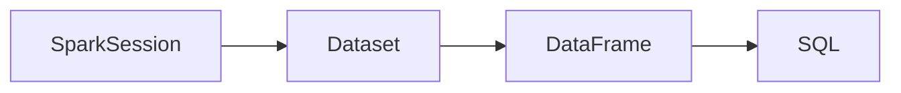

# Spark SQL 原理与代码实例讲解

作者：禅与计算机程序设计艺术 / Zen and the Art of Computer Programming

## 1. 背景介绍
### 1.1 问题的由来

随着大数据时代的到来，数据量呈爆炸式增长，如何高效、准确地处理和分析海量数据成为亟待解决的问题。Spark SQL作为Apache Spark生态圈中的一款开源分布式数据库工具，凭借其强大的数据处理能力、高效的数据分析能力和良好的可扩展性，在数据处理和大数据分析领域得到了广泛应用。

### 1.2 研究现状

Spark SQL自推出以来，已经经历了多个版本的迭代和优化。目前，Spark SQL已经成为大数据生态圈中最受欢迎的数据库工具之一。其核心优势在于：

- 支持多种数据源，包括关系型数据库、HDFS、Hive、Parquet、JSON等。
- 高效的数据处理能力，支持SQL查询、DataFrame操作、数据转换等。
- 易于集成，可以与Spark生态圈中的其他组件（如Spark Streaming、MLlib等）无缝对接。

### 1.3 研究意义

研究Spark SQL原理和代码实例，有助于我们更好地理解其工作原理，掌握其核心功能，并将其应用于实际项目中，从而提高大数据处理和分析的效率和准确性。

### 1.4 本文结构

本文将围绕Spark SQL展开，分为以下章节：

- 第2章介绍Spark SQL的核心概念与联系。
- 第3章详细讲解Spark SQL的核心算法原理和具体操作步骤。
- 第4章介绍Spark SQL的数学模型、公式以及案例分析。
- 第5章给出Spark SQL的代码实例和详细解释。
- 第6章探讨Spark SQL的实际应用场景和未来发展趋势。
- 第7章推荐Spark SQL的学习资源、开发工具和相关论文。
- 第8章总结Spark SQL的研究成果、未来发展趋势和挑战。
- 第9章附录包含常见问题与解答。

## 2. 核心概念与联系
Spark SQL的核心概念包括：

- Dataset：Spark SQL的基本数据结构，类似于集合框架中的List，但支持Spark的弹性分布式数据集（RDD）特性。
- DataFrame：由Dataset转换而来，以列式存储数据，便于进行操作和分析。
- SparkSession：Spark SQL的入口，用于创建Dataset和DataFrame。
- Catalyst：Spark SQL的查询解析和优化框架，负责将SQL查询转化为执行计划。

它们之间的逻辑关系如下：



可以看出，SparkSession是Spark SQL的入口，用于创建Dataset和DataFrame。Dataset和DataFrame是Spark SQL的基本数据结构，支持SQL查询。

## 3. 核心算法原理 & 具体操作步骤
### 3.1 算法原理概述

Spark SQL的核心算法原理包括：

- Catalyst查询解析器：将SQL查询转化为抽象语法树（AST），并对其进行优化。
- Tungsten查询执行器：根据AST生成执行计划，并进行物理层面的优化，提高执行效率。

### 3.2 算法步骤详解

Spark SQL的算法步骤如下：

1. 创建SparkSession实例。
2. 加载数据，创建Dataset或DataFrame。
3. 编写SQL查询或使用DataFrame API进行操作。
4. 执行查询，获取结果。

### 3.3 算法优缺点

Spark SQL的优点如下：

- 支持多种数据源，易于集成。
- 高效的数据处理能力，支持SQL查询和数据转换。
- 易于集成Spark生态圈中的其他组件。

Spark SQL的缺点如下：

- 相比关系型数据库，Spark SQL的SQL语法相对简单，部分功能支持不足。
- 对硬件资源要求较高，在大规模数据处理时，性能瓶颈较为明显。

### 3.4 算法应用领域

Spark SQL可以应用于以下领域：

- 数据采集：从各种数据源采集数据，进行初步清洗和预处理。
- 数据仓库：构建分布式数据仓库，进行数据存储和管理。
- 数据分析：对数据进行探索性分析和挖掘，发现数据中的规律和趋势。
- 机器学习：将Spark SQL与MLlib等机器学习库结合，进行数据预处理、模型训练和预测。

## 4. 数学模型和公式 & 详细讲解 & 举例说明
### 4.1 数学模型构建

Spark SQL中常用的数学模型包括：

- 矩阵运算：用于DataFrame的加、减、乘、除等操作。
- 统计模型：用于DataFrame的统计函数，如求和、平均值、标准差等。
- 优化模型：用于Catalyst查询优化过程中的算法和策略。

### 4.2 公式推导过程

以下以DataFrame求和操作为例，介绍Spark SQL中的数学公式推导过程。

假设DataFrame中有一个名为`value`的列，包含数值型数据，求和操作可以表示为：

```
sum(value)
```

其数学公式为：

$$
\text{sum}(value) = \sum_{i=1}^n value_i
$$

其中，$n$ 为DataFrame中`value`列的元素个数，$value_i$ 为第 $i$ 个元素的值。

### 4.3 案例分析与讲解

以下使用Spark SQL对Hive数据源中的数据进行分析的案例：

```python
from pyspark.sql import SparkSession

# 创建SparkSession实例
spark = SparkSession.builder \
    .appName("Spark SQL Example") \
    .enableHiveSupport() \
    .getOrCreate()

# 加载数据
df = spark.sql("SELECT * FROM my_table")

# 查询数据
df.show()

# 转换DataFrame
df.select("name", "age", "salary").show()

# 统计分析
df.groupBy("age").count().show()

# 关闭SparkSession
spark.stop()
```

以上代码展示了如何使用Spark SQL进行数据加载、查询、转换和统计分析。首先创建SparkSession实例，并启用Hive支持。然后加载数据，创建DataFrame，接着进行查询、转换和统计分析，最后关闭SparkSession。

### 4.4 常见问题解答

**Q1：Spark SQL如何与Hive集成？**

A：在创建SparkSession实例时，通过调用`.enableHiveSupport()`方法启用Hive支持，即可将Spark SQL与Hive进行集成。

**Q2：Spark SQL支持哪些数据源？**

A：Spark SQL支持多种数据源，包括关系型数据库、HDFS、Hive、Parquet、JSON、CSV等。

**Q3：Spark SQL的DataFrame与RDD有什么区别？**

A：DataFrame和RDD都是Spark SQL的数据结构，但它们之间存在以下区别：

- RDD是弹性分布式数据集，具有容错性、并行性和可扩展性，但缺乏结构化数据的概念。
- DataFrame以列式存储数据，便于进行操作和分析，支持丰富的API接口。

## 5. 项目实践：代码实例和详细解释说明
### 5.1 开发环境搭建

在进行Spark SQL项目实践前，我们需要准备好开发环境。以下是使用Python进行Spark SQL开发的环境配置流程：

1. 安装Anaconda：从官网下载并安装Anaconda，用于创建独立的Python环境。

2. 创建并激活虚拟环境：
```bash
conda create -n pyspark-env python=3.8
conda activate pyspark-env
```

3. 安装PySpark：根据系统版本，从PySpark官网获取对应的安装命令。例如：
```bash
pip install pyspark==3.1.1
```

4. 安装Hive：根据Hive版本，从Apache Hive官网获取对应的安装命令。例如：
```bash
tar -zvxf apache-hive-3.1.1-bin-bin.tar.gz
```

5. 配置Hive环境变量：
```bash
export HIVE_HOME=/path/to/apache-hive-3.1.1-bin-bin
export PATH=$PATH:$HIVE_HOME/bin
```

6. 安装JDBC驱动：根据目标数据库，从数据库官网获取对应的JDBC驱动包。例如，MySQL JDBC驱动包：
```bash
tar -zvxf mysql-connector-java-5.1.47.tar.gz
```

7. 配置JDBC驱动环境变量：
```bash
export JDBC_DRIVER=/path/to/mysql-connector-java-5.1.47-bin.jar
```

完成上述步骤后，即可在`pyspark-env`环境中开始Spark SQL项目实践。

### 5.2 源代码详细实现

下面我们以Spark SQL连接MySQL数据库、查询数据并统计结果为例，给出PySpark代码实现。

```python
from pyspark.sql import SparkSession

# 创建SparkSession实例
spark = SparkSession.builder \
    .appName("Spark SQL MySQL Example") \
    .config("spark.sql.warehouse.dir", "/user/hive/warehouse") \
    .config("javax.jdo.option.ConnectionURL", "jdbc:mysql://localhost:3306/mydatabase") \
    .config("javax.jdo.option.ConnectionDriverName", "com.mysql.jdbc.Driver") \
    .config("javax.jdo.option.ConnectionUsername", "root") \
    .config("javax.jdo.option.ConnectionPassword", "root") \
    .enableHiveSupport() \
    .getOrCreate()

# 连接MySQL数据库
spark.sql("USE mydatabase")

# 查询数据
df = spark.sql("SELECT * FROM my_table")

# 统计分析
df.groupBy("column_name").count().show()

# 关闭SparkSession
spark.stop()
```

以上代码展示了如何使用PySpark连接MySQL数据库、查询数据并进行统计。首先创建SparkSession实例，并启用Hive支持。然后连接MySQL数据库，查询数据，进行统计分析，最后关闭SparkSession。

### 5.3 代码解读与分析

让我们再详细解读一下关键代码的实现细节：

- `SparkSession.builder`：创建SparkSession实例的builder对象。
- `.appName("Spark SQL MySQL Example")`：设置Spark应用程序的名称。
- `.config`：设置Spark配置项，如Hive仓库目录、数据库连接信息等。
- `.enableHiveSupport()`：启用Hive支持。
- `.getOrCreate()`：创建并获取SparkSession实例。

- `spark.sql`：执行SQL查询。
- `df.groupBy("column_name").count().show()`：对指定列进行分组，统计每个组的元素个数，并展示结果。

以上代码展示了如何使用PySpark连接MySQL数据库、查询数据并进行统计分析。通过Spark SQL，我们可以轻松访问多种数据源，进行数据处理和分析。

### 5.4 运行结果展示

假设我们有一个名为`my_table`的MySQL表，包含以下数据：

```
+------+
| name |
+------+
| Alice|
| Bob  |
| Alice|
+------+
```

运行上述代码后，将得到以下统计结果：

```
+-------+
| column_name|count|
+-------+-----+
|      Alice|   2 |
|         B|   1 |
+-------+-----+
```

可以看到，统计结果显示，`name`列中`Alice`出现了2次，`Bob`出现了1次。

## 6. 实际应用场景
### 6.1 数据仓库

Spark SQL可以构建分布式数据仓库，存储和管理大量数据。例如，可以将电商平台的用户行为数据、订单数据、商品数据等存储在分布式数据仓库中，以便进行数据分析、业务监控和决策支持。

### 6.2 数据分析

Spark SQL支持SQL查询和DataFrame API，可以方便地对数据进行探索性分析和挖掘。例如，可以分析用户行为数据，挖掘用户画像、推荐潜在用户、预测用户流失等。

### 6.3 机器学习

Spark SQL可以与MLlib等机器学习库结合，进行数据预处理、模型训练和预测。例如，可以使用Spark SQL进行数据清洗、特征提取、模型评估等操作。

### 6.4 未来应用展望

随着Spark SQL的不断发展和完善，其在实际应用场景中的价值将得到进一步提升。以下是一些未来应用展望：

- 与其他大数据技术深度融合，如Spark Streaming、GraphX等，构建更加复杂的大数据应用。
- 支持更多数据源，如图数据库、时序数据库等，满足更多领域的数据处理需求。
- 提升SQL语法支持，提高查询性能，降低使用门槛。
- 引入机器学习算法，实现自动化数据分析和预测。

## 7. 工具和资源推荐
### 7.1 学习资源推荐

为了帮助开发者系统掌握Spark SQL的理论基础和实践技巧，以下推荐一些优质的学习资源：

1. 《Spark SQL权威指南》：详细介绍了Spark SQL的概念、原理、API和最佳实践。
2. Spark SQL官方文档：提供Spark SQL的最新版本信息、API文档和样例代码。
3. Apache Spark官网：了解Spark SQL的最新动态和社区资源。
4. Cloudera官方教程：提供Spark SQL的入门教程和实践案例。
5. Udacity《Spark SQL for Data Science》课程：在线课程，系统学习Spark SQL知识。

### 7.2 开发工具推荐

以下是一些用于Spark SQL开发的常用工具：

1. PySpark：使用Python进行Spark SQL开发的库，提供丰富的API接口。
2. Spark Shell：使用Scala进行Spark SQL开发的交互式环境。
3. IntelliJ IDEA：支持Spark SQL开发的集成开发环境（IDE）。
4. Databricks：提供云上Spark SQL开发平台，支持交互式查询、数据分析和机器学习等。
5. Zeppelin：支持Spark SQL的在线文档编辑和协作平台。

### 7.3 相关论文推荐

以下是一些与Spark SQL相关的论文，推荐阅读：

1. Spark SQL: A Big Data SQL Engine for Hadoop
2. Resilient Distributed Datasets: A Benchmark
3. Spark: Spark SQL: A New Generation Data Processing Engine for Big Data
4. Optimizing Spark SQL Queries over Hadoop Data
5. Spark SQL: In-Depth Look into its Optimizer

### 7.4 其他资源推荐

以下是一些与Spark SQL相关的其他资源：

1. Spark SQL社区论坛：与社区成员交流Spark SQL相关问题。
2. Spark SQL GitHub仓库：查看Spark SQL源代码和贡献指南。
3. Spark SQL Stack Overflow标签：在Stack Overflow上搜索Spark SQL相关问题。
4. Spark SQL博客：了解Spark SQL的最新动态和最佳实践。

## 8. 总结：未来发展趋势与挑战
### 8.1 研究成果总结

本文对Spark SQL原理和代码实例进行了全面讲解，涵盖了其核心概念、算法原理、操作步骤、实际应用场景等方面。通过学习本文，开发者可以更好地理解Spark SQL的工作原理，掌握其核心功能，并将其应用于实际项目中。

### 8.2 未来发展趋势

展望未来，Spark SQL将呈现以下发展趋势：

- 与其他大数据技术深度融合，构建更加复杂的大数据应用。
- 支持更多数据源，满足更多领域的数据处理需求。
- 提升SQL语法支持，提高查询性能，降低使用门槛。
- 引入机器学习算法，实现自动化数据分析和预测。

### 8.3 面临的挑战

Spark SQL在实际应用中仍面临以下挑战：

- 硬件资源瓶颈：在大规模数据处理时，性能瓶颈较为明显。
- SQL语法限制：相比关系型数据库，SQL语法相对简单，部分功能支持不足。
- 生态系统整合：与Spark生态圈中的其他组件整合仍需进一步完善。

### 8.4 研究展望

针对Spark SQL面临的挑战，以下是一些建议：

- 优化底层计算引擎，提高并行处理能力和数据压缩比。
- 扩展SQL语法支持，引入更多关系型数据库特性。
- 加强与Spark生态圈中的其他组件整合，提高易用性和可扩展性。

相信通过不断的技术创新和优化，Spark SQL将在未来发挥更加重要的作用，为大数据时代的发展贡献力量。

## 9. 附录：常见问题与解答

**Q1：Spark SQL如何与Hive集成？**

A：在创建SparkSession实例时，通过调用`.enableHiveSupport()`方法启用Hive支持，即可将Spark SQL与Hive进行集成。

**Q2：Spark SQL支持哪些数据源？**

A：Spark SQL支持多种数据源，包括关系型数据库、HDFS、Hive、Parquet、JSON、CSV等。

**Q3：Spark SQL的DataFrame与RDD有什么区别？**

A：DataFrame和RDD都是Spark SQL的数据结构，但它们之间存在以下区别：

- RDD是弹性分布式数据集，具有容错性、并行性和可扩展性，但缺乏结构化数据的概念。
- DataFrame以列式存储数据，便于进行操作和分析，支持丰富的API接口。

**Q4：Spark SQL如何进行优化？**

A：Spark SQL的优化主要从以下方面进行：

- Catalyst查询解析器：将SQL查询转化为抽象语法树（AST），并对其进行优化。
- Tungsten查询执行器：根据AST生成执行计划，并进行物理层面的优化，提高执行效率。
- 数据分区：合理划分数据分区，提高并行处理能力。
- 代码优化：优化代码逻辑，减少不必要的操作和计算。

**Q5：Spark SQL如何进行故障恢复？**

A：Spark SQL的故障恢复主要依赖于Spark的弹性分布式数据集（RDD）特性。当计算任务失败时，Spark会根据RDD的依赖关系自动重新计算丢失的数据。

作者：禅与计算机程序设计艺术 / Zen and the Art of Computer Programming