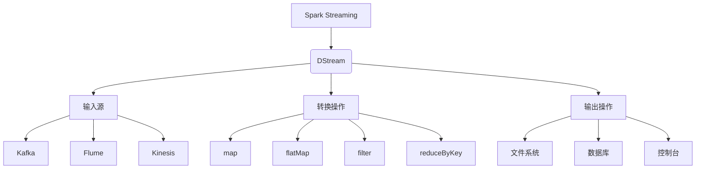

# Spark Streaming原理与代码实例讲解

## 1. 背景介绍

### 1.1 问题的由来

在当今的大数据时代，实时数据处理成为了一个越来越重要的话题。传统的批处理系统无法满足对实时性的需求,因为它们需要先将数据全部加载到内存或磁盘中,然后再进行处理。而对于一些应用场景,如社交网络分析、网络安全监控、物联网数据处理等,需要对持续不断产生的数据流进行实时处理和分析。

### 1.2 研究现状

为了解决实时数据处理的问题,出现了一些流式计算框架,如Apache Storm、Apache Samza、Apache Spark Streaming等。其中,Spark Streaming作为Apache Spark生态系统的一部分,凭借其与Spark核心引擎的紧密集成、高度容错性、易于使用等优势,成为了当前最受欢迎的流式计算框架之一。

### 1.3 研究意义

掌握Spark Streaming的原理和使用方法,对于开发实时数据处理应用程序至关重要。通过本文,读者可以深入了解Spark Streaming的核心概念、算法原理、数学模型,并通过代码实例学习如何使用Spark Streaming进行实时数据处理。

### 1.4 本文结构

本文首先介绍Spark Streaming的核心概念和算法原理,包括DStream(Discretized Stream)、输入源(Input Sources)、转换操作(Transformations)、输出操作(Output Operations)等。然后详细讲解Spark Streaming的数学模型和公式推导过程。接着,通过一个实际项目案例,展示如何使用Scala代码开发一个Spark Streaming应用程序。最后,探讨Spark Streaming在实际应用场景中的使用,介绍相关工具和学习资源,并总结Spark Streaming的发展趋势和面临的挑战。

## 2. 核心概念与联系



Spark Streaming的核心抽象是DStream(Discretized Stream),它代表了一个连续的数据流。DStream可以从各种输入源(如Kafka、Flume、Kinesis等)获取数据,并对数据执行各种转换操作(如map、flatMap、filter、reduceByKey等),最终将处理结果输出到文件系统、数据库或控制台等目的地。

DStream是一个不可变、有序和容错的数据流,它由一系列的RDD(Resilient Distributed Dataset)组成,每个RDD都包含一个特定时间间隔内的数据。Spark Streaming通过将数据流划分为多个批次,并对每个批次的数据执行Spark RDD操作,从而实现了流式计算。

## 3. 核心算法原理 & 具体操作步骤

### 3.1 算法原理概述

Spark Streaming的核心算法原理是将流式计算转化为一系列的批处理计算。具体来说,Spark Streaming会将输入数据流划分为一系列的批次,每个批次包含一定时间间隔内的数据。然后,Spark Streaming会为每个批次创建一个RDD,并对这个RDD执行指定的转换操作。最后,将处理结果输出到指定的目的地。

这种基于微批次(micro-batching)的设计,使得Spark Streaming能够利用Spark核心引擎的优势,如容错性、内存管理、任务调度等,从而实现高吞吐量和低延迟的流式计算。

### 3.2 算法步骤详解

Spark Streaming的算法步骤可以概括为以下几个步骤:

1. **获取输入数据流**:从指定的输入源(如Kafka、Flume等)获取数据流。

2. **创建DStream**:根据输入数据流创建DStream对象。

3. **定义转换操作**:对DStream执行所需的转换操作,如map、flatMap、filter、reduceByKey等。这些操作会生成一个新的DStream。

4. **执行输出操作**:将最终结果DStream输出到指定的目的地,如文件系统、数据库或控制台。

5. **启动Streaming上下文**:启动Spark Streaming上下文,开始执行流式计算任务。

6. **处理数据**:Spark Streaming会将输入数据流划分为多个批次,每个批次包含一定时间间隔内的数据。对于每个批次,Spark Streaming会创建一个RDD,并对这个RDD执行指定的转换操作。

7. **输出结果**:将处理结果输出到指定的目的地。

8. **持续处理**:Spark Streaming会持续处理输入数据流,直到停止或发生错误。

### 3.3 算法优缺点

**优点:**

- **容错性强**:Spark Streaming利用了Spark核心引擎的容错机制,能够自动恢复故障节点并重新计算丢失的数据。
- **吞吐量高**:Spark Streaming可以充分利用集群资源,实现高吞吐量的流式计算。
- **易于使用**:Spark Streaming提供了简单易用的API,开发人员可以快速上手。
- **与Spark生态系统紧密集成**:Spark Streaming可以与Spark生态系统中的其他组件(如Spark SQL、Spark MLlib等)无缝集成,实现更加复杂的数据处理任务。

**缺点:**

- **延迟性**:由于采用微批次模式,Spark Streaming无法实现真正的流式处理,存在一定的延迟。
- **状态管理复杂**:对于需要维护状态的应用程序(如窗口操作),状态管理会变得比较复杂。
- **内存开销较大**:Spark Streaming需要在内存中缓存一定量的数据,对内存的需求较高。

### 3.4 算法应用领域

Spark Streaming可以应用于各种需要实时数据处理的场景,包括但不限于:

- **实时日志分析**:实时分析网站或应用程序的日志数据,用于监控、安全检测等。
- **实时监控**:实时监控系统指标、网络流量等,用于故障检测和预警。
- **实时数据分析**:实时分析社交网络数据、物联网数据等,用于个性化推荐、预测分析等。
- **实时数据管道**:构建实时数据管道,将数据从各种源传输到不同的目的地。
- **流式机器学习**:结合Spark MLlib,实现流式机器学习模型训练和预测。

## 4. 数学模型和公式 & 详细讲解 & 举例说明

在讨论Spark Streaming的数学模型之前,我们先介绍一些基本概念。

**流(Stream):**一个流是一个无限序列,可以表示为 $S = \{x_1, x_2, x_3, \ldots\}$,其中 $x_i$ 表示第 $i$ 个数据元素。

**DStream(Discretized Stream):**DStream是Spark Streaming中的核心抽象,它表示一个持续的数据流。DStream由一系列的RDD(Resilient Distributed Dataset)组成,每个RDD包含一个特定时间间隔内的数据。

我们可以将DStream表示为:

$$DStream = \{RDD_1, RDD_2, RDD_3, \ldots\}$$

其中,每个 $RDD_i$ 包含时间范围 $[t_i, t_{i+1})$ 内的数据。

### 4.1 数学模型构建

Spark Streaming的数学模型基于以下几个关键概念:

1. **窗口(Window):**窗口是指一个时间范围,用于对数据流进行分组。窗口可以是滚动窗口(Rolling Window)或滑动窗口(Sliding Window)。

2. **增量迭代(Incremental Iteration):**Spark Streaming采用增量迭代的方式处理数据流。每当有新的数据到达,就会对这些新数据执行计算,并将结果与之前的结果合并。

3. **有状态转换(Stateful Transformation):**有状态转换是指需要维护状态的转换操作,如窗口操作、updateStateByKey等。

我们可以将Spark Streaming的数学模型表示为:

$$
\begin{aligned}
DStream &= \{RDD_1, RDD_2, RDD_3, \ldots\} \\
RDD_i &= \{x_1, x_2, \ldots, x_n\} \quad \text{where } x_j \in [t_i, t_{i+1}) \\
y_i &= f(RDD_i, state_i) \\
state_{i+1} &= g(state_i, RDD_i)
\end{aligned}
$$

其中:

- $DStream$ 表示输入的数据流
- $RDD_i$ 表示时间范围 $[t_i, t_{i+1})$ 内的数据
- $y_i$ 表示对 $RDD_i$ 执行转换操作 $f$ 后的结果,其中 $f$ 可能是有状态的
- $state_i$ 表示转换操作 $f$ 在时间 $t_i$ 时的状态
- $g$ 是一个函数,用于根据当前状态 $state_i$ 和新数据 $RDD_i$ 计算下一个状态 $state_{i+1}$

### 4.2 公式推导过程

接下来,我们将推导出一个常见的有状态转换操作 —— 滑动窗口计数(Sliding Window Count)的公式。

假设我们有一个数据流 $DStream$,我们希望统计在最近 $n$ 个时间单位内出现的元素个数。这可以通过滑动窗口计数来实现。

设:

- $w$ 为窗口大小(时间单位)
- $s$ 为滑动步长(时间单位)
- $c_i$ 为时间 $t_i$ 时窗口内的元素计数

我们可以得到以下公式:

$$
\begin{aligned}
c_i &= \sum_{j=i-w+1}^i |RDD_j| \\
    &= c_{i-1} + |RDD_i| - |RDD_{i-w}|
\end{aligned}
$$

其中 $|RDD_j|$ 表示 $RDD_j$ 中元素的个数。

该公式的推导过程如下:

1) 在时间 $t_i$ 时,窗口内的元素计数 $c_i$ 等于过去 $w$ 个时间单位内所有 $RDD$ 中元素的总和,即:

$$c_i = \sum_{j=i-w+1}^i |RDD_j|$$

2) 注意到 $c_{i-1}$ 已经包含了 $RDD_{i-w+1}$ 到 $RDD_{i-1}$ 的元素计数,因此我们只需要加上 $RDD_i$ 中的元素计数,并减去 $RDD_{i-w}$ 中的元素计数(因为它已经不在窗口范围内),即:

$$c_i = c_{i-1} + |RDD_i| - |RDD_{i-w}|$$

这个公式的优点是,我们可以基于前一个状态 $c_{i-1}$ 和新到达的数据 $RDD_i$ 以及最早的过期数据 $RDD_{i-w}$ 来增量计算新的状态 $c_i$,从而避免重复计算,提高效率。

### 4.3 案例分析与讲解

现在,我们来看一个具体的例子,以帮助理解滑动窗口计数的公式。

假设我们有一个数据流 $DStream$,其中每个 $RDD$ 包含一个时间单位内的数据,数据格式为 $(key, value)$ 对。我们希望统计在最近 3 个时间单位内,每个 key 出现的次数。

设:

- 窗口大小 $w = 3$
- 滑动步长 $s = 1$
- $RDD_i = \{(k_1, v_1), (k_2, v_2), \ldots\}$

我们可以使用 `reduceByKeyAndWindow` 转换操作来实现滑动窗口计数:

```scala
val counts = dstream.reduceByKeyAndWindow(
  (v1, v2) => v1 + v2, // 累加器函数
  Seconds(3), // 窗口大小
  Seconds(1) // 滑动步长
)
```

这里,`reduceByKeyAndWindow` 操作会为每个 key 维护一个状态,即该 key 在当前窗口内出现的次数。

假设输入数据流如下:

```
t1: (a, 1), (b, 1)
t2: (a, 1), (b, 1), (c, 1)
t3: (b, 1), (c, 1), (