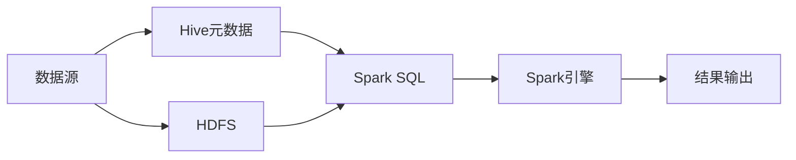
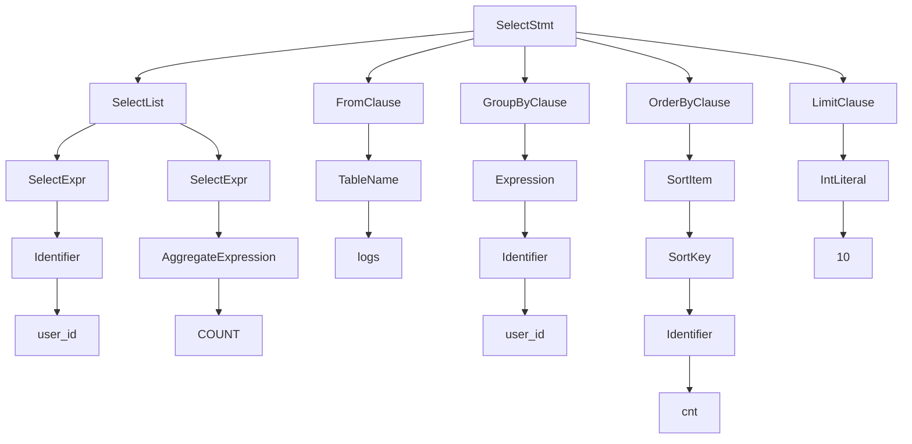
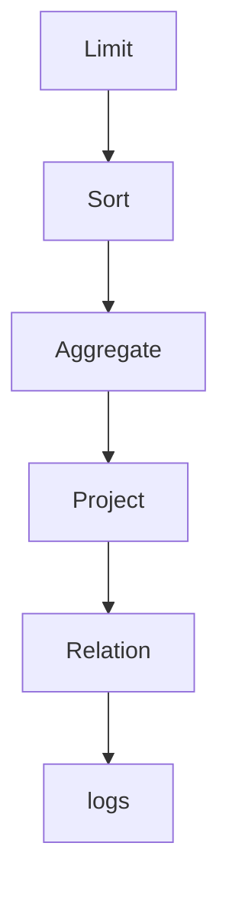
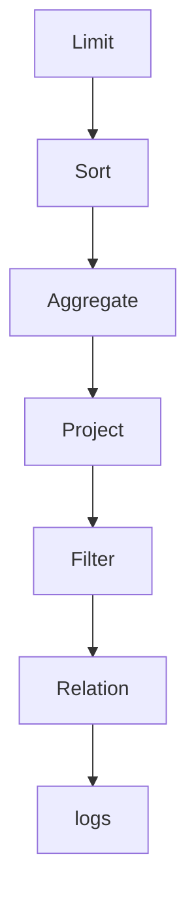
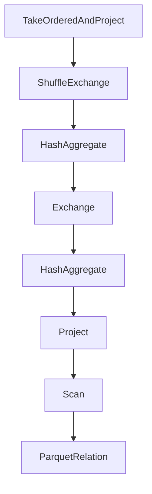

# Spark-Hive整合原理与代码实例讲解

关键词：Spark、Hive、大数据、数据处理、数据仓库、Hadoop

## 1. 背景介绍
### 1.1  问题的由来
随着大数据时代的到来,企业每天产生的数据量呈爆炸式增长。如何有效地存储、管理和分析这些海量数据,成为企业面临的重大挑战。Hadoop生态系统为大数据处理提供了一套完整的解决方案,其中Hive作为构建在Hadoop之上的数据仓库工具,能够通过类SQL语言HiveQL实现对海量结构化数据的查询和分析。而Spark作为新兴的大数据处理引擎,凭借其快速、通用、易用等特点,正在被越来越多的企业采用。因此,如何实现Spark和Hive的整合,充分发挥两者的优势,成为大数据开发人员亟需解决的问题。

### 1.2  研究现状
目前,学术界和工业界已经开展了大量关于Spark和Hive整合的研究和实践。一些互联网公司如阿里、腾讯、京东等,纷纷基于Spark+Hive构建企业级数据仓库和数据分析平台。一些开源项目如Spark-Llap、Hive on Spark等,致力于优化Spark和Hive整合的性能和易用性。同时,Databricks、Cloudera等大数据公司也推出了成熟的Spark+Hive整合方案和产品。总的来说,Spark与Hive的整合已成为大数据领域的研究热点和发展趋势。

### 1.3  研究意义
Spark与Hive的整合具有重要的理论意义和实践价值:

1. 充分发挥Spark和Hive的优势,实现优势互补。Spark擅长复杂、迭代的数据处理和机器学习,Hive擅长海量结构化数据的存储和查询,二者整合后可以构建功能完备的大数据处理平台。

2. 简化大数据应用开发流程,提高开发效率。开发人员可以继续使用HiveQL进行数据查询和分析,而底层的数据处理引擎无缝切换为Spark,避免了学习新的编程语言和框架。

3. 加速查询和分析,提升数据处理性能。Spark可以将中间结果数据缓存在内存中,避免不必要的磁盘IO,从而显著提升Hive查询的速度。

4. 支持更加灵活、复杂的数据分析场景。Spark支持交互式查询、机器学习、图计算等多种数据处理范式,使得Hive可以支持更加复杂的数据分析需求。

### 1.4  本文结构
本文将详细介绍Spark与Hive整合的原理和实践。内容安排如下:

第2节介绍Spark和Hive的基本概念及其关系;第3节重点剖析Spark作为Hive执行引擎的工作原理;第4节给出Spark+Hive的系统架构设计;第5节通过代码实例演示如何用Spark执行Hive查询;第6节总结Spark+Hive在实际应用中的几个典型场景;第7节推荐一些学习Spark和Hive的资源;第8节对Spark+Hive未来的发展进行展望,并指出面临的机遇和挑战。

## 2. 核心概念与联系
### 2.1 Spark概述
Spark是一个开源的分布式数据处理框架,专为大规模数据处理而设计。与Hadoop MapReduce相比,Spark的主要特点包括:

1. 基于内存计算,中间结果可缓存在内存中,避免不必要的磁盘IO,处理速度更快。
2. 支持DAG(有向无环图)型的任务调度执行,更加灵活高效。  
3. 提供Scala、Java、Python、R等多种语言API,使用简单。
4. 支持批处理、交互式查询、流处理、机器学习、图计算等多种计算范式。

Spark的核心是弹性分布式数据集(RDD),它是一个不可变、可分区、里面的元素可并行计算的集合。RDD可以从HDFS等外部存储创建,也可以从其他RDD转换而来。Spark提供了丰富的算子操作RDD,包括map、filter、reduce等转换操作,和count、collect等行动操作。RDD采用惰性求值,只有在行动操作中,才会真正触发计算。

### 2.2 Hive概述
Hive是基于Hadoop的一个数据仓库工具,可以将结构化的数据文件映射为一张数据库表,并提供类SQL查询功能。它的优点主要有:

1. 提供了一系列工具,可以用来对数据进行提取、转化、加载(ETL)。  
2. 可以存储大量的数据,并对数据进行分析和查询。
3. 支持用户自定义函数(UDF),可以方便地扩展功能。
4. 运行在Hadoop集群上,可以利用Hadoop的并行计算能力和容错机制。

Hive定义了一种类似SQL的查询语言HiveQL,可以将SQL语句转换为MapReduce任务执行。Hive的数据存储基于HDFS,没有专门的数据存储格式,也不支持索引,因此查询延迟较高,主要适用于数据仓库的场景。

### 2.3 Spark与Hive的关系
Hive可以将Hadoop上的结构化数据文件映射成数据库表,提供HiveQL查询功能,但其底层执行引擎是MapReduce,执行效率较低。Spark SQL是Spark的一个组件,提供了Spark版的Hive支持。Spark SQL在Spark引擎之上重新实现了Hive的语法解析、逻辑执行计划优化和物理执行引擎,大幅提升了Hive的查询效率。同时,Spark SQL也兼容Hive,可以无缝对接已有的Hive数据仓库。

总的来说,Spark和Hive的关系如下:

1. Hive专注于数据仓库的搭建,提供了数据的ETL、存储和查询功能。
2. Spark专注于数据的处理和分析,提供了内存计算、DAG调度等优化机制。
3. Spark SQL在Spark引擎之上重新实现了Hive,既保留了Hive的数据仓库功能,又利用了Spark的计算优势。
4. Spark SQL兼容Hive,可以直接访问Hive数据仓库,避免数据迁移。

下图展示了Spark与Hive的整合架构:



## 3. 核心算法原理 & 具体操作步骤
### 3.1  算法原理概述
Spark作为Hive的执行引擎,其核心原理是将HiveQL语句转换为Spark的RDD操作。具体来说,Spark SQL在Hive语句的执行过程中扮演了以下角色:

1. 语法解析:将HiveQL语句解析成抽象语法树AST。
2. 语义分析:对AST进行语义分析,生成查询块QB。
3. 逻辑计划生成:将QB转换为Spark的逻辑执行计划。
4. 逻辑计划优化:对逻辑计划进行优化,如谓词下推、列剪枝等。
5. 物理计划生成:将逻辑计划转换为物理执行计划,生成RDD操作。
6. 物理计划执行:触发RDD操作,执行实际的数据计算。

### 3.2  算法步骤详解
下面以一个例子详细说明Spark执行Hive查询的步骤。假设我们有一张用户访问日志表:

```sql
CREATE TABLE logs (
  user_id INT,
  page_url STRING, 
  access_time TIMESTAMP
) STORED AS PARQUET;
```

现在我们要统计每个用户的访问次数:

```sql
SELECT user_id, COUNT(*) AS cnt 
FROM logs
GROUP BY user_id
ORDER BY cnt DESC
LIMIT 10;
```

Spark SQL执行该查询的步骤如下:

1. 语法解析
Spark SQL使用Antlr4定义SQL语法规则,将HiveQL解析成一棵语法树AST。本例中生成的部分AST如下图所示:



2. 语义分析
遍历AST,进行语义验证和信息绑定,生成QueryBlock:

```
QB
├── Select
│   ├── user_id
│   └── COUNT(*) AS cnt
├── From
│   └── logs
├── GroupBy 
│   └── user_id
├── OrderBy
│   └── cnt DESC  
└── Limit
    └── 10
```

3. 逻辑计划生成
将QB转换为逻辑执行计划。下图是本例生成的逻辑计划:



4. 逻辑计划优化
对逻辑计划进行等价变换,尽可能减少shuffle和计算量。例如谓词下推、常量折叠等。本例中可以进行的优化如下:



5. 物理计划生成  
将逻辑计划转换为物理执行计划,映射为RDD操作。生成的物理计划如下:



6. 物理计划执行
触发RDD操作,执行实际计算。Spark会构建RDD的lineage图,并通过DAGScheduler划分stage,将任务提交到集群执行。

### 3.3  算法优缺点
Spark作为Hive的执行引擎,主要有以下优点:

1. 显著提升Hive查询性能,特别是对于复杂查询和数据量较大的场景。
2. 利用内存计算和DAG执行引擎,避免不必要的磁盘IO和MapReduce任务启动开销。
3. 兼容Hive语法和数据格式,学习和迁移成本低。
4. 支持更加灵活的数据处理,如交互式查询、迭代算法等。

但Spark+Hive也存在一些局限性:

1. 需要对Spark的工作原理有深入理解,在性能调优、troubleshooting等方面有一定门槛。
2. Spark作业的资源管理和调度相对复杂,需要仔细规划和监控。
3. Spark+Hive模式下,元数据和数据本身是分离的,数据一致性和事务支持有待加强。

### 3.4  算法应用领域
Spark+Hive在众多领域得到了广泛应用,主要场景包括:

1. 电商领域:用户行为分析、商品推荐、销量预测等。
2. 金融领域:风险建模、反欺诈、客户画像等。  
3. 物联网领域:设备日志分析、异常检测、预测性维护等。
4. 运营商领域:通信信令分析、网络质量分析、用户流失预警等。

总的来说,Spark+Hive适用于海量结构化数据的复杂分析和挖掘场景,特别是需要进行交互式查询和探索分析的场合。

## 4. 数学模型和公式 & 详细讲解 & 举例说明
### 4.1  数学模型构建
Spark中一些核心的算法和模型都有赖于数学理论的支撑。例如,Spark MLlib中的逻辑回归算法,其本质就是一个最优化问题:

$$\min_{\mathbf{w}} \frac{1}{n} \sum_{i=1}^n \log(1+\exp(-y_i \mathbf{w}^T \mathbf{x}_i)) + \lambda