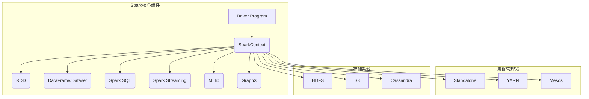
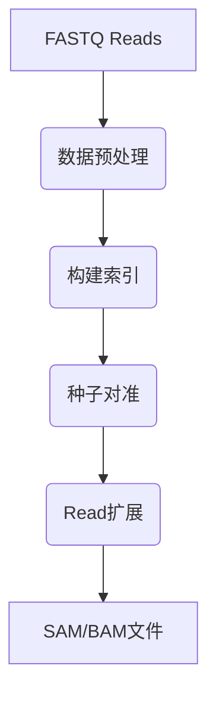

# 《Spark与生物信息学》

## 1. 背景介绍

### 1.1 问题的由来

生物信息学是一门融合生物学、计算机科学和信息技术的交叉学科,旨在通过计算机技术和数学模型来解释生物现象并预测生物行为。随着高通量测序技术的快速发展,生物数据的产生呈指数级增长,给生物信息学数据处理和分析带来了巨大挑战。传统的数据处理方法已经无法满足当前海量生物数据的需求,迫切需要高性能、可扩展的大数据处理框架。

### 1.2 研究现状

Apache Spark作为一种快速、通用的大数据处理引擎,凭借其内存计算优势、高度容错性和易用性,在生物信息学领域得到了广泛应用。与传统的MapReduce框架相比,Spark可以更高效地处理迭代计算和机器学习算法,这对于生物数据分析至关重要。目前,Spark已经被广泛用于基因组测序数据处理、蛋白质结构预测、生物pathway分析等多个生物信息学领域。

### 1.3 研究意义

本文旨在系统地介绍Spark在生物信息学中的应用,包括核心概念、算法原理、数学模型、实际案例等,为读者提供一个全面的认识。通过深入探讨Spark在生物数据处理中的优势和挑战,可以帮助研究人员更好地利用大数据技术推进生物信息学的发展。

### 1.4 本文结构

本文共分为9个部分:第1部分介绍研究背景;第2部分阐述Spark与生物信息学的核心概念;第3部分详细解释核心算法原理;第4部分讲解相关数学模型和公式;第5部分提供实际代码案例;第6部分探讨应用场景;第7部分推荐工具和资源;第8部分总结发展趋势和挑战;第9部分列出常见问题解答。

## 2. 核心概念与联系

在深入探讨Spark在生物信息学中的应用之前,我们需要了解一些核心概念:

### 2.1 Apache Spark

Apache Spark是一个开源的大数据处理框架,它基于内存计算,能够高效地处理批处理和流式计算任务。Spark提供了多种高级API,如RDD(Resilient Distributed Dataset)、DataFrame和Dataset,支持多种编程语言,如Scala、Java、Python和R。此外,Spark还集成了多种库,如SparkSQL、MLlib、GraphX和Spark Streaming,可用于构建端到端的大数据应用程序。



### 2.2 生物信息学数据

生物信息学涉及多种数据类型,包括基因组测序数据、蛋白质结构数据、表达谱数据、蛋白质相互作用数据等。这些数据通常具有4V特征:大量(Volume)、多样(Variety)、高速(Velocity)和复杂(Veracity)。处理和分析这些海量、异构、动态和噪声数据,对计算框架提出了巨大挑战。

### 2.3 Spark与生物信息学的联系

Spark作为一种通用的大数据处理引擎,其内存计算优势、容错性和可扩展性使其非常适合处理生物信息学数据。Spark可以高效地执行迭代计算、机器学习算法和实时流处理,这些都是生物数据分析的关键需求。此外,Spark丰富的生态系统也为生物信息学应用程序的开发提供了强大支持。

## 3. 核心算法原理 & 具体操作步骤  

### 3.1 算法原理概述

在生物信息学中,Spark常用于执行以下几种核心算法:

1. **Read Mapping**: 将原始的基因组测序读段(Reads)比对到参考基因组上,是基因组数据分析的第一步。

2. **Read Assembly**: 将重叠的Reads拼接成较长的连续序列,用于重构新的基因组。

3. **Variant Calling**: 通过比较测序Reads与参考基因组的差异,鉴定基因变异位点。

4. **Expression Analysis**: 分析基因表达谱数据,鉴定差异表达基因及其生物学功能。

5. **Pathway Analysis**: 研究生物分子在细胞内的相互作用网络,揭示调控通路。

这些算法通常涉及大量的数据处理和迭代计算,Spark的内存计算模型可以显著提高性能。

### 3.2 算法步骤详解

以Read Mapping算法为例,具体步骤如下:

1. **数据加载**: 使用Spark的文本文件读取接口(如textFile)将FASTQ格式的测序读段数据加载到RDD中。

2. **数据预处理**: 对原始Reads进行质量控制、接头去除等预处理,过滤掉低质量数据。

3. **构建索引**: 使用Burrows-Wheeler Transform(BWT)等算法,为参考基因组构建高效索引。

4. **种子对准**: 将每条Read的子序列(种子)与参考基因组进行精确匹配,找到候选位置。

5. **Read扩展**: 从种子位置出发,以Read为参考,对参考基因组进行局部比对,延伸匹配区域。

6. **结果输出**: 将最佳比对结果输出为标准的SAM/BAM格式文件。



上述过程中,步骤3-5涉及大量的数据shuffle和迭代计算,可以利用Spark的内存计算优势加速处理。

### 3.3 算法优缺点

Spark实现的生物信息学算法具有以下优缺点:

**优点**:
- 内存计算,避免了磁盘I/O开销
- 容错性强,可自动恢复失败任务
- 支持迭代计算,适合机器学习算法
- 易于使用,提供多种高级API
- 可扩展性好,支持横向扩展集群

**缺点**:
- 内存开销较大,对硬件要求高
- Shuffle操作代价较高,影响性能
- 调试和监控较为困难
- 社区支持有限,缺乏生物领域专用工具

### 3.4 算法应用领域

Spark实现的生物信息学算法已广泛应用于以下领域:

- 基因组测序数据处理
- 转录组测序数据分析
- 蛋白质结构预测
- 生物pathway分析
- 系统生物学建模
- 个性化医疗
- 农业育种

## 4. 数学模型和公式 & 详细讲解 & 举例说明

生物信息学算法通常涉及复杂的数学模型和统计方法,本节将重点介绍几种常用模型。

### 4.1 数学模型构建

#### 4.1.1 隐马尔可夫模型(HMM)

隐马尔可夫模型是一种统计模型,广泛应用于生物序列分析。HMM由一个隐藏的马尔可夫链和一个观测序列组成,常用于基因预测、蛋白质结构域识别等任务。

HMM可以形式化定义为:

$$\lambda = (A, B, \pi)$$

其中:
- $A$ 是状态转移概率矩阵: $A = \{a_{ij}\}$, $a_{ij} = P(q_{t+1} = j | q_t = i)$
- $B$ 是观测概率矩阵: $B = \{b_j(k)\}$, $b_j(k) = P(o_t = v_k | q_t = j)$
- $\pi$ 是初始状态概率向量: $\pi = \{\pi_i\}$, $\pi_i = P(q_1 = i)$

HMM的三个基本问题是:

1. 概率计算: 给定模型$\lambda$和观测序列$O$,计算$P(O|\lambda)$
2. 学习: 给定观测序列$O$,估计模型参数$\lambda = (A, B, \pi)$
3. 预测: 给定模型$\lambda$和观测序列$O$,求最可能的状态序列

这些问题可以使用前向-后向算法、Viterbi算法和Baum-Welch算法等有效求解。

#### 4.1.2 马尔可夫随机场(MRF)

马尔可夫随机场是一种基于无向图的概率模型,常用于蛋白质结构预测、基因调控网络构建等。MRF由无向图$G=(V, E)$和潜在函数$\Psi$组成,定义为:

$$P(X=x) = \frac{1}{Z} \prod_{c \in C} \Psi_c(x_c)$$

其中:
- $X$ 是随机变量向量,对应图$G$中的节点
- $C$ 是最大团(maximal clique),是$G$中所有极大完全子图的集合
- $\Psi_c$ 是团势函数(clique potential),定义在团$c$上
- $Z$ 是配分函数,用于归一化

MRF的关键问题是参数估计(学习)和推断(预测),可以使用伪似然估计、Gibbs采样等方法求解。

### 4.2 公式推导过程

这里以HMM的前向算法为例,推导概率计算公式。

已知:
- 隐状态序列: $Q = \{q_1, q_2, \cdots, q_T\}$
- 观测序列: $O = \{o_1, o_2, \cdots, o_T\}$
- 前向变量: $\alpha_t(i) = P(o_1, o_2, \cdots, o_t, q_t = i | \lambda)$

目标是计算观测序列的概率 $P(O|\lambda)$。

推导过程:

1) 初始化
$$\alpha_1(i) = \pi_i b_i(o_1), \quad 1 \leq i \leq N$$

2) 递推
$$\alpha_{t+1}(j) = \Big[\sum_{i=1}^N \alpha_t(i)a_{ij}\Big]b_j(o_{t+1}), \quad 1\leq j\leq N, \quad 1\leq t\leq T-1$$

3) 终止
$$P(O|\lambda) = \sum_{i=1}^N \alpha_T(i)$$

这个算法的时间复杂度是$\mathcal{O}(N^2T)$,其中$N$是隐状态个数,$T$是观测序列长度。Spark可以通过并行计算来加速这一过程。

### 4.3 案例分析与讲解

以基因注释为例,我们可以使用HMM来预测基因的结构域(如外显子、内含子等)。假设有一段DNA序列:

```
AGCTTCCATGCCTGCATCGGACGGGTTCCATGCCTGCATCGGACGGGTTCCATGCCTGCATCGGACGGGTT
```

我们将其作为观测序列$O$输入到HMM中,HMM包含3个隐状态:外显子(E)、内含子(I)和间隔区(N)。通过训练得到的HMM参数为:

$$\begin{aligned}
\pi &= (0.6, 0.2, 0.2) \\
A &= \begin{pmatrix}
0.4 & 0.6 & 0 \\
0.5 & 0 & 0.5\\
0 & 0.5 & 0.5
\end{pmatrix} \\
B &= \begin{pmatrix}
0.28 & 0.22 & 0.28 & 0.22\\
0.21 & 0.29 & 0.21 & 0.29\\
0.25 & 0.25 & 0.25 & 0.25
\end{pmatrix}
\end{aligned}$$

其中,观测概率矩阵$B$对应4种核苷酸(A,C,G,T)的发射概率。

使用前向算法计算$P(O|\lambda)$,并使用Viterbi算法求解最可能的隐状态序列,就可以得到基因的注释结果。

### 4.4 常见问题解答

1. **Spark如何处理大规模基因数据?**

   Spark支持