# Spark原理与代码实例讲解

## 1. 背景介绍

### 1.1 问题的由来

在当今大数据时代，海量的结构化和非结构化数据不断涌现，传统的数据处理方式已经无法满足实时计算和分析的需求。因此，需要一种能够高效处理大规模数据集的新型计算框架。Apache Spark 应运而生，它是一个快速、通用且可扩展的大数据处理引擎。

### 1.2 研究现状

Apache Spark 自 2014 年发布以来，已经成为大数据处理领域最受欢迎的开源项目之一。它提供了一种统一的框架，能够支持批处理、流处理、机器学习和图计算等多种应用场景。与传统的 MapReduce 框架相比，Spark 具有更高的计算效率和更丰富的功能。

### 1.3 研究意义

深入理解 Apache Spark 的原理和实现细节对于开发者和数据工程师来说至关重要。这不仅有助于更好地利用 Spark 的强大功能,还可以帮助优化代码性能,提高大数据处理的效率。同时,了解 Spark 的设计思想和架构也有助于开发者设计和实现自己的大数据处理系统。

### 1.4 本文结构

本文将从以下几个方面全面介绍 Apache Spark:

1. 核心概念与联系
2. 核心算法原理与具体操作步骤
3. 数学模型和公式详细讲解与案例分析
4. 项目实践:代码实例和详细解释
5. 实际应用场景
6. 工具和资源推荐
7. 总结:未来发展趋势与挑战
8. 附录:常见问题与解答

## 2. 核心概念与联系

Apache Spark 是一个统一的大数据处理引擎,它包含了多个紧密集成的核心组件,每个组件都有自己的特定用途和功能。下面我们将介绍 Spark 的核心概念及它们之间的关系。

```mermaid
graph TD
    Spark(Apache Spark)
    Spark --> SparkCore(Spark Core)
    Spark --> SparkSQL(Spark SQL)
    Spark --> SparkStreaming(Spark Streaming) 
    Spark --> MLlib(MLlib)
    Spark --> GraphX(GraphX)

    SparkCore --> RDD(Resilient Distributed Dataset)
    SparkCore --> DAG(Directed Acyclic Graph)
    SparkCore --> TaskScheduler(Task Scheduler)
    SparkCore --> MemoryManager(Memory Manager)
    SparkCore --> ExecutionModel(Execution Model)

    SparkSQL --> DataFrames(DataFrames)
    SparkSQL --> DatasetAPI(Dataset API)
    SparkSQL --> CatalystOptimizer(Catalyst Optimizer)

    SparkStreaming --> DStream(Discretized Stream)
    SparkStreaming --> InputDStream(Input DStream)
    SparkStreaming --> ReceiverTracker(Receiver Tracker)

    MLlib --> MLAlgorithms(ML Algorithms)
    MLlib --> FeatureEngineering(Feature Engineering)
    MLlib --> Pipelines(Pipelines)

    GraphX --> Graph(Graph)
    GraphX --> Pregel(Pregel API)
    GraphX --> GraphAlgorithms(Graph Algorithms)
```



### 2.1 Spark Core

Spark Core 是 Apache Spark 的核心模块,它提供了分布式计算的基础功能。其中最重要的概念是 RDD (Resilient Distributed Dataset),它是一种分布式内存数据集,是 Spark 进行并行计算的基础数据结构。

Spark Core 还包括了 DAG (Directed Acyclic Graph) 调度程序、任务调度器、内存管理器和执行模型等重要组件,这些组件共同构建了 Spark 的计算引擎。

### 2.2 Spark SQL

Spark SQL 是 Spark 用于结构化数据处理的模块。它提供了 DataFrames 和 Dataset API,允许使用类似 SQL 的语法来查询数据。Spark SQL 还包含了 Catalyst 优化器,用于优化查询计划并生成高效的执行代码。

### 2.3 Spark Streaming

Spark Streaming 是 Spark 用于流式数据处理的模块。它基于 Spark Core 的 RDD,将实时数据流划分为一系列的小批次,并使用类似批处理的方式进行处理。Spark Streaming 包括 DStream、输入 DStream 和接收器跟踪器等核心概念。

### 2.4 MLlib

MLlib 是 Spark 的机器学习库,它提供了多种机器学习算法的实现,包括分类、回归、聚类和协同过滤等。MLlib 还包含了特征工程和机器学习管道等功能,可以方便地构建和调优机器学习模型。

### 2.5 GraphX

GraphX 是 Spark 用于图形计算和图形分析的模块。它提供了一个基于 Spark RDD 的分布式图形数据结构,以及 Pregel API 和图形算法库,用于高效地执行图形计算和分析任务。

## 3. 核心算法原理与具体操作步骤

### 3.1 算法原理概述

Apache Spark 的核心算法原理是基于 RDD (Resilient Distributed Dataset) 和 DAG (Directed Acyclic Graph) 执行模型。RDD 是一种分布式内存数据集,它可以在集群中的多个节点上进行并行计算。DAG 是一种有向无环图,用于描述 RDD 之间的依赖关系和转换操作。

Spark 将用户的计算任务表示为一系列 RDD 转换操作,并构建相应的 DAG。然后,Spark 的任务调度器根据 DAG 生成一系列任务,并将这些任务分发到集群中的执行器进行计算。执行器负责执行分配给它的任务,并将计算结果存储在内存或磁盘中。

### 3.2 算法步骤详解

1. **创建 RDD**

   用户可以从外部数据源(如文件或集合)创建初始 RDD,也可以通过对现有 RDD 进行转换操作生成新的 RDD。

2. **构建 DAG**

   每个 RDD 转换操作都会生成一个新的 RDD,并在 DAG 中创建一个新的节点。这些节点之间的边表示 RDD 之间的依赖关系。

3. **DAG 优化**

   Spark 的 DAG 调度程序会对 DAG 进行优化,例如合并一些小任务、重新分区等,以提高执行效率。

4. **任务划分**

   DAG 调度程序将 DAG 划分为多个阶段(Stage),每个阶段包含一个或多个任务(Task)。

5. **任务调度**

   任务调度器根据集群资源情况,将任务分发到执行器上执行。

6. **任务执行**

   执行器执行分配给它的任务,并将计算结果存储在内存或磁盘中。

7. **结果汇总**

   所有任务完成后,Spark 将结果 RDD 的分区数据汇总,并返回给用户。

### 3.3 算法优缺点

**优点:**

- **内存计算**:Spark 能够充分利用集群内存进行计算,避免了频繁的磁盘 I/O,从而提高了计算效率。
- **容错性**:Spark 的 RDD 具有容错性,可以自动从故障中恢复,保证计算的可靠性。
- **通用性**:Spark 提供了统一的框架,支持批处理、流处理、机器学习和图计算等多种应用场景。
- **易用性**:Spark 提供了多种高级 API,如 DataFrames 和 Dataset API,使得开发者可以更加轻松地进行数据处理和分析。

**缺点:**

- **内存开销**:由于 Spark 主要在内存中进行计算,因此对内存的需求较高,可能会导致内存不足的问题。
- **延迟**:Spark 需要先构建 DAG 和划分任务,因此在处理小数据集时可能会比直接计算延迟更高。
- **小文件问题**:Spark 在处理大量小文件时可能会遇到性能bottleneck,因为需要创建大量的任务和 RDD 分区。
- **流式计算限制**:Spark Streaming 采用微批次模式,因此在处理低延迟流式数据时可能会存在一些限制。

### 3.4 算法应用领域

Apache Spark 由于其通用性和高效性,在多个领域都有广泛的应用:

- **大数据处理**:Spark 可以高效地处理海量的结构化和非结构化数据,如日志分析、网络数据处理等。
- **机器学习与数据分析**:Spark 提供了 MLlib 和 DataFrame/Dataset API,可以方便地进行机器学习建模和数据分析。
- **流式计算**:Spark Streaming 可以用于实时数据处理,如网络日志监控、在线推荐系统等。
- **图计算**:GraphX 模块支持图形计算和分析,可应用于社交网络分析、推荐系统等领域。

## 4. 数学模型和公式与详细讲解与举例说明

### 4.1 数学模型构建

在 Apache Spark 中,常见的数学模型包括:

1. **机器学习模型**

   Spark MLlib 提供了多种机器学习算法的实现,如逻辑回归、决策树、K-Means 聚类等。这些算法都基于特定的数学模型,如逻辑回归基于对数几率模型。

2. **图形模型**

   GraphX 中的图形算法通常基于图论和线性代数,如 PageRank 算法基于马尔可夫链模型。

3. **优化模型**

   Spark 的 DataFrame/Dataset API 中的一些优化器,如 Catalyst 优化器,会使用代数模型和规则系统来优化查询计划。

下面我们将以 K-Means 聚类算法为例,介绍其数学模型的构建过程。

K-Means 聚类算法的目标是将 $n$ 个数据点 $\{x_1, x_2, \dots, x_n\}$ 划分为 $k$ 个簇 $\{C_1, C_2, \dots, C_k\}$,使得每个数据点都属于离它最近的簇中心,并且所有簇内数据点到簇中心的距离之和最小。

我们定义簇内平方和 $J$ 作为目标函数:

$$J = \sum_{i=1}^{k}\sum_{x \in C_i} \|x - \mu_i\|^2$$

其中 $\mu_i$ 表示第 $i$ 个簇的中心点。优化目标是找到 $k$ 个簇中心 $\{\mu_1, \mu_2, \dots, \mu_k\}$,使得 $J$ 最小。

### 4.2 公式推导过程

K-Means 算法通过迭代的方式求解最优簇中心,具体步骤如下:

1. 随机初始化 $k$ 个簇中心 $\mu_1, \mu_2, \dots, \mu_k$。
2. 对于每个数据点 $x$,计算它与所有簇中心的距离,将它划分到距离最近的簇中。
3. 对于每个簇 $C_i$,重新计算簇中心 $\mu_i$,作为簇内所有点的均值:

$$\mu_i = \frac{1}{|C_i|}\sum_{x \in C_i}x$$

4. 重复步骤 2 和 3,直到簇中心不再发生变化或达到最大迭代次数。

可以证明,在每一次迭代中,簇内平方和 $J$ 都会减小或保持不变,因此算法将收敛到一个局部最优解。

### 4.3 案例分析与讲解

我们以 Spark 中的 K-Means 实现为例,展示如何应用 K-Means 算法进行聚类分析。

假设我们有一个包含客户购买记录的数据集,每条记录包含客户 ID、购买金额和购买时间等字段。我们希望根据客户的购买行为对他们进行聚类,以便为不同类型的客户提供个性化的营销策略。

```scala
// 导入必要的库
import org.apache.spark.ml.clustering.KMeans
import org.apache.spark.ml.feature.VectorAssembler

// 加载数据
val data = spark.read.format("csv")
  .option("header", "true")
  .option("inferSchema", "true")
  .load("customer_data.csv")

// 特征工程
val assembler = new VectorAssembler()
  .setInputCols(Array("purchase_amount", "purchase_time"))
  .setOutputCol("features")
val transformed = assembler.transform(data)

// 训练 K-Means 模型
val kmeans = new KMeans().setK(3).setSeed(12345)
val model = kmeans.fit(transformed.select("features"))

// 评估模型
val predictions = model.transform(transformed)
predictions.show()
```

在这个例子中,我们首先加载包含客户购买记录的