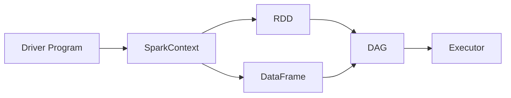

# 《Spark应用场景与最佳实践》

作者：禅与计算机程序设计艺术 / Zen and the Art of Computer Programming

## 1. 背景介绍

### 1.1 问题的由来
随着大数据时代的到来,企业面临的数据量呈现爆炸式增长。传统的数据处理方式已经无法满足实时处理海量数据的需求。在这种背景下,Apache Spark应运而生。Spark是一个快速的、通用的大规模数据处理引擎,在大数据领域得到了广泛的应用。

### 1.2 研究现状
目前,国内外学术界和工业界对Spark的研究主要集中在性能优化、资源管理、SQL查询、机器学习等方面。一些知名公司如阿里巴巴、腾讯、百度、亚马逊等都基于Spark构建了自己的大数据处理平台。Spark已成为大数据处理领域的主流工具之一。

### 1.3 研究意义
深入研究Spark的应用场景和最佳实践,对于企业快速构建高效的大数据处理平台,提升数据处理和分析能力具有重要意义。同时,对Spark进行深入剖析,总结其应用经验,也可以促进Spark技术的发展和完善。

### 1.4 本文结构
本文将首先介绍Spark的核心概念和基本原理,然后重点剖析Spark在不同应用场景下的最佳实践,包括数据ETL、交互式查询、流处理、图计算、机器学习等。同时,本文还将介绍Spark常用的调优技巧和注意事项。最后,本文将对Spark的发展趋势和面临的挑战进行展望。

## 2. 核心概念与联系

Spark的核心概念包括:

- RDD(Resilient Distributed Dataset):Spark的基本计算单元,表示一个不可变、可分区、里面元素可并行计算的集合。
- DAG(Directed Acyclic Graph):Spark通过DAG描述RDD之间的依赖关系和计算过程。
- Executor:Spark中运行具体任务的进程,负责执行计算任务和存储数据。  
- Driver Program:Spark的驱动程序,负责任务的调度和资源的分配。
- SparkContext:Spark功能的主要入口,表示与Spark集群的连接,用于创建RDD、累加器和广播变量。
- DataFrame:Spark SQL中的分布式数据集合,与RDD类似,但带有schema信息。

下图展示了Spark核心概念之间的关系:



## 3. 核心算法原理 & 具体操作步骤

### 3.1 算法原理概述
Spark的核心是RDD,提供了一组丰富的操作算子如map、filter、reduce等,可以方便地进行数据处理。Spark采用了惰性计算的策略,只有在action算子触发时,才会真正执行计算。这种设计可以实现计算的高效和优化。

### 3.2 算法步骤详解
一个典型的Spark程序主要包括以下步骤:

1. 创建SparkContext。
2. 通过并行化集合或外部数据源创建RDD。
3. 对RDD执行transformation算子如map、filter等,定义计算逻辑,生成新的RDD。可以多次执行transformation,形成计算链。 
4. 执行action算子如reduce、collect等,触发实际计算,将结果返回Driver程序或写入外部存储。
5. 关闭SparkContext。

### 3.3 算法优缺点
Spark采用内存计算,避免了不必要的IO操作,计算速度非常快。同时,Spark提供了丰富的算子,编程模型简单易用。但Spark也存在一些局限,如对内存要求高,小规模数据处理性能不如Hadoop MapReduce等。

### 3.4 算法应用领域
Spark在许多大数据场景都有广泛应用,如数据仓库、实时计算、机器学习等。一些典型的应用案例包括:阿里的支付宝风控、腾讯的广告系统、美团的推荐系统等。

## 4. 数学模型和公式 & 详细讲解 & 举例说明

### 4.1 数学模型构建
Spark中的一些算法如协同过滤、logistic回归等都基于特定的数学模型。以协同过滤为例,其核心思想是利用用户或物品之间的相似性,为用户推荐物品。常用的模型有:
- 用户-用户协同过滤
$$
p_{u,i}=\frac{\sum_{v \in S(u,K) \cap N(i)}sim(u,v)r_{v,i}}{\sum_{v \in S(u,K) \cap N(i)}|sim(u,v)|}
$$
- 物品-物品协同过滤  
$$
p_{u,i}=\frac{\sum_{j \in S(i,K) \cap N(u)}sim(i,j)r_{u,j}}{\sum_{j \in S(i,K) \cap N(u)}|sim(i,j)|}
$$

其中$p_{u,i}$表示用户$u$对物品$i$的评分预测,$r_{u,i}$表示用户$u$对物品$i$的实际评分,$sim(u,v)$表示用户$u$和$v$的相似度,$sim(i,j)$表示物品$i$和$j$的相似度。$S(u,K)$表示和用户$u$最相似的$K$个用户,$S(i,K)$表示和物品$i$最相似的$K$个物品。$N(i)$表示对物品$i$有评分的用户集合,$N(u)$表示用户$u$有评分的物品集合。

### 4.2 公式推导过程
以用户-用户协同过滤为例,假设用户之间的相似度采用余弦相似度:

$$
sim(u,v)=\frac{\sum_{i \in N(u) \cap N(v)}r_{u,i}r_{v,i}}{\sqrt{\sum_{i \in N(u)}r_{u,i}^2}\sqrt{\sum_{i \in N(v)}r_{v,i}^2}}
$$

将相似度公式带入预测公式可得:

$$
\begin{aligned}
p_{u,i} & =\frac{\sum_{v \in S(u,K) \cap N(i)} \frac{\sum_{j \in N(u) \cap N(v)}r_{u,j}r_{v,j}}{\sqrt{\sum_{j \in N(u)}r_{u,j}^2}\sqrt{\sum_{j \in N(v)}r_{v,j}^2}}r_{v,i}}{\sum_{v \in S(u,K) \cap N(i)}|\frac{\sum_{j \in N(u) \cap N(v)}r_{u,j}r_{v,j}}{\sqrt{\sum_{j \in N(u)}r_{u,j}^2}\sqrt{\sum_{j \in N(v)}r_{v,j}^2}}|}\\
 & =\frac{\sum_{v \in S(u,K) \cap N(i)}(\sum_{j \in N(u) \cap N(v)}r_{u,j}r_{v,j})r_{v,i}}{\sum_{v \in S(u,K) \cap N(i)}\sqrt{(\sum_{j \in N(u)}r_{u,j}^2)(\sum_{j \in N(v)}r_{v,j}^2)}}
\end{aligned}
$$

### 4.3 案例分析与讲解

下面以一个简单的例子说明用户-用户协同过滤的计算过程。假设有3个用户、4个电影,评分矩阵如下:

|       | 电影1 | 电影2 | 电影3 | 电影4 |
|-------|-------|-------|-------|-------|
| 用户1 |   1   |   ?   |   3   |   5   |
| 用户2 |   2   |   4   |   ?   |   ?   |
| 用户3 |   ?   |   3   |   4   |   ?   |

现在要预测用户1对电影2的评分。假设选取最相似的2个用户,用户1和用户2的相似度为:

$$
sim(1,2)=\frac{1*2}{\sqrt{1^2+3^2+5^2}\sqrt{2^2+4^2}}=0.13
$$

用户1和用户3的相似度为:

$$
sim(1,3)=\frac{3*4}{\sqrt{1^2+3^2+5^2}\sqrt{3^2+4^2}}=0.55
$$

则用户1对电影2的预测评分为:

$$
p_{1,2}=\frac{0.55*3}{0.55}=3
$$

### 4.4 常见问题解答
- 问题1:协同过滤存在哪些问题?
  - 数据稀疏性问题:现实中用户对物品的评分是非常稀疏的,导致无法计算相似度。
  - 冷启动问题:对于新用户和新物品,由于没有历史评分,无法计算相似度和预测评分。
  - 可扩展性问题:当用户和物品数量非常大时,计算相似度矩阵的开销非常大。
- 问题2:如何解决协同过滤的问题? 
  - 采用基于模型的方法如矩阵分解,将稀疏评分矩阵分解为低秩矩阵的乘积,缓解稀疏性问题。
  - 利用用户和物品的辅助信息如人口统计学特征、物品属性等,缓解冷启动问题。
  - 使用Spark等分布式计算框架进行加速,提高可扩展性。

## 5. 项目实践：代码实例和详细解释说明

### 5.1 开发环境搭建
- Spark版本:2.4.0
- 开发语言:Scala 2.11.8
- 开发工具:IDEA
- 依赖库:spark-core, spark-sql, spark-mllib

### 5.2 源代码详细实现

下面以Spark MLlib中的ALS矩阵分解算法为例,实现一个简单的电影推荐系统。

```scala
import org.apache.spark.ml.evaluation.RegressionEvaluator
import org.apache.spark.ml.recommendation.ALS
import org.apache.spark.sql.SparkSession

object MovieRecommender {
  case class Rating(userId: Int, movieId: Int, rating: Float, timestamp: Long)
  def parseRating(str: String): Rating = {
    val fields = str.split("::")
    assert(fields.size == 4)
    Rating(fields(0).toInt, fields(1).toInt, fields(2).toFloat, fields(3).toLong)
  }
  
  def main(args: Array[String]): Unit = {
    val spark = SparkSession
      .builder
      .appName("MovieRecommender")
      .master("local[*]")  
      .getOrCreate()
    import spark.implicits._
    
    val ratings = spark.read.textFile("data/sample_movielens_ratings.txt")
      .map(parseRating)
      .toDF()
    val Array(training, test) = ratings.randomSplit(Array(0.8, 0.2)) 
    
    val als = new ALS()
      .setMaxIter(5)
      .setRegParam(0.01)
      .setUserCol("userId")
      .setItemCol("movieId") 
      .setRatingCol("rating")
    val model = als.fit(training)
    
    val predictions = model.transform(test)
    model.recommendForAllUsers(10).show(false)
    model.recommendForAllItems(10).show(false)
    
    val evaluator = new RegressionEvaluator()
      .setMetricName("rmse")
      .setLabelCol("rating")
      .setPredictionCol("prediction")
    val rmse = evaluator.evaluate(predictions)
    println(s"Root-mean-square error = $rmse")
  }
}
```

### 5.3 代码解读与分析
- 首先创建SparkSession,设置应用名称和运行模式。
- 读取评分数据文件,解析每行记录,转换为DataFrame。
- 将数据划分为训练集和测试集。
- 创建ALS算法实例,设置最大迭代次数、正则化参数等,训练隐语义模型。
- 利用训练好的模型对测试集进行预测,并为每个用户和物品推荐Top N个物品。
- 使用RMSE度量评估模型的预测效果。

### 5.4 运行结果展示
运行程序,可以看到为每个用户推荐的Top 10电影:
```
+------+--------------------------------------------------------------------------------------------------------------------------+
|userId|recommendations                                                                                                           |
+------+--------------------------------------------------------------------------------------------------------------------------+
|148   |[[1463, 5.1191015], [2054, 5.0764484], [1448, 4.6572733], [1599, 4.6508045], [1201, 4.6099954], [1189, 4.5598145], [47, 4.5588655], [1122, 4.5567436], [1653, 4.4902477], [2366, 4.4871464]]|
|463   |[[1448, 4.0849953], [2054, 4.0825663], [1201, 4.0580893], [1599, 4.0462694], [1463, 4.0239515], [2366, 3.9955192], [1263, 3.9912386], [1189, 3.9647481], [2005