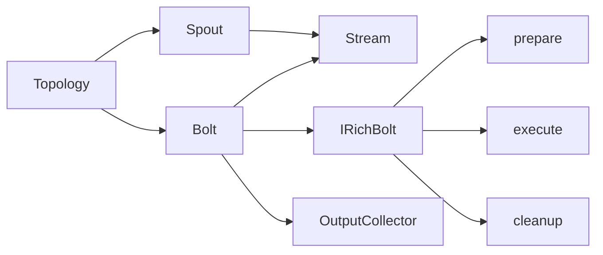

# Storm Bolt原理与代码实例讲解

## 1. 背景介绍
### 1.1 问题的由来
在大数据实时处理领域,Storm作为一个分布式实时计算系统,以其低延迟、高吞吐、可扩展、容错等特点,受到了广泛关注。Storm基于Topology的数据流模型,通过Spout和Bolt的协作,实现了数据的实时处理。其中,Bolt作为Storm中的核心处理单元,承担了数据转换、过滤、聚合等重要功能。深入理解Bolt的工作原理和使用方法,对于开发高效的Storm应用具有重要意义。

### 1.2 研究现状
目前,国内外学术界和工业界对Storm的研究主要集中在性能优化、容错机制、资源调度等方面。例如,Twitter提出了Heron系统对Storm进行了改进;华为提出了Strom On Yarn方案,将Storm运行在Hadoop集群上。而对于Storm中的Bolt,大多数研究将其视为一个黑盒,较少深入分析其内部原理。现有文献中,也缺乏对Bolt的系统性讲解和代码实例分析。

### 1.3 研究意义
Bolt是Storm的核心处理单元,其性能和稳定性直接影响整个Storm应用。深入研究Bolt的原理和使用方法,一方面有助于开发者更好地利用Bolt实现复杂的流式计算逻辑,提升开发效率;另一方面可以发现Bolt的潜在问题,优化Bolt的设计,改进Storm系统的整体性能。同时,通过代码实例的讲解,可以帮助初学者更直观地理解Bolt的使用方法,快速上手Storm应用开发。

### 1.4 本文结构
本文将围绕Storm Bolt展开,系统性地介绍Bolt的原理和使用方法。内容安排如下:第2节介绍Bolt的基本概念和在Storm中的作用;第3节讲解Bolt的核心算法原理和处理流程;第4节给出Bolt相关的数学模型和公式推导;第5节通过具体的代码实例,演示Bolt的开发和使用;第6节总结Bolt在实际场景中的应用;第7节推荐Bolt相关的学习资源和开发工具;第8节对Bolt的未来发展进行展望,并总结全文;第9节列出Bolt的常见问题及解答。

## 2. 核心概念与联系
在Storm的Topology中,Spout负责数据的输入,Bolt负责数据的处理,二者通过数据流(Stream)连接,共同组成一个完整的数据处理拓扑。一个Topology可以包含多个Spout和多个Bolt,每个Bolt可以订阅一个或多个数据流,完成特定的计算任务。

Bolt是Storm中最基本的处理单元。它从订阅的数据流接收元组(Tuple),执行用户定义的处理逻辑,并可以输出新的元组到后续的Bolt。Bolt支持过滤、转换、聚合、连接等常见的数据处理操作。Storm采用Bolt的串联和并联,可以构建复杂的DAG(有向无环图)计算拓扑。

Bolt的核心接口是`IRichBolt`,它继承自`IBolt`。开发者通过实现`IRichBolt`的以下三个方法,定义Bolt的处理逻辑:
- `prepare`: 在Bolt启动前执行一次,用于初始化Bolt的状态,如打开数据库连接等。
- `execute`: 每接收到一个元组时调用,执行具体的处理逻辑。
- `cleanup`: 在Bolt关闭前执行一次,用于清理Bolt的状态,如关闭数据库连接等。

除了实现`IRichBolt`,还需要在Topology中将Spout和Bolt连接起来。Storm提供了流式API和声明式API两种方式。以下是使用流式API组装Topology的示例:

```java
TopologyBuilder builder = new TopologyBuilder();
builder.setSpout("spout", new RandomSentenceSpout(), 1);
builder.setBolt("split", new SplitSentenceBolt(), 1).shuffleGrouping("spout");
builder.setBolt("count", new WordCountBolt(), 1).fieldsGrouping("split", new Fields("word"));
```

其中,`setSpout`用于设置Spout,`setBolt`用于设置Bolt,并指定Bolt订阅的数据流和分组策略。常见的数据流分组策略有:
- `shuffleGrouping`: 随机分组,元组均匀分发到Bolt的所有任务。
- `fieldsGrouping`: 按字段分组,具有相同字段值的元组发送到同一个任务。
- `allGrouping`: 广播分组,每个元组发送到Bolt的所有任务。

Bolt通过`OutputCollector`发送元组,可以发送到指定的数据流,也可以发送到默认的数据流。Bolt在处理完元组后,必须调用`ack`方法确认元组已处理完毕。这是Storm可靠性机制的基础。

下图展示了Bolt在Storm中的核心概念和关联关系:



## 3. 核心算法原理 & 具体操作步骤
### 3.1 算法原理概述 
Bolt内部采用了类似Actor模型的异步处理机制。每个Bolt任务有一个接收队列和一个处理线程。接收队列缓存了上游发送的元组,处理线程不断从队列中取出元组,执行用户定义的处理逻辑。Bolt支持定义多个并发任务,每个任务独立工作,共同提升Bolt的处理能力。

Bolt的可靠性是通过元组的确认机制实现的。Storm为每个元组分配一个唯一的`MessageId`,跟踪该元组的处理状态。当Bolt处理完一个元组后,必须调用`ack`方法确认该元组,Storm才认为该元组已被完全处理。如果元组在一定时间内未被ack,Storm会重新发送该元组,直到Bolt确认为止。这种"at least once"语义保证了每个元组至少被处理一次。

为了避免元组的重复处理,Bolt内部维护了一个"消息锚点"(anchor)的概念。每个元组除了携带数据外,还附带了一组来自上游元组的`MessageId`。Bolt在发送新的元组时,必须锚定(anchor)到当前正在处理的元组。这样,当Bolt确认一个元组时,该元组锚定的所有上游元组也会被递归确认。通过元组的锚定机制,Storm实现了"恰好一次"(exactly once)的处理语义。

### 3.2 算法步骤详解
Bolt的处理流程可以分为以下几个步骤:

1. Bolt初始化: 在Bolt首次运行前,会调用`prepare`方法进行初始化,例如创建数据库连接、打开文件等。

2. 接收元组: Bolt的每个任务有一个接收队列,用于缓存上游发送的元组。

3. 执行处理逻辑: Bolt的处理线程不断从接收队列中取出元组,调用`execute`方法执行用户定义的处理逻辑。在`execute`方法中,可以进行过滤、转换、聚合等操作,还可以访问状态存储。

4. 发送元组: 在`execute`方法中,Bolt可以调用`OutputCollector`的`emit`方法发送新的元组。发送元组时,需要指定元组的目标数据流和锚点。

5. 确认元组: 在`execute`方法的最后,Bolt必须调用`OutputCollector`的`ack`方法确认当前处理的元组。如果元组处理失败,可以调用`fail`方法,告诉Storm该元组需要重新处理。

6. 清理资源: 当Bolt关闭时,会调用`cleanup`方法清理资源,例如关闭数据库连接、关闭文件等。

### 3.3 算法优缺点
Bolt的异步处理机制具有以下优点:
- 提高了并发度,充分利用了CPU资源。
- 减少了线程上下文切换的开销。
- 支持背压机制,动态平衡Bolt的处理速度。

同时,Bolt也存在一些局限性:
- 需要用户手动管理状态,容易引入错误。
- 容错和故障恢复的代价较高。
- 调试和问题定位比较困难。

### 3.4 算法应用领域
Bolt作为Storm的核心处理单元,在流式数据处理的各个领域都有广泛应用,例如:
- 日志分析: 对服务器日志进行实时收集、过滤、统计。
- 金融风控: 对交易数据进行实时验证、异常检测。
- 舆情监控: 对社交媒体数据进行实时抓取、情感分析。
- 物联网分析: 对传感器数据进行实时清洗、告警。

## 4. 数学模型和公式 & 详细讲解 & 举例说明 
### 4.1 数学模型构建
为了分析Bolt的性能和行为,我们可以构建一个简化的数学模型。假设一个Bolt有$n$个并发任务,每个任务的处理时间服从参数为$\lambda$的指数分布,即:

$$
f(x) = \lambda e^{-\lambda x}, x \geq 0
$$

其中,$\lambda$表示单位时间内处理元组的平均数量。

根据排队论的知识,这个模型可以看作一个$M/M/n$队列,其中:
- $M$表示元组的到达过程和处理时间都服从参数为$\lambda$的泊松分布。
- $n$表示并发的任务数。

### 4.2 公式推导过程
对于$M/M/n$队列,我们可以推导出以下性能指标的计算公式:

1. 系统中元组的平均数量$L_s$:

$$
L_s = \frac{\rho}{1-\rho} + \frac{n\rho^n}{n!(1-\rho)^2}P_0
$$

其中,$\rho=\lambda/n\mu$为服务强度,$P_0$为系统空闲的概率,可以通过以下公式计算:

$$
P_0 = [\sum_{k=0}^{n-1}\frac{(n\rho)^k}{k!} + \frac{(n\rho)^n}{n!(1-\rho)}]^{-1}
$$

2. 元组在系统中的平均等待时间$W_s$:

$$
W_s = \frac{L_s}{\lambda}
$$

3. 元组在队列中的平均等待时间$W_q$:

$$
W_q = W_s - \frac{1}{\mu}
$$

### 4.3 案例分析与讲解
下面我们通过一个具体的例子来说明如何使用上述公式分析Bolt的性能。

假设一个Bolt有4个并发任务($n=4$),每秒到达的元组数为100($\lambda=100$),每个任务处理一个元组的平均时间为0.02秒($\mu=1/0.02=50$)。

首先,计算服务强度$\rho$:

$$
\rho = \frac{\lambda}{n\mu} = \frac{100}{4*50} = 0.5
$$

然后,计算系统空闲的概率$P_0$:

$$
P_0 = [\sum_{k=0}^{3}\frac{(4*0.5)^k}{k!} + \frac{(4*0.5)^4}{4!(1-0.5)}]^{-1} \approx 0.1328
$$

接着,计算系统中元组的平均数量$L_s$:

$$
L_s = \frac{0.5}{1-0.5} + \frac{4*0.5^4}{4!(1-0.5)^2}*0.1328 \approx 2.0625
$$

最后,计算元组在系统中的平均等待时间$W_s$和在队列中的平均等待时间$W_q$:

$$
W_s = \frac{2.0625}{100} \approx 0.0206 (s)
$$

$$
W_q = 0.0206 - \frac{1}{50} = 0.0006 (s)
$$

从结果可以看出,在当前配置下,元组在系统中的平均等待时间为0.0206秒,其中大部分时间是在执行任务,队列等待的时间只有0.0006秒。这说明Bolt的处理能力基本匹配了元组的到达速率,效率较高。

### 4.4 常见问题解答
问题1: 如果元组的到达速率增加,Bolt的性能会受到什么影响?

答: 如果元组的到达速率($\lambda$)增加,会导致服务强度($\rho$)变大,从而使系统中元组的平均数量($L_s$)和平均等待时间($W_s$)都变大。当$\rho$接近1时,系统会