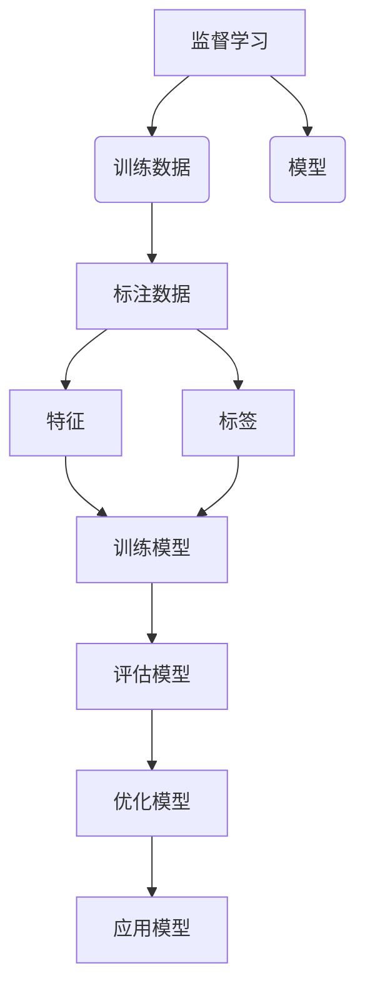

# Supervised Learning 原理与代码实战案例讲解

## 1. 背景介绍

### 1.1 问题的由来

在当今的数据时代,我们被海量的数据所包围。如何从这些原始数据中提取有价值的信息和知识,成为了人工智能领域的一个核心问题。监督学习(Supervised Learning)作为机器学习的一个重要分支,为解决这一问题提供了有力的方法。

### 1.2 研究现状

监督学习已经在诸多领域取得了巨大的成功,例如计算机视觉、自然语言处理、推荐系统等。随着深度学习技术的不断发展,监督学习的性能也在不断提升。但同时,也面临着一些新的挑战,如数据标注的成本高昂、对大规模数据的需求等。

### 1.3 研究意义

掌握监督学习的原理和实践技能,对于解决实际问题具有重要意义。本文将全面介绍监督学习的基本概念、核心算法、数学模型,并通过代码实战案例,帮助读者深入理解和掌握监督学习的实现细节。

### 1.4 本文结构

本文首先介绍监督学习的背景和概念,然后详细阐述其核心算法原理和数学模型,并配以代码实例进行说明。接下来探讨监督学习在实际应用中的场景,并推荐相关的工具和资源。最后总结监督学习的发展趋势和面临的挑战。

## 2. 核心概念与联系



监督学习(Supervised Learning)是机器学习的一种范式,它利用已标注的训练数据来构建模型,然后应用该模型对新的未知数据进行预测或分类。

其核心思想是通过学习大量标注好的训练数据,捕捉数据内在的模式和规律,从而得到一个能够对新数据进行准确预测的模型。

训练数据是监督学习的基础,它由两部分组成:特征(Feature)和标签(Label)。特征描述了数据样本的属性,而标签则是我们希望模型学习和预测的目标值。

在训练阶段,监督学习算法会根据特征和标签,构建一个映射函数(模型),使其能够尽可能准确地预测新数据的标签。这个过程通常需要反复迭代,评估模型的性能并进行优化,直到达到满意的结果。

一旦模型训练完成,就可以将其应用于实际场景,对新的未知数据进行预测或分类。

## 3. 核心算法原理 & 具体操作步骤

### 3.1 算法原理概述

监督学习算法可以分为两大类:回归算法和分类算法。

回归算法用于预测连续的数值输出,如房价预测、销量预测等。常见的回归算法有线性回归、多项式回归、支持向量回归等。

分类算法则用于对数据进行分类,将其划分到不同的类别中,如垃圾邮件分类、图像识别等。常见的分类算法有逻辑回归、决策树、支持向量机、朴素贝叶斯等。

无论是回归还是分类,算法的核心思想都是基于训练数据构建一个模型,使其能够最小化预测误差或最大化分类准确率。

### 3.2 算法步骤详解

以线性回归为例,其算法步骤如下:

1. **数据预处理**: 对原始数据进行清洗、标准化等预处理,以满足算法的输入要求。

2. **特征工程**: 从原始数据中提取有意义的特征,作为模型的输入。

3. **模型假设**: 假设输出值 $y$ 和输入特征 $x$ 之间存在线性关系,即 $y = \theta_0 + \theta_1 x_1 + \theta_2 x_2 + ... + \theta_n x_n$,其中 $\theta_i$ 为待求参数。

4. **代价函数**: 定义代价函数(如均方误差) $J(\theta) = \frac{1}{2m}\sum_{i=1}^m(h_\theta(x^{(i)}) - y^{(i)})^2$,用于衡量模型预测值与实际值之间的差距。

5. **优化算法**: 使用优化算法(如梯度下降)不断调整参数 $\theta$,最小化代价函数 $J(\theta)$,得到最优模型参数。

6. **模型评估**: 在测试集上评估模型的性能,如均方根误差、决定系数等。

7. **模型调优**: 根据评估结果,通过正则化、特征选择等方法优化模型。

8. **模型应用**: 将训练好的模型应用于实际预测任务。

### 3.3 算法优缺点

**优点**:

- 原理简单,易于理解和实现。
- 对于线性问题,表现良好,可解释性强。
- 训练速度快,可以处理大规模数据。

**缺点**:

- 对于非线性问题,效果可能不佳。
- 对异常值敏感,需要进行数据预处理。
- 存在欠拟合和过拟合的风险,需要进行正则化。

### 3.4 算法应用领域

线性回归广泛应用于以下领域:

- 金融领域:股票价格预测、贷款风险评估等。
- 经济领域:GDP预测、通货膨胀率预测等。
- 工业领域:产品需求预测、能源消耗预测等。
- 其他领域:房价预测、销量预测、气候预测等。

## 4. 数学模型和公式 & 详细讲解 & 举例说明

### 4.1 数学模型构建

在线性回归中,我们假设输出值 $y$ 和输入特征 $x$ 之间存在线性关系,可以用下式表示:

$$y = \theta_0 + \theta_1 x_1 + \theta_2 x_2 + ... + \theta_n x_n$$

其中,

- $y$ 是我们要预测的目标值
- $x_i$ 是第 $i$ 个特征
- $\theta_i$ 是第 $i$ 个特征的权重系数,需要通过训练数据来学习得到

我们的目标是找到一组最优的参数 $\theta$,使得模型在训练数据上的预测值 $h_\theta(x)$ 与实际值 $y$ 之间的差距最小。

### 4.2 公式推导过程

为了量化模型预测值与实际值之间的差距,我们定义代价函数(Cost Function)如下:

$$J(\theta) = \frac{1}{2m}\sum_{i=1}^m(h_\theta(x^{(i)}) - y^{(i)})^2$$

其中,

- $m$ 是训练样本的数量
- $x^{(i)}$ 是第 $i$ 个训练样本的特征向量
- $y^{(i)}$ 是第 $i$ 个训练样本的实际值
- $h_\theta(x^{(i)})$ 是模型对第 $i$ 个样本的预测值

我们的目标是找到参数 $\theta$ 的值,使得代价函数 $J(\theta)$ 最小。

为了优化参数 $\theta$,我们可以使用梯度下降(Gradient Descent)算法,其更新规则如下:

$$\theta_j := \theta_j - \alpha \frac{\partial}{\partial \theta_j}J(\theta)$$

其中,

- $\alpha$ 是学习率,控制每次更新的步长
- $\frac{\partial}{\partial \theta_j}J(\theta)$ 是代价函数关于 $\theta_j$ 的偏导数

通过不断迭代更新参数 $\theta$,直到代价函数 $J(\theta)$ 收敛到最小值,我们就得到了最优的线性回归模型。

### 4.3 案例分析与讲解

假设我们有一个房价预测的数据集,包含房屋面积(平方英尺)和房价(千美元)两个特征。我们希望构建一个线性回归模型,根据房屋面积来预测房价。

**步骤1: 导入数据并可视化**

```python
import pandas as pd
import matplotlib.pyplot as plt

data = pd.read_csv('housing.csv')
plt.scatter(data['area'], data['price'])
plt.xlabel('House Area (sq.ft.)')
plt.ylabel('Price (USD 1000)')
plt.show()
```

**步骤2: 数据预处理**

```python
from sklearn.preprocessing import StandardScaler

scaler = StandardScaler()
data[['area']] = scaler.fit_transform(data[['area']])
```

**步骤3: 构建线性回归模型**

```python
from sklearn.linear_model import LinearRegression

model = LinearRegression()
model.fit(data[['area']], data['price'])

print(f"Coefficient: {model.coef_[0]}")
print(f"Intercept: {model.intercept_}")
```

**步骤4: 模型评估**

```python
from sklearn.metrics import mean_squared_error, r2_score

predictions = model.predict(data[['area']])
mse = mean_squared_error(data['price'], predictions)
r2 = r2_score(data['price'], predictions)

print(f"Mean Squared Error: {mse}")
print(f"R-squared: {r2}")
```

**步骤5: 可视化结果**

```python
plt.scatter(data['area'], data['price'])
plt.plot(data['area'], predictions, color='red')
plt.xlabel('House Area (sq.ft.)')
plt.ylabel('Price (USD 1000)')
plt.show()
```

通过上述案例,我们可以看到线性回归模型如何基于房屋面积来预测房价。代码中包括了数据预处理、模型构建、模型评估和结果可视化等步骤,帮助读者更好地理解线性回归的实现细节。

### 4.4 常见问题解答

**1. 什么是过拟合和欠拟合?如何避免?**

过拟合是指模型过于复杂,捕捉了训练数据中的噪音和细节,导致在新数据上的泛化能力差。欠拟合则是模型过于简单,无法很好地捕捉数据的内在规律。

避免过拟合和欠拟合的方法包括:

- 增加训练数据量
- 特征选择,去除冗余特征
- 正则化,对模型参数加入惩罚项
- 交叉验证,选择合适的模型复杂度

**2. 如何处理异常值?**

异常值会对线性回归模型产生很大影响,因此需要进行处理。常见的方法包括:

- 删除异常值
- 用中位数或其他统计量替换异常值
- 对数据进行变换(如对数变换)

**3. 线性回归的假设是什么?如果违反假设会怎样?**

线性回归的主要假设包括:

- 线性关系:目标值和特征之间存在线性关系
- 同方差性:残差的方差恒定
- 无自相关性:残差之间相互独立
- 正态性:残差服从正态分布

如果违反这些假设,模型的预测结果可能会失真,需要采取相应的措施,如数据变换、使用其他模型等。

## 5. 项目实践:代码实例和详细解释说明

### 5.1 开发环境搭建

在开始编码之前,我们需要准备好开发环境。本例使用 Python 作为编程语言,并引入以下库:

- NumPy: 科学计算库,提供数值计算支持
- Pandas: 数据处理库,方便导入和操作数据
- Scikit-learn: 机器学习库,提供了线性回归等算法的实现
- Matplotlib: 数据可视化库,用于绘制图表

你可以使用 Anaconda 或 pip 来安装这些库。

### 5.2 源代码详细实现

```python
import numpy as np
import pandas as pd
from sklearn.linear_model import LinearRegression
import matplotlib.pyplot as plt

# 导入数据
data = pd.read_csv('housing.csv')

# 数据预处理
from sklearn.preprocessing import StandardScaler
scaler = StandardScaler()
data[['area']] = scaler.fit_transform(data[['area']])

# 拆分训练集和测试集
from sklearn.model_selection import train_test_split
X_train, X_test, y_train, y_test = train_test_split(data[['area']], data['price'], test_size=0.2, random_state=42)

# 构建线性回归模型
model = LinearRegression()
model.fit(X_train, y_train)

# 模型评估
from sklearn.metrics import mean_squared_error, r2_score
y_pred = model.predict(X_test)
mse =