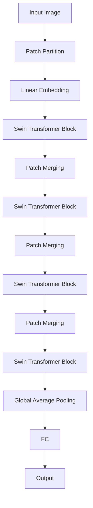

# Swin Transformer原理与代码实例讲解

## 1. 背景介绍
### 1.1 问题的由来
随着深度学习的快速发展,计算机视觉领域取得了令人瞩目的成就。从最初的LeNet到AlexNet、VGGNet、GoogLeNet、ResNet等经典卷积神经网络(CNN)模型,再到近年来基于Transformer的视觉模型,如ViT、DeiT等,视觉模型的性能不断刷新着各项任务的SOTA记录。然而,直接将NLP领域大获成功的Transformer架构应用到视觉任务中仍面临着计算复杂度高、局部建模能力不足等问题。为了更好地将Transformer用于视觉任务,微软在2021年提出了Swin Transformer模型[1],通过引入层次化的Transformer块和移位窗口机制,在Linear计算复杂度下获得了优异的性能。

### 1.2 研究现状
Swin Transformer自提出以来受到学术界和工业界的广泛关注。许多研究者在Swin Transformer的基础上进行了改进和扩展,如Swin-B、Swin-L等更大规模的模型,在ImageNet分类、COCO目标检测、ADE20K语义分割等任务上取得了SOTA的性能[2]。此外,Swin Transformer强大的特征提取能力使其在很多下游任务中得到应用,如人脸识别、行人重识别、遥感图像分类等。目前,Swin Transformer已成为计算机视觉领域最重要的Backbone网络之一。

### 1.3 研究意义
Swin Transformer是将Transformer成功应用于视觉领域的代表性工作,对计算机视觉领域的发展具有重要意义:

1. 为视觉任务提供了一种新的特征提取范式,弥补了CNN局部建模能力的不足。
2. 引入层次化设计和移位窗口机制,在线性计算复杂度下获得了优异的性能,为高效视觉Backbone设计提供了新思路。
3. 作为General-purpose Backbone,可以方便地迁移到多种视觉任务中,大大促进了下游任务的发展。
4. 为探索更强大的视觉Transformer模型提供了重要基础,推动了视觉模型的进一步发展。

### 1.4 本文结构
本文将全面介绍Swin Transformer的原理和代码实现,内容安排如下:

- 第2部分介绍Swin Transformer涉及的核心概念。 
- 第3部分详细讲解Swin Transformer的核心算法原理和具体操作步骤。
- 第4部分介绍Swin Transformer用到的数学模型和公式,并举例说明。
- 第5部分给出Swin Transformer的代码实例和详细解释。
- 第6部分讨论Swin Transformer的实际应用场景。
- 第7部分推荐Swin Transformer相关的工具和学习资源。
- 第8部分总结Swin Transformer的研究现状和未来发展趋势。
- 第9部分列举了一些常见问题及其解答。

## 2. 核心概念与联系

在详细介绍Swin Transformer之前,我们先来了解其中涉及的一些核心概念:

- **Transformer**: 原本是自然语言处理(NLP)领域的模型,通过自注意力机制建模长程依赖,在机器翻译等任务上取得了巨大成功。
- **自注意力机制(Self-attention)**: Transformer的核心组件,用于捕捉输入序列中不同位置之间的相互作用,可以有效建模长程依赖。
- **多头自注意力(Multi-head Self-attention,MSA)**: 将自注意力扩展为多个头(head),不同头可以关注输入的不同子空间,增强模型的表达能力。
- **位置编码(Positional Encoding)**: 由于Transformer不包含空间信息,需要通过位置编码将位置信息引入。
- **Layer Normalization**: 对神经网络的每一层输入进行归一化,有助于加速模型收敛,提高训练稳定性。
- **移位窗口(Shifted Window)**: Swin Transformer提出的创新性机制,通过移动窗口的方式引入不同窗口之间的联系,增强局部建模能力。

下图展示了Swin Transformer模型的整体架构,可以看到其由Patch Partition、Patch Merging和Swin Transformer Block构成。Swin Transformer Block是模型的核心组件,由多头自注意力(W-MSA/SW-MSA)、MLP等模块组成。通过堆叠Swin Transformer Block,在层次化的特征图上进行自注意力计算,可以在线性计算复杂度下建模全局信息。

## 3. 核心算法原理 & 具体操作步骤
### 3.1 算法原理概述
Swin Transformer的核心思想是在Transformer的基础上引入层次化设计和移位窗口机制。具体来说:

1. 将输入图像划分为不重叠的Patch,并通过线性投影将Patch映射为特征向量。
2. 通过Swin Transformer Block在不同尺度的特征图上进行自注意力计算。Block内部使用移位窗口机制,增强局部建模能力。
3. 通过Patch Merging模块逐步降低特征图的分辨率,形成层次化的特征表示。
4. 在最后一个Stage的输出特征图上进行全局平均池化,再通过全连接层输出最终的分类结果。

### 3.2 算法步骤详解

**Step 1: Patch Partition and Linear Embedding**

将输入图像$\mathbf{x} \in \mathbb{R}^{H \times W \times 3}$划分为$\frac{H}{P} \times \frac{W}{P}$个大小为$P \times P$的Patch,每个Patch可以表示为$\mathbf{x}_p \in \mathbb{R}^{P^2 \cdot 3}$。然后通过线性映射将Patch投影到$C$维特征空间:

$$
\mathbf{z}_0 = [\mathbf{x}_{p_1}\mathbf{E}; \mathbf{x}_{p_2}\mathbf{E}; \cdots; \mathbf{x}_{p_N}\mathbf{E}] + \mathbf{E}_{pos},
$$

其中$\mathbf{E} \in \mathbb{R}^{(P^2 \cdot 3) \times C}$是Patch Embedding矩阵,$\mathbf{E}_{pos} \in \mathbb{R}^{N \times C}$是可学习的位置编码,$N = \frac{HW}{P^2}$是Patch的数量。

**Step 2: Swin Transformer Block**

Swin Transformer Block由多头自注意力模块(W-MSA/SW-MSA)、MLP等组成。W-MSA对窗口内的Patch计算自注意力,建模局部信息;SW-MSA通过移动窗口的方式引入跨窗口联系,进一步增强模型的表示能力。两个MSA模块之间通过Layer Normalization、残差连接等操作连接,公式如下:

$$
\begin{aligned}
\hat{\mathbf{z}}^l &= \text{W-MSA}(\text{LN}(\mathbf{z}^{l-1})) + \mathbf{z}^{l-1}, \\
\mathbf{z}^l &= \text{MLP}(\text{LN}(\hat{\mathbf{z}}^l)) + \hat{\mathbf{z}}^l, \\
\hat{\mathbf{z}}^{l+1} &= \text{SW-MSA}(\text{LN}(\mathbf{z}^l)) + \mathbf{z}^l, \\
\mathbf{z}^{l+1} &= \text{MLP}(\text{LN}(\hat{\mathbf{z}}^{l+1})) + \hat{\mathbf{z}}^{l+1},
\end{aligned}
$$

其中$\mathbf{z}^l$表示第$l$个Block的输出,$\text{LN}$表示Layer Normalization。

**Step 3: Patch Merging**

Patch Merging用于逐步降低特征图分辨率,形成层次化的特征表示。具体地,将相邻的$2 \times 2$个Patch在Channel维度拼接,并通过线性层降低通道数,输出分辨率减半、通道数加倍的特征图:

$$
\mathbf{z}_{l+1} = \text{Reshape}(\text{Linear}(\text{Reshape}(\mathbf{z}_l))).
$$

**Step 4: Global Average Pooling and FC**

在最后一个Stage的输出特征图上进行全局平均池化,将不同位置的特征聚合为一个全局特征向量。然后通过全连接层映射到类别数维度,输出最终的分类Logits:

$$
\mathbf{y} = \text{FC}(\text{GlobalAveragePooling}(\mathbf{z}_L)).
$$

### 3.3 算法优缺点

**优点**:
1. 引入层次化设计和移位窗口机制,在线性计算复杂度下获得了优异的建模全局信息的能力。 
2. 通过局部自注意力和跨窗口自注意力的结合,在全局建模的同时也增强了局部特征的表达能力。
3. 作为General-purpose Backbone,可以方便地迁移到多种视觉任务中,具有很好的泛化性。

**缺点**:
1. 移位窗口机制虽然增强了不同窗口间的信息交互,但仍难以像CNN那样高效地建模局部特征。
2. 为了降低计算复杂度,需要将输入图像划分为较大的Patch,这可能损失一些细粒度的视觉信息。
3. 模型参数量较大,对计算资源和内存要求较高,在实际应用中需要权衡精度和效率。

### 3.4 算法应用领域
Swin Transformer作为视觉领域的General-purpose Backbone,可以应用到多种视觉任务中,如:

- 图像分类:在ImageNet-1K、ImageNet-21K等数据集上取得SOTA性能。
- 目标检测:将Swin Transformer作为检测器(如Cascade R-CNN)的Backbone,在COCO数据集上达到很高的mAP。
- 语义分割:以Swin Transformer为Encoder,UperNet为Decoder,在ADE20K等数据集上取得优异成绩。
- 实例分割:将Swin Transformer和Mask R-CNN结合,在COCO实例分割任务上超越ResNet等CNN Backbone。
- 人体姿态估计:利用Swin Transformer强大的特征提取能力,可以准确预测关键点坐标。
- 行人重识别:使用Swin Transformer提取鉴别性特征,克服行人外观变化,取得很高的识别精度。
- 医学图像分析:将Swin Transformer用于病变区域检测、器官分割等医疗应用,辅助疾病诊断。

此外,Swin Transformer还被用于遥感图像分类、超分辨率、风格迁移、视频理解等领域,展现了其广泛的适用性。

## 4. 数学模型和公式 & 详细讲解 & 举例说明
### 4.1 数学模型构建
Swin Transformer中用到的主要数学模型包括Multi-head Self-attention(MSA)和MLP。

**Multi-head Self-attention**:

$$
\text{MSA}(\mathbf{z}) = [\text{head}_1; \text{head}_2; \cdots; \text{head}_h]\mathbf{W}^O,
$$
$$
\text{head}_i = \text{Attention}(\mathbf{z}\mathbf{W}_i^Q, \mathbf{z}\mathbf{W}_i^K, \mathbf{z}\mathbf{W}_i^V),
$$
$$
\text{Attention}(\mathbf{Q}, \mathbf{K}, \mathbf{V}) = \text{softmax}(\frac{\mathbf{Q}\mathbf{K}^T}{\sqrt{d}})\mathbf{V},
$$

其中$\mathbf{W}_i^Q \in \mathbb{R}^{C \times d}, \mathbf{W}_i^K \in \mathbb{R}^{C \times d}, \mathbf{W}_i^V \in \mathbb{R}^{C \times d}$分别是第$i$个头的Query、Key、Value矩阵,$\mathbf{W}^O \in \mathbb{R}^{hd \times C}$是输出投影矩阵,$h$是头数,$d=C/h$是每个头的隐藏维度。

**MLP**:

$$
\text{MLP