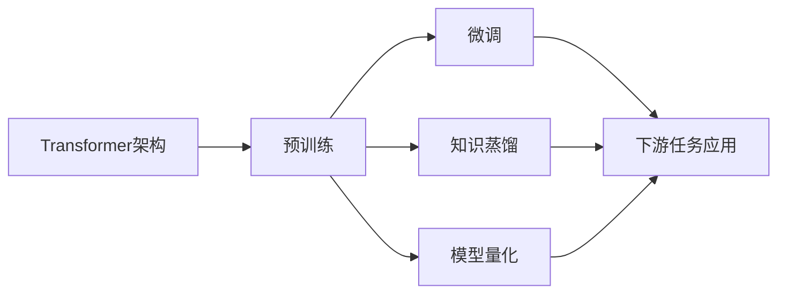

# Transformer大模型实战 BERT 的其他配置

## 1. 背景介绍
### 1.1 问题的由来
随着深度学习的快速发展,尤其是 Transformer 架构的出现,大规模预训练语言模型取得了巨大的成功。其中最具代表性的就是 BERT(Bidirectional Encoder Representations from Transformers)模型。BERT 在多个自然语言处理任务上取得了 state-of-the-art 的结果,展示了其强大的语义理解和特征提取能力。

然而,原始的 BERT 模型在实际应用中仍然存在一些局限性,如模型参数量大、训练和推理成本高等。为了进一步提升 BERT 的性能和效率,研究者们提出了许多改进方案,对 BERT 进行了各种优化和改进。

### 1.2 研究现状
目前,围绕 BERT 的改进工作主要集中在以下几个方面:

1. 模型架构优化:通过改进 Transformer 的架构设计,如引入新的注意力机制、改进 FFN 结构等,来提升模型的表示能力。代表性工作有 ConvBERT、DeBERTa 等。

2. 模型蒸馏与压缩:通过知识蒸馏、量化、剪枝等技术,在保持模型性能的同时,减小模型参数量和计算开销。如 DistilBERT、TinyBERT、Q-BERT 等。

3. 预训练任务改进:探索新的预训练任务和目标函数,更好地利用无监督数据,提升模型的语义理解能力。如 ELECTRA、ERNIE 等。

4. 多语言与领域适应:针对特定语言和领域,对 BERT 进行微调和适配,提高其在垂直领域的性能。如 mBERT、BioBERT 等。

这些改进工作极大地拓展了 BERT 的应用范围,提升了其在实际任务中的表现。

### 1.3 研究意义
深入研究 BERT 的优化配置,对于推动 Transformer 大模型的发展具有重要意义:

1. 性能提升:通过架构改进、预训练优化等手段,可以进一步提高 BERT 在下游任务上的性能,拓展其应用边界。

2. 效率优化:模型压缩和加速技术可以降低 BERT 的部署成本,促进其在实际生产环境中的应用。

3. 语言与领域拓展:针对不同语言和领域对 BERT 进行适配,有助于构建更加通用和鲁棒的语言理解模型。

4. 理论探索:BERT 的优化研究也为探索 Transformer 架构的内在机制和改进方向提供了新的视角。

### 1.4 本文结构 
本文将重点介绍几种有代表性的 BERT 优化配置,探讨其核心思想和改进效果。全文结构安排如下:

- 第2部分介绍 BERT 优化的核心概念与思路
- 第3部分重点讲解几种典型的模型架构改进算法 
- 第4部分介绍相关的数学原理和关键公式
- 第5部分给出具体的代码实现示例
- 第6部分讨论 BERT 优化在实际应用场景中的案例
- 第7部分推荐相关的学习资源和开发工具
- 第8部分总结全文,并展望 BERT 优化的未来方向和挑战
- 第9部分列举一些常见问题,并给出解答

## 2. 核心概念与联系
在探讨 BERT 的优化配置之前,我们先来了解一些核心概念:

- Transformer:一种基于自注意力机制的神经网络架构,是 BERT 的基础架构。
- 预训练:在大规模无监督语料上对模型进行预先训练,学习通用的语言表示。BERT 采用 MLM 和 NSP 任务进行预训练。
- 微调:在下游任务的监督数据上对预训练模型进行微调,使其适应特定任务。
- 知识蒸馏:通过让小模型学习大模型的知识,在保持性能的同时压缩模型。
- 模型量化:将模型参数和激活值从浮点数转为低比特定点数,减小模型存储和计算开销。

这些概念环环相扣,构成了 BERT 优化的基本思路:在 Transformer 的基础上,通过改进预训练方式、引入新的学习目标,来增强模型的语义理解能力;在此基础上,通过知识蒸馏、量化等技术压缩模型,提高其部署效率;同时借助微调等手段,将 BERT 应用到不同的语言和领域任务中。

下图展示了这些概念之间的关系:

## 3. 核心算法原理 & 具体操作步骤
### 3.1 算法原理概述
BERT 优化的核心是在 Transformer 的基础上引入新的改进,主要可分为以下几类:

1. 架构改进:在 Transformer 的编码器结构中引入新的注意力机制、FFN等组件,增强模型的特征提取和融合能力。
2. 目标函数设计:设计新的预训练任务和损失函数,更好地利用无监督语料,学习更加准确的语言表示。
3. 模型压缩:通过知识蒸馏、量化、剪枝等技术,在保持模型性能的同时,降低其存储和计算开销。

这些改进都是在 BERT 原有的 Transformer 架构和预训练范式的基础上,进行局部的修改和优化,以期获得更好的性能和效率。

### 3.2 算法步骤详解
下面以 ConvBERT 为例,详细讲解其算法步骤:

1. 在 Transformer 的自注意力层后添加卷积层,增强局部特征的提取能力。
2. 卷积层采用深度可分离卷积,减少参数量和计算量。
3. 在卷积层后添加残差连接和 Layer Normalization,促进训练的稳定性。
4. 沿用 BERT 的 MLM 和 NSP 预训练任务,在大规模语料上进行预训练。
5. 在下游任务上进行微调,验证模型的性能提升。

可以看到,ConvBERT 的改进主要集中在模型架构上,通过引入卷积结构,来增强 BERT 的特征提取能力,同时兼顾效率。其训练和应用流程与 BERT 基本一致。

### 3.3 算法优缺点
以 ConvBERT 为例,其优点包括:

1. 通过卷积增强了局部特征的建模能力,提升了模型的性能。
2. 采用深度可分离卷积,参数量和计算量增加不多,保持了模型的效率。
3. 沿用 BERT 的预训练范式,可以方便地迁移到不同任务上。

但同时也存在一些局限:

1. 卷积虽然增强了局部特征,但也可能影响长距离依赖的建模。
2. 引入卷积后,模型的并行性有所降低,不利于 GPU 加速。

### 3.4 算法应用领域
BERT 及其变体可以应用到几乎所有的 NLP 任务中,如文本分类、序列标注、问答系统、机器翻译等。ConvBERT 等架构改进型的模型,在这些任务上往往能取得更好的效果。同时,BERT 还被拓展到了语音、图像、视频等领域,展现出广泛的应用前景。

## 4. 数学模型和公式 & 详细讲解 & 举例说明
### 4.1 数学模型构建
BERT 的核心是 Transformer 的编码器,其数学模型可以表示为:

$$
\begin{aligned}
\mathbf{Q},\mathbf{K},\mathbf{V} &= \mathbf{X}\mathbf{W}^Q,\mathbf{X}\mathbf{W}^K,\mathbf{X}\mathbf{W}^V \\
\mathbf{A} &= \text{softmax}(\frac{\mathbf{Q}\mathbf{K}^T}{\sqrt{d_k}}) \\
\mathbf{H} &= \mathbf{A}\mathbf{V} \\
\mathbf{O} &= \text{LayerNorm}(\mathbf{X} + \mathbf{H}) \\
\mathbf{F} &= \text{ReLU}(\mathbf{O}\mathbf{W}_1 + \mathbf{b}_1)\mathbf{W}_2 + \mathbf{b}_2 \\
\mathbf{Y} &= \text{LayerNorm}(\mathbf{O} + \mathbf{F})
\end{aligned}
$$

其中,$\mathbf{Q},\mathbf{K},\mathbf{V}$分别为查询、键、值向量,$\mathbf{A}$为注意力矩阵,$\mathbf{H}$为注意力输出,$\mathbf{O}$为残差连接和层归一化后的输出,$\mathbf{F}$为前馈网络的输出,$\mathbf{Y}$为最终的编码器输出。

在此基础上,ConvBERT 在注意力层后插入卷积:

$$
\begin{aligned}
\mathbf{P} &= \text{DepthwiseConv}(\mathbf{O}) \\
\mathbf{C} &= \text{PointwiseConv}(\mathbf{P}) \\
\mathbf{Y} &= \text{LayerNorm}(\mathbf{O} + \mathbf{C})
\end{aligned}
$$

其中,$\mathbf{P}$为深度卷积的输出,$\mathbf{C}$为逐点卷积的输出。

### 4.2 公式推导过程
以注意力矩阵$\mathbf{A}$的计算为例,其公式推导如下:

1. 首先通过线性变换得到$\mathbf{Q},\mathbf{K},\mathbf{V}$:

$$
\mathbf{Q} = \mathbf{X}\mathbf{W}^Q, \quad
\mathbf{K} = \mathbf{X}\mathbf{W}^K, \quad
\mathbf{V} = \mathbf{X}\mathbf{W}^V
$$

2. 然后计算$\mathbf{Q}$和$\mathbf{K}$的点积注意力分数:

$$
\text{score}(\mathbf{Q},\mathbf{K}) = \frac{\mathbf{Q}\mathbf{K}^T}{\sqrt{d_k}}
$$

3. 对注意力分数进行 softmax 归一化,得到注意力矩阵$\mathbf{A}$:

$$
\mathbf{A} = \text{softmax}(\frac{\mathbf{Q}\mathbf{K}^T}{\sqrt{d_k}})
$$

其他公式的推导过程类似,主要通过线性变换和非线性激活函数的组合来实现特征的提取和融合。

### 4.3 案例分析与讲解
我们以一个简单的句子"I love natural language processing"为例,说明 BERT 中注意力机制的作用:

1. 将句子输入 BERT,经过嵌入层得到词向量表示$\mathbf{X}$。
2. 通过自注意力层计算注意力矩阵$\mathbf{A}$,其中$\mathbf{A}_{ij}$表示第$i$个词对第$j$个词的注意力权重。
3. 直观地,与"love"关联度最高的词可能是"I"和"processing",因此它们之间的注意力权重会较大。
4. 注意力矩阵$\mathbf{A}$与值向量$\mathbf{V}$相乘,得到融合了上下文信息的新的词表示$\mathbf{H}$。
5. 经过后续的 FFN 等层,最终得到句子的编码表示$\mathbf{Y}$,可用于下游任务。

可以看到,注意力机制能够有效地捕捉词与词之间的依赖关系,动态地融合上下文信息,是 BERT 强大语义表示能力的关键所在。

### 4.4 常见问题解答
Q: BERT 中的位置编码是如何实现的?

A: BERT 使用的是基于正弦函数的位置编码,对于第$i$个位置,其位置编码为:

$$
\begin{aligned}
PE_{(i,2j)} &= \sin(i/10000^{2j/d}) \\
PE_{(i,2j+1)} &= \cos(i/10000^{2j/d})
\end{aligned}
$$

其中,$d$为嵌入维度。这种位置编码能够反映词之间的相对位