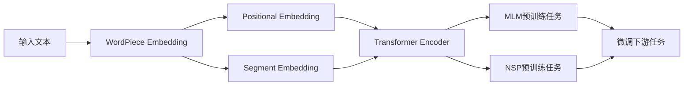

# Transformer大模型实战 BERT 的配置

关键词：Transformer, BERT, 预训练模型, 自然语言处理, 迁移学习

## 1. 背景介绍 
### 1.1 问题的由来
近年来，随着深度学习技术的飞速发展，自然语言处理(NLP)领域取得了令人瞩目的进展。尤其是Transformer[1]架构的提出，极大地推动了NLP的发展。基于Transformer的各种预训练语言模型如雨后春笋般涌现，其中最具代表性的当属BERT(Bidirectional Encoder Representations from Transformers)[2]模型。BERT作为一个里程碑式的工作，开创了NLP领域预训练+微调(Pre-train + Fine-tune)的新范式，极大地提升了各种NLP任务的性能表现。

### 1.2 研究现状
当前，围绕BERT展开了大量的后续研究工作。一方面，研究者们通过增大模型参数量、扩充预训练语料等方式，不断刷新BERT的性能上限，代表性工作如RoBERTa[3]、XLNet[4]等；另一方面，也有大量工作致力于提高BERT的计算效率，加速推理和训练过程，如ALBERT[5]、DistilBERT[6]等轻量化模型。BERT已经成为NLP领域的标配，在机器翻译、问答系统、情感分析等诸多任务中得到广泛应用。

### 1.3 研究意义
尽管BERT在学术界和工业界得到了广泛关注，但对于如何实际使用和部署BERT模型，仍然缺乏系统性的指导。很多开发者在使用BERT时，面临诸如模型选择、超参数设置、计算资源配置等一系列问题。因此，有必要对BERT的实战应用做一个全面梳理，总结经验教训，让更多人能够快速上手并掌握这一强大工具。

### 1.4 本文结构
本文将重点介绍BERT模型的实战配置流程。第2节介绍BERT的核心概念和内部原理；第3节详细讲解BERT的训练算法和优化技巧；第4节介绍BERT相关的数学知识；第5节通过代码实例演示BERT的实际使用；第6节总结BERT的主要应用场景；第7节推荐BERT相关的学习资源；第8节对BERT的未来发展趋势做了展望；第9节列举了BERT实战过程中的常见问题。

## 2. 核心概念与联系
BERT是一种基于Transformer编码器的双向语言表示模型。与传统的LSTM、GRU等单向语言模型不同，BERT采用了Masked Language Model(MLM)和Next Sentence Prediction(NSP)两种预训练任务，可以融合上下文信息，从而获得更加丰富的词语和句子表示。

BERT的核心概念如下：

- Transformer编码器：BERT舍弃了传统的RNN/CNN等结构，改用Transformer的编码器作为主干网络。Transformer本质上是一种自注意力(Self-Attention)机制，通过计算词语之间的注意力权重，可以捕捉词语的长距离依赖关系。
- 双向语言模型：与ELMo[7]等模型类似，BERT采用了双向语言建模的方式。传统的语言模型通常是单向的，只能利用左侧或右侧的上下文，而双向语言模型可以同时利用两个方向的上下文信息，从而获得更加准确的词语表示。
- MLM预训练任务：为了实现双向建模，BERT采用了MLM预训练任务。MLM随机地Mask掉一些词语，然后让模型根据上下文去预测这些被Mask掉的词语。通过这种方式，可以强迫模型去学习词语的上下文表示。
- NSP预训练任务：除了MLM，BERT还引入了NSP预训练任务，用于学习句子级别的表示。NSP采用二分类的方式，判断两个句子在原文中是否相邻。这有助于学习句子之间的逻辑关系。
- 微调：基于预训练好的BERT模型，我们可以用较小的数据集和较少的计算资源，在特定任务上进行微调，从而获得性能优异的模型。这种"预训练+微调"的模式极大地降低了NLP任务的门槛。

下图展示了BERT的总体架构和内部机制：

## 3. 核心算法原理 & 具体操作步骤
### 3.1 算法原理概述
BERT的核心是基于Transformer的双向语言模型预训练算法。具体来说，主要涉及以下几个关键技术：

1. WordPiece Embedding：BERT采用了WordPiece[8]的分词方式，可以有效处理未登录词。WordPiece通过将词语划分为更小的词片段，在保留词语含义的同时降低了词表大小。
2. Positional Embedding：由于Transformer不包含RNN等顺序结构，需要引入位置编码，显式地给每个词语一个位置向量，从而引入顺序信息。BERT使用了固定的正弦曲线函数作为位置编码。  
3. Transformer Encoder：Transformer编码器通过自注意力机制和前馈神经网络，建模词语之间的相互作用。自注意力机制可以计算任意两个词语之间的注意力权重，从而获得词语的上下文表示。
4. Masked Language Model：MLM通过随机Mask词语的方式，强迫模型学习上下文信息。具体来说，对于每个训练样本，以一定概率(如15%)随机Mask掉一些词语，然后让模型根据上下文预测这些被Mask掉的词语。
5. Next Sentence Prediction：NSP是一个二分类任务，用于判断两个句子是否在原文中相邻。训练时，以50%的概率选择两个相邻的句子作为正样本，以50%的概率随机选择两个不相邻的句子作为负样本。
6. 微调：在特定任务上微调BERT时，我们需要根据任务的特点，设计输入表示和输出层。例如，对于分类任务，输出层通常是一个全连接的Softmax层；对于序列标注任务，输出层通常是一个CRF层。

### 3.2 算法步骤详解
下面我们详细介绍BERT的训练和微调流程。

#### 3.2.1 预训练阶段
1. 准备预训练语料：收集大规模的无监督文本数据，进行清洗和预处理。
2. 构建词表：使用WordPiece算法对语料进行分词，得到词表。
3. 转换训练数据：将文本数据转换为BERT的输入格式，包括Token ID、Segment ID、Position ID等。
4. 配置模型参数：设置模型的层数、隐藏层大小、注意力头数等超参数。
5. 训练MLM和NSP任务：以MLM和NSP为目标，对BERT进行预训练。MLM任务以掩码预测准确率为优化目标，NSP任务以二分类交叉熵为优化目标。
6. 保存预训练模型：训练完成后，保存预训练好的BERT模型参数，用于后续的微调。

#### 3.2.2 微调阶段
1. 确定下游任务：根据具体应用场景，选择合适的NLP任务，如文本分类、序列标注、问答等。
2. 准备任务数据集：收集和标注任务相关的数据集，划分为训练集、验证集和测试集。
3. 设计输入输出层：根据任务的特点，在BERT的基础上设计输入表示和输出层。输入表示通常包括Token Embedding、Position Embedding和Segment Embedding的拼接；输出层根据任务的类型而定，如Softmax层、CRF层等。
4. 配置微调参数：设置微调的超参数，如学习率、Batch Size、Epoch数等。通常微调时使用较小的学习率和Batch Size。
5. 加载预训练模型：加载预训练阶段得到的BERT模型参数，作为微调的初始化参数。
6. 训练微调模型：以任务的损失函数为优化目标，对BERT进行微调训练。根据任务的不同，损失函数可以是交叉熵、平方误差、F1值等。
7. 评估微调模型：在验证集上评估微调后的模型性能，根据评估结果调整超参数。
8. 测试微调模型：在测试集上测试微调后的模型性能，得到最终的评价指标。

### 3.3 算法优缺点
BERT算法的主要优点如下：

1. 双向建模：通过MLM任务，BERT可以融合左右两个方向的上下文信息，获得更加准确的词语表示。
2. 预训练+微调范式：BERT采用了预训练+微调的范式，预训练阶段学习通用的语言表示，微调阶段根据具体任务进行调整。这种范式极大地提高了模型的泛化能力和训练效率。
3. 强大的特征提取能力：得益于Transformer的强大建模能力，BERT可以学习到丰富的语义特征，在多种NLP任务上取得了SOTA的效果。
4. 灵活的应用方式：BERT提供了灵活的应用接口，可以方便地应用于各种NLP任务，如分类、序列标注、句子关系判断等。

同时，BERT算法也存在一些局限性：

1. 计算开销大：BERT是一个大规模的神经网络模型，训练和推理都需要消耗大量的计算资源。这对于实际应用构成了一定的挑战。
2. 语言依赖：尽管BERT采用了WordPiece等方法处理未登录词，但仍然对语言有一定的依赖性。对于中文等语言，需要重新预训练BERT模型。
3. 任务适配：将BERT应用于特定任务时，需要根据任务的特点设计输入输出层，这需要一定的NLP专业知识和经验。
4. 鲁棒性不足：BERT对于一些对抗样本和异常输入的鲁棒性还有待提高，在实际应用中可能面临安全性挑战。

### 3.4 算法应用领域
BERT算法在NLP领域得到了广泛应用，主要包括以下几个方面：

1. 文本分类：BERT可以用于各种文本分类任务，如情感分析、新闻分类、意图识别等。通过在BERT上添加Softmax输出层，可以实现端到端的分类模型。
2. 序列标注：BERT可以用于各种序列标注任务，如命名实体识别、词性标注、语义角色标注等。通过在BERT上添加CRF等输出层，可以实现端到端的序列标注模型。
3. 句子关系判断：BERT可以用于判断两个句子之间的关系，如自然语言推理、语义相似度计算等。通过在BERT上添加分类输出层，可以实现端到端的句子关系判断模型。
4. 问答系统：BERT可以用于构建问答系统，包括阅读理解、开放域问答等。通过在BERT上添加Span Extraction等输出层，可以实现端到端的问答模型。
5. 机器翻译：BERT可以用于机器翻译任务，作为编码器或解码器的一部分。通过将BERT与Transformer等模型结合，可以实现高质量的神经机器翻译系统。

## 4. 数学模型和公式 & 详细讲解 & 举例说明
### 4.1 数学模型构建
BERT的数学模型主要包括以下几个部分：

1. Embedding层：将离散的词语映射为连续的向量表示。设词表大小为$V$，词嵌入维度为$d_e$，则Embedding层可以表示为一个矩阵$\mathbf{E} \in \mathbb{R}^{V \times d_e}$。对于第$i$个词$w_i$，其嵌入向量为$\mathbf{e}_i = \mathbf{E}[w_i]$。

2. 位置编码：为每个位置生成一个位置向量，与词嵌入向量相加。设位置编码维度与词嵌入维度相同，则位置编码可以表示为一个矩阵$\mathbf{P} \in \mathbb{R}^{n \times d_e}$，其中$n$为序列长度。BERT采用正弦曲线